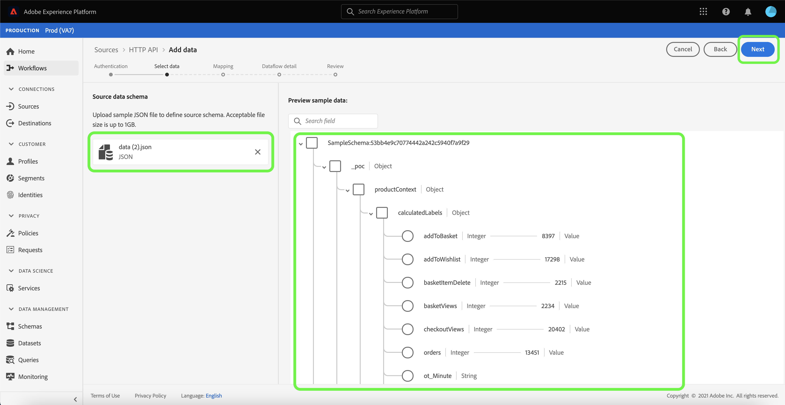
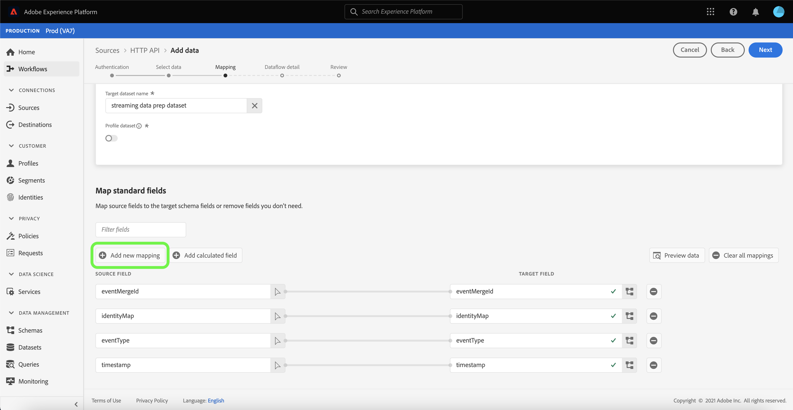
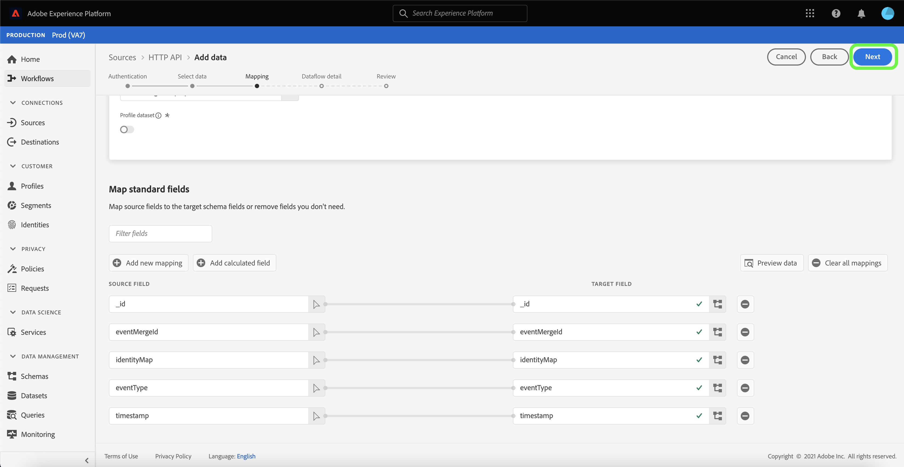

# 使用使用者介面建立[!DNL HTTP API]串流連線

本教學課程提供使用[!UICONTROL 來源]工作區建立串流來源連線的步驟。

## 快速入門

本教學課程需要您實際瞭解下列Adobe Experience Platform元件：

- [[!DNL Experience Data Model (XDM)] 系統](../../../../../xdm/home.md)： [!DNL Experience Platform]用來組織客戶體驗資料的標準化架構。
   - [結構描述組合的基本概念](../../../../../xdm/schema/composition.md)：瞭解XDM結構描述的基本建置區塊，包括結構描述組合中的關鍵原則和最佳實務。
   - [結構描述編輯器教學課程](../../../../../xdm/tutorials/create-schema-ui.md)：瞭解如何使用結構描述編輯器使用者介面建立自訂結構描述。
- [[!DNL Real-Time Customer Profile]](../../../../../profile/home.md)：根據來自多個來源的彙總資料，提供統一的即時消費者設定檔。

## 建立串流連線

在Platform UI中，從左側導覽選取&#x200B;**[!UICONTROL 來源]**&#x200B;以存取[!UICONTROL 來源]工作區。 [!UICONTROL 目錄]畫面會顯示您可以用來建立帳戶的各種來源。

您可以從熒幕左側的目錄中選取適當的類別。 或者，您可以使用搜尋選項來尋找您要使用的特定來源。

在&#x200B;**[!UICONTROL 串流]**&#x200B;類別下，選取&#x200B;**[!UICONTROL HTTP API]**，然後選取&#x200B;**[!UICONTROL 新增資料]**。

**[!UICONTROL 連線HTTP API帳戶]**&#x200B;頁面隨即顯示。 您可以在此頁面使用新的證明資料或現有的證明資料。

### 現有帳戶

若要使用現有帳戶，請選取您要用來建立新資料流的HTTP API帳戶，然後選取[下一步] **[!UICONTROL 以繼續。]**

### 新帳戶

如果您正在建立新帳戶，請選取&#x200B;**[!UICONTROL 新帳戶]**。 在出現的輸入表單上，提供帳戶名稱和選用的說明。 您也會選擇提供下列設定屬性：

- **[!UICONTROL 驗證]：**&#x200B;此屬性決定串流連線是否需要驗證。 驗證可確保從受信任的來源收集資料。 如果您處理的是個人識別資訊(PII)，則應開啟此屬性。 此屬性預設為關閉。
- **[!UICONTROL 與XDM相容]：**&#x200B;此屬性表示此串流連線是否會傳送與XDM結構描述相容的事件。 此屬性預設為關閉。

完成時，請選取&#x200B;**[!UICONTROL 連線到來源]**，然後選取&#x200B;**[!UICONTROL 下一步]**&#x200B;以繼續。

## 選取資料

建立HTTP API連線後，**[!UICONTROL 選取資料]**&#x200B;步驟隨即顯示，為您提供上傳和預覽資料的介面。

選取&#x200B;**[!UICONTROL 上傳檔案]**&#x200B;以上傳您的資料。 或者，您可以將資料拖放至介面的[!UICONTROL 拖放檔案]區段。

上傳資料後，您可以使用介面的右側來預覽檔案階層。 選取&#x200B;**[!UICONTROL 下一步]**&#x200B;以繼續。

## 將資料欄位對應至XDM結構描述

[!UICONTROL 對應]步驟出現，提供介面以將來源資料對應到Platform資料集。

[!DNL HTTP API]來源支援擷取JSON檔案。 如果JSON檔案標示為XDM申訴，則不需要手動設定。 如果沒有，則必須明確設定對應。

選擇要將傳入資料擷取的資料集。 您可以使用現有的資料集或建立新的資料集。

### 建立新的資料集

若要建立新資料集，請選取&#x200B;**[!UICONTROL 新資料集]**。 在出現的表單上，提供資料集的名稱、可選說明以及目標結構描述。 如果您選取已啟用[!DNL Profile]的結構描述，您可以選擇資料集是否也應該已啟用[!DNL Profile]。

### 使用現有的資料集

若要使用現有的資料集，請選取&#x200B;**[!UICONTROL 現有的資料集]**。 在出現的表單上，選取您要使用的資料集。 選取資料集後，您可以選擇資料集是否應該啟用[!DNL Profile]。

### 對應標準欄位

您可以根據自己的需求，選擇直接對應欄位，或使用資料準備函式來轉換來源資料，以衍生計算或計算的值。 如需使用對應程式介面和計算欄位的完整步驟，請參閱[資料準備UI指南](../../../../../data-prep/ui/mapping.md)。

若要新增來源欄位，請選取&#x200B;**[!UICONTROL 新增對應]**。

會出現新的來源欄位和目標欄位配對。 若要新增來源欄位，請選取[!UICONTROL 選取來源欄位]輸入列旁的箭頭圖示。

[!UICONTROL 選取屬性]面板可讓您探索您的檔案階層，並選取要對應至目標XDM欄位的特定來源欄位。 選取要對應的來源欄位後，選取&#x200B;**[!UICONTROL 選取]**&#x200B;以繼續。

選取來源欄位後，您現在可以識別要對應的適當目標XDM欄位。 在目標欄位區段下選取結構描述圖示。

[!UICONTROL 將來源欄位對應到目標欄位]視窗會出現，提供您一個介面來探索目標資料集的結構描述。 選取與來源欄位相符的目標欄位，然後選取&#x200B;**[!UICONTROL 選取]**&#x200B;以繼續。

一旦您的來源欄位全部對應到適當的目標XDM欄位後，請選取&#x200B;**[!UICONTROL 下一步]**

## 資料流詳細資料

**[!UICONTROL 資料流詳細資料]**&#x200B;步驟隨即顯示。 您可以在此頁面上提供名稱和選擇性說明，以提供已建立資料流的詳細資訊。

提供資料流的詳細資訊後，選取&#x200B;**[!UICONTROL 下一步]**。

## 檢閱

**[!UICONTROL 檢閱]**&#x200B;步驟隨即顯示，可讓您在建立資料流之前先檢閱資料流的詳細資訊。 詳細資料分為以下類別：

- **[!UICONTROL 連線]**：顯示帳戶名稱、來源平台和來源名稱。
- **[!UICONTROL 指派資料集和對應欄位]**：顯示目標資料集和資料集所遵守的結構描述。

確認詳細資料正確之後，請選取&#x200B;**[!UICONTROL 完成]**。

## 取得串流端點URL

建立連線後，來源詳細資訊頁面就會顯示。 此頁面顯示您新建立之連線的詳細資料，包括先前執行的資料流、ID和串流端點URL。

## 後續步驟

依照此教學課程中的指示，您已建立串流HTTP連線，讓您能夠使用串流端點來存取各種[!DNL Data Ingestion] API。 如需在API中建立串流連線的指示，請參閱[建立串流連線教學課程](../../../api/create/streaming/http.md)。

若要瞭解如何將資料串流到Platform，請閱讀[串流時間序列資料](../../../../../ingestion/tutorials/streaming-time-series-data.md)的教學課程或[串流記錄資料](../../../../../ingestion/tutorials/streaming-record-data.md)的教學課程。
