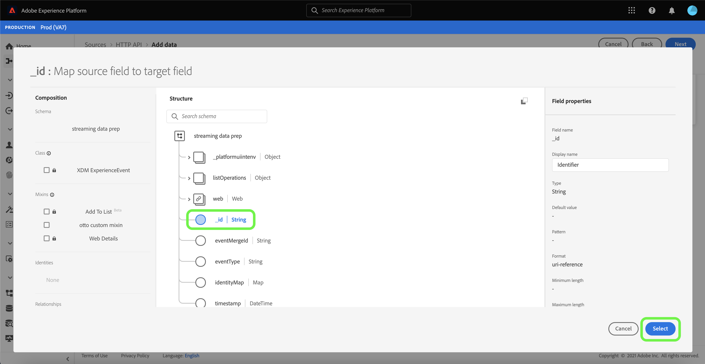

# 建立 [!DNL HTTP API] 使用UI的串流連線

本教學課程提供使用 [!UICONTROL 來源] 工作區。

## 快速入門

本教學課程需要妥善了解下列Adobe Experience Platform元件：

- [[!DNL Experience Data Model (XDM)] 系統](../../../../../xdm/home.md):標準化框架 [!DNL Experience Platform] 組織客戶體驗資料。
   - [結構構成基本概念](../../../../../xdm/schema/composition.md):了解XDM結構描述的基本建置組塊，包括結構描述的主要原則和最佳實務。
   - [結構編輯器教學課程](../../../../../xdm/tutorials/create-schema-ui.md):了解如何使用結構編輯器UI建立自訂結構。
- [[!DNL Real-Time Customer Profile]](../../../../../profile/home.md):根據來自多個來源的匯總資料，提供統一的即時消費者設定檔。

## 建立串流連線

在平台UI中，選取 **[!UICONTROL 來源]** 從左側導覽器存取 [!UICONTROL 來源] 工作區。 此 [!UICONTROL 目錄] 畫面會顯示您可以用來建立帳戶的各種來源。

您可以從畫面左側的目錄中選取適當的類別。 或者，您也可以使用搜尋選項找到您要使用的特定來源。

在 **[!UICONTROL 串流]** 類別，選擇 **[!UICONTROL HTTP API]** 然後選取 **[!UICONTROL 新增資料]**.

此 **[!UICONTROL 連接HTTP API帳戶]** 頁。 在此頁面上，您可以使用新憑證或現有憑證。

### 現有帳戶

要使用現有帳戶，請選擇要使用建立新資料流的HTTP API帳戶，然後選擇 **[!UICONTROL 下一個]** 繼續。

### 新帳戶

如果您要建立新帳戶，請選取 **[!UICONTROL 新帳戶]**. 在顯示的輸入表單中，提供帳戶名稱和可選說明。 您也可以選擇提供下列設定屬性：

- **[!UICONTROL 驗證]:** 此屬性決定串流連線是否需要驗證。 驗證可確保從受信任的來源收集資料。 若您處理的是個人識別資訊(PII)，應開啟此屬性。 此屬性預設為關閉。
- **[!UICONTROL XDM相容]:** 此屬性表示此串流連線是否會傳送與XDM結構相容的事件。 此屬性預設為關閉。

完成後，請選取 **[!UICONTROL 連接到源]** 然後選取 **[!UICONTROL 下一個]** 繼續。

## 選擇資料

建立HTTP API連線後， **[!UICONTROL 選擇資料]** 步驟，提供您上傳和預覽資料的介面。

選擇 **[!UICONTROL 上傳檔案]** 上傳資料。 或者，您也可以將資料拖放至 [!UICONTROL 拖放檔案] 區段。

上傳資料後，您就可以使用介面的右側預覽檔案階層。 選擇 **[!UICONTROL 下一個]** 繼續。

## 將資料欄位對應至XDM結構

此 [!UICONTROL 對應] 步驟，提供將來源資料對應至Platform資料集的介面。

Parquet檔案必須符合XDM標準，且不要求您手動設定對應，而CSV檔案則要求您明確設定對應，但可讓您選取要對應的來源資料欄位。 JSON檔案若標示為XDM投訴，則不需要手動設定。 不過，如果未標示為符合XDM，則需要您明確設定對應。

選擇要內嵌入的傳入資料的資料集。 您可以使用現有資料集或建立新資料集。

### 建立新資料集

若要建立新資料集，請選取 **[!UICONTROL 新資料集]**. 在顯示的表單中，提供名稱、選用說明以及資料集的目標結構。 如果您選取 [!DNL Profile]-enabled schema，您可以選擇是否也 [!DNL Profile]-enabled。

### 使用現有資料集

若要使用現有資料集，請選取 **[!UICONTROL 現有資料集]**. 在顯示的表單中，選取您要使用的資料集。 選取資料集後，您就可以選擇是否應將資料集 [!DNL Profile]-enabled。

### 映射標準欄位

您可以視需要選擇直接映射欄位，或使用資料準備函式來轉換源資料，以導出計算值或計算值。 有關使用映射器介面和計算欄位的完整步驟，請參閱 [資料準備UI指南](../../../../../data-prep/ui/mapping.md).

要添加新源欄位，請選擇 **[!UICONTROL 新增對應]**.

出現新源欄位和目標欄位配對。 要添加新源欄位，請選擇 [!UICONTROL 選擇源欄位] 欄。

此 [!UICONTROL 選擇屬性] 面板可讓您探索檔案階層，並選取特定來源欄位以對應至目標XDM欄位。 選擇要映射的源欄位後，請選擇 **[!UICONTROL 選擇]** 繼續。

選取來源欄位後，您現在可以識別要對應的適當目標XDM欄位。 在目標欄位區段下選取架構圖示。

此 [!UICONTROL 將源欄位映射到目標欄位] ，提供您探索目標資料集結構的介面。 選擇與源欄位匹配的目標欄位，然後選擇 **[!UICONTROL 選擇]** 繼續。

將來源欄位全部對應至其適當的目標XDM欄位後，請選取 **[!UICONTROL 下一個]**

## 資料流詳細資訊

此 **[!UICONTROL 資料流詳細資訊]** 步驟。 在此頁上，您可以通過提供名稱和可選說明來提供已建立資料流的詳細資訊。

提供資料流的詳細資訊後，請選擇 **[!UICONTROL 下一個]**.

## 檢閱

此 **[!UICONTROL 檢閱]** 步驟，允許您在建立資料流之前查看資料流的詳細資訊。 詳細資料分為下列類別：

- **[!UICONTROL 連線]**:顯示帳戶名稱、源平台和源名稱。
- **[!UICONTROL 指派資料集和對應欄位]**:顯示目標資料集和資料集所遵守的結構。

確認詳細資訊正確後，請選取 **[!UICONTROL 完成]**.

## 取得串流端點URL

建立連接後，將顯示源詳細資訊頁。 此頁顯示新建立的連接的詳細資訊，包括以前運行的資料流、ID和流端點URL。

## 後續步驟

依照本教學課程，您已建立串流HTTP連線，讓您能使用串流端點存取各種 [!DNL Data Ingestion] API。 如需在API中建立串流連線的指示，請參閱 [建立串流連線教學課程](../../../api/create/streaming/http.md).

若要了解如何將資料串流至Platform，請閱讀以下任一教學課程： [串流時間序列資料](../../../../../ingestion/tutorials/streaming-time-series-data.md) 或 [流記錄資料](../../../../../ingestion/tutorials/streaming-record-data.md).
