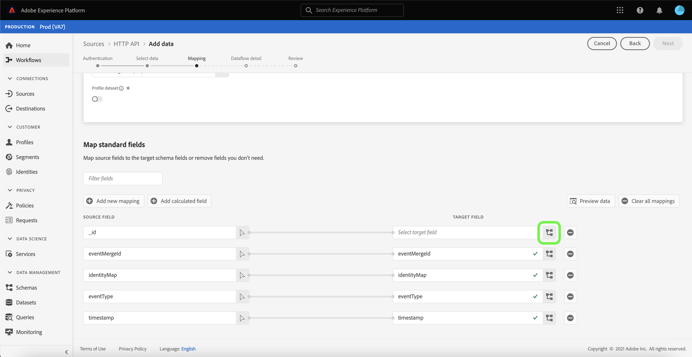

# 使用UI建立串流連線

本教學課程提供使用[!UICONTROL Sources]工作區建立串流來源連線的步驟。

## 快速入門

本教學課程需要對Adobe Experience Platform的下列部分有正確的理解：

- [[!DNL Experience Data Model (XDM)] 系統](../../../../../xdm/home.md):組織客戶體驗資 [!DNL Experience Platform] 料的標準化架構。
   - [架構構成基礎](../../../../../xdm/schema/composition.md):瞭解XDM架構的基本建置區塊，包括架構組合的主要原則和最佳實務。
   - [架構編輯器教程](../../../../../xdm/tutorials/create-schema-ui.md):瞭解如何使用架構編輯器UI建立自訂架構。
- [[!DNL Real-time Customer Profile]](../../../../../profile/home.md):根據來自多個來源的匯整資料，提供統一、即時的消費者個人檔案。

## 建立串流連線

在平台UI中，從左側導覽器選擇&#x200B;**[!UICONTROL Sources]**&#x200B;以存取[!UICONTROL Sources]工作區。 [!UICONTROL Catalog]畫面會顯示多種來源，您可以使用這些來源建立帳戶。

您可以從畫面左側的目錄中選取適當的類別。 或者，您也可以使用搜尋選項找到您要使用的特定來源。

在&#x200B;**[!UICONTROL Streaming]**&#x200B;類別下，選擇&#x200B;**[!UICONTROL HTTP API]**，然後選擇&#x200B;**[!UICONTROL Add data]**。

此時將顯示&#x200B;**[!UICONTROL Connect HTTP API account]**&#x200B;頁。 在此頁上，您可以使用新認證或現有認證。

### 現有帳戶

要使用現有帳戶，請選擇要使用建立新資料流的HTTP API帳戶，然後選擇&#x200B;**[!UICONTROL Next]**&#x200B;繼續。

### 新帳戶

如果要建立新帳戶，請選擇&#x200B;**[!UICONTROL New account]**。 在出現的輸入表單上，提供帳戶名稱和選擇性說明。 您也可以選擇提供下列配置屬性：

- **[!UICONTROL Authentication]:** 此屬性決定串流連線是否需要驗證。驗證可確保從受信任的來源收集資料。 如果您正在處理個人識別資訊(PII)，應開啟此屬性。 依預設，此屬性會關閉。
- **[!UICONTROL XDM compatible]:** 此屬性表示此串流連接是否將發送與XDM方案相容的事件。依預設，此屬性會關閉。

完成後，選擇&#x200B;**[!UICONTROL Connect to source]**，然後選擇&#x200B;**[!UICONTROL Next]**&#x200B;繼續。

## 選擇資料

建立HTTP API連線後，會出現&#x200B;**[!UICONTROL Select data]**&#x200B;步驟，提供您上傳和預覽資料的介面。

選擇&#x200B;**[!UICONTROL Upload files]**&#x200B;以上傳您的資料。 或者，您也可以將資料拖放到介面的[!UICONTROL Drag and drop files]部分。

上傳資料後，您可以使用介面的右側來預覽檔案階層。 選擇&#x200B;**[!UICONTROL Next]**&#x200B;繼續。

## 將資料欄位對應至XDM架構

出現[!UICONTROL Mapping]步驟，提供將源資料映射到平台資料集的介面。

Parce檔案必須符合XDM規範，而不需要手動設定對應，而CSV檔案則要求您明確設定對應，但可讓您選擇要對應的來源資料欄位。 JSON檔案（如果標示為XDM抱怨）不需要手動設定。 但是，如果它未標籤為XDM相容，則需要顯式配置映射。

選擇要接收傳入資料的資料集。 您可以使用現有資料集或建立新資料集。

### 建立新資料集

要建立新資料集，請選擇&#x200B;**[!UICONTROL New dataset]**。 在顯示的表單上，提供資料集的名稱、選用說明以及目標架構。 如果選擇[!DNL Profile]啟用的模式，則可以選擇資料集是否也應該啟用[!DNL Profile]。

### 使用現有資料集

若要使用現有資料集，請選取&#x200B;**[!UICONTROL Existing dataset]**。 在顯示的表格上，選取您要使用的資料集。 在選擇資料集後，您可以選擇資料集是否應啟用[!DNL Profile]。

### 對應標準欄位

根據您的需求，您可以選擇直接映射欄位，或使用資料準備函式來轉換來源資料，以衍生計算或計算值。 有關資料映射和映射器功能的詳細資訊，請參閱有關將CSV資料映射到XDM模式欄位](../../../../../ingestion/tutorials/map-a-csv-file.md)的教程。[

要添加新源欄位，請選擇&#x200B;**[!UICONTROL Add new mapping]**。

出現新的源欄位和目標欄位配對。 要添加新源欄位，請選擇[!UICONTROL Select source field]輸入欄旁的箭頭表徵圖。

[!UICONTROL Select attributes]面板允許您瀏覽檔案分層結構，並選擇特定源欄位以映射到目標XDM欄位。 選擇要映射的源欄位後，選擇&#x200B;**[!UICONTROL Select]**&#x200B;繼續。

在選取來源欄位後，您現在可以識別要對應至的適當目標XDM欄位。 在目標欄位部分下選擇方案表徵圖。

出現[!UICONTROL Map source field to target field]視窗，提供您一個介面來探索目標資料集的模式。 選擇與源欄位匹配的目標欄位，然後選擇&#x200B;**[!UICONTROL Select]**&#x200B;繼續。

將源欄位全部映射到相應的目標XDM欄位後，請選擇&#x200B;**[!UICONTROL Next]**

## 資料流詳細資訊

出現&#x200B;**[!UICONTROL Dataflow detail]**&#x200B;步驟。 在此頁中，可以通過指定名稱和可選說明來提供建立的資料流的詳細資訊。

提供資料流的詳細資訊後，選擇&#x200B;**[!UICONTROL Next]**。

## 評論

出現&#x200B;**[!UICONTROL Review]**&#x200B;步驟，允許您在建立資料流之前查看其詳細資訊。 詳細資訊分為下列類別：

- **[!UICONTROL Connection]**:顯示帳戶名稱、來源平台和來源名稱。
- **[!UICONTROL Assign dataset and map fields]**:顯示目標資料集和資料集所遵守的模式。

確認詳細資訊正確後，選擇&#x200B;**[!UICONTROL Finish]**。

## 取得串流端點URL

在建立連線後，會顯示來源詳細資料頁面。 此頁顯示新建立的連接的詳細資訊，包括以前運行的資料流、ID和流端點URL。

## 後續步驟

在本教學課程中，您已建立串流HTTP連線，讓您使用串流端點來存取各種[!DNL Data Ingestion] API。 有關在API中建立流連接的說明，請閱讀[建立流連接教程](../../../api/create/streaming/http.md)。

要瞭解如何將資料串流至平台，請閱讀有關[串流時間系列資料](../../../../../ingestion/tutorials/streaming-time-series-data.md)的教學課程，或有關[串流記錄資料](../../../../../ingestion/tutorials/streaming-record-data.md)的教學課程。
