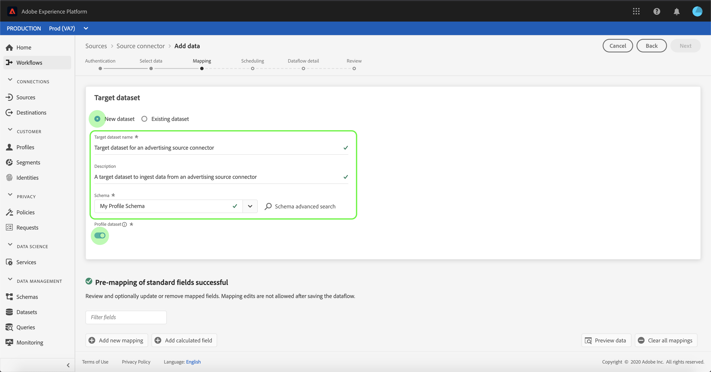

# 在UI中為Advertising連線設定資料流

資料流是一項排程任務，可從來源擷取資料，並內嵌至Adobe Experience Platform資料集。 本教學課程提供使用您的Advertising帳戶設定新資料流的步驟。

## 快速入門

本教學課程需要妥善了解下列Adobe Experience Platform元件：

- [[!DNL Experience Data Model (XDM)] 系統](../../../../xdm/home.md):組織客戶體驗資 [!DNL Experience Platform] 料的標準化架構。
   - [結構構成基本概念](../../../../xdm/schema/composition.md):了解XDM結構描述的基本建置組塊，包括結構描述的主要原則和最佳實務。
   - [結構編輯器教學課程](../../../../xdm/tutorials/create-schema-ui.md):了解如何使用結構編輯器UI建立自訂結構。
- [[!DNL Real-time Customer Profile]](../../../../profile/home.md):根據來自多個來源的匯總資料，提供統一的即時消費者設定檔。

此外，本教學課程需要您已建立Advertising帳戶。 若需在UI中建立不同付款連接器的教學課程清單，請參閱[來源連接器概述](../../../home.md)。

## 選擇資料

建立您的廣告帳戶後，會出現「選取資料」步驟&#x200B;**[!UICONTROL ，提供互動式介面供您探索檔案階層。]**

- 介面的左半部是目錄瀏覽器，顯示伺服器的檔案和目錄。
- 介面的右半部分可讓您從相容的檔案中預覽最多100列資料。

您可以使用頁面頂端的&#x200B;**[!UICONTROL 搜尋]**&#x200B;選項，快速識別您要使用的來源資料。

>[!NOTE]
>
>搜尋來源資料選項可供所有表格式來源連接器使用，但不包括Analytics、分類、事件中心和Kinesis連接器。

找到源資料後，選擇目錄，然後按一下&#x200B;**[!UICONTROL Next]**。

## 將資料欄位對應至XDM結構

此時會顯示&#x200B;**[!UICONTROL 映射]**&#x200B;步驟，提供互動式介面將源資料映射到[!DNL Platform]資料集。

選擇要內嵌入的傳入資料的資料集。 您可以使用現有資料集或建立新資料集。

### 使用現有資料集

若要將資料內嵌至現有資料集，請選取「**[!UICONTROL 使用現有資料集]**」，然後按一下資料集圖示。

此時會出現「**[!UICONTROL 選取資料集]**」對話方塊。 找到您要使用的資料集，選擇該資料集，然後按一下&#x200B;**[!UICONTROL Continue]**。

### 使用新資料集

若要將資料內嵌至新資料集，請選取「**[!UICONTROL 建立新資料集]**」，然後在提供的欄位中輸入資料集的名稱和說明。

您可以在&#x200B;**[!UICONTROL 選擇架構]**&#x200B;搜索欄中輸入架構名稱，以附加架構欄位。 您也可以選取下拉式圖示，以查看現有結構的清單。 或者，您也可以選取&#x200B;**[!UICONTROL 進階搜尋]**&#x200B;來存取現有結構的畫面，包括其各自的詳細資訊。

在此步驟中，您可以為[!DNL Real-time Customer Profile]啟用資料集，並建立實體屬性和行為的整體檢視。 [!DNL Profile]中將包含所有已啟用資料集的資料，並在保存資料流時應用更改。

切換&#x200B;**[!UICONTROL 設定檔資料集]**&#x200B;按鈕，為[!DNL Profile]啟用目標資料集。

此時將顯示&#x200B;**[!UICONTROL 選擇架構]**&#x200B;對話框。 選取您要套用至新資料集的架構，然後按一下「**[!DNL Done]**」。

您可以視需要選擇直接映射欄位，或使用資料準備函式來轉換源資料，以導出計算值或計算值。 有關映射器函式和計算欄位的詳細資訊，請參閱[資料準備函式指南](../../../../data-prep/functions.md)或[計算欄位指南](../../../../data-prep/calculated-fields.md)。

>[!TIP]
>
>[!DNL Platform] 根據您選取的目標結構或資料集，為自動對應欄位提供智慧型建議。您可以手動調整對應規則以符合您的使用案例。

選取「**[!UICONTROL 預覽資料]**」 ，即可查看所選資料集中最多100列範例資料的對應結果。

在預覽期間，身分欄會優先順序排列為第一個欄位，因為這是驗證對應結果時所需的關鍵資訊。

映射源資料後，選擇&#x200B;**[!UICONTROL Close]**。

## 排程擷取執行

此時會顯示&#x200B;**[!UICONTROL 排程]**&#x200B;步驟，讓您設定擷取排程，以使用設定的對應自動擷取選取的來源資料。 下表概述用於調度的不同可配置欄位：

| 欄位 | 說明 |
| --- | --- |
| 頻率 | 可選頻率包括`Once`、`Minute`、`Hour`、`Day`和`Week`。 |
| 間隔 | 設定所選頻率間隔的整數。 |
| 開始時間 | UTC時間戳記，指出第一次擷取的設定何時發生。 |
| 回填 | 一個布林值，可決定最初擷取的資料。 如果啟用&#x200B;**[!UICONTROL 回填]**，則在首次排程擷取期間，會擷取指定路徑中所有目前的檔案。 如果&#x200B;**[!UICONTROL 回填]**&#x200B;已停用，則只會擷取在首次擷取執行與開始時間之間載入的檔案。 在開始時間之前載入的檔案將不會被擷取。 |
| 增量列 | 具有類型、日期或時間的源架構欄位集的篩選選項。 此欄位可用來區分新資料和現有資料。 將根據所選欄的時間戳記擷取增量資料。 |

資料流設計為按計畫自動內嵌資料。 首先，選取擷取頻率。 接下來，設定間隔以指定兩個流運行之間的週期。 間隔的值應為非零整數，應設為大於或等於15。

若要設定擷取的開始時間，請調整開始時間方塊中顯示的日期和時間。 或者，您也可以選取日曆圖示來編輯開始時間值。 開始時間必須大於或等於當前UTC時間。

選擇&#x200B;**[!UICONTROL 按]**&#x200B;載入增量資料以分配增量列。 此欄位可區分新資料和現有資料。

### 設定一次性內嵌資料流

若要設定一次性擷取，請選取頻率下拉箭頭，然後選取&#x200B;**[!UICONTROL Once]**。

>[!TIP]
>
>**** 擷取 **** 一次期間內不會顯示間隔回填。

在為調度提供適當值後，選擇&#x200B;**[!UICONTROL Next]**。

## 提供資料流詳細資訊

此時將顯示&#x200B;**[!UICONTROL 資料流詳細資訊]**&#x200B;步驟，允許您命名新資料流並提供有關新資料流的簡要說明。

在此過程中，您還可以啟用&#x200B;**[!UICONTROL 部分獲取]**&#x200B;和&#x200B;**[!UICONTROL 錯誤診斷]**。 啟用&#x200B;**[!UICONTROL 部分擷取]**&#x200B;可讓您內嵌包含錯誤且高達特定臨界值的資料。 啟用&#x200B;**[!UICONTROL 部分擷取]**&#x200B;後，拖曳&#x200B;**[!UICONTROL 錯誤臨界值%]**&#x200B;撥號以調整批次的錯誤臨界值。 或者，您也可以選取輸入方塊，手動調整臨界值。 如需詳細資訊，請參閱[部分批次內嵌概述](../../../../ingestion/batch-ingestion/partial.md)。
為資料流提供值，然後選擇**[!UICONTROL Next]**。

## 查看資料流

此時將顯示&#x200B;**[!UICONTROL 查看]**&#x200B;步驟，允許您在建立新資料流之前查看該資料流。 詳細資料會分組為下列類別：

- **[!UICONTROL 連線]**:顯示源類型、所選源檔案的相關路徑以及該源檔案中的列數。
- **[!UICONTROL 指派資料集和對應欄位]**:顯示要擷取來源資料的資料集，包括資料集所遵守的結構。
- **[!UICONTROL 排程]**:顯示擷取排程的作用中期間、頻率和間隔。

審核資料流後，按一下&#x200B;**[!UICONTROL 完成]**&#x200B;並允許建立資料流的一些時間。

## 監視資料流

建立資料流後，您可以監視正在通過資料流進行內嵌的資料，以查看有關內嵌率、成功和錯誤的資訊。 有關如何監視資料流的詳細資訊，請參閱UI](../monitor.md)中有關[監視帳戶和資料流的教程。

## 刪除資料流

您可以刪除不再需要或使用&#x200B;**[!UICONTROL Dataflows]**&#x200B;工作區中可用的&#x200B;**[!UICONTROL Delete]**&#x200B;函式建立錯誤的資料流。 有關如何刪除資料流的詳細資訊，請參閱有關在UI](../delete.md)中刪除資料流的教程。[

## 後續步驟

依照本教學課程，您已成功建立資料流，以從行銷自動化系統匯入資料，並深入了解監控資料集。 下游[!DNL Platform]服務（如[!DNL Real-time Customer Profile]和[!DNL Data Science Workspace]）現在可以使用傳入的資料。 如需詳細資訊，請參閱下列檔案：

- [即時客戶個人檔案概觀](../../../../profile/home.md)
- [Data Science Workspace概觀](../../../../data-science-workspace/home.md)

## 附錄

以下各節提供使用源連接器的其他資訊。

### 禁用資料流

建立資料流時，它會立即變為活動狀態，並根據給定的時間表內嵌資料。 您可以隨時按照以下說明禁用活動資料流。

在&#x200B;**[!UICONTROL 資料流]**&#x200B;螢幕中，選擇要禁用的資料流的名稱。

螢幕的右側會顯示&#x200B;**[!UICONTROL Properties]**&#x200B;欄。 此面板包含&#x200B;**[!UICONTROL Enabled]**&#x200B;切換按鈕。 按一下切換按鈕以禁用資料流。 禁用資料流後，可以使用相同的切換按鈕重新啟用資料流。

### 啟用[!DNL Profile]母體的入站資料

來自來源連接器的傳入資料可用於擴充和填入[!DNL Real-time Customer Profile]資料。 如需填入[!DNL Real-time Customer Profile]資料的詳細資訊，請參閱[設定檔填入](../profile.md)的教學課程。
