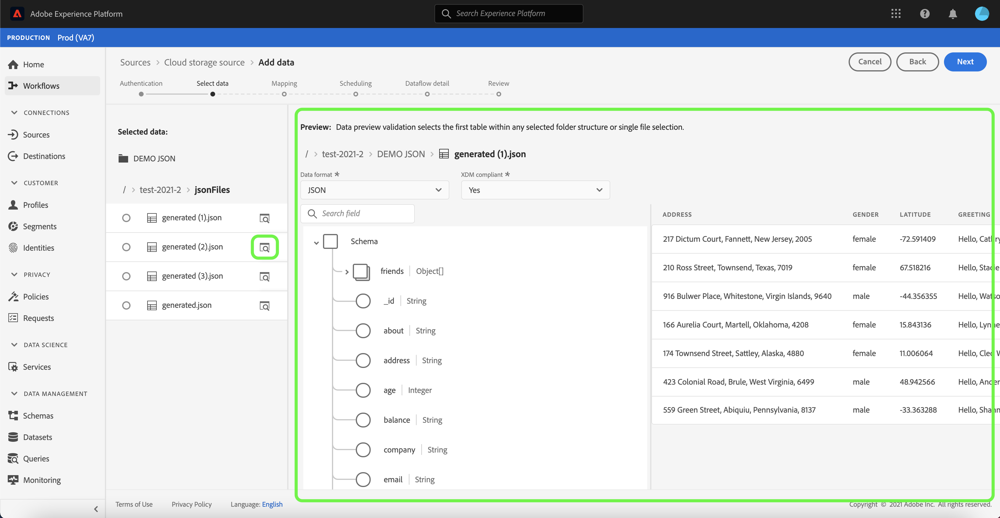
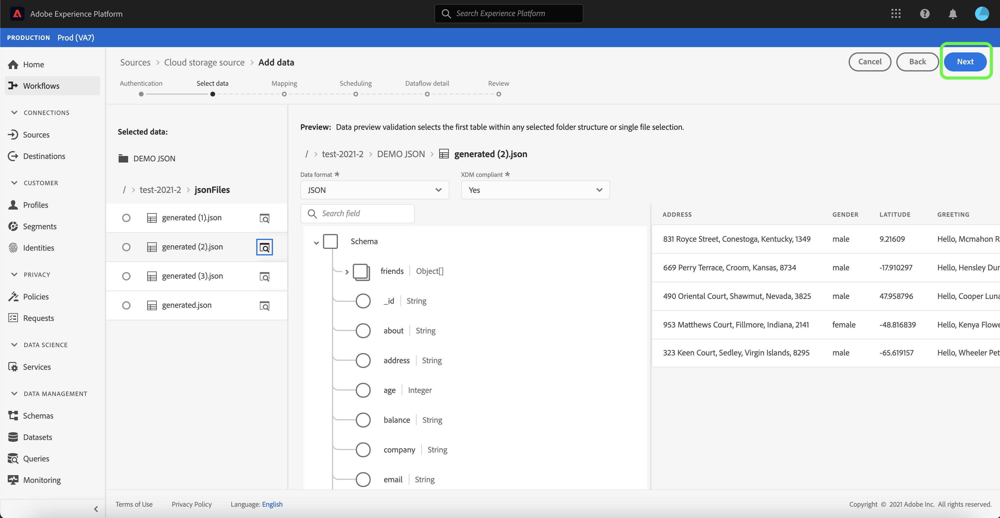
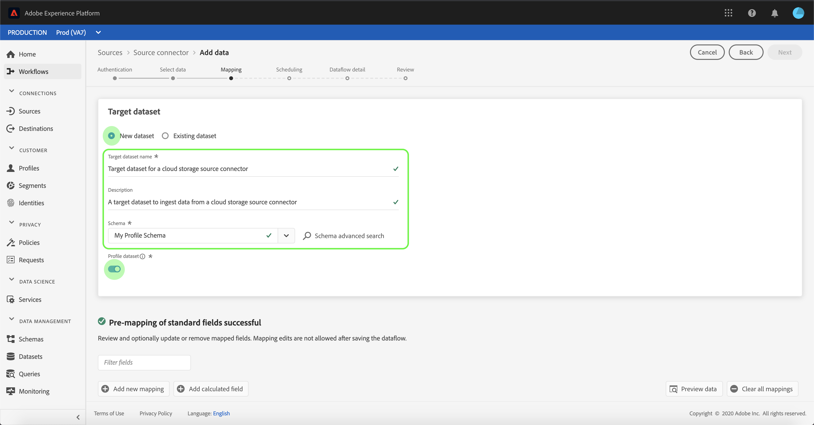

# 在UI中為雲儲存批次連接配置資料流

資料流是從源中檢索和將資料內嵌到 [!DNL Platform] 資料集。 本教學課程提供使用雲儲存帳戶配置新資料流的步驟。

## 快速入門

本教學課程需要妥善了解下列Adobe Experience Platform元件：

* [[!DNL Experience Data Model (XDM)] 系統](../../../../../xdm/home.md):標準化框架 [!DNL Experience Platform] 組織客戶體驗資料。
   * [結構構成基本概念](../../../../../xdm/schema/composition.md):了解XDM結構描述的基本建置組塊，包括結構描述的主要原則和最佳實務。
   * [結構編輯器教學課程](../../../../../xdm/tutorials/create-schema-ui.md):了解如何使用結構編輯器UI建立自訂結構。
* [[!DNL Real-time Customer Profile]](../../../../../profile/home.md):根據來自多個來源的匯總資料，提供統一的即時消費者設定檔。

此外，本教學課程需要您已建立雲端儲存空間帳戶。 若需在UI中建立不同雲端儲存空間帳戶的教學課程清單，請參閱 [來源連接器概觀](../../../../home.md).

### 支援的檔案格式

[!DNL Experience Platform] 支援從外部儲存器擷取的下列檔案格式：

* 分隔字元分隔值(DSV):任何單字元值都可用作DSV格式化資料檔案的分隔符。
* [!DNL JavaScript Object Notation] (JSON):JSON格式的資料檔案必須符合XDM。
* [!DNL Apache Parquet]:鑲木格式的資料檔案必須符合XDM。
* 壓縮檔案：JSON和分隔檔案可壓縮為： `bzip2`, `gzip`, `deflate`, `zipDeflate`, `tarGzip`，和 `tar`.

## 選擇資料

建立雲端儲存空間帳戶後， **[!UICONTROL 選擇資料]** 步驟，提供介面供您探索雲端儲存檔案階層。

* 介面的左側是目錄瀏覽器，顯示您的雲儲存檔案和目錄。
* 介面的右側可讓您從相容的檔案中預覽最多100列資料。

選取列出的資料夾可讓您將資料夾階層周遊至更深層的資料夾。 您可以選取單一資料夾，遞回內嵌資料夾中的所有檔案。 擷取整個資料夾時，您必須確保資料夾中的所有檔案都共用相同的結構。

選取相容的檔案或資料夾後，請從 [!UICONTROL 選擇資料格式] 下拉式功能表。

下表顯示支援的檔案類型的適當資料格式：

| 檔案類型 | 資料格式 |
| --- | --- |
| CSV | [!UICONTROL 分隔] |
| JSON | [!UICONTROL JSON] |
| 鑲木 | [!UICONTROL XDM Parquet] |

選擇 **[!UICONTROL JSON]** 並等待幾秒鐘，以便填入預覽介面。

>[!NOTE]
>
>與分隔檔案和JSON檔案類型不同，預覽無法使用Parquet格式化檔案。

預覽介面可讓您檢查檔案的內容和結構。 預設情況下，預覽介面將顯示所選資料夾中的第一個檔案。

要預覽不同的檔案，請在要檢查的檔案名稱旁選擇預覽表徵圖。

檢查資料夾中檔案的內容和結構後，選擇 **[!UICONTROL 下一個]** 遞歸內嵌資料夾中的所有檔案。

如果您偏好選取特定檔案，請選取您要擷取的檔案，然後選取 **[!UICONTROL 下一個]**.

### 為分隔檔案設定自訂分隔字元

擷取分隔檔案時，您可以設定自訂分隔字元。 選取 **[!UICONTROL 分隔字元]** 選項，然後從下拉式功能表中選取分隔字元。 功能表會顯示分隔字元最常使用的選項，包括逗號(`,`)、標籤(`\t`)和垂直號(`|`)。 如果您偏好使用自訂分隔字元，請選取 **[!UICONTROL 自訂]** 並在彈出式輸入列中輸入您所選擇的單字元分隔字元。

選取資料格式並設定分隔字元後，請選取 **[!UICONTROL 下一個]**.

### 內嵌壓縮檔案

您可以指定壓縮類型，以內嵌壓縮的JSON或分隔檔案。

在 [!UICONTROL 選擇資料] 步驟，選取要擷取的壓縮檔案，然後選取其適當的檔案類型，以及是否符合XDM。 下一步，選擇 **[!UICONTROL 壓縮類型]** 然後為源資料選擇適當的壓縮檔案類型。

識別壓縮檔案類型後，請選取 **[!UICONTROL 下一個]** 繼續。

## 將資料欄位對應至XDM結構

此 **[!UICONTROL 對應]** 步驟，提供互動式介面以將來源資料對應至 [!DNL Platform] 資料集。 以Parquet格式化的來源檔案必須符合XDM標準，且不要求您手動設定對應，而CSV檔案則要求您明確設定對應，但可讓您選取要對應的來源資料欄位。 JSON檔案若標示為XDM投訴，則不需要手動設定。 不過，如果未標示為符合XDM，則需要您明確設定對應。

選擇要內嵌入的傳入資料的資料集。 您可以使用現有資料集或建立新資料集。

**使用現有資料集**

若要將資料內嵌至現有資料集，請選取 **[!UICONTROL 現有資料集]**，然後選取資料集圖示。

此 **[!UICONTROL 選取資料集]** 對話框。 找到您要使用的資料集，選取該資料集，然後按一下 **[!UICONTROL 繼續]**.

**使用新資料集**

若要將資料內嵌至新資料集，請選取 **[!UICONTROL 新資料集]** 並在提供的欄位中輸入資料集的名稱和說明。 若要新增結構，您可以在 **[!UICONTROL 選擇架構]** 對話框。 或者，您也可以選取 **[!UICONTROL 架構高級搜索]** 來搜尋適當的結構。

在此步驟中，您可以為 [!DNL Real-time Customer Profile] 並建立實體屬性和行為的整體檢視。 所有已啟用資料集的資料將包含在 [!DNL Profile] 和更改會在保存資料流時應用。

切換 **[!UICONTROL 設定檔資料集]** 按鈕，啟用目標資料集 [!DNL Profile].

此 **[!UICONTROL 選擇架構]** 對話框。 選取您要套用至新資料集的結構，然後選取 **[!UICONTROL 完成]**.

您可以視需要選擇直接映射欄位，或使用資料準備函式來轉換源資料，以導出計算值或計算值。 有關映射器函式和計算欄位的詳細資訊，請參閱 [資料準備功能指南](../../../../../data-prep/functions.md) 或 [計算欄位指南](../../../../../data-prep/calculated-fields.md).

對於JSON檔案，除了直接將欄位對應至其他欄位，您還可以直接將物件對應至其他物件和陣列至其他陣列。您也可以使用雲端儲存來源連接器，預覽和對應JSON檔案中的陣列等複雜資料類型。

請注意，您無法對應不同類型。 例如，您無法將對象映射到陣列，或將欄位映射到對象。

>[!TIP]
>
>Platform會根據您選取的目標結構或資料集，為自動對應欄位提供智慧型建議。 您可以手動調整對應規則以符合您的使用案例。

選擇 **[!UICONTROL 預覽資料]** ，查看所選資料集最多100列範例資料的對應結果。

在預覽期間，身分欄會優先順序排列為第一個欄位，因為這是驗證對應結果時所需的關鍵資訊。

映射源資料後，選擇 **[!UICONTROL 關閉]**.

## 排程擷取執行

此 **[!UICONTROL 排程]** 步驟，可讓您設定擷取排程，以使用已設定的對應自動擷取選取的來源資料。 下表概述用於調度的不同可配置欄位：

| 欄位 | 說明 |
| --- | --- |
| 頻率 | 可選頻率包括 `Once`, `Minute`, `Hour`, `Day`，和 `Week`. |
| 間隔 | 設定所選頻率間隔的整數。 |
| 開始時間 | UTC時間戳記，指出第一次擷取的設定何時發生。 |
| 回填 | 一個布林值，可決定最初擷取的資料。 若 **[!UICONTROL 回填]** 啟用時，指定路徑中的所有目前檔案都會在首次排程擷取期間內擷取。 若 **[!UICONTROL 回填]** 已停用，則只會擷取在首次擷取執行與開始時間之間載入的檔案。 在開始時間之前載入的檔案將不會被擷取。 |

資料流設計為按計畫自動內嵌資料。 首先，選取擷取頻率。 接下來，設定間隔以指定兩個流運行之間的週期。 間隔的值應為非零整數，應設為大於或等於15。

若要設定擷取的開始時間，請調整開始時間方塊中顯示的日期和時間。 或者，您也可以選取日曆圖示來編輯開始時間值。 開始時間必須大於或等於當前時間（以UTC表示）。

提供排程的值並選取 **[!UICONTROL 下一個]**.

>[!NOTE]
>
>對於批次內嵌，每個隨後的資料流都會根據檔案的來源選擇要內嵌的檔案 **上次修改** 時間戳記。 這意味著批處理資料流從源中選擇自上次資料流運行以來新建或修改的檔案。

### 設定一次性內嵌資料流

若要設定一次性擷取，請選取頻率下拉箭頭並選取 **[!UICONTROL 一次]**. 只要開始時間在將來，您就可以繼續編輯資料流集以進行一次性頻率獲取。 一旦開始時間過後，就無法再編輯一次性頻率值。 **[!UICONTROL 間隔]** 和 **[!UICONTROL 回填]** 設定一次性內嵌資料流時，不會顯示。

>[!IMPORTANT]
>
>強烈建議在使用 [FTP連接器](../../../../connectors/cloud-storage/ftp.md).

為排程提供適當值後，請選取 **[!UICONTROL 下一個]**.

## 提供資料流詳細資訊

此 **[!UICONTROL 資料流詳細資訊]** 步驟出現，允許您為新資料流命名並提供簡要說明。

在此程式中，您也可以啟用 **[!UICONTROL 部分擷取]** 和 **[!UICONTROL 錯誤診斷]**. 啟用 **[!UICONTROL 部分擷取]** 提供內嵌包含錯誤的資料的功能，最多可以設定特定臨界值。 啟用 **[!UICONTROL 錯誤診斷]** 會提供任何個別批次處理之錯誤資料的詳細資訊。 如需詳細資訊，請參閱 [部分批次內嵌概觀](../../../../../ingestion/batch-ingestion/partial.md).

為資料流提供值並選擇 **[!UICONTROL 下一個]**.

## 查看資料流

此 **[!UICONTROL 檢閱]** 步驟顯示，允許您在建立新資料流之前對其進行查看。 詳細資料會分組為下列類別：

* **[!UICONTROL 連線]**:顯示源類型、所選源檔案的相關路徑以及該源檔案中的列數。
* **[!UICONTROL 指派資料集和對應欄位]**:顯示要擷取來源資料的資料集，包括資料集所遵守的結構。
* **[!UICONTROL 排程]**:顯示擷取排程的作用中期間、頻率和間隔。

審核資料流後，按一下 **[!UICONTROL 完成]** 並允許建立資料流的時間。

## 監視資料流

建立資料流後，您可以監視正在通過資料流進行內嵌的資料，以查看有關內嵌率、成功和錯誤的資訊。 有關如何監視資料流的詳細資訊，請參閱 [監視UI中的帳戶和資料流](../../monitor.md).

## 刪除資料流

您可以刪除不再需要的資料流，或使用 **[!UICONTROL 刪除]** 函式 **[!UICONTROL 資料流]** 工作區。 有關如何刪除資料流的詳細資訊，請參閱 [刪除UI中的資料流](../../delete.md).

## 後續步驟

依照本教學課程，您已成功建立資料流以從外部雲端儲存空間傳入資料，並深入了解監控資料集。 要了解有關建立資料流的詳細資訊，您可以觀看下面的視頻來補充學習內容。 此外，下游現在可以使用傳入的資料 [!DNL Platform] 服務，例如 [!DNL Real-time Customer Profile] 和 [!DNL Data Science Workspace]. 如需詳細資訊，請參閱下列檔案：

* [[!DNL Real-time Customer Profile] 概觀](../../../../../profile/home.md)
* [[!DNL Data Science Workspace] 概觀](../../../../../data-science-workspace/home.md)

>[!WARNING]
>
> 此 [!DNL Platform] 下列影片中顯示的UI已過期。 請參閱上述檔案，了解最新的UI螢幕擷取畫面和功能。

>[!VIDEO](https://video.tv.adobe.com/v/29695?quality=12&learn=on)

## 附錄

以下各節提供使用源連接器的其他資訊。

### 禁用資料流

建立資料流時，它會立即變為活動狀態，並根據給定的時間表內嵌資料。 您可以隨時按照以下說明禁用活動資料流。

在 **[!UICONTROL 來源]** 工作區，按一下 **[!UICONTROL 瀏覽]** 標籤。 接下來，按一下與要禁用的活動資料流關聯的帳戶的名稱。

此 **[!UICONTROL 來源活動]** 頁。 從清單中選擇活動資料流以開啟其 **[!UICONTROL 屬性]** 欄，其中包含 **[!UICONTROL 已啟用]** 切換按鈕。 按一下切換按鈕以禁用資料流。 禁用資料流後，可以使用相同的切換按鈕重新啟用資料流。

### 為啟用傳入資料 [!DNL Profile] 人口

來自來源連接器的傳入資料可用於擴充和填入 [!DNL Real-time Customer Profile] 資料。 如需填入 [!DNL Real-time Customer Profile] 資料，請參閱 [設定檔母體](../../profile.md).
