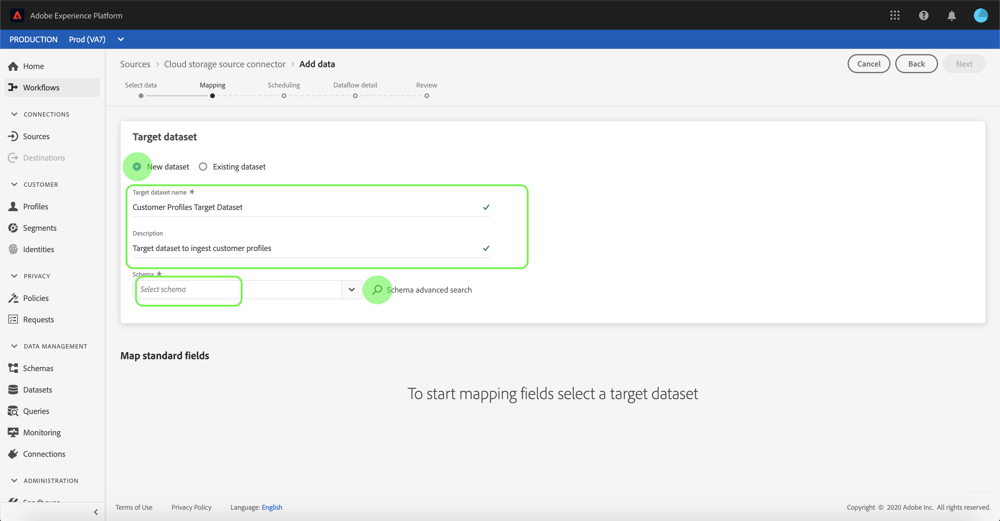

# 在UI中為雲儲存批處理連接器配置資料流

資料流是從源中檢索資料並將資料收錄到資料集的計畫 [!DNL Platform] 任務。 本教學課程提供使用雲端儲存帳戶設定新資料流的步驟。

## 快速入門

本教學課程需要對Adobe Experience Platform的下列元件有正確的認識：

* [體驗資料模型(XDM)系統](../../../../../xdm/home.md):組織客戶體驗資料 [!DNL Experience Platform] 的標準化架構。
   * [架構構成基礎](../../../../../xdm/schema/composition.md):瞭解XDM架構的基本建置區塊，包括架構組合的主要原則和最佳實務。
   * [架構編輯器教程](../../../../../xdm/tutorials/create-schema-ui.md):瞭解如何使用架構編輯器UI建立自訂架構。
* [即時客戶個人檔案](../../../../../profile/home.md):根據來自多個來源的匯整資料，提供統一、即時的消費者個人檔案。

此外，本教學課程要求您擁有已建立的雲端儲存空間帳戶。 如需在UI中建立不同雲端儲存空間帳戶的教學課程清單，請參閱來源連接 [器概觀](../../../../home.md)。

### 支援的檔案格式

[!DNL Experience Platform] 支援從外部儲存中提取的以下檔案格式：

* 分隔字元分隔值(DSV):目前，對DSV格式化資料檔案的支援僅限於逗號分隔值。 DSV格式檔案中欄位標題的值只能由字母數字字元和下划線組成。 將來將提供對一般DSV檔案的支援。
* [!DNL JavaScript Object Notation] (JSON):JSON格式的資料檔案必須符合XDM規範。
* [!DNL Apache Parquet]:拼花格式的資料檔案必須與XDM相容。

## 選擇資料

在建立雲端儲存帳戶後，會出 *[!UICONTROL 現「選取資料]* 」步驟，提供互動式介面供您探索雲端儲存階層。

* 介面的左半部分是目錄瀏覽器，顯示伺服器的檔案和目錄。
* 介面的右半部分可讓您從相容檔案中預覽最多100列資料。

選擇列出的資料夾可讓您將資料夾層次結構遍歷到更深的資料夾中。 在您選取相容的檔案或資料夾後，就會出現「選取資料格式 **** 」下拉式清單，您可在其中選擇格式以在預覽視窗中顯示資料。

在預覽視窗填入後，您可以選取「下 **[!UICONTROL 一步]** 」來上傳所選資料夾中的所有檔案。 如果要上傳到特定檔案，請在選擇「下一步」之前，從清單中選擇該 **[!UICONTROL 檔案]**。

### 收錄Parce或JSON檔案

雲端儲存帳戶支援的檔案格式也包含JSON和Parce。 JSON和Parce檔案必須符合XDM規範。 若要擷取JSON或Parce檔案，請從目錄瀏覽器中選取適當的檔案格式，並從正確的介面套用相容的資料格式。 選擇 **[!UICONTROL 下一步]** ，繼續。

>[!IMPORTANT]
>
>與分隔的檔案類型不同，JSON和Parce格式的檔案無法用於預覽。

## 將資料欄位對應至XDM架構

此時 *[!UICONTROL 會顯示]* 「映射」步驟，提供互動式介面，將來源資料映射至資料 [!DNL Platform] 集。 使用JSON或Parce格式化的來源檔案必須符合XDM標準，而且您不需要手動設定對應。 相反地，CSV檔案會要求您明確設定對應，但允許您選擇要對應的來源資料欄位。

選擇要接收傳入資料的資料集。 您可以使用現有資料集或建立新資料集。

**使用現有資料集**

若要將資料內嵌至現有資料集，請選取「 **[!UICONTROL 現有資料集]**」，然後選取資料集圖示。

將出 *[!UICONTROL 現「選擇資料集]* 」對話框。 尋找您要使用的資料集，選取它，然後按一下「繼 **[!UICONTROL 續]**」。

**使用新資料集**

若要將資料新增至新資料集，請選取「 **[!UICONTROL 新資料集]** 」，並在提供的欄位中輸入資料集的名稱和說明。 要添加方案，可以在「選擇方案」對話框中輸入現 *[!UICONTROL 有方案]* 名稱。 或者，您也可以選擇「方 **[!UICONTROL 案」高級搜索]** ，以搜索適當的方案。

將出 *[!UICONTROL 現「選擇模式]* 」對話框。 選擇要應用於新資料集的模式，然後選擇「完 **[!UICONTROL 成」]**。

您可以根據需要選擇直接映射欄位，或使用映射器函式轉換源資料以導出計算值或計算值。 有關資料映射和映射器函式的詳細資訊，請參閱將CSV資料映 [射到XDM模式欄位的教程](../../../../../ingestion/tutorials/map-a-csv-file.md)。

映射源資料後，選擇「下 **[!UICONTROL 一步]**」。

## 排程擷取執行

此時 *[!UICONTROL 會顯示「排程]* 」步驟，允許您配置提取計畫，以使用配置的映射自動提取選定的源資料。 下表概述了用於計畫的不同可配置欄位：

| 欄位 | 說明 |
| --- | --- |
| 頻率 | 可選頻率 `Once`包括 `Minute`、 `Hour`、 `Day`和 `Week`。 |
| 間隔 | 一個整數，用於設定所選頻率的間隔。 |
| 開始時間 | UTC時間戳記，指示何時設定進行第一次擷取。 |
| 回填 | 一個布爾值，可決定最初收錄的資料。 如果 *[!UICONTROL 啟用回填]* ，則指定路徑中的所有目前檔案將在第一次排程擷取期間被擷取。 如果 *停用* 「回填」 *[!UICONTROL ，則只會收錄在首次擷取執行和開始時間之間載入的]* 檔案。 在開始時間之前載 *[!UICONTROL 入的檔案]* ，將不會收錄。 |

資料流設計為在計畫基礎上自動收錄資料。 從選取擷取頻率開始。 接著，設定間隔，以指定兩個流程執行之間的期間。 間隔的值應為非零整數，且應設定為大於或等於15。

若要設定擷取的開始時間，請調整顯示在開始時間方塊中的日期和時間。 或者，您也可以選取日曆圖示來編輯開始時間值。 開始時間必須大於或等於UTC中的當前時間。

為調度提供值並選擇「下 **[!UICONTROL 一步]**」。

### 設定一次性提取資料流

若要設定一次性擷取，請選取頻率下拉箭頭，然後選取「 **[!UICONTROL Once]**」。 只要開始時間未來仍在，您就可以繼續編輯資料流集以進行一次性頻率接收。 一旦開始時間過去，就無法再編輯一次頻率值。

>[!TIP]
>
>**[!UICONTROL 在單]** 次擷取期間 **** ，不會顯示間隔和回填。

在為計畫提供適當值後，選擇「下 **[!UICONTROL 一步」]**。

## 提供資料流詳細資訊

此時將顯示 *[!UICONTROL 資料流詳細資訊]* ，允許您命名新資料流並提供有關新資料流的簡要說明。

在此過程中，您還可以啟用「部 *[!UICONTROL 分提取]* 」和「 *[!UICONTROL 錯誤診斷」]*。 啟用 *[!UICONTROL 部分擷取]* ，可讓您擷取包含錯誤的資料，最多可設定特定臨界值。 啟用 *[!UICONTROL 錯誤診斷]* ，將提供任何個別批次錯誤資料的詳細資訊。 如需詳細資訊，請參閱部 [分批次擷取概觀](../../../../../ingestion/batch-ingestion/partial.md)。

為資料流提供值並選擇「下 **[!UICONTROL 一步]**」。

## 查看資料流

此時 *[!UICONTROL 會出現]* 「查看」步驟，允許您在建立新資料流之前對其進行查看。 詳細資訊會分組在下列類別中：

* *[!UICONTROL 連接]*:顯示源檔案的類型、所選源檔案的相關路徑，以及該源檔案中的列數。
* *[!UICONTROL 指派資料集與地圖欄位]*:顯示源資料被吸收到的資料集，包括資料集所附的模式。
* *[!UICONTROL 排程]*:顯示接收調度的活動期間、頻率和間隔。

複查資料流後，按一下 **[!UICONTROL 完成]** ，並為建立資料流留出一些時間。

## 監控資料流

建立資料流後，您可以監視通過其獲取的資料，以查看有關提取率、成功和錯誤的資訊。 有關如何監視資料流的詳細資訊，請參見UI中有關監 [視帳戶和資料流的教程](../../monitor.md)。

## 刪除資料流

您可以使用「資料流」工作區中的「刪除」功能刪除不再需要或 *[!UICONTROL 建立錯誤的]* 資料流 ** 。 有關如何刪除資料流的詳細資訊，請參見UI中有關 [刪除資料流的教程](../../delete.md)。

## 後續步驟

在本教程中，您成功建立了一個資料流，以便從外部雲儲存中導入資料，並獲得了對監控資料集的深入瞭解。 若要進一步瞭解建立資料流，您可以觀賞以下視訊來補充學習內容。 此外，下游服務（例如和）現在可以 [!DNL Platform] 使用傳入 [!DNL Real-time Customer Profile] 的資料 [!DNL Data Science Workspace]。 如需詳細資訊，請參閱下列檔案：

* [即時客戶個人檔案總覽](../../../../../profile/home.md)
* [資料科學工作區概觀](../../../../../data-science-workspace/home.md)

>[!WARNING]
>
> 下 [!DNL Platform] 列視訊中顯示的UI已過時。 請參閱上述檔案以取得最新的UI螢幕擷取和功能。

>[!VIDEO](https://video.tv.adobe.com/v/29695?quality=12&learn=on)

## 附錄

以下各節提供了使用源連接器的附加資訊。

### 禁用資料流

建立資料流時，它會立即變為活動狀態，並根據給定的時間表收集資料。 您可以隨時按照以下說明禁用活動資料流。

在「來源 *[!UICONTROL 」工作]* 區中，按一下「 **[!UICONTROL 瀏覽]** 」標籤。 接著，按一下與要禁用的活動資料流關聯的帳戶的名稱。

此時將 *[!UICONTROL 顯示「源]* 」活動頁。 從清單中選擇活動資料流，以在螢幕右側開啟其 *[!UICONTROL Properties]* （屬性）列，該列包含 **** Enabled（啟用）切換按鈕。 按一下切換以禁用資料流。 在禁用資料流後，可以使用相同的切換來重新啟用資料流。

### 啟用傳入的人口資 [!DNL Profile] 料

來自來源連接器的傳入資料可用於豐富和填入資 [!DNL Real-time Customer Profile] 料。 如需填入真實客戶資料的詳細資訊，請參 [!DNL Profile] 閱描述檔填入 [教學課程](../../profile.md)。
