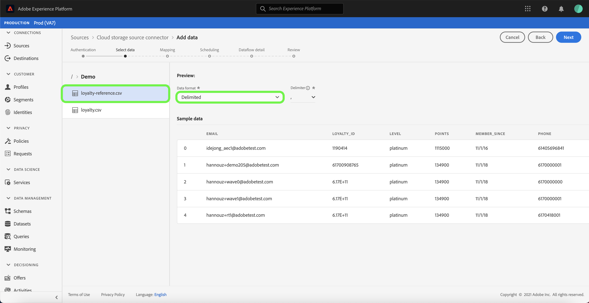

# 在UI中為雲儲存批處理連接配置資料流

資料流是從源中檢索資料並將資料帶入[!DNL Platform]資料集的計畫任務。 本教學課程提供使用雲端儲存帳戶設定新資料流的步驟。

## 快速入門

本教學課程需要對Adobe Experience Platform的下列部分有正確的理解：

* [[!DNL Experience Data Model (XDM)] 系統](../../../../../xdm/home.md):組織客戶體驗資 [!DNL Experience Platform] 料的標準化架構。
   * [架構構成基礎](../../../../../xdm/schema/composition.md):瞭解XDM架構的基本建置區塊，包括架構組合的主要原則和最佳實務。
   * [架構編輯器教程](../../../../../xdm/tutorials/create-schema-ui.md):瞭解如何使用架構編輯器UI建立自訂架構。
* [[!DNL Real-time Customer Profile]](../../../../../profile/home.md):根據來自多個來源的匯整資料，提供統一、即時的消費者個人檔案。

此外，本教學課程要求您擁有已建立的雲端儲存空間帳戶。 有關在UI中建立不同雲端儲存空間帳戶的教學課程清單，請參閱[來源連接器概述](../../../../home.md)。

### 支援的檔案格式

[!DNL Experience Platform] 支援從外部儲存中提取的以下檔案格式：

* 分隔字元分隔值(DSV):任何單字元值都可用作DSV格式資料檔案的分隔符。
* [!DNL JavaScript Object Notation] (JSON):JSON格式的資料檔案必須符合XDM規範。
* [!DNL Apache Parquet]:拼花格式的資料檔案必須與XDM相容。

## 選擇資料

在建立雲端儲存帳戶後，會出現「選取資料&#x200B;]**」步驟，提供介面供您探索雲端儲存檔案階層。**[!UICONTROL 

* 介面的左半部分是目錄瀏覽器，顯示伺服器的檔案和目錄。
* 介面的右半部分可讓您從相容檔案中預覽最多100列資料。

選擇列出的資料夾可讓您將資料夾層次結構遍歷到更深的資料夾中。 選擇相容檔案或資料夾後，將出現&#x200B;**[!UICONTROL 選擇資料格式]**&#x200B;下拉式清單，您可以在其中選擇在預覽窗口中顯示資料的格式。

為要收錄的檔案選擇適當的資料格式，並在數秒內讓預覽視窗填入。

在擷取分隔字元檔案時，您可以設定自訂分隔字元。 選擇&#x200B;**[!UICONTROL 分隔字元]**&#x200B;選項，然後從下拉式選單中選取分隔字元。 功能表顯示最常用於分隔字元的選項，包括逗號(`,`)、標籤(`\t`)和垂直號(`|`)。 或者，您也可以選擇&#x200B;**[!UICONTROL Custom]**，然後在彈出式輸入列中輸入您選擇的自訂分隔字元。

在選擇資料格式並設定分隔符後，選擇&#x200B;**[!UICONTROL Next]**。

### 收錄Parce或JSON檔案

雲端儲存空間帳戶也支援JSON和Parce檔案。 拼花檔案必須與XDM相容，而JSON檔案則不需要與XDM相容。 若要擷取JSON或Parce檔案，請從目錄瀏覽器中選取適當的檔案格式，並從正確的介面套用相容的資料格式。

如果資料格式為JSON，則會顯示預覽，顯示檔案中資料的相關資訊。 在預覽畫面上，您可以使用&#x200B;**[!UICONTROL XDM相容]**&#x200B;下拉式清單來選取JSON是否符合XDM。

選擇&#x200B;**[!UICONTROL Next]**&#x200B;繼續。

>[!IMPORTANT]
>
>與分隔字元和JSON檔案類型不同，Parce格式化的檔案無法預覽。

## 將資料欄位對應至XDM架構

出現&#x200B;**[!UICONTROL 映射]**&#x200B;步驟，提供互動式介面將源資料映射到[!DNL Platform]資料集。 以Parce格式化的來源檔案必須符合XDM規範，而不需要手動設定對應，而CSV檔案則要求您明確設定對應，但可讓您選擇要對應的來源資料欄位。 JSON檔案（如果標示為XDM問題）不需要手動設定。 但是，如果它未標籤為XDM相容，則需要顯式配置映射。

選擇要接收傳入資料的資料集。 您可以使用現有資料集或建立新資料集。

**使用現有資料集**

若要將資料內嵌至現有資料集，請選取&#x200B;**[!UICONTROL Existing dataset]**，然後選取資料集圖示。

出現&#x200B;**[!UICONTROL 選擇dataset]**&#x200B;對話框。 尋找您要使用的資料集，選取它，然後按一下&#x200B;**[!UICONTROL 繼續]**。

**使用新資料集**

若要將資料內嵌至新資料集，請選取&#x200B;**[!UICONTROL 新資料集]**，並在提供的欄位中輸入資料集的名稱和說明。 要添加方案，可以在&#x200B;**[!UICONTROL 選擇方案]**&#x200B;對話框中輸入現有方案名稱。 或者，您可以選擇&#x200B;**[!UICONTROL 方案高級搜索]**&#x200B;以搜索適當的方案。

在此步驟中，您可以啟用[!DNL Real-time Customer Profile]的資料集，並建立實體屬性和行為的整體檢視。 所有啟用資料集的資料將包含在[!DNL Profile]中，並在保存資料流時應用更改。

切換&#x200B;**[!UICONTROL Profile dataset]**&#x200B;按鈕，以啟用[!DNL Profile]的目標資料集。

將顯示&#x200B;**[!UICONTROL 選擇方案]**&#x200B;對話框。 選擇要應用於新資料集的模式，然後選擇&#x200B;**[!UICONTROL Done]**。

您可以根據需要選擇直接映射欄位，或使用映射器函式轉換源資料以導出計算值或計算值。 有關資料映射和映射器功能的詳細資訊，請參閱有關將CSV資料映射到XDM模式欄位](../../../../../ingestion/tutorials/map-a-csv-file.md)的教程。[

對於JSON檔案，除了直接將欄位對應至其他欄位外，您還可將物件直接對應至其他物件和陣列至其他陣列。您也可以使用雲端儲存來源連接器，預覽並對應JSON檔案中的陣列等複雜資料類型。

請注意，您無法對應不同的類型。 例如，您無法將物件對應至陣列，或欄位對應至物件。

>[!TIP]
>
>[!DNL Platform] 根據您選取的目標架構或資料集，為自動映射欄位提供智慧建議。您可以手動調整對應規則，以符合您的使用案例。

選擇&#x200B;**[!UICONTROL 預覽資料]**，以查看從所選資料集中最多100列樣本資料的映射結果。

在預覽期間，身分欄會優先化為第一個欄位，因為這是驗證映射結果時所需的關鍵資訊。

映射源資料後，選擇&#x200B;**[!UICONTROL Close]**。

## 排程擷取執行

此時將顯示&#x200B;**[!UICONTROL 計畫]**&#x200B;步驟，允許您配置提取計畫以使用配置的映射自動提取選定的源資料。 下表概述了用於計畫的不同可配置欄位：

| 欄位 | 說明 |
| --- | --- |
| 頻率 | 可選頻率包括`Once`、`Minute`、`Hour`、`Day`和`Week`。 |
| 間隔 | 一個整數，用於設定所選頻率的間隔。 |
| 開始時間 | UTC時間戳記，指示何時設定進行第一次擷取。 |
| 回填 | 一個布爾值，可決定最初收錄的資料。 如果&#x200B;**[!UICONTROL 回填]**&#x200B;已啟用，則指定路徑中的所有當前檔案將在第一次計畫提取期間被提取。 如果&#x200B;**[!UICONTROL 回填]**&#x200B;已停用，則只會收錄在第一次擷取執行和開始時間之間載入的檔案。 在開始時間之前載入的檔案將不會被收錄。 |

資料流設計為在計畫基礎上自動收錄資料。 從選取擷取頻率開始。 接著，設定間隔，以指定兩個流程執行之間的期間。 間隔的值應為非零整數，且應設定為大於或等於15。

若要設定擷取的開始時間，請調整顯示在開始時間方塊中的日期和時間。 或者，您也可以選取日曆圖示來編輯開始時間值。 開始時間必須大於或等於UTC中的當前時間。

為調度提供值並選擇&#x200B;**[!UICONTROL Next]**。

### 設定一次性提取資料流

要設定一次性攝取，請選擇頻率下拉箭頭並選擇&#x200B;**[!UICONTROL 一次]**。 只要開始時間未來，您就可以繼續編輯資料流集以進行一次頻率接收。 一旦開始時間過去，就無法再編輯一次頻率值。 **[!UICONTROL 在設]** 置一次性 **** 提取資料流時，不會顯示Interval和Backfill。

>[!IMPORTANT]
>
>強烈建議在使用[FTP連接器](../../../../connectors/cloud-storage/ftp.md)時，安排資料流進行一次性提取。

在為調度提供適當值後，選擇&#x200B;**[!UICONTROL Next]**。

## 提供資料流詳細資訊

將顯示&#x200B;**[!UICONTROL 資料流詳細資訊]**&#x200B;步驟，允許您命名新資料流並提供有關新資料流的簡要說明。

在此過程中，您還可以啟用&#x200B;**[!UICONTROL 部分攝取]**&#x200B;和&#x200B;**[!UICONTROL 錯誤診斷]**。 啟用&#x200B;**[!UICONTROL 部分擷取]**&#x200B;可讓您擷取包含錯誤的資料，最多可以設定特定臨界值。 啟用&#x200B;**[!UICONTROL 錯誤診斷]**&#x200B;將提供有關單獨批處理的任何不正確資料的詳細資訊。 如需詳細資訊，請參閱[部分批次擷取概觀](../../../../../ingestion/batch-ingestion/partial.md)。

為資料流提供值並選擇&#x200B;**[!UICONTROL Next]**。

## 查看資料流

將顯示&#x200B;**[!UICONTROL 查看]**&#x200B;步驟，允許您在建立新資料流之前對其進行查看。 詳細資訊會分組在下列類別中：

* **[!UICONTROL 連接]**:顯示源檔案的類型、所選源檔案的相關路徑，以及該源檔案中的列數。
* **[!UICONTROL 指派資料集與地圖欄位]**:顯示源資料被吸收到的資料集，包括資料集所附的模式。
* **[!UICONTROL 排程]**:顯示接收調度的活動期間、頻率和間隔。

複查資料流後，按一下&#x200B;**[!UICONTROL 完成]**&#x200B;並允許建立資料流一段時間。

## 監控資料流

建立資料流後，您可以監視通過其獲取的資料，以查看有關提取率、成功和錯誤的資訊。 有關如何監視資料流的詳細資訊，請參見UI](../../monitor.md)中有關[監視帳戶和資料流的教程。

## 刪除資料流

您可以使用&#x200B;**[!UICONTROL Dataflows]**&#x200B;工作區中的&#x200B;**[!UICONTROL Delete]**&#x200B;函式刪除不再需要或建立錯誤的資料流。 有關如何刪除資料流的詳細資訊，請參見UI](../../delete.md)中有關[刪除資料流的教程。

## 後續步驟

在本教程中，您成功建立了一個資料流，以便從外部雲儲存中導入資料，並獲得了對監控資料集的深入瞭解。 若要進一步瞭解建立資料流，您可以觀賞以下視訊來補充學習內容。 此外，下游[!DNL Platform]服務（例如[!DNL Real-time Customer Profile]和[!DNL Data Science Workspace]）現在可以使用傳入的資料。 如需詳細資訊，請參閱下列檔案：

* [[!DNL Real-time Customer Profile] 概述](../../../../../profile/home.md)
* [[!DNL Data Science Workspace] 概述](../../../../../data-science-workspace/home.md)

>[!WARNING]
>
> 下列視訊中顯示的[!DNL Platform] UI已過期。 請參閱上述檔案以取得最新的UI螢幕擷取和功能。

>[!VIDEO](https://video.tv.adobe.com/v/29695?quality=12&learn=on)

## 附錄

以下各節提供了使用源連接器的附加資訊。

### 禁用資料流

建立資料流時，它會立即變為活動狀態，並根據給定的時間表收集資料。 您可以隨時按照以下說明禁用活動資料流。

在&#x200B;**[!UICONTROL Sources]**&#x200B;工作區中，按一下&#x200B;**[!UICONTROL Browse]**&#x200B;標籤。 接著，按一下與要禁用的活動資料流關聯的帳戶的名稱。

此時將顯示&#x200B;**[!UICONTROL 源活動]**&#x200B;頁。 從清單中選擇活動資料流，以開啟螢幕右側的&#x200B;**[!UICONTROL 屬性]**&#x200B;列，該列包含&#x200B;**[!UICONTROL 啟用]**&#x200B;切換按鈕。 按一下切換以禁用資料流。 在禁用資料流後，可以使用相同的切換來重新啟用資料流。

### 啟用[!DNL Profile]人口的傳入資料

來自源連接器的入站資料可用於豐富和填充[!DNL Real-time Customer Profile]資料。 如需填入[!DNL Real-time Customer Profile]資料的詳細資訊，請參閱[描述檔填入](../../profile.md)的教學課程。
