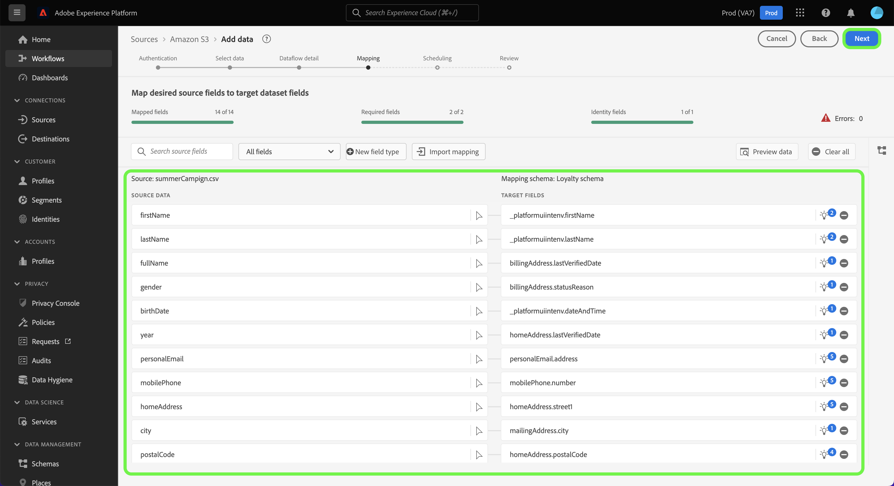

# 在UI中配置資料流以從雲儲存源內嵌批資料

本教學課程提供如何設定資料流，以將雲端儲存來源的批次資料帶入Adobe Experience Platform的步驟。

## 快速入門

>[!NOTE]
>
>為了建立資料流以從雲儲存中帶來批資料，您必須已經擁有已驗證的雲儲存源的訪問權限。 如果您沒有存取權，請前往 [來源概觀](../../../../home.md#cloud-storage) 以取得您可以建立帳戶的雲端儲存空間來源清單。

本教學課程需要妥善了解下列Experience Platform元件：

* [[!DNL Experience Data Model (XDM)] 系統](../../../../../xdm/home.md):Experience Platform組織客戶體驗資料的標準化架構。
   * [結構構成基本概念](../../../../../xdm/schema/composition.md):了解XDM結構描述的基本建置組塊，包括結構描述的主要原則和最佳實務。
   * [結構編輯器教學課程](../../../../../xdm/tutorials/create-schema-ui.md):了解如何使用結構編輯器UI建立自訂結構。
* [[!DNL Real-Time Customer Profile]](../../../../../profile/home.md):根據來自多個來源的匯總資料，提供統一的即時消費者設定檔。

### 支援的檔案格式

批次資料的雲端儲存來源支援下列檔案格式以供擷取：

* 分隔字元分隔值(DSV):任何單字元值都可用作DSV格式化資料檔案的分隔符。
* [!DNL JavaScript Object Notation] (JSON):JSON格式的資料檔案必須符合XDM。
* [!DNL Apache Parquet]:鑲木格式的資料檔案必須符合XDM。
* 壓縮檔案：JSON和分隔檔案可壓縮為： `bzip2`, `gzip`, `deflate`, `zipDeflate`, `tarGzip`，和 `tar`.

## 新增資料

建立雲端儲存空間帳戶後， **[!UICONTROL 新增資料]** 此時會顯示步驟，提供介面供您探索雲端儲存檔案階層，並選取您要帶入Platform的資料夾或特定檔案。

* 介面的左側是目錄瀏覽器，顯示您的雲端儲存檔案階層。
* 介面的右側可讓您從相容的資料夾或檔案中預覽最多100列資料。

選取根資料夾以存取資料夾階層。 在此，您可以選取單一資料夾，以遞回內嵌資料夾中的所有檔案。 擷取整個資料夾時，您必須確保該資料夾中的所有檔案都共用相同的資料格式和結構。

選取資料夾後，右介面會更新為所選資料夾中第一個檔案的內容和結構的預覽。

在此步驟中，您可以先對資料進行數個設定，然後再繼續。 首先，選取 **[!UICONTROL 資料格式]** 然後，在顯示的下拉式面板中，為您的檔案選取適當的資料格式。

下表顯示支援的檔案類型的適當資料格式：

| 檔案類型 | 資料格式 |
| --- | --- |
| CSV | [!UICONTROL 分隔] |
| JSON | [!UICONTROL JSON] |
| 鑲木 | [!UICONTROL XDM Parquet] |

### 選擇列分隔符

設定資料格式後，您可以在擷取分隔檔案時設定欄分隔字元。 選取 **[!UICONTROL 分隔字元]** 選項，然後從下拉式功能表中選取分隔字元。 功能表會顯示分隔字元最常使用的選項，包括逗號(`,`)、標籤(`\t`)和垂直號(`|`)。

如果您偏好使用自訂分隔字元，請選取 **[!UICONTROL 自訂]** 並在彈出式輸入列中輸入您所選擇的單字元分隔字元。

### 內嵌壓縮檔案

您也可以指定壓縮類型，以內嵌壓縮的JSON或分隔檔案。

在 [!UICONTROL 選擇資料] 步驟，選取要擷取的壓縮檔案，然後選取其適當的檔案類型，以及是否符合XDM。 下一步，選擇 **[!UICONTROL 壓縮類型]** 然後為源資料選擇適當的壓縮檔案類型。

若要將特定檔案帶入Platform，請選取資料夾，然後選取您要擷取的檔案。 在此步驟中，您還可以使用檔案名旁的預覽表徵圖預覽給定資料夾中其他檔案的檔案內容。

完成後，請選取 **[!UICONTROL 下一個]**.

## 提供資料流詳細資訊

此 [!UICONTROL 資料流詳細資訊] 頁面可讓您選取要使用現有資料集或新資料集。 在此程式中，您也可以設定要擷取至設定檔的資料，並啟用下列設定： [!UICONTROL 錯誤診斷], [!UICONTROL 部分擷取]，和 [!UICONTROL 警報].

### 使用現有資料集

若要將資料內嵌至現有資料集，請選取 **[!UICONTROL 現有資料集]**. 您可以使用 [!UICONTROL 進階搜尋] 選項，或透過捲動下拉式選單中的現有資料集清單來執行。 選取資料集後，請提供資料流的名稱和說明。

### 使用新資料集

若要內嵌至新資料集，請選取 **[!UICONTROL 新資料集]** 然後提供輸出資料集名稱和選用說明。 接下來，使用 [!UICONTROL 進階搜尋] 選項，或透過捲動下拉式選單中的現有結構清單來執行。 選擇架構後，請為資料流提供名稱和說明。

### 啟用配置檔案和錯誤診斷

下一步，選取 **[!UICONTROL 設定檔資料集]** 切換為啟用「設定檔」的資料集。 這可讓您建立實體屬性和行為的整體檢視。 所有啟用配置檔案的資料集的資料將包含在配置檔案中，並且在保存資料流時將應用更改。

[!UICONTROL 錯誤診斷] 為資料流中發生的任何錯誤記錄啟用詳細的錯誤消息生成，同時 [!UICONTROL 部分擷取] 可讓您內嵌包含錯誤的資料，最高可以是您手動定義的特定臨界值。 請參閱 [部分批次內嵌概觀](../../../../../ingestion/batch-ingestion/partial.md) 以取得更多資訊。

### 啟用警報

您可以啟用警報，以接收有關資料流狀態的通知。 從清單中選擇要訂閱的警報，以接收有關資料流狀態的通知。 如需警報的詳細資訊，請參閱 [使用UI訂閱來源警報](../../alerts.md).

完成向資料流提供詳細資訊後，請選擇 **[!UICONTROL 下一個]**.

## 將資料欄位對應至XDM結構

此 [!UICONTROL 對應] 步驟，提供您一個介面，將來源架構的來源欄位對應至目標架構中適當的目標XDM欄位。

Platform會根據您選取的目標結構或資料集，為自動對應欄位提供智慧型建議。 您可以手動調整對應規則以符合您的使用案例。 您可以視需要選擇直接映射欄位，或使用資料準備函式來轉換源資料，以導出計算值或計算值。 有關使用映射器介面和計算欄位的完整步驟，請參閱 [資料準備UI指南](../../../../../data-prep/ui/mapping.md).

成功映射源資料後，請選擇 **[!UICONTROL 下一個]**.

## 排程擷取執行

>[!IMPORTANT]
>
>強烈建議在使用 [FTP來源](../../../../connectors/cloud-storage/ftp.md).

此 [!UICONTROL 排程] 步驟，可讓您設定擷取排程，以使用已設定的對應自動擷取選取的來源資料。 預設情況下，排程設為 `Once`. 若要調整擷取頻率，請選取 **[!UICONTROL 頻率]** ，然後從下拉式功能表中選取選項。

>[!TIP]
>
>一次性擷取期間不會顯示間隔和回填。

如果您將擷取頻率設為 `Minute`, `Hour`, `Day`，或 `Week`，則您必須設定間隔，以在每次擷取之間建立設定的時間範圍。 例如，擷取頻率設為 `Day` 和間隔設定為 `15` 表示資料流計畫每15天內嵌一次資料。

在此步驟中，您也可以啟用 **回填** 並定義資料增量擷取的欄。 回填可用來內嵌歷史資料，而您為增量內嵌定義的欄則可讓新資料與現有資料有所區別。

如需排程設定的詳細資訊，請參閱下表。

| 欄位 | 說明 |
| --- | --- |
| 頻率 | 擷取發生的頻率。 可選頻率包括 `Once`, `Minute`, `Hour`, `Day`，和 `Week`. |
| 間隔 | 設定所選頻率間隔的整數。 間隔的值應為非零整數，應設為大於或等於15。 |
| 開始時間 | UTC時間戳記，指出第一次擷取的設定何時發生。 開始時間必須大於或等於當前UTC時間。 |
| 回填 | 一個布林值，可決定最初擷取的資料。 如果啟用回填，則在首次排程擷取期間，會擷取指定路徑中所有目前的檔案。 如果停用回填，則只會擷取在首次擷取執行與開始時間之間載入的檔案。 在開始時間之前載入的檔案將不會被擷取。 |

>[!NOTE]
>
>對於批次內嵌，每個隨後的資料流都會根據檔案的來源選擇要內嵌的檔案 **上次修改** 時間戳記。 這意味著批處理資料流從源中選擇新檔案或自上次流運行以來已修改的檔案。 此外，您必須確保檔案上傳與排程流程執行之間有足夠的時間跨度，因為在排程流程執行時間之前，未完全上傳至雲端儲存帳戶的檔案可能無法擷取以進行擷取。

完成擷取排程的設定後，請選取 **[!UICONTROL 下一個]**.

## 查看資料流

此 **[!UICONTROL 檢閱]** 步驟顯示，允許您在建立新資料流之前對其進行查看。 詳細資料會分組為下列類別：

* **[!UICONTROL 連線]**:顯示源類型、所選源檔案的相關路徑以及該源檔案中的列數。
* **[!UICONTROL 指派資料集和對應欄位]**:顯示要擷取來源資料的資料集，包括資料集所遵守的結構。
* **[!UICONTROL 排程]**:顯示擷取排程的作用中期間、頻率和間隔。

審核資料流後，按一下 **[!UICONTROL 完成]** 並允許建立資料流的時間。

## 後續步驟

依照本教學課程，您已成功建立資料流以從外部雲端儲存空間傳入資料，並深入了解監控資料集。 要了解有關建立資料流的詳細資訊，您可以觀看下面的視頻來補充學習內容。 此外，下游現在可以使用傳入的資料 [!DNL Platform] 服務，例如 [!DNL Real-Time Customer Profile] 和 [!DNL Data Science Workspace]. 如需詳細資訊，請參閱下列檔案：

* [[!DNL Real-Time Customer Profile] 概覽](../../../../../profile/home.md)
* [[!DNL Data Science Workspace] 概覽](../../../../../data-science-workspace/home.md)

>[!WARNING]
>
> 此 [!DNL Platform] 下列影片中顯示的UI已過期。 請參閱上述檔案，了解最新的UI螢幕擷取畫面和功能。

>[!VIDEO](https://video.tv.adobe.com/v/29695?quality=12&learn=on)

## 附錄

以下各節提供使用源連接器的其他資訊。

## 監視資料流

建立資料流後，您可以監視正在通過資料流進行內嵌的資料，以查看有關內嵌率、成功和錯誤的資訊。 有關如何監視資料流的詳細資訊，請訪問 [監視UI中的帳戶和資料流](../../monitor.md).

## 更新資料流

要更新資料流調度、映射和一般資訊的配置，請訪問以下的教程： [更新UI中的源資料流](../../update-dataflows.md)

## 刪除資料流

您可以刪除不再需要的資料流，或使用 **[!UICONTROL 刪除]** 函式 **[!UICONTROL 資料流]** 工作區。 有關如何刪除資料流的詳細資訊，請訪問 [刪除UI中的資料流](../../delete.md).