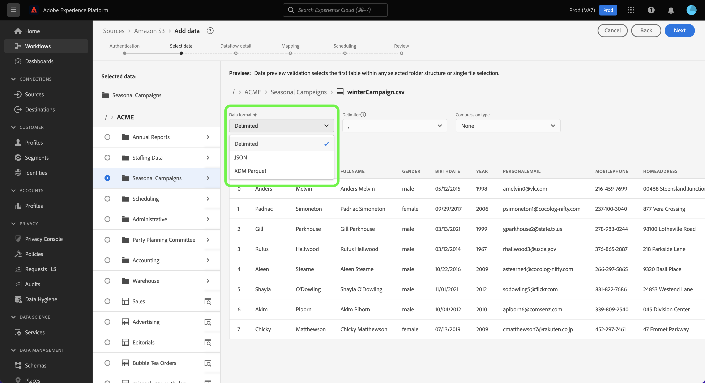
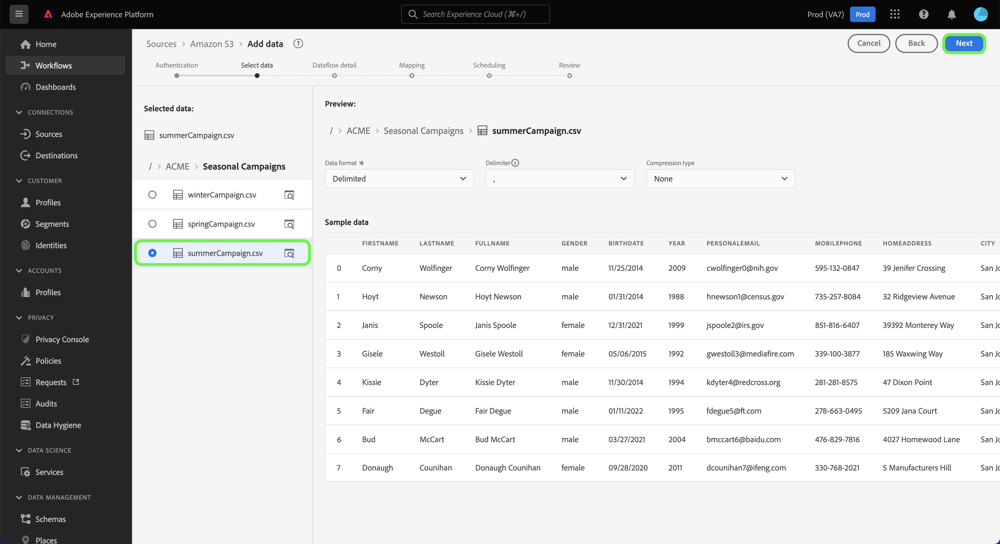

# 設定資料流以從UI中的雲端儲存空間來源擷取批次資料

本教學課程提供如何設定資料流的步驟，以將雲端儲存空間來源的批次資料引進Adobe Experience Platform。

## 快速入門

>[!NOTE]
>
>為了建立資料流以從雲端儲存空間引入批次資料，您必須已擁有已驗證的雲端儲存空間來源的存取權。 如果您沒有存取權，請移至[來源概觀](../../../../home.md#cloud-storage)，以取得您可以用來建立帳戶的雲端儲存空間來源清單。

本教學課程需要您實際瞭解下列Experience Platform元件：

* [[!DNL Experience Data Model (XDM)] 系統](../../../../../xdm/home.md)： Experience Platform用來組織客戶體驗資料的標準化架構。
   * [結構描述組合的基本概念](../../../../../xdm/schema/composition.md)：瞭解XDM結構描述的基本建置區塊，包括結構描述組合中的關鍵原則和最佳實務。
   * [結構描述編輯器教學課程](../../../../../xdm/tutorials/create-schema-ui.md)：瞭解如何使用結構描述編輯器使用者介面建立自訂結構描述。
* [[!DNL Real-Time Customer Profile]](../../../../../profile/home.md)：根據來自多個來源的彙總資料，提供統一的即時消費者設定檔。

### 支援的檔案格式

批次資料的雲端儲存空間來源支援下列檔案格式以供擷取：

* 分隔符號分隔值(DSV)：任何單一字元值都可以當作DSV格式資料檔案的分隔符號。
* [!DNL JavaScript Object Notation] (JSON)： JSON格式的資料檔案必須符合XDM。
* [!DNL Apache Parquet]： Parquet格式的資料檔案必須符合XDM標準。
* 壓縮檔： JSON和分隔檔可以壓縮為： `bzip2`、`gzip`、`deflate`、`zipDeflate`、`tarGzip`和`tar`。

## 新增資料

建立雲端儲存空間帳戶後，**[!UICONTROL 新增資料]**&#x200B;步驟隨即顯示，提供介面讓您探索雲端儲存空間檔案階層，並選取您要帶入Experience Platform的資料夾或特定檔案。

* 介面的左側是目錄瀏覽器，顯示您的雲端儲存空間檔案階層。
* 介面的右側部分可讓您預覽相容資料夾或檔案中最多100列的資料。

選取根資料夾以存取資料夾階層。 從這裡，您可以選取單一資料夾，以遞回方式擷取資料夾中的所有檔案。 擷取整個資料夾時，您必須確保該資料夾中的所有檔案都共用相同的資料格式和結構描述。

選取資料夾後，正確的介面會更新為所選資料夾中第一個檔案的內容和結構預覽。

在此步驟中，您可以在繼續之前對資料進行數個設定。 首先，選取&#x200B;**[!UICONTROL 資料格式]**，然後在出現的下拉式面板中為您的檔案選取適當的資料格式。

下表顯示支援的檔案型別適用的資料格式：

| 檔案類型 | 資料格式 |
| --- | --- |
| CSV | [!UICONTROL 已分隔] |
| JSON | [!UICONTROL JSON] |
| Parquet | [!UICONTROL XDM Parquet] |

### 選取欄分隔符號

設定資料格式後，您可以在擷取分隔檔案時設定欄分隔符號。 選取&#x200B;**[!UICONTROL 分隔符號]**&#x200B;選項，然後從下拉式功能表中選取分隔符號。 功能表會顯示分隔字元最常使用的選項，包括逗號(`,`)、索引標籤(`\t`)和垂直號(`|`)。

如果您偏好使用自訂分隔符號，請選取&#x200B;**[!UICONTROL 自訂]**，然後在快顯視窗輸入列中輸入您選擇的單一字元分隔符號。

### 擷取壓縮檔案

您也可以指定其壓縮型別，以內嵌壓縮的JSON或分隔檔案。

在[!UICONTROL 選取資料]步驟中，選取要擷取的壓縮檔案，然後選取其適當的檔案型別，以及是否符合XDM規範。 接著，選取&#x200B;**[!UICONTROL 壓縮型別]**，然後為您的來源資料選取適當的壓縮檔案型別。

若要將特定檔案帶入Experience Platform，請選取資料夾，然後選取您要擷取的檔案。 在此步驟中，您也可以使用檔案名稱旁的預覽圖示，來預覽指定資料夾中其他檔案的內容。

完成後，選取&#x200B;**[!UICONTROL 下一步]**。

## 提供資料流詳細資訊

[!UICONTROL 資料流詳細資料]頁面可讓您選取要使用現有資料集還是新資料集。 在此程式中，您也可以設定要擷取至設定檔的資料，並啟用[!UICONTROL 錯誤診斷]、[!UICONTROL 部分擷取]和[!UICONTROL 警示]等設定。

### 使用現有的資料集

若要將資料內嵌到現有的資料集中，請選取&#x200B;**[!UICONTROL 現有的資料集]**。 您可以使用[!UICONTROL 進階搜尋]選項或捲動下拉式選單中的現有資料集清單，來擷取現有資料集。 選取資料集後，請為資料流提供名稱和說明。

### 使用新資料集

若要擷取到新的資料集，請選取&#x200B;**[!UICONTROL 新的資料集]**，然後提供輸出資料集名稱和選用的說明。 接下來，使用[!UICONTROL 進階搜尋]選項，或捲動下拉式選單中的現有結構描述清單，選取要對應的結構描述。 選取結構描述後，請為資料流提供名稱和說明。

### 啟用設定檔和錯誤診斷

接著，選取&#x200B;**[!UICONTROL 設定檔資料集]**&#x200B;切換功能，以啟用設定檔的資料集。 這可讓您建立實體屬性和行為的整體檢視。 來自所有啟用設定檔的資料集的資料將會包含在設定檔中，當您儲存資料流時，將會套用變更。

[!UICONTROL 錯誤診斷]可針對資料流中發生的任何錯誤記錄產生詳細的錯誤訊息，而[!UICONTROL 部分擷取]可讓您擷取包含錯誤的資料，最多可擷取到您手動定義的特定臨界值。 如需詳細資訊，請參閱[部分批次擷取總覽](../../../../../ingestion/batch-ingestion/partial.md)。

### 啟用警示

您可以啟用警報以接收有關資料流狀態的通知。 從清單中選取警報以訂閱接收有關資料流狀態的通知。 如需警示的詳細資訊，請參閱[使用UI訂閱來源警示](../../alerts.md)的指南。

當您完成提供詳細資料給資料流時，請選取&#x200B;**[!UICONTROL 下一步]**。

## 將資料欄位對應至XDM結構描述

[!UICONTROL 對應]步驟出現，為您提供介面，用於將來源結構描述中的來源欄位對應到目標結構描述中適當的目標XDM欄位。

Experience Platform會根據您選取的目標結構或資料集，為自動對應的欄位提供智慧型建議。 您可以手動調整對應規則以符合您的使用案例。 您可以根據自己的需求，選擇直接對應欄位，或使用資料準備函式來轉換來源資料，以衍生計算或計算的值。 如需使用對應程式介面和計算欄位的完整步驟，請參閱[資料準備UI指南](../../../../../data-prep/ui/mapping.md)。

成功對應來源資料後，請選取&#x200B;**[!UICONTROL 下一步]**。

## 排程內嵌執行

>[!IMPORTANT]
>
>強烈建議在使用[FTP來源](../../../../connectors/cloud-storage/ftp.md)時，排程您的資料流以進行一次性擷取。

[!UICONTROL 排程]步驟隨即顯示，允許您設定擷取排程，以使用已設定的對應自動擷取選取的來源資料。 根據預設，排程設定為`Once`。 若要調整您的擷取頻率，請選取&#x200B;**[!UICONTROL 頻率]**，然後從下拉式選單中選取選項。

>[!TIP]
>
>在一次性內嵌期間看不到間隔和回填。

如果您將擷取頻率設為`Minute`、`Hour`、`Day`或`Week`，則必須設定間隔，以在每次擷取之間建立設定的時間範圍。 例如，擷取頻率設為`Day`，而間隔設為`15`，表示您的資料流已排程每15天擷取一次資料。

在此步驟中，您也可以啟用&#x200B;**回填**，並定義資料增量擷取的資料行。 回填是用來擷取歷史資料，而您為增量擷取定義的欄則可區分新資料與現有資料。

請參閱下表以取得排程設定的詳細資訊。

| 正在排程設定 | 說明 |
| --- | --- |
| 頻率 | 設定頻率以指出資料流執行的頻率。 您可以將頻率設為： <ul><li>**一次**：將您的頻率設定為`once`以建立一次性內嵌。 建立一次性擷取資料流時，無法使用間隔和回填的設定。 依預設，排程頻率會設定為一次。</li><li>**分鐘**：將頻率設為`minute`，排程您的資料流以每分鐘擷取資料。</li><li>**小時**：將頻率設為`hour`，排程您的資料流以每小時為基礎擷取資料。</li><li>**天**：將您的頻率設為`day`，排程您的資料流每天擷取資料。</li><li>**周**：將頻率設為`week`，排程您的資料流每週擷取資料。</li></ul> |
| 間隔 | 選取頻率後，您就可以設定間隔設定，以建立每次擷取之間的時間範圍。 例如，如果您將頻率設為「天」，並將間隔設為15，則您的資料流將每隔15天執行一次。 您不能將間隔設定為零。 每個頻率的最小接受間隔值如下：<ul><li>**一次**：不適用</li><li>**分鐘**： 15</li><li>**小時**： 1</li><li>**天**： 1</li><li>**周**： 1</li></ul> |
| 開始時間 | 預計執行的時間戳記，以UTC時區顯示。 |
| 回填 | 回填會決定最初要擷取的資料。 如果已啟用回填，則會在第一次排程擷取期間擷取指定路徑中的所有目前檔案。 如果停用回填，則只會擷取在第一次內嵌執行到開始時間之間載入的檔案。 將不會擷取在開始時間之前載入的檔案。 |

>[!NOTE]
>
>對於批次擷取，每個後續資料流會根據其&#x200B;**上次修改時間**&#x200B;時間戳記，選取要從您的來源擷取的檔案。 這表示批次資料流會從來源選取新的或自上次資料流執行以來經過修改的檔案。 此外，您必須確保檔案上傳與排定的資料流執行之間有足夠的時間跨度，因為在排定的資料流執行時間之前未完全上傳到您的雲端儲存體帳戶的檔案可能無法擷取以進行內嵌。

完成擷取排程的設定後，請選取&#x200B;**[!UICONTROL 下一步]**。

## 檢閱您的資料流

**[!UICONTROL 檢閱]**&#x200B;步驟隨即顯示，可讓您在建立新資料流之前先檢閱該資料流。 詳細資料會分組到以下類別中：

* **[!UICONTROL 連線]**：顯示來源型別、所選來源檔案的相關路徑，以及該來源檔案中的欄數。
* **[!UICONTROL 指派資料集與對應欄位]**：顯示要將來源資料擷取到哪個資料集，包括資料集所堅持的結構描述。
* **[!UICONTROL 排程]**：顯示內嵌排程的有效期間、頻率和間隔。

檢閱您的資料流後，請按一下[完成] **&#x200B;**，並等待一些時間來建立資料流。

## 後續步驟

依照本教學課程中的指示，您已成功建立資料流以從外部雲端儲存空間匯入資料，並取得監控資料集的insight。 若要進一步瞭解如何建立資料流，您可以觀看下方的影片以補充您的學習。 此外，下游[!DNL Experience Platform]服務（例如[!DNL Real-Time Customer Profile]和[!DNL Data Science Workspace]）現在可以使用傳入的資料。 如需更多詳細資訊，請參閱下列檔案：

* [[!DNL Real-Time Customer Profile] 概觀](../../../../../profile/home.md)
* [[!DNL Data Science Workspace] 概觀](../../../../../data-science-workspace/home.md)

>[!WARNING]
>
> 下列影片中顯示的[!DNL Experience Platform] UI已過期。 請參閱上述檔案，瞭解最新的UI熒幕擷取畫面及功能。

>[!VIDEO](https://video.tv.adobe.com/v/29695?quality=12&learn=on)

## 附錄

以下各節提供使用來源聯結器的其他資訊。

## 監視資料流

建立資料流後，您可以監視透過它擷取的資料，以檢視擷取率、成功和錯誤的資訊。 如需如何監視資料流的詳細資訊，請造訪有關UI[&#128279;](../../monitor.md)中監視帳戶和資料流的教學課程。

## 更新您的資料流

若要更新資料流排程、對應和一般資訊的設定，請瀏覽有關[在UI中更新來源資料流的教學課程](../../update-dataflows.md)

## 刪除您的資料流

您可以刪除不再需要的資料流，或使用&#x200B;**[!UICONTROL 資料流]**&#x200B;工作區中可用的&#x200B;**[!UICONTROL 刪除]**&#x200B;功能建立錯誤的資料流。 如需有關如何刪除資料流的詳細資訊，請瀏覽教學課程，瞭解如何在UI[&#128279;](../../delete.md)中刪除資料流。