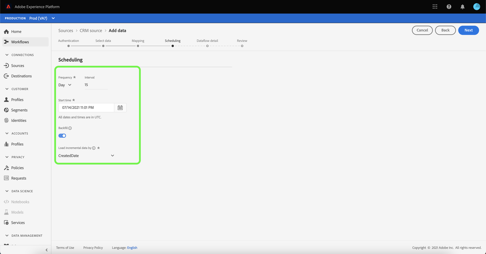

# 在UI中為CRM連接配置資料流

資料流是從源資料集中檢索資料並將資料接收到平台資料集的計畫任務。 本教程提供了使用CRM帳戶配置新資料流的步驟。

## 快速入門

本教程需要對Adobe Experience Platform的以下部分進行有效的理解：

* [[!DNL Experience Data Model (XDM)] 系統](../../../../xdm/home.md):標準化框架 [!DNL Experience Platform] 組織客戶體驗資料。
   * [架構組合的基礎](../../../../xdm/schema/composition.md):瞭解XDM架構的基本構建基塊，包括架構組成中的關鍵原則和最佳做法。
   * [架構編輯器教程](../../../../xdm/tutorials/create-schema-ui.md):瞭解如何使用架構編輯器UI建立自定義架構。
* [[!DNL Real-time Customer Profile]](../../../../profile/home.md):基於來自多個源的聚合資料提供統一、即時的用戶配置檔案。

此外，本教程要求您已建立CRM帳戶。 有關在UI中建立不同CRM連接器的教程清單，請參見 [源連接器概述](../../../home.md)。

## 選擇資料

建立CRM帳戶後， [!UICONTROL 選擇資料] 步驟，為您提供一個介面以瀏覽檔案層次結構。

* 介面的左半部分是目錄瀏覽器，顯示CRM的檔案和目錄。
* 該介面的右半部分允許您從相容檔案中預覽多達100行資料。

您可以使用 **[!UICONTROL 搜索]** 選項，以快速確定要使用的源資料。

>[!NOTE]
>
>搜索源資料選項可用於除分析、分類、事件集線器和Kinesis連接器之外的所有基於表格的源連接器。

找到源資料後，選擇目錄，然後選擇 **[!UICONTROL 下一個]**。

## 將資料欄位映射到XDM架構

的 **[!UICONTROL 映射]** 步驟，提供將源資料映射到平台資料集的介面。

為要接收到的入站資料選擇資料集。 可以使用現有資料集或建立新資料集。

### 使用現有資料集

要將資料插入現有資料集，請選擇 **[!UICONTROL 現有資料集]**，然後選擇資料表徵圖  的子菜單。

的 **[!UICONTROL 選擇資料集]** 對話框。 查找要使用的資料集，選擇它，然後按一下 **[!UICONTROL 繼續]**。

### 使用新資料集

要將資料插入新資料集，請選擇 **[!UICONTROL 新資料集]** 並在提供的欄位中輸入資料集的名稱和說明。

通過在 **[!UICONTROL 選擇架構]** 的子菜單。 您也可以選擇下拉表徵圖，查看現有方案的清單。 或者，可以選擇 **[!UICONTROL 高級搜索]** 訪問現有架構的螢幕，包括其各自的詳細資訊。

在此步驟中，您可以為 [!DNL Real-time Customer Profile] 並建立實體屬性和行為的整體視圖。 來自所有已啟用的資料集的資料將包含在 [!DNL Profile] 並在保存資料流時應用更改。

切換 **[!UICONTROL 配置檔案資料集]** 按鈕啟用目標資料集 [!DNL Profile]。

的 **[!UICONTROL 選擇架構]** 對話框。 選擇要應用到新資料集的架構，然後按一下 **[!UICONTROL 完成]**。

根據您的需要，您可以選擇直接映射欄位，或使用資料準備函式轉換源資料以導出計算值或計算值。 有關使用映射器介面和計算欄位的全面步驟，請參見 [資料準備UI指南](../../../../data-prep/ui/mapping.md)

>[!TIP]
>
>如果使用 [!DNL Salesforce] 源作為B2B CDP的一部分，請參閱 [[!DNL Salesforce] 欄位映射表](../../../connectors/adobe-applications/mapping/salesforce.md) 指南 [!DNL Salesforce] 源欄位和XDM目標欄位。

平台根據您選擇的目標架構或資料集為自動映射欄位提供智慧建議。 您可以手動調整映射規則以適合您的使用情形。

選擇 **[!UICONTROL 預覽資料]** 查看所選資料集中最多100行示例資料的映射結果。

在預覽期間，標識列作為第一個欄位按優先順序排列，因為它是驗證映射結果時所必需的關鍵資訊。

映射源資料後，選擇 **[!UICONTROL 關閉]**。

下一個，從 [!UICONTROL 映射] 螢幕，選擇 **[!UICONTROL 下一個]** 繼續。

## 計畫攝取運行

的 **[!UICONTROL 計畫]** 步驟，允許您配置接收計畫以使用配置的映射自動接收選定的源資料。 下表概述了計畫的不同可配置欄位：

| 欄位 | 說明 |
| --- | --- |
| 頻率 | 可選頻率包括 `Once`。 `Minute`。 `Hour`。 `Day`, `Week`。 |
| 間隔 | 設定所選頻率的間隔的整數。 |
| 開始時間 | UTC時間戳，指示第一次攝取的時間設定為何時發生。 |
| 回填 | 一個布爾值，它確定最初接收的資料。 如果 **[!UICONTROL 回填]** 啟用後，指定路徑中的所有當前檔案將在首次計畫接收期間被接收。 如果 **[!UICONTROL 回填]** 禁用，僅載入到第一次接收和 **[!UICONTROL 開始時間]** 會被攝食。 檔案載入時間早於 **[!UICONTROL 開始時間]** 不會被攝食。 |
| 增量列 | 具有類型、日期或時間的一組篩選源架構欄位的選項。 此欄位用於區分新資料和現有資料。 增量資料將根據選定列的時間戳進行接收。 |

資料流設計為按計畫自動接收資料。 從選擇攝取頻率開始。 接下來，設定間隔以指定兩個流運行之間的時段。 間隔的值應為非零整數，並應設定為大於或等於15。

要設定攝取的開始時間，請調整在開始時間框中顯示的日期和時間。 或者，可以選擇日曆表徵圖以編輯開始時間值。 開始時間必須大於或等於當前UTC時間。

選擇 **[!UICONTROL 載入增量資料的方式]** 指定增量列。 此欄位區分新資料和現有資料。

### 設定一次性接收資料流

要設定一次性接收，請選擇頻率下拉箭頭並選擇 **[!UICONTROL 一次]**。

>[!TIP]
>
>**[!UICONTROL 間隔]** 和 **[!UICONTROL 回填]** 在一次性攝取期間不可見。

為計畫提供適當值後，選擇 **[!UICONTROL 下一個]**。

## 提供資料流詳細資訊

的 **[!UICONTROL 資料流詳細資訊]** 步驟，使您可以命名並簡要描述新資料流。

在此過程中，您還可以 **[!UICONTROL 部分攝取]** 和 **[!UICONTROL 錯誤診斷]**。 啟用 **[!UICONTROL 部分攝取]** 提供了接收包含錯誤的資料的能力，這些錯誤最高可達某個閾值。 一次 **[!UICONTROL 部分攝取]** 啟用，拖動 **[!UICONTROL 錯誤閾值%]** 撥號以調整批的錯誤閾值。 或者，可以通過選擇輸入框手動調整閾值。 有關詳細資訊，請參見 [部分批處理接收概述](../../../../ingestion/batch-ingestion/partial.md)。

為資料流提供值並選擇 **[!UICONTROL 下一個]**。

## 查看資料流

的 *審閱* 步驟，允許您在建立新資料流之前查看它。 詳細資訊按以下類別分組：

* **[!UICONTROL 連接]**:顯示源帳戶名、源平台、所選源檔案的相關路徑以及該源檔案中的列數。
* **[!UICONTROL 分配資料集和映射欄位]**:顯示源資料正被攝取到的目標資料集，包括資料集所遵循的模式。
* **[!UICONTROL 計畫]**:顯示資料流的開始時間和頻率。

查看資料流後，按一下 **[!UICONTROL 完成]** 並為建立資料流留出一些時間。

## 監視資料流

建立資料流後，您可以監視通過它攝取的資料，以查看有關攝取率、成功和錯誤的資訊。 有關如何監視資料流的詳細資訊，請參見上的教程 [監視UI中的帳戶和資料流](../monitor.md)。

## 刪除資料流

您可以刪除不再需要或使用 **[!UICONTROL 刪除]** 函式 **[!UICONTROL 資料流]** 工作區。 有關如何刪除資料流的詳細資訊，請參見上的教程 [刪除UI中的資料流](../delete.md)。

## 後續步驟

通過本教程，您已成功建立了一個資料流，以從CRM中導入資料，並深入瞭解了監視資料集。 要瞭解有關建立資料流的詳細資訊，您可以通過觀看下面的視頻來補充學習內容。 此外，下游平台服務(如 [!DNL Real-time Customer Profile] 和 [!DNL Data Science Workspace]。 有關詳細資訊，請參閱以下文檔：

* [即時客戶概要資訊概述](../../../../profile/home.md)
* [資料科學工作區概述](../../../../data-science-workspace/home.md)

>[!WARNING]
>
> 以下視頻中顯示的平台UI已過期。 有關最新的UI螢幕截圖和功能，請參閱上面的文檔。
>
>[!VIDEO](https://video.tv.adobe.com/v/29711?quality=12&learn=on)
