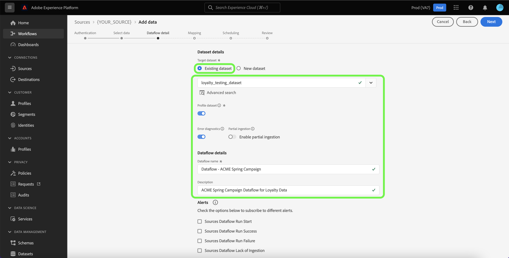

# 在UI中使用客戶成功來源建立資料流

資料流是排程的工作，可擷取來源中的資料並將資料擷取到Adobe Experience Platform中的資料集。 本教學課程提供如何使用Experience Platform UI為客戶成功來源建立資料流的步驟。

>[!NOTE]
>
>* 為了建立資料流，您必須擁有已驗證的帳戶，且帳戶具有客戶成功來源。 在UI中建立不同客戶成功來源帳戶的教學課程清單可在[來源概觀](../../../home.md#customer-success)中找到。
>* 為了讓Experience Platform擷取資料，所有表格型批次來源的時區都必須設定為UTC。

## 快速入門

本教學課程需要您實際瞭解下列Experience Platform元件：

* [來源](../../../home.md)： Experience Platform允許從各種來源擷取資料，同時讓您能夠使用[!DNL Experience Platform]服務來建構、加標籤以及增強傳入的資料。
* [[!DNL Experience Data Model (XDM)] 系統](../../../../xdm/home.md)： Experience Platform用來組織客戶體驗資料的標準化架構。
   * [結構描述組合的基本概念](../../../../xdm/schema/composition.md)：瞭解XDM結構描述的基本建置區塊，包括結構描述組合中的關鍵原則和最佳實務。
   * [結構描述編輯器教學課程](../../../../xdm/tutorials/create-schema-ui.md)：瞭解如何使用結構描述編輯器使用者介面建立自訂結構描述。
* [[!DNL Real-Time Customer Profile]](../../../../profile/home.md)：根據來自多個來源的彙總資料，提供統一的即時消費者設定檔。
* [[!DNL Data Prep]](../../../../data-prep/home.md)：允許資料工程師對應、轉換及驗證與Experience資料模型(XDM)之間的資料。

## 新增資料

建立您的客戶成功來源帳戶後，**[!UICONTROL 新增資料]**&#x200B;步驟隨即顯示，提供介面供您探索客戶成功來源帳戶的表格階層。

* 介面的左半部分是瀏覽器，顯示帳戶中包含的資料表清單。 介面也包含搜尋選項，可讓您快速識別要使用的來源資料。
* 介面的右半部分是預覽面板，可讓您預覽最多100列的資料。

>[!NOTE]
>
>搜尋來源資料選項適用於除Adobe Analytics、[!DNL Amazon Kinesis]和[!DNL Azure Event Hubs]之外的所有資料表來源。

找到來源資料後，請選取資料表，然後選取&#x200B;**[!UICONTROL 下一步]**。

## 提供資料流詳細資訊

[!UICONTROL 資料流詳細資料]頁面可讓您選取要使用現有資料集還是新資料集。 在此過程中，您也可以設定[!UICONTROL 設定檔資料集]、[!UICONTROL 錯誤診斷]、[!UICONTROL 部分擷取]和[!UICONTROL 警報]的設定。

### 使用現有的資料集

若要將資料內嵌到現有的資料集中，請選取&#x200B;**[!UICONTROL 現有的資料集]**。 您可以使用[!UICONTROL 進階搜尋]選項或捲動下拉式選單中的現有資料集清單，來擷取現有資料集。 選取資料集後，請為資料流提供名稱和說明。

### 使用新資料集

若要擷取到新的資料集，請選取&#x200B;**[!UICONTROL 新的資料集]**，然後提供輸出資料集名稱和選用的說明。 接下來，使用[!UICONTROL 進階搜尋]選項，或捲動下拉式選單中的現有結構描述清單，選取要對應的結構描述。 選取結構描述後，請為資料流提供名稱和說明。

### 啟用[!DNL Profile]和錯誤診斷

接著，選取「**[!UICONTROL 設定檔資料集]**」切換按鈕，啟用[!DNL Profile]的資料集。 這可讓您建立實體屬性和行為的整體檢視。 來自所有已啟用[!DNL Profile]的資料集的資料將包含在[!DNL Profile]中，而變更會在您儲存資料流時套用。

[!UICONTROL 錯誤診斷]可針對資料流中發生的任何錯誤記錄產生詳細的錯誤訊息，而[!UICONTROL 部分擷取]可讓您擷取包含錯誤的資料，最多可擷取到您手動定義的特定臨界值。 如需詳細資訊，請參閱[部分批次擷取總覽](../../../../ingestion/batch-ingestion/partial.md)。

### 啟用警示

您可以啟用警報以接收有關資料流狀態的通知。 從清單中選取警報以訂閱接收有關資料流狀態的通知。 如需警示的詳細資訊，請參閱[使用UI訂閱來源警示](../alerts.md)的指南。

當您完成提供詳細資料給資料流時，請選取&#x200B;**[!UICONTROL 下一步]**。

## 將資料欄位對應至XDM結構描述

[!UICONTROL 對應]步驟出現，為您提供介面，用於將來源結構描述中的來源欄位對應到目標結構描述中適當的目標XDM欄位。

Experience Platform會根據您選取的目標結構或資料集，為自動對應的欄位提供智慧型建議。 您可以手動調整對應規則以符合您的使用案例。 您可以根據自己的需求，選擇直接對應欄位，或使用資料準備函式來轉換來源資料，以衍生計算或計算的值。 如需使用對應程式介面和計算欄位的完整步驟，請參閱[資料準備UI指南](../../../../data-prep/ui/mapping.md)。

成功對應來源資料後，請選取&#x200B;**[!UICONTROL 下一步]**。

## 排程內嵌執行

[!UICONTROL 排程]步驟隨即顯示，允許您設定擷取排程，以使用已設定的對應自動擷取選取的來源資料。 根據預設，排程設定為`Once`。 若要調整您的擷取頻率，請選取&#x200B;**[!UICONTROL 頻率]**，然後從下拉式選單中選取選項。

>[!TIP]
>
>在一次性內嵌期間看不到間隔和回填。

如果您將擷取頻率設為`Minute`、`Hour`、`Day`或`Week`，則必須設定間隔，以在每次擷取之間建立設定的時間範圍。 例如，擷取頻率設為`Day`，而間隔設為`15`，表示您的資料流已排程每15天擷取一次資料。

在此步驟中，您也可以啟用&#x200B;**回填**，並定義資料增量擷取的資料行。 回填是用來擷取歷史資料，而您為增量擷取定義的欄則可區分新資料與現有資料。

請參閱下表以取得排程設定的詳細資訊。

| 正在排程設定 | 說明 |
| --- | --- |
| 頻率 | 設定頻率以指出資料流執行的頻率。 您可以將頻率設為： <ul><li>**一次**：將您的頻率設定為`once`以建立一次性內嵌。 建立一次性擷取資料流時，無法使用間隔和回填的設定。 依預設，排程頻率會設定為一次。</li><li>**分鐘**：將頻率設為`minute`，排程您的資料流以每分鐘擷取資料。</li><li>**小時**：將頻率設為`hour`，排程您的資料流以每小時為基礎擷取資料。</li><li>**天**：將您的頻率設為`day`，排程您的資料流每天擷取資料。</li><li>**周**：將頻率設為`week`，排程您的資料流每週擷取資料。</li></ul> |
| 間隔 | 選取頻率後，您就可以設定間隔設定，以建立每次擷取之間的時間範圍。 例如，如果您將頻率設為「天」，並將間隔設為15，則您的資料流將每隔15天執行一次。 您不能將間隔設定為零。 每個頻率的最小接受間隔值如下：<ul><li>**一次**：不適用</li><li>**分鐘**： 15</li><li>**小時**： 1</li><li>**天**： 1</li><li>**周**： 1</li></ul> |
| 開始時間 | 預計執行的時間戳記，以UTC時區顯示。 |
| 回填 | 回填會決定最初要擷取的資料。 如果已啟用回填，則會在第一次排程擷取期間擷取指定路徑中的所有目前檔案。 如果停用回填，則只會擷取在第一次內嵌執行到開始時間之間載入的檔案。 將不會擷取在開始時間之前載入的檔案。 |
| 載入增量資料者： | 一個選項，其中包含一組型別、日期或時間的篩選來源結構描述欄位。 您為&#x200B;**[!UICONTROL 依]**&#x200B;載入增量資料所選取的欄位必須有UTC時區的日期時間值，才能正確載入增量資料。 所有以表格為基礎的批次來源都會挑選增量資料，方法是比較差異欄時間戳記值與對應的流程執行視窗UTC時間，然後複製來源中的資料（如果在UTC時間視窗中找到任何新資料）。 |

## 檢閱您的資料流

**[!UICONTROL 檢閱]**&#x200B;步驟隨即顯示，可讓您在建立新資料流之前先檢閱該資料流。 詳細資料會分組到以下類別中：

* **[!UICONTROL 連線]**：顯示來源型別、所選來源檔案的相關路徑，以及該來源檔案中的欄數。
* **[!UICONTROL 指派資料集與對應欄位]**：顯示要將來源資料擷取到哪個資料集，包括資料集所堅持的結構描述。
* **[!UICONTROL 排程]**：顯示內嵌排程的有效期間、頻率和間隔。

檢閱您的資料流後，請選取&#x200B;**[!UICONTROL 完成]**，並等待一些時間來建立資料流。

## 監視資料流

建立資料流後，您可以監視透過該資料流擷取的資料，以檢視擷取率、成功和錯誤的資訊。 如需有關如何監視資料流的詳細資訊，請參閱有關UI[&#128279;](../monitor.md)中監視帳戶和資料流的教學課程。

## 刪除您的資料流

您可以刪除不再需要的資料流，或使用&#x200B;**[!UICONTROL 資料流]**&#x200B;工作區中可用的&#x200B;**[!UICONTROL 刪除]**&#x200B;功能建立錯誤的資料流。 如需有關如何刪除資料流程的詳細資訊，請參閱有關[在UI](../delete.md)中刪除資料流程的教學課程。

## 後續步驟

依照本教學課程所述，您已成功建立資料流，以將客戶成功來源中的資料匯入Experience Platform。 下游[!DNL Experience Platform]服務（例如[!DNL Real-Time Customer Profile]和[!DNL Data Science Workspace]）現在可以使用內送資料。 如需更多詳細資訊，請參閱下列檔案：

* [[!DNL Real-Time Customer Profile] 概觀](../../../../profile/home.md)
* [[!DNL Data Science Workspace] 概觀](../../../../data-science-workspace/home.md)

>[!WARNING]
>
> 以下影片中顯示的Experience Platform UI已過期。 請參閱上述檔案，瞭解最新的UI熒幕擷取畫面及功能。
>
>[!VIDEO](https://video.tv.adobe.com/v/29711?quality=12&learn=on)