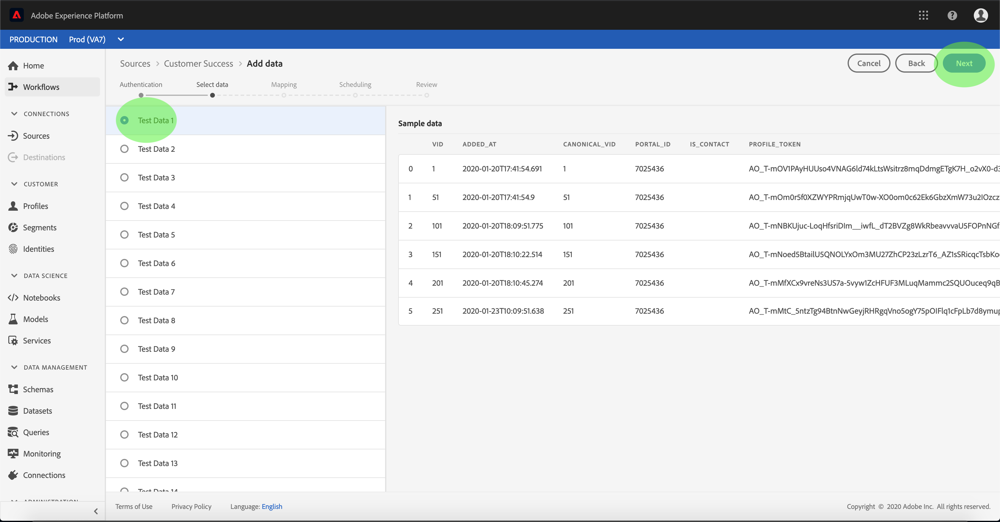

# 在UI中為客戶成功連接器配置資料流

資料流是從源中檢索資料並將資料帶入平台資料集的計畫任務。 本教程提供使用客戶成功帳戶配置新資料流的步驟。

## 快速入門

本教學課程需要對Adobe Experience Platform的下列元件有正確的認識：

- [體驗資料模型(XDM)系統](../../../../xdm/home.md):Experience Platform組織客戶體驗資料的標準化架構。
   - [架構構成基礎](../../../../xdm/schema/composition.md):瞭解XDM架構的基本建置區塊，包括架構組合的主要原則和最佳實務。
   - [架構編輯器教程](../../../../xdm/tutorials/create-schema-ui.md):瞭解如何使用架構編輯器UI建立自訂架構。
- [即時客戶個人檔案](../../../../profile/home.md):根據來自多個來源的匯整資料，提供統一、即時的消費者個人檔案。

此外，本教學課程要求您已建立客戶成功帳戶。 如需在UI中建立不同客戶成功連接器的教學課程清單，請參閱來源連 [接器概觀](../../../home.md)。

## 選擇資料

建立客戶成功連接器後，會出現「選 *取資料* 」步驟，提供互動式介面供您探索檔案階層。

- 介面的左半部分是目錄瀏覽器，顯示伺服器的檔案和目錄。
- 介面的右半部分可讓您從相容檔案中預覽最多100列資料。

選擇您要使用的目錄，然後按一下「下 **一步**」。

## 將資料欄位對應至XDM架構

此時 *會出現* 「對應」步驟，提供互動式介面，將來源資料對應至平台資料集。

選擇要接收傳入資料的資料集。 您可以使用現有資料集或建立新資料集。

### 使用現有資料集

若要將資料內嵌至現有資料集，請選取「使 **用現有資料集**」，然後按一下資料集圖示。

將出 *現「選擇資料集* 」對話框。 尋找您要使用的資料集，選取它，然後按一下「繼 **續**」。

### 使用新資料集

若要將資料新增至新資料集，請選取「 **建立新資料集** 」，並在提供的欄位中輸入資料集的名稱和說明。

在此過程中，您還可以啟用「部 *分提取* 」和「 *錯誤診斷」*。 啟用 *部分擷取* ，可讓您擷取包含錯誤的資料，最多可設定特定臨界值。 啟用 *錯誤診斷* ，將提供任何個別批次錯誤資料的詳細資訊。 如需詳細資訊，請參閱部 [分批次擷取概觀](../../../../ingestion/batch-ingestion/partial.md)。

接著，按一下結構圖示。

將出 *現「選擇模式* 」對話框。 選擇要應用於新資料集的模式，然後按一下「完 **成」**。

您可以根據需要選擇直接映射欄位，或使用映射器函式轉換源資料以導出計算值或計算值。 有關資料映射和映射器函式的詳細資訊，請參閱將CSV資料映 [射到XDM模式欄位的教程](../../../../ingestion/tutorials/map-a-csv-file.md)。

映射源資料後，按一下「下 **一步**」。

## 排程擷取執行

此時 *會顯示「排程* 」步驟，允許您配置提取計畫，以使用配置的映射自動提取選定的源資料。 下表概述了用於計畫的不同可配置欄位：

| 欄位 | 說明 |
| --- | --- |
| 頻率 | 可選頻率包括分鐘、小時、日和周。 |
| 間隔 | 一個整數，用於設定所選頻率的間隔。 |
| 開始時間 | UTC時間戳記，將會發生第一次擷取。 |
| 回填 | 一個布爾值，可決定最初收錄的資料。 如果 *啟用回填* ，則指定路徑中的所有目前檔案將在第一次排程擷取期間被擷取。 如果 *停用* 「回填」 *，則只會收錄在首次擷取執行和開始時間之間載入的* 檔案。 在開始時間之前載 *入的檔案* ，將不會收錄。 |

資料流設計為在計畫基礎上自動收錄資料。 如果您只想在此工作流程中收錄一次，可以將 **Frequency** （頻率）設為「Day」（日），並套用很大的 **Interval**（例如10000或類似）。

提供計畫值，然後按一下「下 **一步**」。

## 查看資料流

此時 *會出現* 「查看」步驟，允許您在建立新資料流之前對其進行查看。 詳細資訊會分組在下列類別中：

- *連接詳細資訊*:顯示源檔案的類型、所選源檔案的相關路徑，以及該源檔案中的列數。
- *對應詳細資訊*:顯示源資料被吸收到的資料集，包括資料集所附的模式。
- *排程詳細資訊*:顯示接收調度的活動期間、頻率和間隔。

複查資料流後，按一下 **完成** ，並為建立資料流留出一些時間。

## 監控資料流

建立資料流後，您可以監視通過其獲取的資料。 按照以下步驟訪問資料流的資料集監視器。

在「來 *源* 」工作區中，選取您要在「客戶成功」類別下檢視的客戶 *成功來源* 。 選擇 *連接源* ，啟動驗證介面。 要查看現有資料流，請選擇 *現有帳戶* ，然後選擇要訪問的帳戶。

此時將 *顯示「源* 」活動螢幕。 在此處，按一下要監視其活動的資料集的名稱。

此時會 *顯示「資料集* 」活動畫面。 此頁面以圖形形式顯示消費訊息的比率。

有關監視資料集和提取的詳細資訊，請參閱有關監視流資料流 [的教程](../../../../ingestion/quality/monitor-data-flows.md)。

## 後續步驟

通過本教程，您成功建立了一個資料流，以導入來自客戶成功源的資料並獲得了有關監控資料集的深入見解。 現在，下游平台服務（例如即時客戶個人檔案和資料科學工作區）可以使用傳入的資料。 如需詳細資訊，請參閱下列檔案：

- [即時客戶個人檔案總覽](../../../../profile/home.md)
- [資料科學工作區概觀](../../../../data-science-workspace/home.md)

## 附錄

以下各節提供了使用源連接器的附加資訊。

### 禁用資料流

建立資料流時，它會立即變為活動狀態，並根據給定的時間表收集資料。 您可以隨時按照以下說明禁用活動資料流。

在驗 *證螢幕* ，選擇與要禁用的資料流關聯的帳戶的名稱。

此時將 _顯示「源_ 」活動頁。 從清單中選擇活動資料流，以在螢幕右側開啟其 *Properties* （屬性）列，該列包含 **** Enabled（啟用）切換按鈕。 按一下切換以禁用資料流。 在禁用資料流後，可以使用相同的切換來重新啟用資料流。

### 啟用描述檔填入的傳入資料

來自來源連接器的傳入資料可用於豐富和填入即時客戶個人檔案資料。 如需填入真實客戶個人檔案資料的詳細資訊，請參閱個人檔案填入 [教學課程](../profile.md)。