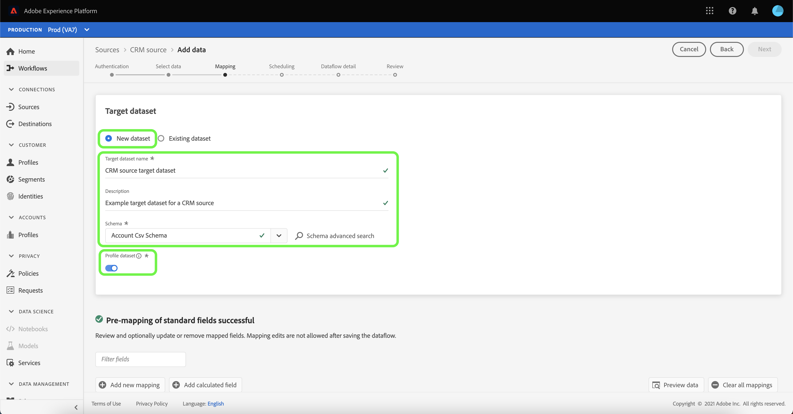
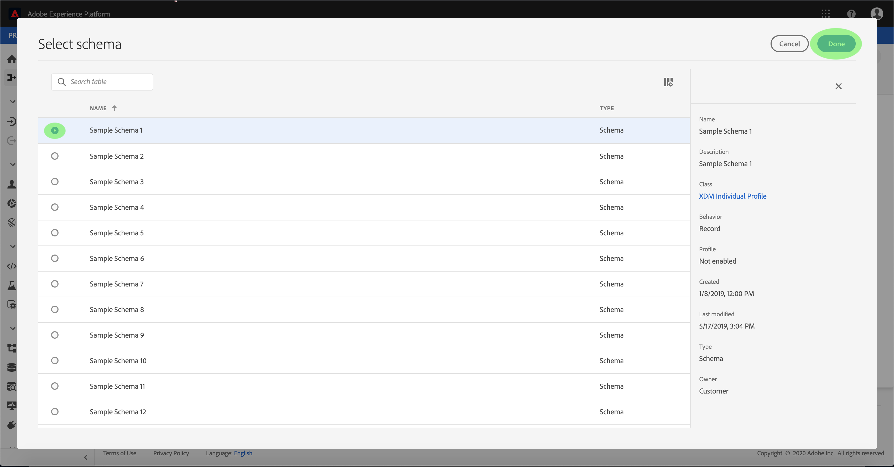
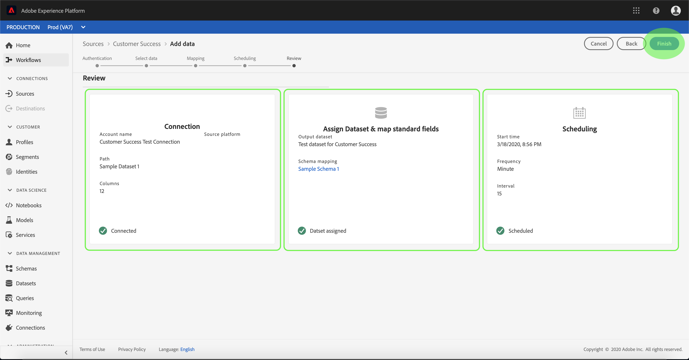

# 在UI中為客戶成功連接配置資料流

資料流是從源中檢索資料並將資料帶入[!DNL Platform]資料集的計畫任務。 本教程提供使用客戶成功帳戶配置新資料流的步驟。

## 快速入門

本教學課程需要對Adobe Experience Platform的下列元件有正確的認識：

- [[!DNL Experience Data Model (XDM)] 系統](../../../../xdm/home.md):組織客戶體驗資 [!DNL Experience Platform] 料的標準化架構。
   - [架構構成基礎](../../../../xdm/schema/composition.md):瞭解XDM架構的基本建置區塊，包括架構組合的主要原則和最佳實務。
   - [架構編輯器教程](../../../../xdm/tutorials/create-schema-ui.md):瞭解如何使用架構編輯器UI建立自訂架構。
- [[!DNL Real-time Customer Profile]](../../../../profile/home.md):根據來自多個來源的匯整資料，提供統一、即時的消費者個人檔案。

此外，本教學課程要求您已建立客戶成功帳戶。 有關在UI中建立不同客戶成功連接器的教學課程清單，請參閱[來源連接器概述](../../../home.md)。

## 選擇資料

在建立客戶成功連接器後，會出現&#x200B;**[!UICONTROL 選擇data]**&#x200B;步驟，提供互動式介面供您探索檔案階層。

- 介面的左半部分是目錄瀏覽器，顯示伺服器的檔案和目錄。
- 介面的右半部分可讓您從相容檔案中預覽最多100列資料。

您可以使用頁面頂部的&#x200B;**[!UICONTROL Search]**&#x200B;選項，快速識別您要使用的來源資料。

>[!NOTE]
>
>搜索源資料選項可用於所有基於表格的源連接器，但Analytics、分類、事件集線器和Kinesis連接器除外。

找到源資料後，選擇目錄，然後按一下&#x200B;**[!UICONTROL Next]**。

## 將資料欄位對應至XDM架構

出現&#x200B;**[!UICONTROL 映射]**&#x200B;步驟，提供互動式介面將源資料映射到[!DNL Platform]資料集。

選擇要接收傳入資料的資料集。 您可以使用現有資料集或建立新資料集。

### 使用現有資料集

若要將資料內嵌至現有資料集，請選取&#x200B;**[!UICONTROL 使用現有資料集]**，然後按一下資料集圖示。

出現&#x200B;**[!UICONTROL 選擇dataset]**&#x200B;對話框。 尋找您要使用的資料集，選取它，然後按一下&#x200B;**[!UICONTROL 繼續]**。

### 使用新資料集

若要將資料內嵌至新資料集，請選取&#x200B;**[!UICONTROL 建立新資料集]**，並在提供的欄位中輸入資料集的名稱和說明。

通過在&#x200B;**[!UICONTROL 選擇方案]**&#x200B;搜索欄中輸入方案名稱，可以附加方案欄位。 您也可以選擇下拉式圖示，查看現有結構的清單。 或者，您可以選擇&#x200B;**[!UICONTROL 高級搜索]**&#x200B;來訪問現有方案的螢幕，包括其各自的詳細資訊。

在此步驟中，您可以啟用[!DNL Real-time Customer Profile]的資料集，並建立實體屬性和行為的整體檢視。 所有啟用資料集的資料將包含在[!DNL Profile]中，並在保存資料流時應用更改。

切換&#x200B;**[!UICONTROL Profile dataset]**&#x200B;按鈕，以啟用[!DNL Profile]的目標資料集。

將顯示&#x200B;**[!UICONTROL 選擇方案]**&#x200B;對話框。 選擇要應用於新資料集的模式，然後按一下&#x200B;**[!UICONTROL Done]**。

根據您的需求，您可以選擇直接映射欄位，或使用映射器函式轉換來源資料以衍生計算或計算值。 有關資料映射和映射器功能的詳細資訊，請參閱有關將CSV資料映射到XDM模式欄位](../../../../ingestion/tutorials/map-a-csv-file.md)的教程。[

>[!TIP]
>
>[!DNL Platform] 根據您選取的目標架構或資料集，為自動映射欄位提供智慧建議。您可以手動調整對應規則，以符合您的使用案例。

選擇&#x200B;**[!UICONTROL 預覽資料]**，以查看從所選資料集中最多100列樣本資料的映射結果。

在預覽期間，身分欄會優先化為第一個欄位，因為這是驗證映射結果時所需的關鍵資訊。

映射源資料後，選擇&#x200B;**[!UICONTROL Close]**。

## 排程擷取執行

此時將顯示&#x200B;**[!UICONTROL 計畫]**&#x200B;步驟，允許您配置提取計畫以使用配置的映射自動提取選定的源資料。 下表概述了用於計畫的不同可配置欄位：

| 欄位 | 說明 |
| --- | --- |
| 頻率 | 可選頻率包括`Once`、`Minute`、`Hour`、`Day`和`Week`。 |
| 間隔 | 一個整數，用於設定所選頻率的間隔。 |
| 開始時間 | UTC時間戳記，指示何時設定進行第一次擷取。 |
| 回填 | 一個布爾值，可決定最初收錄的資料。 如果&#x200B;**[!UICONTROL 回填]**&#x200B;已啟用，則指定路徑中的所有當前檔案將在第一次計畫提取期間被提取。 如果&#x200B;**[!UICONTROL 回填]**&#x200B;已停用，則只會收錄在第一次擷取執行和開始時間之間載入的檔案。 在開始時間之前載入的檔案將不會被收錄。 |
| 增量列 | 具有類型、日期或時間的一組已篩選源架構欄位的選項。 此欄位用於區分新資料和現有資料。 增量資料將根據選取欄的時間戳記進行擷取。 |

資料流設計為在計畫基礎上自動收錄資料。 從選取擷取頻率開始。 接著，設定間隔，以指定兩個流程執行之間的期間。 間隔的值應為非零整數，且應設定為大於或等於15。

若要設定擷取的開始時間，請調整顯示在開始時間方塊中的日期和時間。 或者，您也可以選取日曆圖示來編輯開始時間值。 開始時間必須大於或等於當前UTC時間。

選擇&#x200B;**[!UICONTROL 按]**&#x200B;載入增量資料以分配增量列。 此欄位可區分新資料和現有資料。

### 設定一次性提取資料流

要設定一次性攝取，請選擇頻率下拉箭頭並選擇&#x200B;**[!UICONTROL 一次]**。

>[!TIP]
>
>**[!UICONTROL 一次]** 性擷 **** 取期間不會顯示間隔和回填。

在為調度提供適當值後，選擇&#x200B;**[!UICONTROL Next]**。

## 提供資料流詳細資訊

將顯示&#x200B;**[!UICONTROL 資料流詳細資訊]**&#x200B;步驟，允許您命名新資料流並提供有關新資料流的簡要說明。

在此過程中，您還可以啟用&#x200B;**[!UICONTROL 部分攝取]**&#x200B;和&#x200B;**[!UICONTROL 錯誤診斷]**。 啟用&#x200B;**[!UICONTROL 部分擷取]**&#x200B;可擷取包含錯誤至特定臨界值的資料。 啟用&#x200B;**[!UICONTROL 部分擷取]**&#x200B;後，拖曳&#x200B;**[!UICONTROL 錯誤臨界值%]**&#x200B;撥號以調整批次的錯誤臨界值。 或者，也可以通過選擇輸入框手動調整閾值。 如需詳細資訊，請參閱[部分批次擷取概觀](../../../../ingestion/batch-ingestion/partial.md)。

為資料流提供值並選擇&#x200B;**[!UICONTROL Next]**。

## 查看資料流

將顯示&#x200B;**[!UICONTROL 查看]**&#x200B;步驟，允許您在建立新資料流之前對其進行查看。 詳細資訊會分組在下列類別中：

- **[!UICONTROL 連接詳細資訊]**:顯示源檔案的類型、所選源檔案的相關路徑，以及該源檔案中的列數。
- **[!UICONTROL 對應詳細資訊]**:顯示源資料被吸收到的資料集，包括資料集所附的模式。
- **[!UICONTROL 排程詳細資訊]**:顯示接收調度的活動期間、頻率和間隔。

複查資料流後，按一下&#x200B;**[!UICONTROL 完成]**&#x200B;並允許建立資料流一段時間。

## 監控資料流

建立資料流後，您可以監視通過其獲取的資料，以查看有關提取率、成功和錯誤的資訊。 有關如何監視資料流的詳細資訊，請參見UI](../monitor.md)中有關[監視帳戶和資料流的教程。

## 刪除資料流

您可以使用&#x200B;**[!UICONTROL Dataflows]**&#x200B;工作區中的&#x200B;**[!UICONTROL Delete]**&#x200B;函式刪除不再需要或建立錯誤的資料流。 有關如何刪除資料流的詳細資訊，請參見UI](../delete.md)中有關[刪除資料流的教程。

## 後續步驟

通過本教程，您成功建立了一個資料流，以導入來自客戶成功源的資料並獲得了有關監控資料集的深入見解。 現在，下游[!DNL Platform]服務（例如[!DNL Real-time Customer Profile]和[!DNL Data Science Workspace]）可以使用傳入的資料。 如需詳細資訊，請參閱下列檔案：

- [即時客戶個人檔案總覽](../../../../profile/home.md)
- [資料科學工作區概觀](../../../../data-science-workspace/home.md)

## 附錄

以下各節提供了使用源連接器的附加資訊。

### 禁用資料流

建立資料流時，它會立即變為活動狀態，並根據給定的時間表收集資料。 您可以隨時按照以下說明禁用活動資料流。

在&#x200B;**[!UICONTROL Authentication]**&#x200B;螢幕中，選擇與要禁用的資料流關聯的帳戶名稱。

此時將顯示&#x200B;**[!UICONTROL 源活動]**&#x200B;頁。 從清單中選擇活動資料流，以開啟螢幕右側的&#x200B;**[!UICONTROL 屬性]**&#x200B;列，該列包含&#x200B;**[!UICONTROL 啟用]**&#x200B;切換按鈕。 按一下切換以禁用資料流。 在禁用資料流後，可以使用相同的切換來重新啟用資料流。

### 啟用[!DNL Profile]人口的傳入資料

來自源連接器的入站資料可用於豐富和填充[!DNL Real-time Customer Profile]資料。 如需填入[!DNL Real-time Customer Profile]資料的詳細資訊，請參閱[描述檔填入](../profile.md)的教學課程。