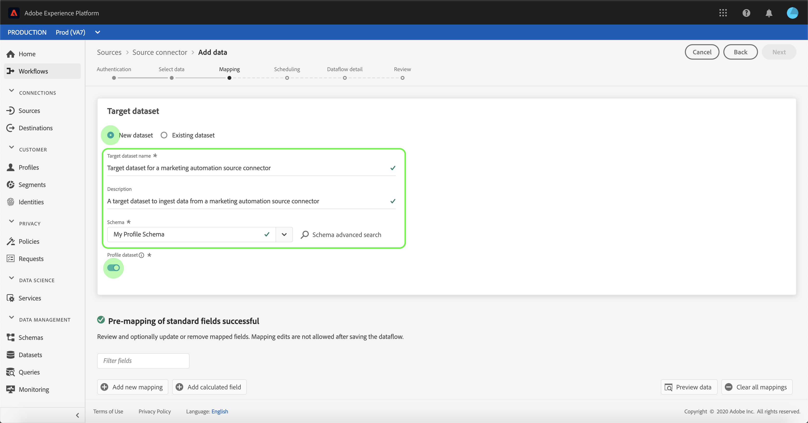
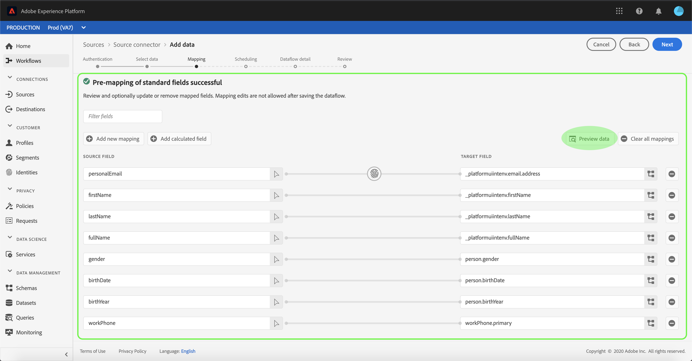
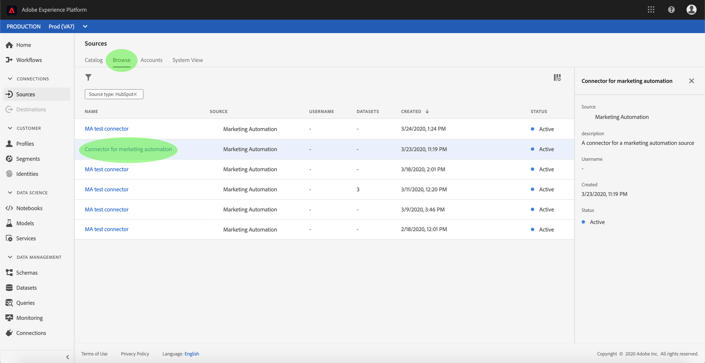
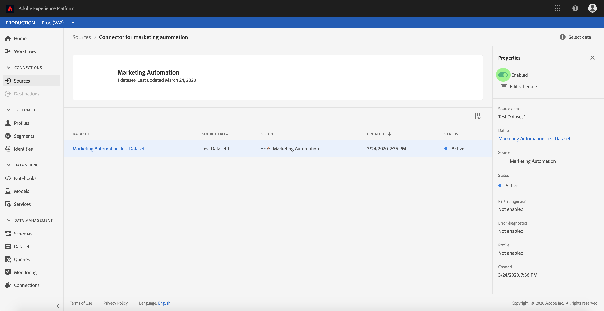

# 在UI中為市場營銷自動化連接配置資料流

資料流是從源中檢索資料並將資料接收到的計畫任務 [!DNL Platform] 資料集。 本教程提供了使用市場營銷自動化帳戶配置新資料流的步驟。

## 快速入門

本教程需要對Adobe Experience Platform的以下部分進行有效的理解：

- [[!DNL Experience Data Model (XDM)] 系統](../../../../xdm/home.md):標準化框架 [!DNL Experience Platform] 組織客戶體驗資料。
   - [架構組合的基礎](../../../../xdm/schema/composition.md):瞭解XDM架構的基本構建基塊，包括架構組成中的關鍵原則和最佳做法。
   - [架構編輯器教程](../../../../xdm/tutorials/create-schema-ui.md):瞭解如何使用架構編輯器UI建立自定義架構。
- [[!DNL Real-time Customer Profile]](../../../../profile/home.md):基於來自多個源的聚合資料提供統一、即時的用戶配置檔案。

此外，本教程要求您已經建立了市場營銷自動化帳戶。 有關在UI中建立不同市場營銷自動化連接器的教程清單，請參見 [源連接器概述](../../../home.md)。

## 選擇資料

建立市場營銷自動化帳戶後， *選擇資料* 的子菜單。

- 介面的左半部分是目錄瀏覽器，顯示伺服器的檔案和目錄。
- 該介面的右半部分允許您從相容檔案中預覽多達100行資料。

您可以使用 **[!UICONTROL 搜索]** 選項，以快速確定要使用的源資料。

>[!NOTE]
>
>搜索源資料選項可用於除分析、分類、事件集線器和Kinesis連接器之外的所有基於表格的源連接器。

找到源資料後，選擇目錄，然後按一下 **[!UICONTROL 下一個]**。

## 將資料欄位映射到XDM架構

的 **[!UICONTROL 映射]** 步驟，提供交互介面將源資料映射到 [!DNL Platform] 資料集。

為要接收到的入站資料選擇資料集。 可以使用現有資料集或建立新資料集。

### 使用現有資料集

要將資料插入現有資料集，請選擇 **[!UICONTROL 使用現有資料集]**，然後按一下資料集表徵圖。

的 **[!UICONTROL 選擇資料集]** 對話框。 查找要使用的資料集，選擇它，然後按一下 **[!UICONTROL 繼續]**。

### 使用新資料集

要將資料插入新資料集，請選擇 **[!UICONTROL 建立新資料集]** 並在提供的欄位中輸入資料集的名稱和說明。

通過在 **[!UICONTROL 選擇架構]** 的子菜單。 您也可以選擇下拉表徵圖，查看現有方案的清單。 或者，可以選擇 **[!UICONTROL 高級搜索]** 訪問現有架構的螢幕，包括其各自的詳細資訊。

在此步驟中，您可以為 [!DNL Real-time Customer Profile] 並建立實體屬性和行為的整體視圖。 來自所有已啟用的資料集的資料將包含在 [!DNL Profile] 並在保存資料流時應用更改。

切換 **[!UICONTROL 配置檔案資料集]** 按鈕啟用目標資料集 [!DNL Profile]。

的 **[!UICONTROL 選擇架構]** 對話框。 選擇要應用到新資料集的架構，然後按一下 **[!UICONTROL 完成]**。

根據您的需要，您可以選擇直接映射欄位，或使用資料準備函式轉換源資料以導出計算值或計算值。 有關使用映射器介面和計算欄位的全面步驟，請參見 [資料準備UI指南](../../../../data-prep/ui/mapping.md)。

>[!TIP]
>
>平台根據您選擇的目標架構或資料集為自動映射欄位提供智慧建議。 您可以手動調整映射規則以適合您的使用情形。

選擇 **[!UICONTROL 預覽資料]** 查看所選資料集中最多100行示例資料的映射結果。

在預覽期間，標識列作為第一個欄位按優先順序排列，因為它是驗證映射結果時所必需的關鍵資訊。

映射源資料後，選擇 **[!UICONTROL 關閉]**。

## 計畫攝取運行

的 **[!UICONTROL 計畫]** 步驟，允許您配置接收計畫以使用配置的映射自動接收選定的源資料。 下表概述了計畫的不同可配置欄位：

| 欄位 | 說明 |
| --- | --- |
| 頻率 | 可選頻率包括 `Once`。 `Minute`。 `Hour`。 `Day`, `Week`。 |
| 間隔 | 設定所選頻率的間隔的整數。 |
| 開始時間 | UTC時間戳，指示第一次攝取的時間設定為何時發生。 |
| 回填 | 一個布爾值，它確定最初接收的資料。 如果 **[!UICONTROL 回填]** 啟用後，指定路徑中的所有當前檔案將在首次計畫接收期間被接收。 如果 **[!UICONTROL 回填]** 禁用，將只接收在第一次接收運行和開始時間之間載入的檔案。 在開始時間之前載入的檔案將不會被攝取。 |
| 增量列 | 具有類型、日期或時間的一組篩選源架構欄位的選項。 此欄位用於區分新資料和現有資料。 增量資料將根據選定列的時間戳進行接收。 |

資料流設計為按計畫自動接收資料。 從選擇攝取頻率開始。 接下來，設定間隔以指定兩個流運行之間的時段。 間隔的值應為非零整數，並應設定為大於或等於15。

要設定攝取的開始時間，請調整在開始時間框中顯示的日期和時間。 或者，可以選擇日曆表徵圖以編輯開始時間值。 開始時間必須大於或等於當前UTC時間。

選擇 **[!UICONTROL 載入增量資料的方式]** 指定增量列。 此欄位區分新資料和現有資料。

### 設定一次性接收資料流

要設定一次性接收，請選擇頻率下拉箭頭並選擇 **[!UICONTROL 一次]**。

>[!TIP]
>
>**[!UICONTROL 間隔]** 和 **[!UICONTROL 回填]** 在一次性攝取期間不可見。

為計畫提供適當值後，選擇 **[!UICONTROL 下一個]**。

## 提供資料流詳細資訊

的 **[!UICONTROL 資料流詳細資訊]** 步驟，使您可以命名並簡要描述新資料流。

在此過程中，您還可以 **[!UICONTROL 部分攝取]** 和 **[!UICONTROL 錯誤診斷]**。 啟用 **[!UICONTROL 部分攝取]** 提供了接收包含錯誤的資料的能力，這些錯誤最高可達某個閾值。 一次 **[!UICONTROL 部分攝取]** 啟用，拖動 **[!UICONTROL 錯誤閾值%]** 撥號以調整批的錯誤閾值。 或者，可以通過選擇輸入框手動調整閾值。 有關詳細資訊，請參見 [部分批處理接收概述](../../../../ingestion/batch-ingestion/partial.md)。

為資料流提供值並選擇 **[!UICONTROL 下一個]**。

## 查看資料流

的 **[!UICONTROL 審閱]** 步驟，允許您在建立新資料流之前查看它。 詳細資訊按以下類別分組：

- **[!UICONTROL 連接]**:顯示源類型、所選源檔案的相關路徑以及該源檔案中的列數。
- **[!UICONTROL 分配資料集和映射欄位]**:顯示源資料正被攝取到的資料集，包括該資料集所遵循的架構。
- **[!UICONTROL 計畫]**:顯示接收計畫的活動期間、頻率和間隔。

查看資料流後，按一下 **[!UICONTROL 完成]** 並為建立資料流留出一些時間。

## 監視資料流

建立資料流後，您可以監視通過它攝取的資料，以查看有關攝取率、成功和錯誤的資訊。 有關如何監視資料流的詳細資訊，請參見上的教程 [監視UI中的帳戶和資料流](../monitor.md)。

## 刪除資料流

您可以刪除不再需要或使用 **[!UICONTROL 刪除]** 函式 **[!UICONTROL 資料流]** 工作區。 有關如何刪除資料流的詳細資訊，請參見上的教程 [刪除UI中的資料流](../delete.md)。

## 後續步驟

通過本教程，您成功建立了一個資料流，以從市場營銷自動化系統中導入資料，並深入瞭解了監控資料集。 傳入資料現在可供下游使用 [!DNL Platform] 服務，如 [!DNL Real-time Customer Profile] 和 [!DNL Data Science Workspace]。 有關詳細資訊，請參閱以下文檔：

- [[!DNL Real-time Customer Profile] 概觀](../../../../profile/home.md)
- [[!DNL Data Science Workspace] 概觀](../../../../data-science-workspace/home.md)

## 附錄

以下各節提供了有關使用源連接器的其他資訊。

### 禁用資料流

建立資料流時，它會立即變為活動狀態，並根據給定的時間表接收資料。 您可以隨時按照以下說明禁用活動資料流。

在 **[!UICONTROL 認證]** 螢幕中，選擇與要禁用的資料流關聯的連接的名稱。

的 **[!UICONTROL 源活動]** 的子菜單。 從清單中選擇活動資料流以開啟其 **[!UICONTROL 屬性]** 框中，該框包含 **[!UICONTROL 已啟用]** 切換按鈕。 按一下切換以禁用資料流。 禁用資料流後，可以使用相同的切換功能重新啟用資料流。

### 激活入站資料 [!DNL Profile] 人口

來自源連接器的入站資料可用於豐富和填充 [!DNL Real-time Customer Profile] 資料。 有關填充的詳細資訊 [!DNL Real-time Customer Profile] 資料，請參見上的教程 [概況填充](../profile.md)。
