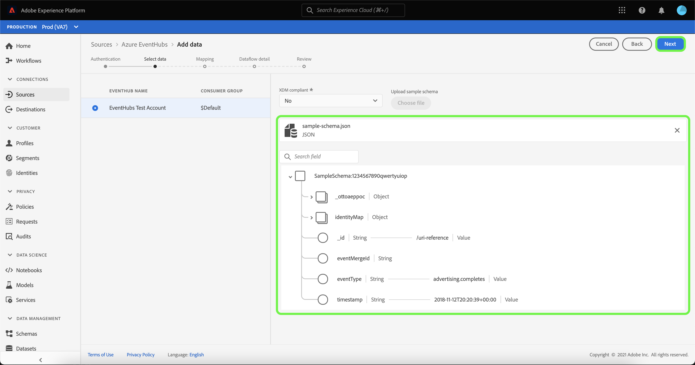
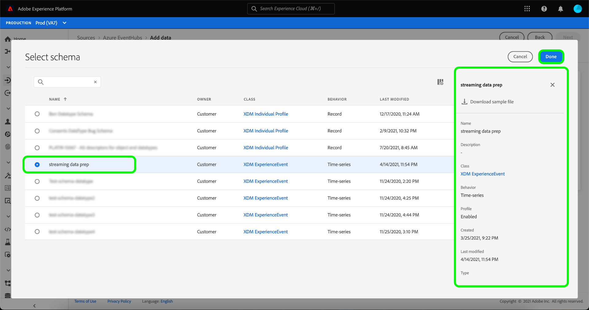

# 在UI中為雲儲存源建立流資料流

資料流是一項排程任務，可從來源擷取資料，並內嵌至Adobe Experience Platform資料集。 本教學課程提供在UI中為雲儲存來源建立串流資料流的步驟。

在嘗試本教學課程之前，您必須先在雲端儲存帳戶與平台之間建立有效且經過驗證的連線。 如果您尚未驗證連線，請參閱下列其中一個教學課程，以取得驗證串流雲端儲存空間帳戶的相關資訊：

- [[!DNL Amazon Kinesis]](../../../ui/create/cloud-storage/kinesis.md)
- [[!DNL Azure Event Hubs]](../../../ui/create/cloud-storage/eventhub.md)
- [[!DNL Google PubSub]](../../../ui/create/cloud-storage/google-pubsub.md)

## 快速入門

本教學課程需要妥善了解下列Adobe Experience Platform元件：

- [資料流](../../../../../dataflows/home.md):資料流是跨平台移動資料的資料作業的表示。 資料流是跨不同的服務(從源到 [!DNL Identity Service]，到 [!DNL Profile]和 [!DNL Destinations].
- [資料準備](../../../../../data-prep/home.md):資料準備可讓資料工程師將資料對應、轉換及驗證至Experience Data Model(XDM)。 資料準備會在資料擷取程式（包括CSV擷取工作流程）中顯示為「對應」步驟。
- [[!DNL Experience Data Model (XDM)] 系統](../../../../../xdm/home.md):標準化框架 [!DNL Experience Platform] 組織客戶體驗資料。
   - [結構構成基本概念](../../../../../xdm/schema/composition.md):了解XDM結構描述的基本建置組塊，包括結構描述的主要原則和最佳實務。
   - [結構編輯器教學課程](../../../../../xdm/tutorials/create-schema-ui.md):了解如何使用結構編輯器UI建立自訂結構。
- [[!DNL Real-Time Customer Profile]](../../../../../profile/home.md):根據來自多個來源的匯總資料，提供統一的即時消費者設定檔。

## 新增資料

建立驗證串流雲端儲存空間帳戶的權限後， **[!UICONTROL 選擇資料]** 步驟，提供介面供您選取要將哪個資料流帶入Platform。

- 介面的左側是瀏覽器，可讓您檢視帳戶內可用的資料流；
- 介面的右側可讓您從JSON檔案預覽最多100列資料。

選取您要使用的資料流，然後選取 **[!UICONTROL 選擇檔案]** 上傳範例結構。

>[!TIP]
>
>如果您的資料符合XDM規範，您可以略過上傳範例結構，然後選取 **[!UICONTROL 下一個]** 繼續。

上傳架構後，預覽介面會更新，以顯示您上傳之架構的預覽。 預覽介面可讓您檢查檔案的內容和結構。 您也可以使用 [!UICONTROL 搜尋欄位] 從架構中存取特定項目的公用程式。

完成後，請選取 **[!UICONTROL 下一個]**.

## 映射

此 **[!UICONTROL 對應]** 步驟，提供將來源資料對應至Platform資料集的介面。

選擇要內嵌入的傳入資料的資料集。 您可以使用現有資料集或建立新資料集。

### 新資料集

若要將資料內嵌至新資料集，請選取 **[!UICONTROL 新資料集]** 並在提供的欄位中輸入資料集的名稱和說明。 若要新增結構，您可以在 **[!UICONTROL 選擇架構]** 對話框。 或者，您也可以選取 **[!UICONTROL 架構高級搜索]** 來搜尋適當的結構。

此 [!UICONTROL 選擇架構] 窗口，提供可供選擇的可用架構清單。 從清單中選取結構以更新右側邊欄，以顯示您選取的結構的特定詳細資訊，包括是否為 [!DNL Profile].

在確定並選擇要使用的架構後，選擇 **[!UICONTROL 完成]**.

此 [!UICONTROL 目標資料集] 頁面會隨著您選取的結構而更新，並顯示為資料集的一部分。 在此步驟中，您可以為 [!DNL Profile] 並建立實體屬性和行為的整體檢視。 所有已啟用資料集的資料將包含在 [!DNL Profile] 和更改會在保存資料流時應用。

切換 **[!UICONTROL 設定檔資料集]** 按鈕，啟用目標資料集 [!DNL Profile].

### 現有資料集

若要將資料內嵌至現有資料集，請選取 **[!UICONTROL 現有資料集]**，然後選取資料集圖示。

此 **[!UICONTROL 選取資料集]** 對話框，提供可供選擇的可用資料集清單。 從清單中選取資料集，以更新右側邊欄，顯示您所選資料集的特定詳細資料，包括是否可為 [!DNL Profile].

識別並選取您要使用的資料集後，請選取 **[!UICONTROL 完成]**.

選取資料集後，請選取 [!DNL Profile] 切換為啟用資料集 [!DNL Profile].

### 映射標準欄位

建立資料集和結構後， **[!UICONTROL 映射標準欄位]** 介面，讓您手動設定資料的對應欄位。

>[!TIP]
>
>Platform會根據您選取的目標結構或資料集，為自動對應欄位提供智慧型建議。 您可以手動調整對應規則以符合您的使用案例。

您可以視需要選擇直接映射欄位，或使用資料準備函式來轉換源資料，以導出計算值或計算值。 有關使用映射器介面和計算欄位的完整步驟，請參閱 [資料準備UI指南](../../../../../data-prep/ui/mapping.md).

映射源資料後，選擇 **[!UICONTROL 下一個]**.

## 資料流詳細資訊

此 **[!UICONTROL 資料流詳細資訊]** 步驟出現，允許您為新資料流命名並提供簡要說明。

為資料流提供值並選擇 **[!UICONTROL 下一個]**.

### 檢閱

此 **[!UICONTROL 檢閱]** 步驟顯示，允許您在建立新資料流之前對其進行查看。 詳細資料會分組為下列類別：

- **[!UICONTROL 連線]**:顯示您的帳戶名稱、來源類型，以及您所使用串流雲端儲存空間來源的其他特定資訊。
- **[!UICONTROL 指派資料集和對應欄位]**:顯示您用於資料流的目標資料集和架構。

審核資料流後，請選擇 **[!UICONTROL 完成]** 並允許建立資料流的時間。

## 監視和刪除資料流

建立流雲儲存資料流後，您就可以監視正在通過它接收的資料。 有關監視和刪除流資料流的詳細資訊，請參閱 [監視流資料流](../../monitor-streaming.md).

## 後續步驟

依照本教學課程，您已成功建立資料流以從雲儲存源流資料。 下游Platform服務(例如 [!DNL Real-Time Customer Profile] 和 [!DNL Data Science Workspace]. 如需詳細資訊，請參閱下列檔案：

- [[!DNL Real-Time Customer Profile] 概覽](../../../../../profile/home.md)
- [[!DNL Data Science Workspace] 概覽](../../../../../data-science-workspace/home.md)