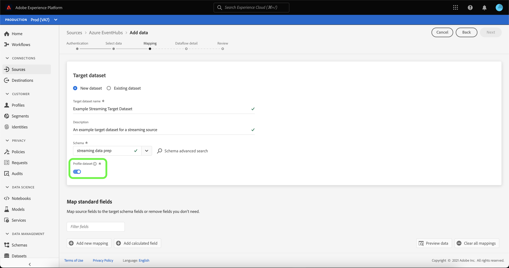

# 在UI中為雲端儲存空間來源建立串流資料流

資料流是排程的工作，會從來源擷取資料並擷取資料至Adobe Experience Platform資料集。 本教學課程提供在UI中為雲端儲存空間來源建立串流資料流的步驟。

在嘗試本教學課程之前，您必須先在雲端儲存空間帳戶和平台之間建立有效且已驗證的連線。 如果您尚未驗證連線，請參閱下列教學課程之一，以瞭解如何驗證串流雲端儲存空間帳戶的資訊：

- [[!DNL Amazon Kinesis]](../../../ui/create/cloud-storage/kinesis.md)
- [[!DNL Azure Event Hubs]](../../../ui/create/cloud-storage/eventhub.md)
- [[!DNL Google PubSub]](../../../ui/create/cloud-storage/google-pubsub.md)

## 快速入門

本教學課程需要您實際瞭解下列Adobe Experience Platform元件：

- [資料流](../../../../../dataflows/home.md)：資料流能呈現資料處理作業在Platform上行動資料的情形。 資料流會跨不同的服務進行設定，從來源到 [!DNL Identity Service]，至 [!DNL Profile]，並至 [!DNL Destinations].
- [資料準備](../../../../../data-prep/home.md)：資料準備可讓資料工程師對應、轉換和驗證進出體驗資料模型(XDM)的資料。 「資料準備」在資料擷取程式（包括CSV擷取工作流程）中顯示為「對應」步驟。
- [[!DNL Experience Data Model (XDM)] 系統](../../../../../xdm/home.md)：作為依據的標準化架構 [!DNL Experience Platform] 組織客戶體驗資料。
   - [結構描述組合基本概念](../../../../../xdm/schema/composition.md)：瞭解XDM結構描述的基本建置區塊，包括結構描述組合中的關鍵原則和最佳實務。
   - [結構描述編輯器教學課程](../../../../../xdm/tutorials/create-schema-ui.md)：瞭解如何使用結構編輯器UI建立自訂結構描述。
- [[!DNL Real-Time Customer Profile]](../../../../../profile/home.md)：根據來自多個來源的彙總資料，提供統一的即時消費者個人檔案。

## 新增資料

>[!NOTE]
>
>對於指定的事件中樞，每個使用者群組只能建立一個來源資料流。

建立驗證串流雲端儲存空間帳戶後， **[!UICONTROL 選取資料]** 步驟隨即顯示，提供介面供您選取要帶至Platform的資料流。

- 介面的左側是瀏覽器，可讓您檢視帳戶內的可用資料流；
- 介面的右側部分可讓您預覽JSON檔案中最多100列的資料。

選取您要使用的資料流，然後選取 **[!UICONTROL 選擇檔案]** 上傳範例結構描述。

>[!TIP]
>
>如果您的資料符合XDM標準，您可以略過上傳範例結構描述，然後選取 **[!UICONTROL 下一個]** 以繼續進行。

上傳結構描述後，預覽介面會更新，以顯示您上傳之結構描述的預覽。 預覽介面可讓您檢查檔案的內容和結構。 您也可以使用 [!UICONTROL 搜尋欄位] 用於從結構描述中存取特定專案的公用程式。

完成後，選取 **[!UICONTROL 下一個]**.

## 映射

此 **[!UICONTROL 對應]** 步驟隨即顯示，提供介面將來源資料對應至Platform資料集。

選擇要將傳入資料擷取的資料集。 您可以使用現有的資料集或建立新的資料集。

### 新資料集

若要將資料內嵌至新資料集，請選取「 」 **[!UICONTROL 新資料集]** 並在提供的欄位中輸入資料集的名稱和說明。 若要新增綱要，您可以在以下位置輸入現有的綱要名稱： **[!UICONTROL 選取結構描述]** 對話方塊。 或者，您可以選取 **[!UICONTROL 結構描述進階搜尋]** 以搜尋適當的結構描述。

此 [!UICONTROL 選取結構描述] 視窗會出現，為您提供可供選擇的可用方案清單。 從清單中選取結構描述，以更新右側邊欄以顯示所選結構描述的特定詳細資訊，包括有關是否已為啟用結構描述的資訊 [!DNL Profile].

在識別並選取您要使用的結構描述後，選取 **[!UICONTROL 完成]**.

此 [!UICONTROL 目標資料集] 頁面會以您選取的結構描述來更新，並顯示為資料集的一部分。 在此步驟中，您可以為以下專案啟用資料集 [!DNL Profile] 以及建立實體屬性和行為的整體檢視。 來自所有已啟用資料集的資料將包含在 [!DNL Profile] 和變更會在您儲存資料流時套用。

切換 **[!UICONTROL 設定檔資料集]** 按鈕啟用您的目標資料集 [!DNL Profile].

### 現有資料集

若要將資料內嵌至現有的資料集，請選取「 」 **[!UICONTROL 現有資料集]**，然後選取資料集圖示。

此 **[!UICONTROL 選取資料集]** 對話方塊隨即顯示，為您提供可供選擇的可用資料集清單。 從清單中選取資料集以更新右邊欄，以顯示您所選資料集的特定詳細資訊，包括有關資料集是否可以啟用的資訊 [!DNL Profile].

識別並選取您要使用的資料集後，選取 **[!UICONTROL 完成]**.

選取資料集後，請選取 [!DNL Profile] 切換以啟用您的資料集 [!DNL Profile].

### 對應標準欄位

建立資料集和結構描述後， **[!UICONTROL 對應標準欄位]** 介面會出現，可讓您手動設定資料的對應欄位。

>[!TIP]
>
>Platform會根據您選取的目標結構或資料集，為自動對應的欄位提供智慧型建議。 您可以手動調整對應規則以符合您的使用案例。

您可以根據自己的需求，選擇直接對應欄位，或使用資料準備函式來轉換來源資料，以衍生計算或計算的值。 如需使用對應程式介面和計算欄位的完整步驟，請參閱 [資料準備UI指南](../../../../../data-prep/ui/mapping.md).

在對應來源資料後，選取 **[!UICONTROL 下一個]**.

## 資料流詳細資料

此 **[!UICONTROL 資料流詳細資料]** 步驟隨即顯示，可讓您為新資料流命名並提供簡短說明。

為資料流提供值並選取 **[!UICONTROL 下一個]**.

### 檢閱

此 **[!UICONTROL 檢閱]** 步驟隨即顯示，可讓您在建立新資料流之前對其進行檢閱。 詳細資料會分組到以下類別中：

- **[!UICONTROL 連線]**：顯示您的帳戶名稱、來源型別，以及您使用之串流雲端儲存空間來源的其他特定資訊。
- **[!UICONTROL 指派資料集和對應欄位]**：顯示您用於資料流的目標資料集和結構描述。

檢閱資料流後，選取「 」 **[!UICONTROL 完成]** 並留出一些時間建立資料流。

## 監視和刪除資料流

建立串流雲端儲存空間資料流後，您可以監視從中擷取的資料。 如需監視和刪除串流資料流的詳細資訊，請參閱以下教學課程： [監視串流資料流](../../monitor-streaming.md).

## 後續步驟

依照本教學課程中的指示，您已成功建立資料流，以從雲端儲存空間來源串流資料。 傳入資料現在可供下游Platform服務使用，例如 [!DNL Real-Time Customer Profile] 和 [!DNL Data Science Workspace]. 如需更多詳細資訊，請參閱下列檔案：

- [[!DNL Real-Time Customer Profile] 概覽](../../../../../profile/home.md)
- [[!DNL Data Science Workspace] 概覽](../../../../../data-science-workspace/home.md)