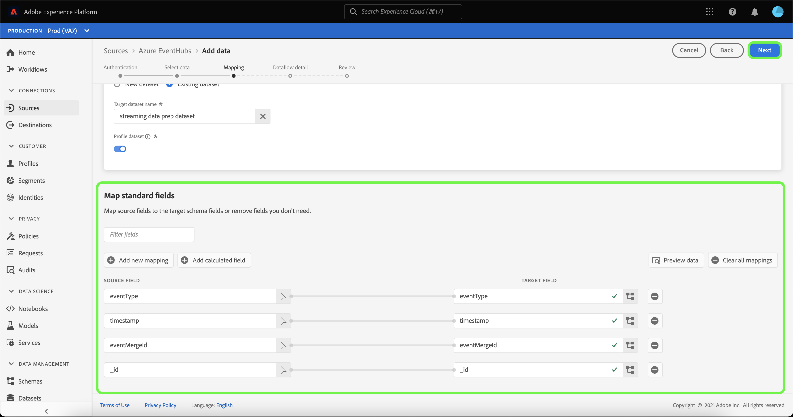

# 在UI中為雲端儲存空間來源建立串流資料流

資料流是排程的工作，會從來源擷取資料並擷取資料至Adobe Experience Platform資料集。 本教學課程提供在UI中為雲端儲存空間來源建立串流資料流的步驟。

在嘗試本教學課程之前，您必須先在雲端儲存空間帳戶和平台之間建立有效且已驗證的連線。 如果您尚未驗證連線，請參閱下列教學課程之一，以瞭解如何驗證串流雲端儲存空間帳戶的資訊：

- [[!DNL Amazon Kinesis]](../../../ui/create/cloud-storage/kinesis.md)
- [[!DNL Azure Event Hubs]](../../../ui/create/cloud-storage/eventhub.md)
- [[!DNL Google PubSub]](../../../ui/create/cloud-storage/google-pubsub.md)

## 快速入門

本教學課程需要您實際瞭解下列Adobe Experience Platform元件：

- [資料流](../../../../../dataflows/home.md)：資料流可呈現跨平台行動資料的資料作業。 資料流是跨不同服務設定的，從來源到[!DNL Identity Service]，到[!DNL Profile]，再到[!DNL Destinations]。
- [資料準備](../../../../../data-prep/home.md)：「資料準備」可讓資料工程師對應、轉換和驗證與Experience Data Model (XDM)之間的資料。 「資料準備」在資料擷取程式（包括CSV擷取工作流程）中顯示為「對應」步驟。
- [[!DNL Experience Data Model (XDM)] 系統](../../../../../xdm/home.md)： [!DNL Experience Platform]用來組織客戶體驗資料的標準化架構。
   - [結構描述組合的基本概念](../../../../../xdm/schema/composition.md)：瞭解XDM結構描述的基本建置區塊，包括結構描述組合中的關鍵原則和最佳實務。
   - [結構描述編輯器教學課程](../../../../../xdm/tutorials/create-schema-ui.md)：瞭解如何使用結構描述編輯器使用者介面建立自訂結構描述。
- [[!DNL Real-Time Customer Profile]](../../../../../profile/home.md)：根據來自多個來源的彙總資料，提供統一的即時消費者設定檔。

## 新增資料

>[!NOTE]
>
>對於指定的事件中樞，每個使用者群組只能建立一個來源資料流。

建立驗證串流雲端儲存空間帳戶後，**[!UICONTROL 選取資料]**&#x200B;步驟隨即顯示，提供介面供您選取要帶到Platform的資料流。

- 介面的左側是瀏覽器，可讓您檢視帳戶內的可用資料流；
- 介面的右側部分可讓您預覽JSON檔案中最多100列的資料。

選取您要使用的資料流，然後選取&#x200B;**[!UICONTROL 選擇檔案]**&#x200B;以上傳範例結構描述。

>[!TIP]
>
>如果您的資料符合XDM標準，您可以略過上傳範例結構描述，並選取&#x200B;**[!UICONTROL 下一步]**&#x200B;以繼續。

上傳結構描述後，預覽介面會更新，以顯示您上傳之結構描述的預覽。 預覽介面可讓您檢查檔案的內容和結構。 您也可以使用[!UICONTROL 搜尋欄位]公用程式來存取結構描述中的特定專案。

完成後，選取&#x200B;**[!UICONTROL 下一步]**。

## 對應

**[!UICONTROL 對應]**&#x200B;步驟出現，提供介面以將來源資料對應到Platform資料集。

選擇要將傳入資料擷取的資料集。 您可以使用現有的資料集或建立新的資料集。

### 新資料集

若要將資料擷取到新資料集中，請選取&#x200B;**[!UICONTROL 新資料集]**，然後在提供的欄位中輸入資料集的名稱和描述。 若要新增結構描述，您可以在&#x200B;**[!UICONTROL 選取結構描述]**&#x200B;對話方塊中輸入現有的結構描述名稱。 或者，您可以選取&#x200B;**[!UICONTROL 結構描述進階搜尋]**&#x200B;來搜尋適當的結構描述。

「[!UICONTROL 選取結構描述]」視窗會出現，為您提供可選擇的可用結構描述清單。 從清單中選取結構描述，以更新右邊欄以顯示您所選結構描述的特定詳細資料，包括有關是否為[!DNL Profile]啟用結構描述的資訊。

識別並選取您要使用的結構描述後，請選取&#x200B;**[!UICONTROL 完成]**。

[!UICONTROL Target資料集]頁面會隨著您選取的結構描述更新，並顯示為資料集的一部分。 在此步驟中，您可以為[!DNL Profile]啟用資料集，並建立實體屬性和行為的整體檢視。 來自所有已啟用資料集的資料將包含在[!DNL Profile]中，當您儲存資料流時，將會套用變更。

切換&#x200B;**[!UICONTROL 設定檔資料集]**&#x200B;按鈕，以啟用[!DNL Profile]的目標資料集。

### 現有的資料集

若要將資料內嵌至現有的資料集，請選取&#x200B;**[!UICONTROL 現有的資料集]**，然後選取資料集圖示。

**[!UICONTROL 選取資料集]**&#x200B;對話方塊隨即顯示，為您提供可供選擇的資料集清單。 從清單中選取資料集以更新右邊欄，以顯示您所選取資料集的特定詳細資料，包括是否可為[!DNL Profile]啟用資料集的資訊。

識別並選取您要使用的資料集後，請選取&#x200B;**[!UICONTROL 完成]**。

選取資料集後，選取[!DNL Profile]切換即可啟用[!DNL Profile]的資料集。

### 對應標準欄位

建立您的資料集和結構描述後，**[!UICONTROL 對應標準欄位]**&#x200B;介面就會顯示，可讓您手動設定資料的對應欄位。

>[!TIP]
>
>Platform會根據您選取的目標結構或資料集，為自動對應的欄位提供智慧型建議。 您可以手動調整對應規則以符合您的使用案例。

您可以根據自己的需求，選擇直接對應欄位，或使用資料準備函式來轉換來源資料，以衍生計算或計算的值。 如需使用對應程式介面和計算欄位的完整步驟，請參閱[資料準備UI指南](../../../../../data-prep/ui/mapping.md)。

對映來源資料後，選取&#x200B;**[!UICONTROL 下一步]**。

## 資料流詳細資料

**[!UICONTROL 資料流詳細資料]**&#x200B;步驟隨即顯示，允許您命名新資料流並提供簡短說明。

提供資料流的值並選取&#x200B;**[!UICONTROL 下一步]**。

### 檢閱

**[!UICONTROL 檢閱]**&#x200B;步驟隨即顯示，可讓您在建立新資料流之前先檢閱該資料流。 詳細資料會分組到以下類別中：

- **[!UICONTROL 連線]**：顯示您的帳戶名稱、來源型別，以及您所使用串流雲端儲存空間來源的其他特定資訊。
- **[!UICONTROL 指派資料集和對應欄位]**：顯示您用於資料流的目標資料集和結構描述。

檢閱您的資料流後，請選取&#x200B;**[!UICONTROL 完成]**，並等待一些時間來建立資料流。

## 監視和刪除資料流

建立串流雲端儲存空間資料流後，您可以監視從中擷取的資料。 如需有關監視和刪除串流資料流的詳細資訊，請參閱[監視串流資料流](../../monitor-streaming.md)的教學課程。

## 後續步驟

依照本教學課程中的指示，您已成功建立資料流，以從雲端儲存空間來源串流資料。 下游Platform服務（例如[!DNL Real-Time Customer Profile]和[!DNL Data Science Workspace]）現在可以使用傳入的資料。 如需更多詳細資訊，請參閱下列檔案：

- [[!DNL Real-Time Customer Profile] 概觀](../../../../../profile/home.md)
- [[!DNL Data Science Workspace] 概觀](../../../../../data-science-workspace/home.md)