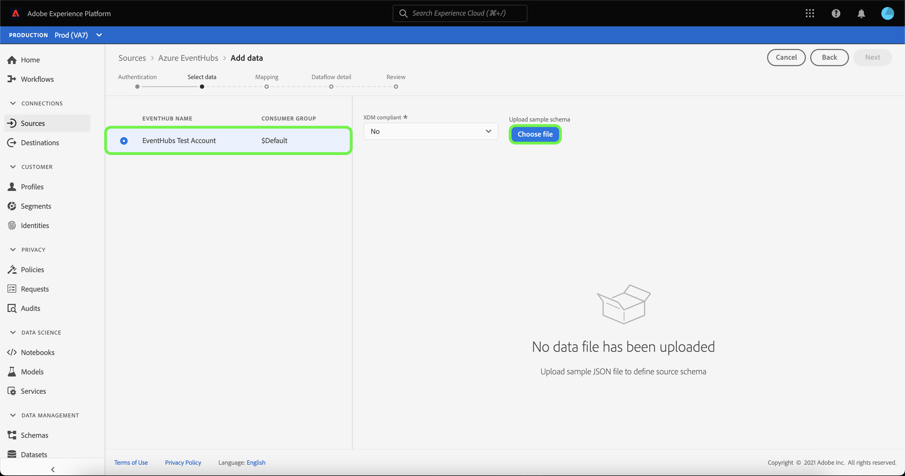

# 在UI中為雲儲存源建立流資料流

資料流是從源中檢索資料並將資料接收到Adobe Experience Platform資料集的計畫任務。 本教程提供了在UI中為雲儲存源建立流資料流的步驟。

在嘗試本教程之前，必須先在雲儲存帳戶和平台之間建立有效且經過身份驗證的連接。 如果尚未經過驗證的連接，請參閱以下教程之一以瞭解有關驗證流式雲儲存帳戶的資訊：

- [[!DNL Amazon Kinesis]](../../../ui/create/cloud-storage/kinesis.md)
- [[!DNL Azure Event Hubs]](../../../ui/create/cloud-storage/eventhub.md)
- [[!DNL Google PubSub]](../../../ui/create/cloud-storage/google-pubsub.md)

## 快速入門

本教程需要對Adobe Experience Platform的以下部分進行有效的理解：

- [資料流](../../../../../dataflows/home.md):資料流是跨平台移動資料的資料作業的表示形式。 資料流是跨從源到 [!DNL Identity Service]。 [!DNL Profile], [!DNL Destinations]。
- [資料準備](../../../../../data-prep/home.md):資料準備允許資料工程師將資料映射到體驗資料模型(XDM)並驗證資料。 資料準備在資料接收流程中顯示為「映射」步驟，包括CSV接收工作流。
- [[!DNL Experience Data Model (XDM)] 系統](../../../../../xdm/home.md):標準化框架 [!DNL Experience Platform] 組織客戶體驗資料。
   - [架構組合的基礎](../../../../../xdm/schema/composition.md):瞭解XDM架構的基本構建基塊，包括架構組成中的關鍵原則和最佳做法。
   - [架構編輯器教程](../../../../../xdm/tutorials/create-schema-ui.md):瞭解如何使用架構編輯器UI建立自定義架構。
- [[!DNL Real-Time Customer Profile]](../../../../../profile/home.md):基於來自多個源的聚合資料提供統一、即時的用戶配置檔案。

## 添加資料

在建立對流雲儲存帳戶進行身份驗證後， **[!UICONTROL 選擇資料]** 步驟，提供介面以選擇將帶到平台的資料流。

- 介面的左側部分是一個瀏覽器，允許您查看帳戶中的可用資料流；
- 該介面的右部分允許您從JSON檔案預覽多達100行的資料。

選擇要使用的資料流，然後選擇 **[!UICONTROL 選擇檔案]** 上載示例架構。

>[!TIP]
>
>如果資料符合XDM標準，則可以跳過上載示例架構，然後選擇 **[!UICONTROL 下一個]** 繼續。

上載架構後，預覽介面將更新以顯示已上載架構的預覽。 預覽介面允許您檢查檔案的內容和結構。 您還可以使用 [!UICONTROL 搜索欄位] 用於從架構中訪問特定項的實用程式。

完成後，選擇 **[!UICONTROL 下一個]**。

## 映射

的 **[!UICONTROL 映射]** 步驟，提供將源資料映射到平台資料集的介面。

為要接收到的入站資料選擇資料集。 可以使用現有資料集或建立新資料集。

### 新資料集

要將資料插入新資料集，請選擇 **[!UICONTROL 新資料集]** 並在提供的欄位中輸入資料集的名稱和說明。 要添加方案，可以在 **[!UICONTROL 選擇架構]** 對話框。 或者，可以選擇 **[!UICONTROL 架構高級搜索]** 以搜索適當的架構。

的 [!UICONTROL 選擇架構] 的子例行程式。 從清單中選擇一個方案以更新右欄以顯示所選方案的特定詳細資訊，包括是否為 [!DNL Profile]。

確定並選擇要使用的架構後，選擇 **[!UICONTROL 完成]**。

的 [!UICONTROL 目標資料集] 頁面更新，其中所選架構顯示為資料集的一部分。 在此步驟中，您可以為 [!DNL Profile] 並建立實體屬性和行為的整體視圖。 來自所有已啟用的資料集的資料將包含在 [!DNL Profile] 並在保存資料流時應用更改。

切換 **[!UICONTROL 配置檔案資料集]** 按鈕啟用目標資料集 [!DNL Profile]。

### 現有資料集

要將資料插入現有資料集，請選擇 **[!UICONTROL 現有資料集]**，然後選擇資料集表徵圖。

的 **[!UICONTROL 選擇資料集]** 對話框，為您提供可供選擇的可用資料集清單。 從清單中選擇資料集以更新右欄以顯示特定於所選資料集的詳細資訊，包括是否可為 [!DNL Profile]。

確定並選擇要使用的資料集後，選擇 **[!UICONTROL 完成]**。

選擇資料集後，選擇 [!DNL Profile] 切換為 [!DNL Profile]。

### 映射標準欄位

建立資料集和架構後， **[!UICONTROL 映射標準欄位]** 介面，允許您手動配置資料的映射欄位。

>[!TIP]
>
>平台根據您選擇的目標架構或資料集為自動映射欄位提供智慧建議。 您可以手動調整映射規則以適合您的使用情形。

根據您的需要，您可以選擇直接映射欄位，或使用資料準備函式轉換源資料以導出計算值或計算值。 有關使用映射器介面和計算欄位的全面步驟，請參見 [資料準備UI指南](../../../../../data-prep/ui/mapping.md)。

映射源資料後，選擇 **[!UICONTROL 下一個]**。

## 資料流詳細資訊

的 **[!UICONTROL 資料流詳細資訊]** 步驟，使您可以命名並簡要描述新資料流。

為資料流提供值並選擇 **[!UICONTROL 下一個]**。

### 請檢閱

的 **[!UICONTROL 審閱]** 步驟，允許您在建立新資料流之前查看它。 詳細資訊按以下類別分組：

- **[!UICONTROL 連接]**:顯示您的帳戶名、源類型以及特定於您正在使用的流式雲儲存源的其他雜項資訊。
- **[!UICONTROL 分配資料集和映射欄位]**:顯示您用於資料流的目標資料集和方案。

查看資料流後，選擇 **[!UICONTROL 完成]** 並為建立資料流留出一些時間。

## 監視並刪除資料流

建立流雲儲存資料流後，您可以監視通過它接收的資料。 有關監視和刪除流資料流的詳細資訊，請參見上的教程 [監視流資料流](../../monitor-streaming.md)。

## 後續步驟

按照本教程，您已成功建立了資料流，以從雲儲存源流資料。 現在，下游平台服務(如 [!DNL Real-Time Customer Profile] 和 [!DNL Data Science Workspace]。 有關詳細資訊，請參閱以下文檔：

- [[!DNL Real-Time Customer Profile] 概覽](../../../../../profile/home.md)
- [[!DNL Data Science Workspace] 概覽](../../../../../data-science-workspace/home.md)