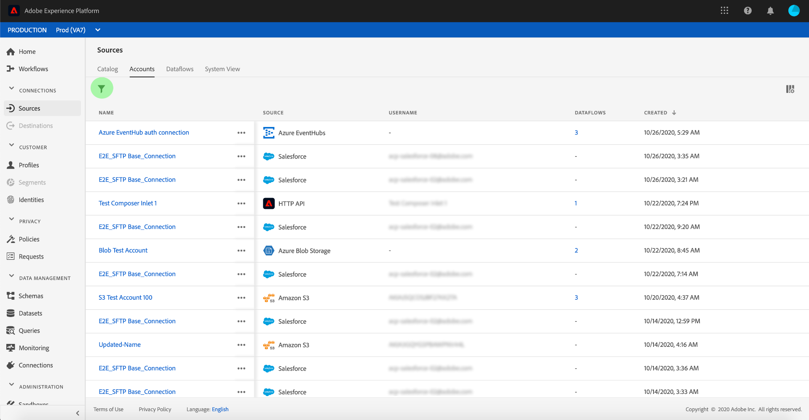

# 刪除來源連線帳戶

Adobe Experience Platform中的Source聯結器可讓您依排程擷取外部來源資料。 本教學課程提供從&#x200B;**[!UICONTROL 來源]**&#x200B;工作區刪除帳戶的步驟。

## 快速入門

本教學課程需要您實際瞭解下列Adobe Experience Platform元件：

- [[!DNL Experience Data Model (XDM)] 系統](../../../xdm/home.md)： [!DNL Experience Platform]用來組織客戶體驗資料的標準化架構。
   - [結構描述組合的基本概念](../../../xdm/schema/composition.md)：瞭解XDM結構描述的基本建置區塊，包括結構描述組合中的關鍵原則和最佳實務。
   - [結構描述編輯器教學課程](../../../xdm/tutorials/create-schema-ui.md)：瞭解如何使用結構描述編輯器使用者介面建立自訂結構描述。
- [[!DNL Real-Time Customer Profile]](../../../profile/home.md)：根據來自多個來源的彙總資料，提供統一的即時消費者設定檔。

## 使用UI刪除帳戶

>[!TIP]
>
>在刪除來源帳戶之前，您必須先刪除與來源帳戶關聯的任何現有資料流。 若要刪除現有的資料流，請參閱有關[在UI](./delete.md)中刪除來源資料流的教學課程。

登入[Adobe Experience Platform](https://platform.adobe.com)，然後從左側導覽列中選取&#x200B;**[!UICONTROL 來源]**&#x200B;以存取&#x200B;**[!UICONTROL 來源]**&#x200B;工作區。 **[!UICONTROL 目錄]**&#x200B;畫面會顯示各種來源，您可利用這些來源建立帳戶和資料流。 每個來源會顯示與其相關聯的現有帳戶和資料流數量。

選取&#x200B;**[!UICONTROL 帳戶]**&#x200B;以存取&#x200B;**[!UICONTROL 帳戶]**&#x200B;頁面。

現有帳戶的清單隨即顯示。 此頁面列出現有帳戶（例如來源、使用者名稱、關聯的資料流和建立日期）的可排序資訊。 選取左上方的&#x200B;**漏斗圖示**&#x200B;以排序。

排序面板會顯示在畫面左側，其中包含可用來源清單。 您可以使用排序功能選取多個來源。

選取您要存取的來源，並從主介面的帳戶清單中找出您要刪除的帳戶。 在此範例中，選取的來源為&#x200B;**[!DNL Azure Blob Storage]**，帳戶名稱為&#x200B;**[!UICONTROL blobTestConnector]**。 從排序面板中選取多個來源時，您最近建立的帳戶會先出現，因為清單是依建立日期排序。

選取您要刪除的帳戶。

**[!UICONTROL 屬性]**&#x200B;面板會出現在熒幕的右側，其中包含有關所選帳戶的資訊。

選取您要刪除之帳戶名稱旁的省略符號(`...`)。 出現快顯面板，提供&#x200B;**[!UICONTROL 新增資料]**、**[!UICONTROL 編輯詳細資料]**&#x200B;和&#x200B;**[!UICONTROL 刪除]**&#x200B;的選項。 選取&#x200B;**[!UICONTROL 刪除]**&#x200B;以刪除帳戶。

最後確認對話方塊出現，選取&#x200B;**[!UICONTROL 刪除]**&#x200B;以完成程式。

## 後續步驟

依照此教學課程，您已成功使用&#x200B;**[!UICONTROL 來源]**&#x200B;工作區刪除現有帳戶。

如需有關如何使用[!DNL Flow Service] API以程式設計方式執行這些操作的步驟，請參閱有關使用流程服務API ](../../tutorials/api/delete.md)刪除連線的教學課程[
