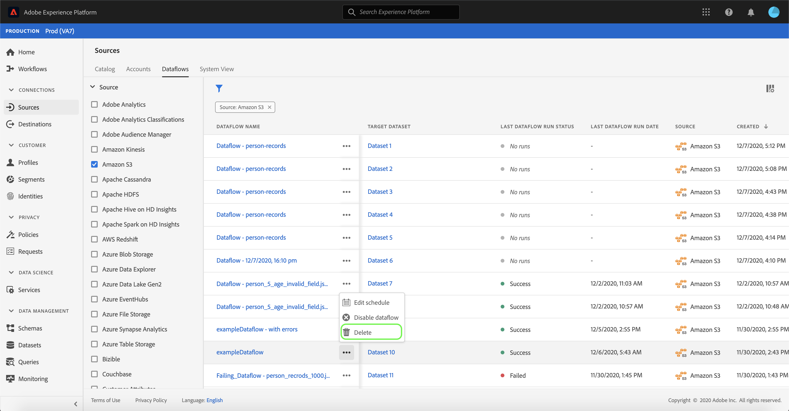

# 刪除UI中的資料流

的 [!UICONTROL 源] 工作區允許您刪除包含錯誤或已過時的現有批處理和流資料流。

本教程提供了使用 [!UICONTROL 源] 工作區。

## 快速入門

本教程需要對Adobe Experience Platform的以下部分進行有效的理解：

- [源](../../home.md): [!DNL Experience Platform] 允許從各種源接收資料，同時讓您能夠使用 [!DNL Platform] 服務。
- [沙箱](../../../sandboxes/home.md): [!DNL Experience Platform] 提供虛擬沙箱，將單個沙箱 [!DNL Platform] 實例到獨立的虛擬環境，以幫助開發和發展數字型驗應用程式。

## 刪除資料流

在 [Experience PlatformUI](https://platform.adobe.com)選中 **[!UICONTROL 源]** 從左側導航 [!UICONTROL 源] 工作區，然後選擇 **[!UICONTROL 資料流]** 的下界。

的 **[!UICONTROL 資料流]** 的子菜單。 此頁上是可查看資料流的清單，包括有關其目標資料集、源、帳戶名和建立日期的資訊。

選擇篩選器表徵圖()以啟動排序面板。

排序面板提供所有源的清單。 您可以從清單中選擇多個源，以訪問與所選特定源關聯的篩選的資料流選擇。

選擇要使用的源，以查看其現有資料流的清單。 確定要刪除的資料流後，選取橢圓(`...`)。

此時將出現一個下拉菜單，為您提供了編輯資料流計畫、禁用資料流或將其完全刪除的選項。

選擇 **[!UICONTROL 刪除]** 刪除資料流。

此時將顯示最終確認對話框。 選擇 **[!UICONTROL 刪除]** 來完成此過程。

幾分鐘後，螢幕底部將出現一個確認框以確認成功刪除。

## 後續步驟

按照本教程，您已成功使用 [!UICONTROL 源] 工作區以刪除現有資料流。

請參閱上的教程 [使用流服務API刪除資料流](../../tutorials/api/delete-dataflows.md) 有關如何使用API調用以寫程式方式執行這些操作的步驟。
