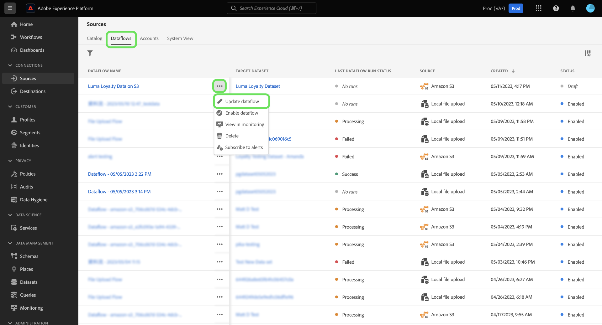
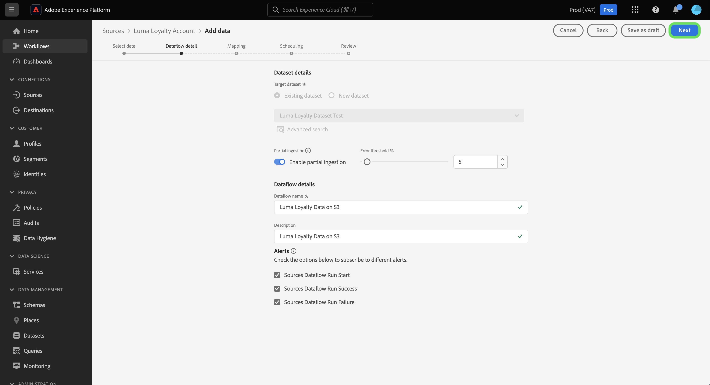

# UI中的資料流草稿

通過將資料流設定為草稿狀態，保存未完成的資料接收工作流進度。 您可以稍後恢復並完成起草的資料流。

本文檔提供了使用Adobe Experience PlatformUI中的源工作區時如何保存資料流的步驟。

## 快速入門

本檔案要求對Adobe Experience Platform的下列構成部分有工作上的理解：

* [源](../../home.md):Experience Platform允許從各種源接收資料，同時讓您能夠使用平台服務構建、標籤和增強傳入資料。

## 將資料流另存為草稿

在選擇要引入平台的資料後，可以隨時暫停資料流建立進度。

例如，如果要在資料流詳細資訊步驟期間保存進度，請選擇 **[!UICONTROL 另存為草稿]**。

保存草稿後，您將被帶到帳戶的頁面，在該頁面中可以查看現有資料流的清單，包括草稿。

>[!TIP]
>
>將不啟用起草的資料流，並將其狀態設定為 `draft`。

要在拔模上繼續，請選取橢圓(`...`)旁邊，然後選擇 **[!UICONTROL 更新資料流]**。

>[!NOTE]
>
>如果您的草稿包含計畫資訊，則下拉窗口還將提供 **[!UICONTROL 編輯計畫]**。

### 從源目錄訪問草稿

您還可以通過資料流目錄訪問草稿資料流。 選擇 **[!UICONTROL 資料流]** 訪問資料流目錄。 從此處，從組織中現有資料流的清單中查找草稿，選擇省略號(`...`)旁邊，然後選擇 **[!UICONTROL 更新資料流]**。

## 發佈草稿資料流

您返回 [!UICONTROL 添加資料] 源工作流的步驟，在此可以重新確認資料的格式並繼續處理資料流。

確認資料的格式、分隔符和壓縮類型後，選擇 **[!UICONTROL 下一個]** 繼續。

接下來，確認資料流詳細資訊。 使用資料流詳細資訊介面更新圍繞資料流名稱、說明、部分接收、錯誤診斷設定和警報首選項的配置。

完成配置後，選擇 **[!UICONTROL 下一個]** 繼續。

的 [!UICONTROL 映射] 的上界。 在此步驟中，可以重新配置資料流的映射配置。 有關用於映射的資料準備功能的全面指南，請訪問 [資料準備UI指南](../../../data-prep/ui/mapping.md)。

完成映射重新配置後，選擇 **[!UICONTROL 下一個]** 繼續。

使用 [!UICONTROL 計畫] 步驟，為資料流建立接收計畫。 你可以將你的攝食頻率 `once`。 `minute`。 `hour`。 `day`或 `week`。 完成後，選擇 **[!UICONTROL 下一個]** 繼續。

最後，查看資料流的詳細資訊，然後選擇 **[!UICONTROL 完成]** 發佈草稿。

保存並發佈草稿後，將啟用資料流，您將無法再將其重置為草稿。

## 後續步驟

通過學習本教程，您已學習如何保存進度並將資料流設定為草稿。 有關來源的詳細資訊，請訪問 [源概述](../../home.md)。