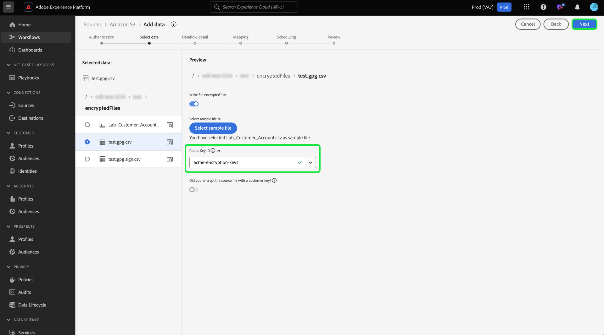

# 將加密資料內嵌在來源UI中

>[!AVAILABILITY]
>
>Beta版支援來源UI中的加密資料擷取。 功能和檔案可能會有所變更。

您可以使用雲端儲存批次來源，將加密的資料檔案和資料夾擷取到Adobe Experience Platform。 透過加密的資料擷取，您可以運用非對稱加密機制，將批次資料安全地傳輸至Experience Platform。 支援的非對稱加密機製為PGP和GPG。

閱讀本指南，瞭解如何使用UI將加密資料與雲端儲存批次來源一起內嵌。

## 快速入門

在繼續本教學課程之前，請閱讀以下檔案，以更加瞭解以下Experience Platform功能和概念。

* [來源](../../home.md)：在Experience Platform中使用來源，從Adobe應用程式或協力廠商資料來源擷取資料。
* [資料流](../../../dataflows/home.md)：資料流是跨Experience Platform行動資料的資料作業的表示法。 您可以使用來源工作區建立資料流程，將指定來源的資料擷取至Experience Platform。
* [沙箱](../../../sandboxes/home.md)：在Experience Platform中使用沙箱，在您的Experience Platform執行個體之間建立虛擬分割區，並建立專用於開發或生產的環境。

### 高階大綱

* 使用Experience Platform UI中的來源工作區來建立加密金鑰組。
   * 或者，您也可以建立自己的簽署驗證金鑰組，為您的加密資料提供額外的安全層。
* 使用加密金鑰組中的公開金鑰來加密資料。
* 將加密的資料放入雲端儲存空間。 在此步驟中，您也必須確保在雲端儲存空間中有資料的範例檔案，可作為參考，將您的來源資料對應至體驗資料模型(XDM)結構描述。
* 使用您的雲端儲存批次來源，並在Experience Platform UI的來源工作區中開始資料擷取程式。
* 在建立來源連線的過程中，請提供與您用來加密資料的公開金鑰對應的金鑰ID。
   * 如果您也使用簽署驗證金鑰配對機制，則您也必須提供對應至加密資料的簽署驗證金鑰ID。
* 繼續進行資料流建立步驟。

## 建立加密金鑰對 {#create-an-encryption-key-pair}

>[!CONTEXTUALHELP]
>id="platform_sources_encrypted_encryptionKeyId"
>title="加密金鑰 ID"
>abstract="提供加密金鑰 ID，且此 ID 必須與用來加密來源資料的加密金鑰對應。"

>[!BEGINSHADEBOX]

**什麼是加密金鑰組？**

加密金鑰組是一種非對稱的加密機制，由公開金鑰和私密金鑰組成。 公開金鑰用來加密資料，而私密金鑰則用來解密所述資料。

您可以透過Experience Platform UI建立您的加密金鑰組。 產生後，您將會收到公開金鑰和對應的金鑰ID。 使用公開金鑰來加密資料，然後在您正在擷取加密資料時，使用金鑰ID來確認您的身分。 私密金鑰會自動傳送至Experience Platform，並儲存在安全的儲存庫中，且只有當資料準備好解密時，才會使用。

>[!ENDSHADEBOX]

在Experience Platform UI中，導覽至來源工作區，然後從頂端標題中選取[!UICONTROL 索引鍵配對]。

系統會將您帶到一個頁面，其中顯示貴組織中現有加密金鑰組的清單。 此頁面提供指定金鑰的標題、ID、型別、加密演演算法、到期日和狀態的資訊。 若要建立新的金鑰組，請選取&#x200B;**[!UICONTROL 建立金鑰]**。

接著，選擇您要建立的金鑰型別。 若要建立加密金鑰，請選取&#x200B;**[!UICONTROL 加密金鑰]**，然後選取&#x200B;**[!UICONTROL 繼續]**。

提供加密金鑰的標題和複雜密碼。 複雜密碼是加密金鑰的額外保護層。 建立後，Experience Platform會將複雜密碼與公開金鑰儲存在不同的安全儲存庫中。 您必須提供非空白字串作為複雜密碼。 完成後，選取&#x200B;**[!UICONTROL 建立]**。

如果成功，會出現新視窗，顯示您的新加密金鑰，包括其標題、公開金鑰和金鑰ID。 使用公開金鑰值來加密資料。 您將在後續步驟中使用金鑰ID，以在資料流建立過程中擷取加密資料時證明您的身分。

若要檢視現有加密金鑰的相關資訊，請選取金鑰標題旁的省略符號(`...`)。 選取&#x200B;**[!UICONTROL 金鑰詳細資料]**&#x200B;以檢視公開金鑰和金鑰識別碼。 或者，如果您要刪除加密金鑰，請選取&#x200B;**[!UICONTROL 刪除]**。

### 建立簽章驗證金鑰 {#create-a-sign-verification-key}

>[!CONTEXTUALHELP]
>id="platform_sources_encrypted_signVerificationKeyId"
>title="簽章驗證金鑰 ID"
>abstract="提供與您已簽署的加密來源資料對應的簽章驗證金鑰 ID。"

>[!BEGINSHADEBOX]

**什麼是簽署驗證金鑰？**

簽章驗證金鑰是另一種涉及私密金鑰與公開金鑰的加密機制。 在這種情況下，您可以建立您的簽署驗證金鑰組，並使用私密金鑰來簽署並提供額外的資料加密層。 然後，您會將對應的公開金鑰共用至Experience Platform。 在內嵌期間，Experience Platform將使用公開金鑰來驗證與您的私密金鑰相關的簽名。

>[!ENDSHADEBOX]

若要建立簽署驗證金鑰，請從金鑰型別選取視窗中選取&#x200B;**[!UICONTROL 簽署驗證金鑰]**，然後選取&#x200B;**[!UICONTROL 繼續]**。

接下來，提供標題和[!DNL Base64]編碼的PGP金鑰作為您的公開金鑰，然後選取&#x200B;**[!UICONTROL 建立]**。

如果成功，會出現一個新視窗，顯示您的新簽名驗證金鑰，包括其標題和金鑰ID。

## 收錄加密的資料 {#ingest-encrypted-data}

>[!CONTEXTUALHELP]
>id="platform_sources_encrypted_isFileEncrypted"
>title="檔案是否已加密？"
>abstract="如果您正在收錄加密的檔案，請選取此開關。"

>[!CONTEXTUALHELP]
>id="platform_sources_encrypted_sampleFile"
>title="選取範例檔案"
>abstract="在收錄加密的資料時，您必須收錄範例檔案才能建立對應。"

您可以使用以下雲端儲存批次來源內嵌加密的資料：

* [[!DNL Amazon S3]](../ui/create/cloud-storage/s3.md)
* [[!DNL Azure Blob]](../ui/create/cloud-storage/blob.md)
* [[!DNL Azure Data Lake Storage Gen2]](../ui/create/cloud-storage/adls-gen2.md)
* [[!DNL Azure File Storage]](../ui/create/cloud-storage/azure-file-storage.md)
* [[!DNL Data Landing Zone]](../ui/create/cloud-storage/data-landing-zone.md)
* [[!DNL FTP]](../ui/create/cloud-storage/ftp.md)
* [[!DNL Google Cloud Storage]](../ui/create/cloud-storage/google-cloud-storage.md)
* [[!DNL HDFS]](../ui/create/cloud-storage/hdfs.md)
* [[!DNL Oracle Object Storage]](../ui/create/cloud-storage/oracle-object-storage.md)
* [[!DNL SFTP]](../ui/create/cloud-storage/sftp.md)

使用您選擇的雲端儲存空間來源進行驗證。 在工作流程的資料選取步驟中，選取要擷取的加密檔案或資料夾，然後啟用&#x200B;**[!UICONTROL 檔案是否已加密]**&#x200B;切換按鈕。

接著，從來源資料中選取範例檔案。 由於您的資料已加密，Experience Platform將需要範例檔案來建立可對應至您的來源資料的XDM結構描述。

選取範例檔案後，請設定資料的設定，例如其對應的資料格式、分隔符號和壓縮型別。 允許預覽介面完全呈現一段時間，然後選取&#x200B;**[!UICONTROL 儲存]**。

從這裡，使用下拉式選單選取公開金鑰ID的公開金鑰標題，其會對應到您用來加密資料的公開金鑰。

如果您也使用簽署驗證金鑰組來提供額外的加密層，然後啟用簽署驗證金鑰切換，接著以類似方式使用下拉式清單選取與您用來加密資料的金鑰對應的簽署驗證金鑰ID。

完成時，選取&#x200B;**[!UICONTROL 下一步]**。

完成來源工作流程中的其餘步驟，以完成資料流程的建立。

* [提供資料流和資料集詳細資訊](../ui/dataflow/batch/cloud-storage.md#provide-dataflow-details)
* [將來源資料對應至XDM結構描述](../ui/dataflow/batch/cloud-storage.md#map-data-fields-to-an-xdm-schema)
* [設定資料流的擷取排程](../ui/dataflow/batch/cloud-storage.md#schedule-ingestion-runs)
* [檢閱您的資料流](../ui/dataflow/batch/cloud-storage.md#review-your-dataflow)

您可以在資料流[&#128279;](../ui/update-dataflows.md)成功建立後，繼續進行更新。

## 後續步驟

閱讀本檔案後，您現在可以從雲端儲存空間批次來源將加密資料擷取到Experience Platform。 如需有關如何使用API擷取加密資料的資訊，請參閱[使用 [!DNL Flow Service] API](../api/encrypt-data.md)擷取加密資料的指南。 如需Experience Platform來源的一般資訊，請閱讀[來源概觀](../../home.md)。
