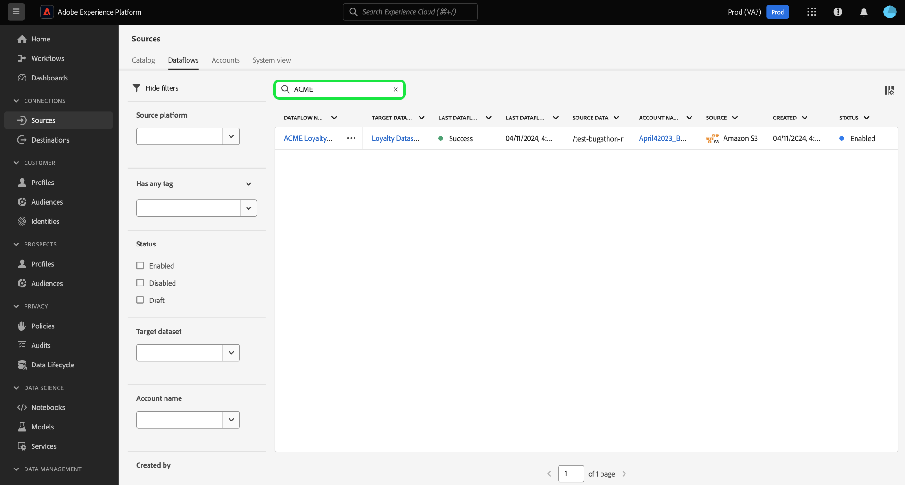

# 在UI中篩選來源物件

使用Adobe Experience Platform使用者介面中的篩選、搜尋和內嵌動作工具，簡化您在[!UICONTROL 來源]工作區中的工作流程

* 使用篩選和搜尋功能，在組織中的來源帳戶和資料流中導覽。
* 使用內嵌動作來修改套用至資料流的組態設定，並改善組織工作流程。 您可以使用內嵌動作來套用標籤、設定警示或依需求建立內嵌工作。

## 快速入門

在來源工作區中使用物件導覽工具之前，先瞭解下列Experience Platform功能和概念會很有幫助：

* [來源](../../home.md)：在Experience Platform中使用來源，從Adobe應用程式或協力廠商資料來源擷取資料。
* [管理標籤](../../../administrative-tags/overview.md)：使用管理標籤將中繼資料關鍵字套用至您的物件，並啟用搜尋功能，以便在Experience Platform生態系統中尋找該物件。
* [警報](../../../observability/home.md)：使用警報接收通知，這些通知提供物件狀態（例如您的來源資料流）的更新。
* [資料流](../../../dataflows/home.md)：資料流是跨Experience Platform行動資料的資料作業的表示法。 您可以使用來源工作區建立資料流程，將指定來源的資料擷取至Experience Platform。
* [資料集](../../../catalog/datasets/user-guide.md)：資料集是資料集合的儲存和管理結構，通常是包含結構描述（欄）和欄位（列）的表格。
* [沙箱](../../../sandboxes/home.md)：在Experience Platform中使用沙箱，在您的Experience Platform執行個體之間建立虛擬分割區，並建立專用於開發或生產的環境。

## 篩選來源資料流 {#filter-sources-dataflows}

在Experience PlatformUI中，在左側導覽中選取&#x200B;**[!UICONTROL 來源]**，然後從頂端標題中選取&#x200B;**[!UICONTROL 資料流程]**。

依預設，篩選功能表會顯示在介面的左側。 若要隱藏功能表，請選取&#x200B;**[!UICONTROL 隱藏篩選器]**。

您可以依下列引數篩選來源資料流程：

| 篩選器 | 說明 |
| --- | --- |
| [Source平台](#filter-dataflows-by-source-platform) | 根據資料流建立的來源篩選資料流。 |
| [標記](#filter-dataflows-by-tags) | 根據套用至資料流的標籤來篩選資料流。 |
| [狀態](#filter-dataflows-by-status) | 根據資料流的目前狀態來篩選資料流。 |
| [目標資料集](#filter-dataflows-by-target-dataset) | 根據資料流建立時所用的目標資料集篩選資料流。 |
| [帳戶名稱](#filter-dataflows-by-account-name) | 根據資料流對應的帳戶名稱篩選資料流。 |
| [建立者：](#filter-dataflows-by-user) | 根據資料流的建立者篩選資料流。 |
| [建立日期](#filter-dataflows-by-creation-date) | 根據資料流的建立日期篩選資料流。 |
| [修改日期](#filter-dataflows-by-modification-date) | 根據資料流的上次更新日期篩選資料流。 |

### 依來源平台篩選資料流 {#filter-dataflows-by-source-platform}

使用[!UICONTROL Source平台]面板，依來源型別篩選您的資料流。 您可以輸入特定來源，或使用下拉式選單來檢視目錄中的來源清單。 您也可以篩選指定查詢的多個不同來源。 例如，您可以選取[!DNL Amazon S3]、[!DNL Azure Data Lake Storage Gen2]和[!DNL Google Cloud Storage]來更新目錄，並僅顯示使用選取的來源建立的資料流。

### 依標籤篩選資料流 {#filter-dataflows-by-tags}

使用「標籤」面板，依其各自的標籤篩選您的資料流。

選取&#x200B;**[!UICONTROL 具有任何標籤]**，然後使用下拉式功能表選取您要篩選的標籤。 使用此設定來篩選具有任何您選取之標籤的資料流。

選取&#x200B;**[!UICONTROL 具有所有標籤]**，然後使用下拉式功能表選取您要篩選的標籤。 使用此設定來篩選具有您選取之所有標籤的資料流。

### 依狀態篩選資料流程 {#filter-dataflows-by-status}

您可以使用[!UICONTROL 狀態]面板依狀態篩選。

| 狀態 | 說明 |
| --- | --- |
| 啟用 | 選取&#x200B;**[!UICONTROL 已啟用]**&#x200B;以篩選檢視並僅顯示作用中的資料流。 |
| 停用 | 選取&#x200B;**[!UICONTROL 已停用]**&#x200B;以篩選檢視並僅顯示已停用的資料流。 |
| 草稿 | 選取&#x200B;**[!UICONTROL 草稿]**&#x200B;以篩選檢視並僅顯示草稿模式的資料流。 |

### 依目標資料集篩選資料流 {#filter-dataflows-by-target-dataset}

選取&#x200B;**[!UICONTROL 目標資料集]**&#x200B;以存取所有目標資料集的下拉式功能表。 然後，選取目標資料集以篩選檢視，並僅顯示使用您指定的目標資料集建立的資料流。

### 依帳戶名稱篩選資料流 {#filter-dataflows-by-account-name}

選取&#x200B;**[!UICONTROL 帳戶名稱]**&#x200B;以存取所有帳戶的下拉式功能表。 然後，選取要篩選檢視的帳戶，並顯示所選帳戶建立的資料流。

### 依使用者篩選資料流 {#filter-dataflows-by-user}

使用「[!UICONTROL 建立者]」面板，依建立或上次更新資料流程的使用者來篩選資料流程。 選取下拉式清單，然後選取使用者名稱，以篩選您的資料流。

### 依建立日期篩選資料流程 {#filter-dataflows-by-creation-date}

您可以依資料流的建立日期來篩選資料流。 在[!UICONTROL 建立日期]面板中，設定開始日期和結束日期以建立時間範圍視窗，並篩選檢視以僅顯示在該視窗中建立的資料流。

您可以輸入開始和結束日期來設定時間範圍。 或者，選取行事曆圖示並使用行事曆設定日期。

您也可以遵循相同的步驟，但依資料流的最後修改日期（而不是其建立日期）來篩選資料流。

### 依修改日期篩選資料流 {#filter-dataflows-by-modification-date}

同樣地，您可以套用相同原則，並根據資料流的修改日期篩選資料流。 使用&#x200B;**[!UICONTROL 修改日期]**&#x200B;來設定特定的時間範圍，並篩選檢視以僅顯示在該期間已修改的資料流。

### 合併篩選器 {#combine-filters}

您可以結合不同的篩選器以擴大或縮小搜尋。 在以下範例中，會套用篩選器以搜尋：

* 使用[!DNL Amazon S3]來源建立的資料流。
* 包含&#x200B;**[!DNL ACME]**&#x200B;標籤的資料流。
* 目前啟用的資料流。
* 使用[!DNL Loyalty Dataset B2C]資料集建立的資料流。
* 在2024年4月1日到2024年4月19日之間建立的資料流。

若要移除所有篩選器，請選取&#x200B;**[!UICONTROL 全部清除]**。

## 篩選來源帳戶 {#filter-sources-accounts}

在Experience PlatformUI中，在左側導覽中選取[!UICONTROL 來源]，然後從頂端標題中選取&#x200B;**[!UICONTROL 帳戶]**。 您可以根據建立來源帳戶的來源或建立來源帳戶的使用者來篩選來源帳戶。

## 搜尋帳戶和資料流 {#search-for-accounts-and-dataflows}

您可以使用搜尋列立即導覽至特定帳戶或資料流，以加快效率。

>[!BEGINTABS]

>[!TAB 搜尋資料流]

使用[!UICONTROL 資料流]頁面中的搜尋列來尋找特定資料流。 您可以使用資料流的名稱或說明來搜尋資料流。

>[!TAB 搜尋帳戶]

使用[!UICONTROL 帳戶]頁面中的搜尋列來尋找特定帳戶。 您可以使用帳戶名稱或說明來搜尋帳戶。

>[!ENDTABS]

## 來源資料流程的內嵌動作 {#inline-actions-for-sources-dataflows}

選取資料流名稱旁的省略符號(`...`)，以取得可用來修改資料流的內嵌動作清單。

| 內嵌動作 | 說明 |
| --- | --- |
| [!UICONTROL 編輯排程] | 選取&#x200B;**[!UICONTROL 編輯排程]**&#x200B;以更新資料流的擷取排程。 無法編輯已設定為一次性內嵌的資料流。 |
| [!UICONTROL 停用資料流] | 選取&#x200B;**[!UICONTROL 停用資料流]**&#x200B;以停用資料流執行。 此選項不會刪除您的資料流。 |
| [!UICONTROL 正在監視中檢視] | 選取&#x200B;**[!UICONTROL 在監視中檢視]**&#x200B;以在監視儀表板中檢視資料流的度量和狀態。 如需詳細資訊，請閱讀[監視來源資料流](../../../dataflows/ui/monitor-sources.md)的指南。 |
| [!UICONTROL 刪除] | 選取&#x200B;**[!UICONTROL 刪除]**&#x200B;以刪除您的資料流。 |
| [!UICONTROL 隨選執行] | 選取&#x200B;**[!UICONTROL 隨選執行]**&#x200B;以觸發資料流執行的單一反複專案。 如需詳細資訊，請參閱[建立隨選資料流執行](../ui/on-demand-ingestion.md)的指南。 |
| [!UICONTROL 訂閱警示] | 選取&#x200B;**[!UICONTROL 訂閱警示]**&#x200B;以檢視可訂閱警示的快顯視窗： <ul><li>來源資料流執行開始：選取此警示可在您的隨選資料流執行開始時接收通知。</li><li>來源資料流執行成功：選取此警示可在您的隨選資料流執行成功完成時收到通知。</li><li>來源資料流執行失敗：當您的隨選資料流執行因錯誤而失敗時，請選取此警示。</li></ul> 如需詳細資訊，請閱讀[訂閱來源資料流警示](../ui/alerts.md)的指南。 |
| [!UICONTROL 新增到封裝] | 選取&#x200B;**[!UICONTROL 新增到封裝]**&#x200B;以將您的資料流新增到封裝，並匯出它以用於不同的沙箱。 在此步驟中，您可以建立新封裝或將資料流新增到現有封裝。 如需詳細資訊，請閱讀[沙箱工具](../../../sandboxes/ui/sandbox-tooling.md)的指南。 |
| [!UICONTROL 管理標籤] | 選取&#x200B;**[!UICONTROL 管理標籤]**&#x200B;以新增或移除資料流中的標籤。 使用標籤來管理中繼資料分類並分類商業物件，以更輕鬆地進行探索和分類。 如需詳細資訊，請閱讀[管理標籤](../../../administrative-tags/ui/managing-tags.md)的指南。 |

## 後續步驟

閱讀本檔案後，您已瞭解如何導覽來源帳戶和資料流頁面。 如需來源的詳細資訊，請閱讀[來源概觀](../../home.md)。
