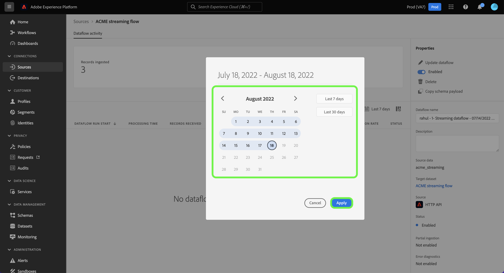

# 在UI中監視串流來源的資料流

本教學課程涵蓋使用監控串流來源資料流的步驟。 [!UICONTROL 來源] 工作區。

## 快速入門

本教學課程需要您實際瞭解下列Adobe Experience Platform元件：

* [資料流](../../../dataflows/home.md)：資料流能呈現資料處理作業在Platform上行動資料的情形。 資料流可跨不同服務進行設定，有助於將資料從來源聯結器移至目標資料集，以及 [!DNL Identity] 和 [!DNL Profile]，並至 [!DNL Destinations].
   * [資料流執行](../../notifications.md)：資料流執行是根據所選資料流的頻率設定而定期排程的工作。
* [來源](../../home.md)：Experience Platform可讓您從各種來源擷取資料，同時使用Platform服務來建構、加標籤及增強傳入資料。
* [沙箱](../../../sandboxes/home.md)：Experience Platform提供的虛擬沙箱可將單一Platform執行個體分割成個別的虛擬環境，以利開發及改進數位體驗應用程式。

## 監控串流來源的資料流

在Platform UI中選取 **[!UICONTROL 來源]** 從左側導覽列存取 [!UICONTROL 來源] 工作區。 此 [!UICONTROL 目錄] 畫面會顯示各種來源，供您建立帳戶。

若要檢視串流來源的現有資料流，請選取「 」 **[!UICONTROL 資料流]** 從頂端標題。

此 [!UICONTROL 資料流] 頁面包含貴組織中所有現有資料流的清單，包括有關其來源資料、帳戶名稱和資料流執行狀態的資訊。

選取您要檢視的資料流名稱。

下表包含資料流執行狀態的詳細資訊：

| 狀態 | 說明 |
| ------ | ----------- |
| 完成 | 此 `Completed` status表示對應資料流執行的所有記錄都在一小時期間內處理。 A `Completed` 在資料流執行中，狀態仍可能包含錯誤。 |
| 成功 | 此 `Success` status表示對應資料流執行的所有記錄都在一小時期間內處理，且在資料流執行期間未遇到任何錯誤。 |
| 正在處理 | 此 `Processing` 狀態表示資料流尚未啟用。 此狀態通常會在建立新資料流後立即發生。 |
| 錯誤 | 此 `Error` 狀態表示資料流程的啟用程式已中斷。 |
| 沒有回合 | 此 `No runs` 狀態表示已建立資料流，但未開始任何資料流執行。 |

此 [!UICONTROL 資料流活動] 頁面會顯示串流資料流的特定資訊。 頂端橫幅包含您所選取日期範圍內所有串流資料流執行的累計擷取記錄和失敗記錄數。

依預設，顯示的資料包含過去七天的擷取率。 選取 **[!UICONTROL 過去7天]** 以調整記錄顯示的時間範圍。

此時會出現一個日曆快顯視窗，為您提供替代擷取時間範圍的選項。 您可以設定資料流執行時間範圍，以檢視過去七天或過去30天的資料流執行。 或者，您可以設定互動式行事曆，以設定自訂的時間範圍。 完成後，選取 **[!UICONTROL 套用]**.

頁面下半部會顯示每個資料流執行中接收、擷取及失敗的記錄數相關資訊。 每個資料流執行都會記錄在一個每小時的時段內。

### 資料流執行量度 {#dataflow-run-metrics}

>[!CONTEXTUALHELP]
>id="platform_sources_dataflow_records_received"
>title="已收到的記錄"
>abstract="已收到的記錄量度會顯示資料流中收到的記錄總計數。"
>text="Learn more in documentation"

>[!CONTEXTUALHELP]
>id="platform_sources_dataflow_records_ingested"
>title="已擷取的記錄"
>abstract="已擷取的記錄量度會顯示擷取至資料湖的記錄總計數。"
>text="Learn more in documentation"

>[!CONTEXTUALHELP]
>id="platform_sources_dataflow_records_failed"
>title="失敗的記錄"
>abstract="失敗的記錄量度會顯示由於資料錯誤而未擷取至資料湖的記錄總計數。"
>text="Learn more in documentation"

>[!CONTEXTUALHELP]
>id="platform_sources_dataflow_records_warnings"
>title="包含警告的記錄"
>abstract="包含警告的記錄會顯示包含對應工具轉換警告的記錄總計數。所有的對應工具轉換錯誤都會通報為警告，部分擷取的列則會被視為包含警告的成功"
>text="Learn more in documentation"

每個個別資料流執行會顯示下列詳細資訊：

* **[!UICONTROL 資料流執行開始]**：資料流執行開始的時間。
* **[!UICONTROL 處理時間]**：資料流處理所花的時間。
* **[!UICONTROL 已接收的記錄]**：資料流中從來源聯結器收到的記錄總數。
* **[!UICONTROL 記錄已擷取]**：擷取到的記錄總數 [!DNL Data Lake].
* **[!UICONTROL 有警告的記錄]**：已擷取含有警告的記錄總數。 所有對應程式轉換錯誤都會回報為警告，而部分擷取的列會標示為 `success` 有警告訊息。 **注意**：擷取含有警告的記錄支援僅適用於串流來源。
* **[!UICONTROL 記錄失敗]**：未擷取的記錄數 [!DNL Data Lake] 因為資料中的錯誤。
* **[!UICONTROL 擷取率]**：擷取到的記錄成功率 [!DNL Data Lake]. 此量度適用於 [!UICONTROL 部分擷取] 已啟用。
* **[!UICONTROL 狀態]**：代表資料流所處的狀態： [!UICONTROL 已完成] 或 [!UICONTROL 處理中]. [!UICONTROL 已完成] 表示對應資料流執行的所有記錄都在一小時內處理。 [!UICONTROL 處理中] 表示資料流執行尚未完成。

此 [!UICONTROL 資料流執行總覽] 頁面包含有關資料流的其他資訊，例如其對應的資料流執行ID、目標資料集和組織ID。

有錯誤的資料流執行也包含 [!UICONTROL 資料流執行錯誤] 面板，顯示導致執行失敗的特定錯誤，以及失敗的記錄總數。

### 檢視含有警告的記錄 {#warnings}

[!UICONTROL 有警告的記錄] 顯示流程執行期間發生的對應程式轉換警告清單。 部分擷取的列會被視為成功，如果發現任何對應程式轉換錯誤，則會附加警告。

依預設，所有對應程式轉換錯誤都會被視為警告，除非它們屬於下列任一情況：

* 語法錯誤
* 對不存在屬性的參照
* XDM資料型別不相符

若要檢視錯誤診斷，請選取 **[!UICONTROL 預覽錯誤診斷]**.

此 [!UICONTROL 錯誤診斷預覽] 視窗可讓您預覽與資料流執行相關的最多100個錯誤和/或警告。 您也可以從此下載內嵌失敗資訊清單，瞭解更多資訊，請使用 [!DNL Data Access] API。

## 後續步驟

依照本教學課程中的指示，您已成功使用 [!UICONTROL 來源] 工作區來監視您的串流資料流，並識別導致任何失敗資料流的錯誤。 如需詳細資訊，請參閱下列檔案：

* [來源概觀](../../home.md)
* [資料流概觀](../../../dataflows/home.md)
