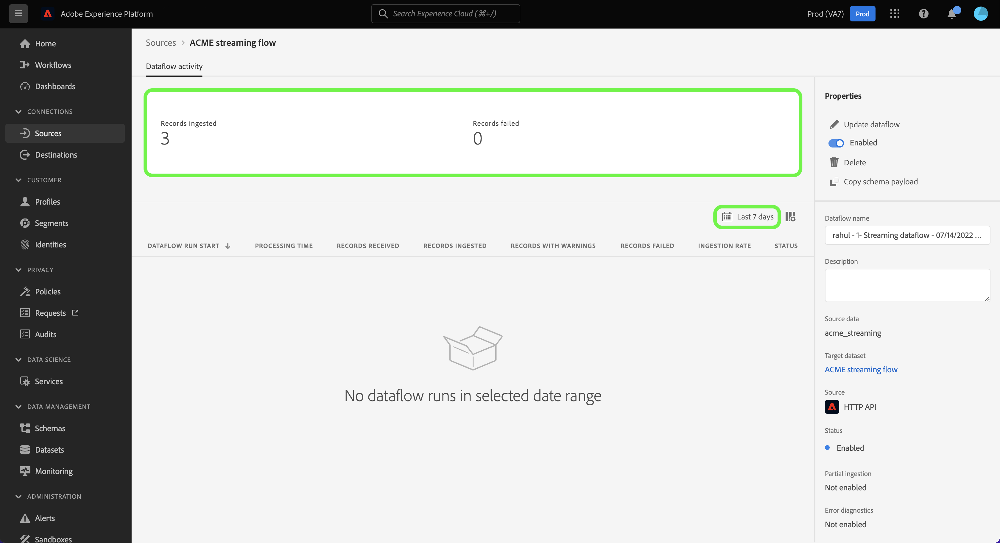

# 在UI中監視流源的資料流

本教學課程涵蓋使用監控串流來源資料流的步驟 [!UICONTROL 來源] 工作區。

## 快速入門

本教學課程需要妥善了解下列Adobe Experience Platform元件：

* [資料流](../../../dataflows/home.md):資料流是跨平台移動資料的資料作業的表示。 資料流可跨不同的服務進行配置，有助於將資料從源連接器移動到目標資料集 [!DNL Identity] 和 [!DNL Profile]和 [!DNL Destinations].
   * [資料流運行](../../notifications.md):資料流運行是基於所選資料流的頻率配置的循環調度作業。
* [來源](../../home.md):Experience Platform可讓您從各種來源擷取資料，同時使用Platform服務來建構、加標籤及增強傳入資料。
* [沙箱](../../../sandboxes/home.md):Experience Platform提供可將單一Platform執行個體分割成個別虛擬環境的虛擬沙箱，以協助開發及改進數位體驗應用程式。

## 監視流源的資料流

在平台UI中，選取 **[!UICONTROL 來源]** 從左側導覽列存取 [!UICONTROL 來源] 工作區。 此 [!UICONTROL 目錄] 畫面會顯示您可以為其建立帳戶的各種來源。

要查看流源的現有資料流，請選擇 **[!UICONTROL 資料流]** 從頂端標題。

此 [!UICONTROL 資料流] 頁包含組織中所有現有資料流的清單，包括有關其源資料、帳戶名和資料流運行狀態的資訊。

選擇要查看的資料流的名稱。

下表包含有關資料流運行狀態的更多資訊：

| 狀態 | 說明 |
| ------ | ----------- |
| 完成 | 此 `Completed` 狀態表示在1小時內處理了相應資料流運行的所有記錄。 A `Completed` 狀態仍可包含資料流運行中的錯誤。 |
| 成功 | 此 `Success` 狀態表示在1小時內處理了相應資料流運行的所有記錄，在資料流運行過程中沒有遇到錯誤。 |
| 正在處理 | 此 `Processing` 狀態表示資料流尚未處於活動狀態。 建立新資料流後，通常會立即出現此狀態。 |
| 錯誤 | 此 `Error` 狀態表示資料流的激活過程已中斷。 |
| 無運行 | 此 `No runs` 狀態表示資料流已建立，但未啟動任何資料流運行。 |

此 [!UICONTROL 資料流活動] 頁顯示流資料流的特定資訊。 頂端橫幅包含所有串流資料流在所選日期範圍內執行時，擷取的記錄數和失敗的記錄數。

依預設，顯示的資料包含過去七天的擷取率。 選擇 **[!UICONTROL 最近7天]** 調整顯示的記錄時間範圍。

此時將出現一個日曆彈出窗口，為您提供可選的獲取時間範圍選項。 您可以配置資料流運行時間範圍，以查看從前七天或最近30天開始運行的流。 或者，您也可以設定互動式日曆，以設定您所選擇的自訂時間範圍。 完成後，請選取 **[!UICONTROL 套用]**.

頁面的下半部顯示每個流程執行所接收、擷取和失敗的記錄數。 每個流運行都記錄在每小時窗口中。

### 資料流運行度量 {#dataflow-run-metrics}

>[!CONTEXTUALHELP]
>id="platform_sources_dataflow_records_received"
>title="已收到的記錄"
>abstract="已收到的記錄量度會顯示資料流中收到的記錄總計數。"
>text="Learn more in documentation"

>[!CONTEXTUALHELP]
>id="platform_sources_dataflow_records_ingested"
>title="已擷取的記錄"
>abstract="已擷取的記錄量度會顯示擷取至資料湖的記錄總計數。"
>text="Learn more in documentation"

>[!CONTEXTUALHELP]
>id="platform_sources_dataflow_records_failed"
>title="失敗的記錄"
>abstract="失敗的記錄量度會顯示由於資料錯誤而未擷取至資料湖的記錄總計數。"
>text="Learn more in documentation"

>[!CONTEXTUALHELP]
>id="platform_sources_dataflow_records_warnings"
>title="包含警告的記錄"
>abstract="包含警告的記錄會顯示包含對應工具轉換警告的記錄總計數。所有的對應工具轉換錯誤都會通報為警告，部分擷取的列則會被視為包含警告的成功"
>text="Learn more in documentation"

每個資料流運行都顯示以下詳細資訊：

* **[!UICONTROL 資料流運行開始]**:資料流運行的開始時間。
* **[!UICONTROL 處理時間]**:資料流處理所花費的時間。
* **[!UICONTROL 已接收記錄]**:資料流中從源連接器接收的記錄總數。
* **[!UICONTROL 擷取的記錄]**:擷取到的記錄總數 [!DNL Data Lake].
* **[!UICONTROL 帶有警告的記錄]**:已擷取警告的記錄總數。 所有映射器轉換錯誤都會報告為警告，而部分擷取的列會標示為 `success` 警告。 **附註**:只有串流來源才支援擷取含有警告的記錄。
* **[!UICONTROL 記錄失敗]**:未擷取到的記錄數 [!DNL Data Lake] 因為資料中的錯誤。
* **[!UICONTROL 擷取率]**:擷取到的記錄成功率 [!DNL Data Lake]. 此量度適用於 [!UICONTROL 部分擷取] 啟用。
* **[!UICONTROL 狀態]**:表示資料流的狀態：heer [!UICONTROL 已完成] 或 [!UICONTROL 處理]. [!UICONTROL 已完成] 表示在1小時內處理了相應資料流運行的所有記錄。 [!UICONTROL 處理] 表示資料流運行尚未完成。

此 [!UICONTROL 資料流運行概述] 頁包含有關資料流的其他資訊，如相應的資料流運行ID、目標資料集和組織ID。

包含錯誤的流程執行也包含 [!UICONTROL 資料流運行錯誤] 面板，顯示導致執行失敗的特定錯誤，以及失敗的記錄總數。

### 查看包含警告的記錄 {#warnings}

[!UICONTROL 帶有警告的記錄] 顯示在流運行期間發生的映射器轉換警告清單。 部分擷取的列會視為成功，並在發現任何映射器轉換錯誤時附加警告。

預設情況下，所有映射器轉換錯誤均被視為警告，但如果這些錯誤是以下任何錯誤：

* 語法錯誤
* 不存在屬性的參考
* XDM資料類型不符

要查看錯誤診斷，請選擇 **[!UICONTROL 預覽錯誤診斷]**.

此 [!UICONTROL 錯誤診斷預覽] 窗口允許您預覽與資料流運行相關的多達100個錯誤和/或警告。 您也可以從這裡下載擷取失敗資訊清單，以取得詳細資訊，請使用 [!DNL Data Access] API。

## 後續步驟

依照本教學課程，您已成功使用 [!UICONTROL 來源] 工作區，監視流資料流並識別導致任何資料流失敗的錯誤。 如需詳細資訊，請參閱下列檔案：

* [來源概觀](../../home.md)
* [資料流概述](../../../dataflows/home.md)
