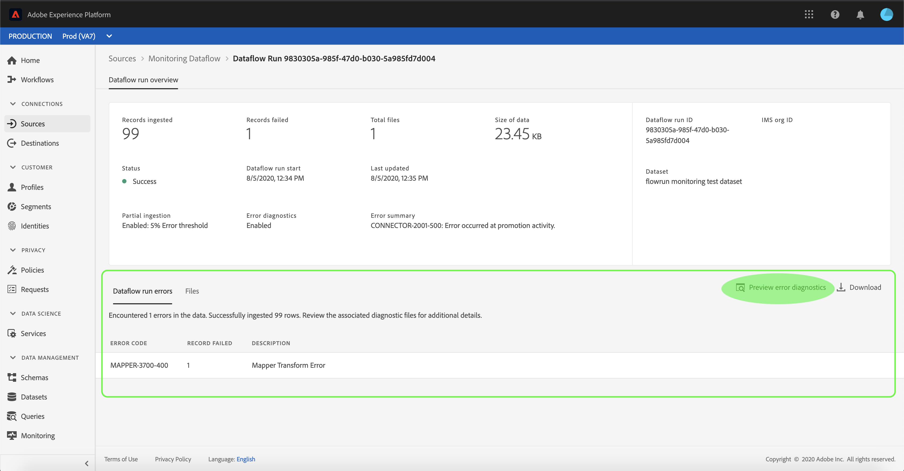

# 在UI中監視帳戶和資料流

Adobe Experience Platform中的來源連接器可讓您依計畫吸收外部來源的資料。 本教學課程提供從 [!UICONTROL Sources工作區檢視現有帳戶和資料流] 的步驟。

## 快速入門

本教學課程需要對Adobe Experience Platform的下列元件有正確的認識：

- [[!DNL Experience Data Model] (XDM)系統](../../../xdm/home.md):組織客戶體驗資料 [!DNL Experience Platform] 的標準化架構。
   - [架構構成基礎](../../../xdm/schema/composition.md):瞭解XDM架構的基本建置區塊，包括架構組合的主要原則和最佳實務。
   - [架構編輯器教程](../../../xdm/tutorials/create-schema-ui.md):瞭解如何使用架構編輯器UI建立自訂架構。
- [[!DNL即時客戶基本資料]](../../../profile/home.md):根據來自多個來源的匯整資料，提供統一、即時的消費者個人檔案。

## 監控帳戶

登入 [Adobe Experience Platform](https://platform.adobe.com) ，然後從左側導覽列選取 **[!UICONTROL Sources]** ，以存取 **** Sources工作區。 「目 **[!UICONTROL 錄]** 」螢幕顯示了各種源，您可以用這些源建立帳戶和資料流。 每個源顯示與其關聯的現有帳戶和資料流的數量。

從頂 **[!UICONTROL 端標題]** ，選擇「帳戶」以檢視現有帳戶。

此時 **[!UICONTROL 會顯示]** 「帳戶」頁面。 此頁面是可查看帳戶的清單，包括有關其源、用戶名、資料流數和建立日期的資訊。

選擇左上角的漏斗表徵圖以啟動排序窗口。

排序面板允許您從特定源訪問帳戶。 選擇要使用的源，然後從右邊的清單中選擇帳戶。

在「帳 **[!UICONTROL 戶]** 」頁中，可以查看與您訪問的帳戶相關聯的現有資料流或目標資料集的清單。

## 監視資料流

可以直接從「目錄」頁訪問數 **[!UICONTROL 據流]** ，而不查看 **[!UICONTROL 帳戶]**。 從頂 **[!UICONTROL 部標題中]** ，選擇資料流以查看現有資料流清單。

此時將顯示現有資料流清單。 本頁列出了可查看的資料流，包括有關其源、用戶名、資料流數和狀態的資訊。 選擇左上角的漏斗圖示進行排序。

出現排序面板。 從滾動菜單中選擇要訪問的源，然後從右側的清單中選擇資料流。

「數 **[!UICONTROL 據流活動]** 」頁包含已接收和記錄失敗的記錄數的詳細資訊，以及有關資料流狀態和處理時間的資訊。 選擇資料流上方的日曆表徵圖，以調整接收記錄的時間範圍。

日曆可讓您檢視所收錄記錄的不同時段。 您可以選擇選擇「最近7天」或「最近30天」這兩 **[!UICONTROL 個預設選項]****[!UICONTROL 之一]**。 或者，您也可以使用日曆來設定自訂時間範圍。 選擇您選擇的時間範圍，然後選擇「 **[!UICONTROL 應用]** 」繼續。

預設情況下，「 **[!UICONTROL 資料流]** 」活動顯示 **[!UICONTROL 與資料流關聯的「屬性]** 」面板。 從清單中選擇流運行以查看其關聯的元資料，包括有關其唯一運行ID的資訊。

選擇 **[!UICONTROL Dataflow run start]** (資料流運行啟動 **[!UICONTROL )以訪問]** Dataflow運行概述。

「數 **[!UICONTROL 據流運行概述]** 」顯示有關資料流的資訊，包括其元資料、 **[!UICONTROL 部分提取狀態]** ，以及分配的 **[!UICONTROL 錯誤閾值]**。 上方標題也包含「錯 **[!UICONTROL 誤」摘要]**。 「錯 **[!UICONTROL 誤]** 」摘要包含特定的頂層錯誤，顯示擷取程式在哪個步驟發生錯誤。

有關「錯誤」摘要中可見的錯誤代碼，請參 **[!UICONTROL 閱下表]**。

| 錯誤代碼 | 錯誤訊息 |
| ---------- | ----------- |
| `CONNECTOR-1001-500` | &quot;複製活動發生問題。&quot; |
| `CONNECTOR-2001-500` | 「從Experience Platform來源複製至資料集時發生問題。」 |
| `CONNECTOR-3001-500` | &quot;使用批量收錄API建立批次時流提供程式出現問題。&quot; |

螢幕的下半部分包含有關 **[!UICONTROL Dataflow運行錯誤的資訊]**。 您也可以從這裡檢視所擷取的檔案、預覽和下載錯誤診斷程式，或下載檔案資訊清單。

「數 **[!UICONTROL 據流運行錯誤]** 」部分顯示 **[!UICONTROL 錯誤代碼]**，記錄失敗的數量，以及說明錯誤的資訊。

選擇 **[!UICONTROL 預覽錯誤診斷]** ，查看有關提取錯誤的詳細資訊。

出現 **[!UICONTROL 「Error diagnostics preview]** （錯誤診斷預覽）」面板。 此畫面會顯示擷取失敗的特定資訊，包括 **[!UICONTROL File name]**、 **[!UICONTROL Error code]**、發生錯誤的欄名稱，以及錯誤的說明。

本節也包含包含錯誤的欄預覽。

>[!IMPORTANT]
>
>要啟用「 **[!UICONTROL 錯誤診斷」預覽]** ，在配置資料流時，必須激活「部 **[!UICONTROL 分提取]** 」和「 **** 錯誤診斷」。 這樣，系統將能夠掃描在流運行期間吸收的所有記錄。

在預覽錯誤後，您可以從 **[!UICONTROL UICONTROL資料流運行概述面板中選擇]** Download **[]** （下載），以訪問完整錯誤診斷並下載檔案清單。 如需詳細資訊，請參 [閱錯誤診斷](../../../ingestion/batch-ingestion/partial.md#retrieve-errors)[和下載中繼資料](../../../ingestion/batch-ingestion/partial.md#download-metadata) 。

有關監視資料流和接收的詳細資訊，請參閱監視流資料流 [的教程](../../../ingestion/quality/monitor-data-flows.md)。

## 後續步驟

遵循本教學課程，您已成功存取 **[!UICONTROL Sources工作區的現有帳戶和]** 資料流。 現在，下游服務（例如和）可 [!DNL Platform] 以使用傳入 [!DNL Real-time Customer Profile] 的資料 [!DNL Data Science Workspace]。 如需詳細資訊，請參閱下列檔案：

- [即時客戶個人檔案總覽](../../../profile/home.md)
- [資料科學工作區概觀](../../../data-science-workspace/home.md)
