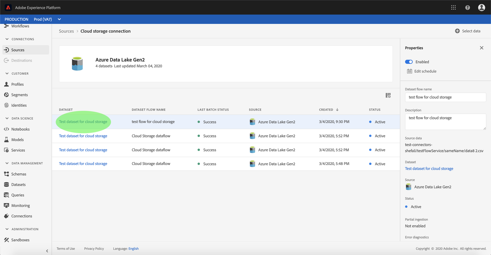

# 監控帳戶和資料集流

Adobe Experience Platform中的來源連接器可讓您依計畫吸收外部來源的資料。 本教學課程提供從 *Sources工作區檢視現有帳戶和資料集流程的* 步驟。

## 快速入門

本教學課程需要對Adobe Experience Platform的下列元件有正確的認識：

- [體驗資料模型(XDM)系統](../../../xdm/home.md):Experience Platform組織客戶體驗資料的標準化架構。
   - [架構構成基礎](../../../xdm/schema/composition.md):瞭解XDM架構的基本建置區塊，包括架構組合的主要原則和最佳實務。
   - [架構編輯器教程](../../../xdm/tutorials/create-schema-ui.md):瞭解如何使用架構編輯器UI建立自訂架構。
- [即時客戶個人檔案](../../../profile/home.md):根據來自多個來源的匯整資料，提供統一、即時的消費者個人檔案。

## 監控帳戶

登入 <a href="https://platform.adobe.com" target="_blank">Adobe Experience Platform</a> ，然後從左側導覽列選取 **Sources** ，以存取 ** Sources工作區。 「目 *錄* 」畫面會顯示多種來源，您可以用來建立帳戶資料集流。 每個來源會顯示與其關聯的現有帳戶和資料集流的數量。

從頂 *端標題* ，選擇「帳戶」以檢視現有帳戶。

此時 *會顯示* 「帳戶」頁面。 此頁面是可檢視帳戶的清單，包括其來源、使用者名稱、資料集流量和建立日期的相關資訊。

選擇左上角的表徵圖以啟動排序窗口。

排序面板允許您從特定源訪問帳戶。 選擇要使用的源，然後從右邊的清單中選擇帳戶。

從「帳 *戶* 」頁面，您可以檢視與您存取之帳戶相關聯的現有資料集流程清單。 選擇您要檢視的資料集流程。

此時會 *顯示「資料集流量* 」活動畫面。 此頁面以圖形形式顯示消費訊息的比率。

## 監控資料集流

您可以直接從「目錄」頁面存取資料集 *流程* ，而不需檢視 *帳戶*。 從上 *方標題選取資料集流* ，以檢視現有資料集流的清單。

與帳戶類似，您可以使用左上角的排序圖示來排序資料集流的清單。 選擇要查看的源，並從右側的清單中選擇資料集流。

此時會 *顯示「資料集流量* 」活動畫面。 此頁面以圖形形式顯示消費訊息的比率。

有關監視資料集和提取的詳細資訊，請參閱有關監視流資料流 [的教程](../../../ingestion/quality/monitor-data-flows.md)。

## 後續步驟

遵循本教學課程，您已成功存取 *Sources工作區的現有帳戶和資料集流* 程。 現在，下游平台服務（例如即時客戶個人檔案和資料科學工作區）可以使用傳入的資料。 如需詳細資訊，請參閱下列檔案：

- [即時客戶個人檔案總覽](../../../profile/home.md)
- [資料科學工作區概觀](../../../data-science-workspace/home.md)