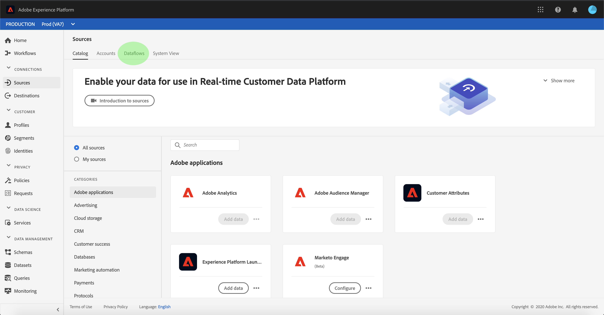

# 監視和刪除資料流

Adobe Experience Platform中的來源連接器可讓您依計畫吸收外部來源的資料。 本教學課程提供從 *[!UICONTROL Sources工作區檢視現有帳戶和資料流]* 的步驟。 本教學課程也提供從 *[!UICONTROL Sources工作區刪除資料流]* 的步驟。

## 快速入門

本教學課程需要對Adobe Experience Platform的下列元件有正確的認識：

- [體驗資料模型(XDM)系統](../../../xdm/home.md): 組織客戶體驗資料 [!DNL Experience Platform] 的標準化架構。
   - [架構構成基礎](../../../xdm/schema/composition.md): 瞭解XDM架構的基本建置區塊，包括架構組合的主要原則和最佳實務。
   - [架構編輯器教程](../../../xdm/tutorials/create-schema-ui.md): 瞭解如何使用架構編輯器UI建立自訂架構。
- [即時客戶個人檔案](../../../profile/home.md): 根據來自多個來源的匯整資料，提供統一、即時的消費者個人檔案。

## 監控帳戶

登入 [Adobe Experience Platform](https://platform.adobe.com) ，然後從左側導覽列選取 **[!UICONTROL Sources]** ，以存取 ** Sources工作區。 「目 *[!UICONTROL 錄]* 」螢幕顯示了各種源，您可以用這些源建立帳戶和資料流。 每個源顯示與其關聯的現有帳戶和資料流的數量。

從頂 *[!UICONTROL 端標題]* ，選擇「帳戶」以檢視現有帳戶。

此時 *[!UICONTROL 會顯示]* 「帳戶」頁面。 此頁面是可查看帳戶的清單，包括有關其源、用戶名、資料流數和建立日期的資訊。

選擇左上角的漏斗表徵圖以啟動排序窗口。

排序面板允許您從特定源訪問帳戶。 選擇要使用的源，然後從右邊的清單中選擇帳戶。

在「帳 *[!UICONTROL 戶]* 」頁中，可以查看與您訪問的帳戶關聯的現有資料流的清單。 選擇要查看的資料流。

出現「 *[!UICONTROL Dataflow(資料流]* )」活動螢幕。 此頁面以圖形形式顯示消費訊息的比率。

## 監視資料流

可以直接從「目錄」頁訪問數 *[!UICONTROL 據流]* ，而不查看 *[!UICONTROL 帳戶]*。 從頂 *[!UICONTROL 部標題中]* ，選擇資料流以查看現有資料流清單。

此時將顯示現有資料流清單。 本頁列出了可查看的資料流，包括有關其源、用戶名、資料流數和狀態的資訊。 選擇左上角的漏斗圖示進行排序。

出現排序面板。 從滾動菜單中選擇要訪問的源，然後從右側的清單中選擇資料流。

出現「 *[!UICONTROL Dataflow(資料流]* )」活動螢幕。 此頁面以圖形形式顯示消費訊息的比率。

有關監視資料流和接收的詳細資訊，請參閱監視流資料流 [的教程](../../../ingestion/quality/monitor-data-flows.md)。

## 刪除資料流

通過訪問資料流螢幕，可以刪除錯誤建立或不再需要的資料流。 使用排序漏斗表徵圖找到要刪除的資料流，並選擇資料流以開啟「屬 **[!UICONTROL 性]** 」面板。

要刪除資料流，請從右 **[!UICONTROL 上角的]** 「屬性」中選擇「刪除」。

此時會顯示最終確認訊息。 選擇「 **[!UICONTROL 刪除]** 」進行確認。

片刻後，畫面底部會出現綠色的確認方塊，以確認刪除成功。

或者，您也可以從「帳戶」螢幕中刪 *[!UICONTROL 除資料]* 流。 使用排序漏斗圖示找出您想要存取的帳戶，然後從清單中選取帳戶。

此時將 *[!UICONTROL 顯示]* 「帳戶」頁。 選擇要刪除的資料流，然後從屬性面板 **[!UICONTROL 中選擇]** 「刪除」以完成該過程。

請依照上述確認步驟完成程式。

## 後續步驟

遵循本教學課程，您已成功存取 *[!UICONTROL Sources工作區的現有帳戶和]* 資料流。 現在，下游服務（例如和）可 [!DNL Platform] 以使用傳入 [!DNL Real-time Customer Profile] 的資料 [!DNL Data Science Workspace]。 如需詳細資訊，請參閱下列檔案：

- [即時客戶個人檔案總覽](../../../profile/home.md)
- [資料科學工作區概觀](../../../data-science-workspace/home.md)