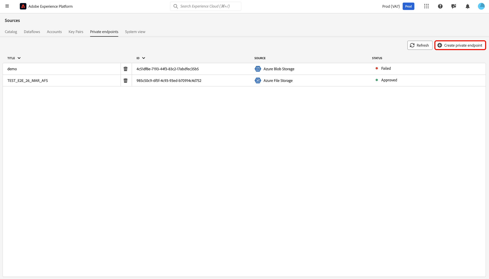

# 在UI中使用來源的[!DNL Azure Private Link]

>[!AVAILABILITY]
>
>此功能為測試版，目前僅支援下列來源：
>
>* [[!DNL Azure Blob Storage]](../../connectors/cloud-storage/blob.md)
>* [[!DNL ADLS Gen2]](../../connectors/cloud-storage/adls-gen2.md)
>* [[!DNL Azure File Storage]](../../connectors/cloud-storage/azure-file-storage.md)
>* [[!DNL Snowflake]](../../connectors/databases/snowflake.md)

您可以使用[!DNL Azure Private Link]功能來建立Adobe Experience Platform來源要連線的私人端點。 使用私人IP位址將您的來源安全地連線到虛擬網路，消除對公用IP的需求，並減少您的攻擊面。簡化網路設定，不需要複雜的防火牆或網路位址轉譯設定，同時確保資料流量僅能到達核准的服務。

請閱讀本指南，瞭解如何在Experience Platform UI中使用來源工作區來建立和使用私人端點。

## 建立私人端點

若要開始使用[!DNL Azure Private Link]，請瀏覽至Experience Platform UI的&#x200B;*[!UICONTROL 來源]*&#x200B;目錄，然後從來源工作區的索引標籤功能表中選取&#x200B;**[!UICONTROL 私人端點]**。

使用介面檢視現有私人端點的相關資訊，例如其ID、相關來源和目前狀態。 若要建立新的私人端點，請選取&#x200B;**[!UICONTROL 建立私人端點]**。

接著，選擇您想要的來源，然後輸入下列屬性的值：

| 屬性 | 說明 |
| --- | --- |
| `name` | 您的私人端點的名稱。 |
| `subscriptionId` | 與您的[!DNL Azure]訂閱相關聯的識別碼。 如需詳細資訊，請參閱[!DNL Azure]的[指南，從 [!DNL Azure Portal]](https://learn.microsoft.com/en-us/azure/azure-portal/get-subscription-tenant-id)擷取您的訂閱和租使用者ID。 |
| `resourceGroupName` | [!DNL Azure]上資源群組的名稱。 資源群組包含[!DNL Azure]解決方案的相關資源。 如需詳細資訊，請閱讀[!DNL Azure]管理資源群組[的](https://learn.microsoft.com/en-us/azure/azure-resource-manager/management/manage-resource-groups-portal)指南。 |
| `resourceGroup` | 資源的名稱。 在[!DNL Azure]中，資源是指虛擬機器器、網頁應用程式和資料庫等執行個體。 如需詳細資訊，請閱讀[!DNL Azure]上的[指南，瞭解 [!DNL Azure] 資源管理員](https://learn.microsoft.com/en-us/azure/azure-resource-manager/management/overview)。 |
| `fqdns` | 您來源的完整網域名稱。 **注意**：只有在使用[!DNL Snowflake]來源時，才需要此屬性。 |

{style="table-layout:auto"}

完成後，選取&#x200B;**[!UICONTROL 提交]**。

### 核准私人端點

新建立的端點會維持在擱置狀態，直到獲得管理員核准為止。

若要核准[!DNL Azure Blob]和[!DNL Azure Data Lake Gen2]來源的私人端點要求，請登入[!DNL Azure Portal]。 在左側導覽中選取&#x200B;**[!DNL Data storage]**，然後前往&#x200B;**[!DNL Security + networking]**&#x200B;標籤並選擇&#x200B;**[!DNL Networking]**。 接下來，選取「**[!DNL Private endpoints]**」以檢視與您帳戶相關聯的私人端點清單及其目前的連線狀態。 若要核准擱置的要求，請選取所要的端點，然後按一下&#x200B;**[!DNL Approve]**。

## 建立具有私人端點的帳戶

導覽至來源目錄，並選取支援私人端點的來源。 接下來，使用您的來源建立新帳戶，並在帳戶驗證期間，選取&#x200B;**[!UICONTROL 私人端點]**&#x200B;切換按鈕。 提供您來源的驗證認證，然後選取&#x200B;**[!UICONTROL 連線到來源]**&#x200B;允許幾分鐘以建立連線。

>[!NOTE]
>
>如果[!UICONTROL 私用端點]選項已啟用，Experience Platform會檢查選取的來源是否存在核准的私用端點。 如果找不到已核准的端點，您將無法建立連線。

接著，瀏覽至您來源的[!UICONTROL 現有帳戶]介面。 使用此介面檢視現有帳戶及其對應狀態的清單。 您可以選取篩選圖示，以僅顯示已啟用與私人端點連線的帳戶。

選取您要使用的帳戶，然後啟用&#x200B;**[!UICONTROL 互動式製作]**。 此切換會啟用[!UICONTROL 互動式製作]，這是一個[!DNL Azure]功能，可讓您測試連線、瀏覽資料夾清單及預覽資料。 私用端點連線需要啟用[!UICONTROL 互動式製作]。 請注意，您無法手動關閉此切換按鈕，60分鐘後會自動停用。

[!UICONTROL 互動式製作]需要幾分鐘才能啟用。 啟用此設定後，請選取&#x200B;**[!UICONTROL 下一步]**&#x200B;以繼續執行下一個步驟，並選取您要擷取的資料。

## 後續步驟

現在您已經成功建立私有端點，您可以建立來源連線和資料流，並使用私有端點擷取資料。 如需如何在UI中建立資料流程的資訊，請參閱下列指南：

* [為雲端儲存空間來源建立資料流](../ui/dataflow/batch/cloud-storage.md)
* [為資料庫來源建立資料流](../ui/dataflow/databases.md)