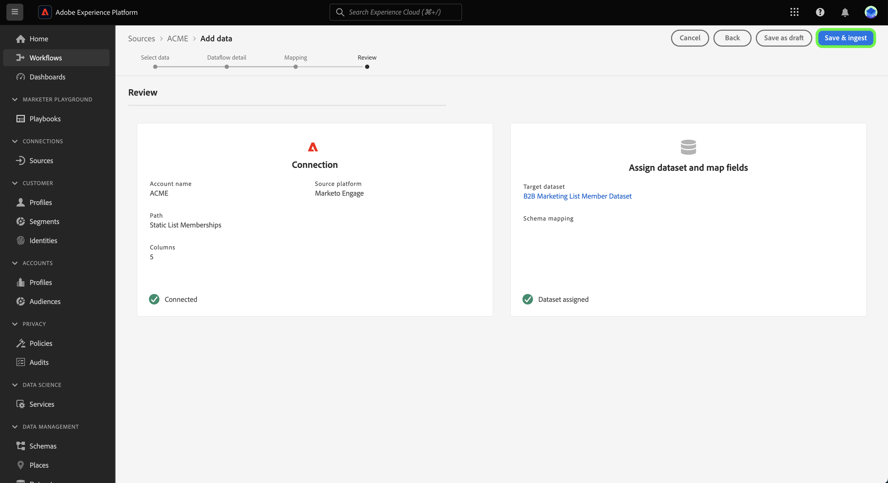

# 使用 UI 中的範本建立來源資料流 {#create-a-sources-dataflow-using-templates-in-the-ui}

>[!CONTEXTUALHELP]
>id="platform_sources_marketo_mapping"
>title="Experience Platform UI中的來源範本"
>abstract="範本包括多種自動產生的資產，例如結構描述、資料集、身分識別、對應規則、身分命名空間和資料流，您將資料從來源帶入 Experience Platform 時可以使用。您可以更新自動產生的資產，以針對您的使用案例進行自訂。"

>[!IMPORTANT]
>
>範本為測試版，並受到下列來源支援：
>
>* [[!DNL Marketo Engage]](../../connectors/adobe-applications/marketo/marketo.md)
>* [[!DNL Microsoft Dynamics]](../../connectors/crm/ms-dynamics.md)
>* [[!DNL Salesforce]](../../connectors/crm/salesforce.md)
>
>檔案和功能可能會有所變更。

Adobe Experience Platform提供預先設定的範本，可用來加速資料擷取程式。 範本包括自動產生的資產，例如結構描述、資料集、身分、對應規則、身分名稱空間和資料流程，在將資料從來源引進Experience Platform時可使用這些資產。

使用範本，您可以：

* 透過加速範本化資產的建立，減少內嵌的價值實現時間。
* 將手動資料擷取流程中可能發生的錯誤減到最少。
* 隨時更新自動產生的資產，以符合您的使用案例。

下列教學課程提供如何在Experience Platform UI中使用範本的步驟。

## 快速入門

本教學課程需要您實際瞭解下列Experience Platform元件：

* [來源](../../home.md)： Experience Platform允許從各種來源擷取資料，同時讓您能夠使用Experience Platform服務來建構、加標籤以及增強傳入的資料。
* [[!DNL Experience Data Model (XDM)] 系統](../../../xdm/home.md)： Experience Platform用來組織客戶體驗資料的標準化架構。
* [沙箱](../../../sandboxes/home.md)： Experience Platform提供的虛擬沙箱可將單一Experience Platform執行個體分割成個別的虛擬環境，以利開發及改進數位體驗應用程式。

## 在Experience Platform UI中使用範本 {#use-templates-in-the-platform-ui}

>[!CONTEXTUALHELP]
>id="platform_sources_templates_accounttype"
>title="選取商業類型"
>abstract="為您的使用案例選取適合的商業類型。您的存取權限可能會依據您的即時客戶資料平台訂閱帳戶而不同。"
>additional-url="https://experienceleague.adobe.com/docs/experience-platform/rtcdp/intro/rtcdp-intro/overview.html" text="Real-Time CDP 概觀"

在Experience Platform UI中，從左側導覽選取&#x200B;**[!UICONTROL 來源]**&#x200B;以存取[!UICONTROL 來源]工作區，並檢視Experience Platform中可用的來源目錄。

使用&#x200B;*[!UICONTROL 類別]*&#x200B;功能表，依類別篩選來源。 或者，在搜尋列中輸入來源名稱，從目錄中尋找特定來源。

移至[!UICONTROL Adobe應用程式]類別以檢視[!DNL Marketo Engage]來源卡，然後選取[!UICONTROL 新增資料]以開始。

系統隨即顯示快顯視窗，提供您瀏覽範本或使用現有方案和資料集的選項。

* **瀏覽範本**：來源範本會為您自動建立具有對應規則的結構描述、身分、資料集和資料流程。 您可以視需要自訂這些資產。
* **使用我現有的資產**：使用您建立的現有資料集和結構描述擷取您的資料。 如有需要，您也可以建立新資料集和結構描述。

若要使用自動產生的資產，請選取&#x200B;**[!UICONTROL 瀏覽範本]**，然後選取&#x200B;**[!UICONTROL 選取]**。

### Authentication

此時會出現驗證步驟，提示您建立新帳戶或使用現有帳戶。

>[!BEGINTABS]

>[!TAB 使用現有的帳戶]

若要使用現有帳戶，請選取[!UICONTROL 現有帳戶]，然後從顯示的清單中選取您要使用的帳戶。

>[!TAB 建立新帳戶]

若要建立新帳戶，請選取&#x200B;**[!UICONTROL 新帳戶]**，然後提供您的來源連線詳細資料和帳戶驗證認證。 完成時，請選取&#x200B;**[!UICONTROL 連線到來源]**，並留出一些時間來建立新連線。

>[!ENDTABS]

### 選取範本

帳戶通過驗證後，您現在可以選取要用於資料流的範本。

+++[!DNL Marketo Engage]個範本
下表概述[!DNL Marketo Engage]來源可用的範本。

| [!DNL Marketo Engage]個範本 | 說明 |
| --- | --- |
| 活動 | 「活動」範本會擷取活動以事件為基礎的快照，例如電子郵件互動、網站互動和銷售電話。 |
| 公司 | 「公司」範本會擷取企業帳戶細節，例如，公司第一方資訊、地點和帳單資訊。 |
| 具名帳戶 | 「具名帳戶」範本會擷取已確定為要追蹤之目標帳戶的帳戶詳細資料。 |
| 機會 | 「商機」範本會擷取商業商機細節，例如，型別、銷售階段和相關帳戶。 |
| 機會聯絡人角色 | 「商機聯絡人角色」範本會擷取與特定商機相關聯之潛在客戶的角色相關詳細資訊。 |
| 人員 | 「人員」範本會擷取個別人員的屬性，例如人口統計細節、聯絡資訊和同意偏好設定。 |
| 計畫成員資格 | 「方案會籍」範本會擷取與商業促銷活動相關連絡人的詳細資料，包括培養步調和連絡人回應。 |
| 方案 | 方案範本會擷取商業促銷活動的詳細資料，如狀態、管道、時間表和成本。 |
| 靜態清單成員資格 | 「靜態清單成員資格」範本會擷取靜態清單中人員與其成員資格之間的關係。 |
| 靜態清單 | 靜態清單範本會擷取特定使用案例的具現化人員清單。 |

{style="table-layout:auto"}

+++

+++[!DNL Salesforce]個B2B範本
下表概述可用於[!DNL Salesforce]來源的B2B範本。

| [!DNL Salesforce]個B2B範本 | 說明 |
| --- | --- |
| 帳戶聯絡人關係 | 「帳戶聯絡人關係」範本會擷取聯絡人與一或多個帳戶之間的關係。 |
| 帳戶 | 「帳戶」範本會擷取商業帳戶細節，例如，公司第一方資訊、地點和帳單資訊。 |
| 行銷活動成員 | 「促銷活動成員」範本擷取個別銷售機會或聯絡人與特定[!DNL Salesforce]促銷活動之間的關係。 |
| 行銷活動 | Campaigns範本會擷取商業帳戶詳細資訊，例如，公司名字資訊、地點和帳單資訊。 |
| 連絡人 | 連絡人範本會擷取連絡人的屬性，例如人口統計細節、連絡人資訊和相關商業實體。 |
| 銷售機會 | 潛在客戶範本會擷取潛在客戶的屬性，例如人口統計細節、聯絡資訊和相關業務實體。 |
| 機會 | 此商機範本會擷取商業商機細節，例如，型別、銷售階段和相關帳戶。 |
| 機會聯絡人角色 | 「商機聯絡人角色」範本會擷取與特定商機相關聯之潛在客戶的角色相關詳細資訊。 |

{style="table-layout:auto"}

+++

+++[!DNL Salesforce]個B2C範本
下表概述可用於[!DNL Salesforce]來源的B2C範本。

| [!DNL Salesforce]個B2C範本 | 說明 |
| --- | --- |
| 聯絡 | 連絡人範本會擷取連絡人的屬性，例如人口統計細節、連絡人資訊和相關商業實體。 |
| 銷售機會 | 潛在客戶範本會擷取潛在客戶的屬性，例如人口統計細節、聯絡資訊和相關業務實體。 |

{style="table-layout:auto"}

+++

+++[!DNL Microsoft Dynamics]個B2B範本
下表概述可用於[!DNL Microsoft Dynamics]來源的B2B範本。

| [!DNL Microsoft Dynamics]個B2B範本 | 說明 |
| --- | --- |
| 帳戶 | 「帳戶」範本會擷取商業帳戶細節，例如，公司第一方資訊、地點和帳單資訊。 |
| 行銷活動 | Campaigns範本會擷取商業帳戶詳細資訊，例如，公司名字資訊、地點和帳單資訊。 |
| 連絡人 | 連絡人範本會擷取連絡人的屬性，例如人口統計細節、連絡人資訊和相關商業實體。 |
| 銷售機會 | 潛在客戶範本會擷取潛在客戶的屬性，例如人口統計細節、聯絡資訊和相關業務實體。 |
| 行銷清單 | 行銷清單範本會擷取為行銷活動或其他銷售目的而建立的現有或潛在客戶群組。 |
| 行銷清單成員 | 行銷清單成員會擷取行銷清單中任一客戶記錄型別的詳細資訊，例如銷售機會、帳戶或聯絡人。 |
| 機會 | 此商機範本會擷取商業商機細節，例如，型別、銷售階段和相關帳戶。 |
| 機會聯絡人角色 | 「商機聯絡人角色」範本會擷取與特定商機相關聯之潛在客戶的角色相關詳細資訊。 |

{style="table-layout:auto"}

+++

+++[!DNL Microsoft Dynamics]個B2C範本
下表概述可用於[!DNL Microsoft Dynamics]來源的B2C範本。

| [!DNL Microsoft Dynamics]個B2C範本 | 說明 |
| --- | --- |
| 聯絡 | 連絡人範本會擷取連絡人的屬性，例如人口統計細節、連絡人資訊和相關商業實體。 |
| 銷售機會 | 潛在客戶範本會擷取潛在客戶的屬性，例如人口統計細節、聯絡資訊和相關業務實體。 |

{style="table-layout:auto"}

+++

根據您選取的企業型別，會出現範本清單。 選取範本名稱旁的預覽圖示，以預覽範本中的範例資料。

預覽視窗會出現，供您瀏覽及檢查範本中的範例資料。 完成時，選取&#x200B;**[!UICONTROL 取得]**。

接著，從清單中選取您要使用的範本。 您可以選取多個範本，一次建立多個資料流。 不過，每個帳戶只能使用一次範本。 選取範本後，請選取&#x200B;**[!UICONTROL 完成]**，讓資產產生一些時間。

如果您從可用範本清單中選取一個或部分專案，仍會產生所有B2B結構描述和身分識別名稱空間，以確保跨結構描述的B2B關係已正確設定。

>[!NOTE]
>
>已使用的範本將從選取範圍中停用。

### 設定排程

[!DNL Microsoft Dynamics]和[!DNL Salesforce]來源都支援排程資料流程。

使用排程介面來設定資料流程的擷取排程。 將您的擷取頻率設定為&#x200B;**一次**&#x200B;以建立一次性擷取。

或者，您可以將擷取頻率設為&#x200B;**分鐘**、**小時**、**天**&#x200B;或&#x200B;**周**。 如果排程資料流進行多次擷取，則必須設定間隔，以建立每次擷取之間的時間範圍。 例如，擷取頻率設為&#x200B;**小時**，而間隔設為&#x200B;**15**，表示您的資料流已排程每&#x200B;**15小時**&#x200B;擷取一次資料。

在此步驟中，您也可以啟用&#x200B;**回填**，並定義資料增量擷取的資料行。 回填是用來擷取歷史資料，而您為增量擷取定義的欄則可區分新資料與現有資料。

完成擷取排程的設定後，請選取&#x200B;**[!UICONTROL 完成]**。

### 檢閱資產 {#review-assets}

>[!CONTEXTUALHELP]
>id="platform_sources_templates_review"
>title="檢閱您自動產生的資產"
>abstract="產生所有資產最多可能需要五分鐘的時間。如果您選擇離開頁面，資產完成後您將收到傳回的通知。您可以在產生資產後檢閱資產，並可隨時對資料流進行其他設定。"

[!UICONTROL 檢閱範本資產]頁面會顯示作為範本的一部分自動產生的資產。 您可以在此頁面檢視與來源連線相關聯的自動產生結構描述、資料集、身分名稱空間和資料流程。 產生所有資產最多可能需要五分鐘的時間。如果您選擇離開頁面，資產完成後您將收到傳回的通知。您可以在產生資產後檢閱資產，並可隨時對資料流進行其他設定。

根據預設，自動產生的資料流會設為草稿狀態，以允許對設定進行進一步自訂，例如對應規則或排程頻率。 選取資料流名稱旁邊的省略符號(`...`)，然後選取&#x200B;**[!UICONTROL 預覽對應]**&#x200B;以檢視為您的草稿資料流建立的對應集。

系統會顯示預覽頁面，讓您檢查來源資料欄位與目標結構描述欄位之間的對應關係。 檢視資料流的對應後。 選取&#x200B;**[!UICONTROL 取得。]**

您可在執行後隨時更新資料流程。 選取資料流名稱旁邊的省略符號(`...`)，然後選取&#x200B;**[!UICONTROL 更新資料流]**。 您會進入來源工作流程頁面，您可以在此頁面更新資料流詳細資訊，包括部分擷取、錯誤診斷和警報通知的設定，以及資料流的對應。

您可以使用結構編輯器檢視，對自動產生的結構描述進行更新。 如需詳細資訊，請造訪[上的使用結構描述編輯器](../../../xdm/tutorials/create-schema-ui.md)的指南。

>[!TIP]
>
>您可以透過來源工作區中的[!UICONTROL 資料流程]目錄頁面存取草稿資料流程。 從頂端標題選取&#x200B;**[!UICONTROL 資料流]**，然後從清單中選取您要更新的資料流。
>
>

### 發佈您的資料流

透過瀏覽來源工作流程開始發佈程式。 選取[!UICONTROL 更新資料流]後，您就會進入工作流程的&#x200B;*[!UICONTROL 新增資料]*&#x200B;步驟。 選取&#x200B;**[!UICONTROL 下一步]**&#x200B;以繼續。

接下來，確認您的資料流詳細資料，並設定錯誤診斷、部分擷取和警報通知的設定。 完成後，選取&#x200B;**[!UICONTROL 下一步]**。

>[!NOTE]
>
>您可以隨時選取「**[!UICONTROL 另存為草稿]**」以停止並儲存您對資料流所做的變更。

對應步驟隨即顯示。 在此步驟中，您可以重新設定資料流的對應設定。 如需用於對應的資料準備功能的完整指南，請造訪[資料準備UI指南](../../../data-prep/ui/mapping.md)。

最後，檢閱資料流的詳細資料，然後選取「**[!UICONTROL 儲存並擷取]**」以發佈您的草稿。

## 後續步驟

依照本教學課程所述，您現在已使用範本建立資料流，以及結構描述、資料集和身分識別名稱空間等資產。 如需來源的一般資訊，請瀏覽[來源概觀](../../home.md)。

## 警示和通知 {#alerts-and-notifications}

Adobe Experience Platform警報支援範本，您可以使用通知面板來接收資產狀態的更新，並導覽回檢閱頁面。

選取Experience Platform UI頂端的通知圖示，然後選取狀態警報以檢視您要檢閱的資產。

您可以更新範本的警報設定，以接收有關資料流狀態的電子郵件和Experience Platform內通知。 如需設定警示的詳細資訊，請參閱[如何訂閱來源資料流](../ui/alerts.md)的警示指南。