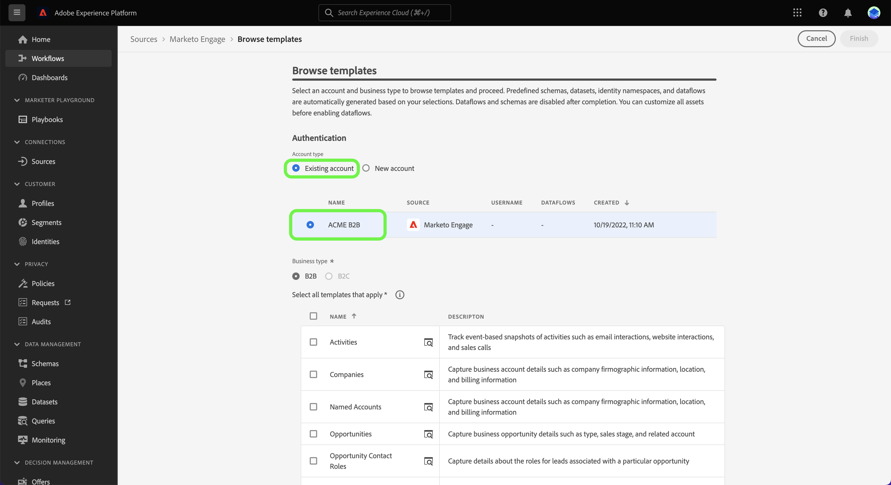

# (Alpha)使用UI中的範本建立來源資料流

>[!IMPORTANT]
>
>範本位於Alpha版，目前僅支援 [[!DNL Marketo Engage] 來源](../../connectors/adobe-applications/marketo/marketo.md). 檔案和功能可能會有所變更。

Adobe Experience Platform提供預先設定的範本，供您加速資料擷取程式。 範本包含自動產生的資產，例如結構、資料集、身分、對應規則、身分命名空間，以及在從來源傳入資料時可使用的資料流。

使用範本，您可以：

* 加速建立範本化資產，縮短擷取的實際時間。
* 將手動資料擷取程式期間可能發生的錯誤降至最低。
* 隨時更新自動產生的資產以符合您的使用案例。

以下教學課程提供如何使用 [[!DNL Marketo Engage] 來源](../../connectors/adobe-applications/marketo/marketo.md).

## 快速入門

本教學課程需要妥善了解下列Experience Platform元件：

* [來源](../../home.md):Experience Platform可讓您從各種來源擷取資料，同時使用Platform服務來建構、加標籤及增強傳入資料。
* [[!DNL Experience Data Model (XDM)] 系統](../../../xdm/home.md):Experience Platform組織客戶體驗資料的標準化架構。
* [沙箱](../../../sandboxes/home.md):Experience Platform提供可將單一Platform執行個體分割成個別虛擬環境的虛擬沙箱，以協助開發及改進數位體驗應用程式。

## 在平台UI中使用範本 {#use-templates-in-the-platform-ui}

>[!CONTEXTUALHELP]
>id="platform_sources_templates_accounttype"
>title="選擇業務類型"
>abstract="為您的使用案例選擇適當的業務類型。 您的存取權限可能會因您的Real-time Customer Data Platform訂閱帳戶而異。"
>additional-url="https://experienceleague.adobe.com/docs/experience-platform/rtcdp/overview.html?lang=zh-Hant" text="Real-Time CDP概述"

在平台UI中，選取 **[!UICONTROL 來源]** 從左側導覽器存取 [!UICONTROL 來源] 工作區。 此 [!UICONTROL 目錄] 畫面會顯示可用來建立帳戶的各種來源。

您可以從畫面左側的目錄中選取適當的類別。 或者，您也可以使用搜尋列找到您要使用的特定來源。

在 [!UICONTROL Adobe應用程式] 類別，選擇 **[!UICONTROL Marketo Engage]** 然後選取 **[!UICONTROL 新增資料]**.

此時會出現一個快顯視窗，提供您瀏覽範本或使用現有結構和資料集的選項。

* **瀏覽範本**:來源範本會自動建立結構、身分、資料集和資料流，並搭配對應規則使用。 您可以視需要自訂這些資產。
* **使用我的現有資產**:使用您建立的現有資料集和結構擷取資料。 您也可以視需要建立新資料集和結構。

若要使用自動產生的資產，請選取 **[!UICONTROL 瀏覽範本]** 然後選取 **[!UICONTROL 選擇]**.

### 驗證

此時會出現驗證步驟，提示您建立新帳戶或使用現有帳戶。

#### 現有帳戶

若要使用現有帳戶，請選取 [!UICONTROL 現有帳戶] 然後，從顯示的清單中選取您要使用的帳戶。

#### 新帳戶

要建立新帳戶，請選擇 **[!UICONTROL 新帳戶]**，然後提供您的來源連線詳細資料和帳戶驗證憑證。 完成後，請選取 **[!UICONTROL 連接到源]** 並讓新連線有時間建立。

### 選取範本

驗證並選取帳戶後，範本清單就會顯示。 選取範本名稱旁的預覽圖示，以預覽範本中的範例資料。

此時會出現預覽視窗，讓您探索並檢查範本中的範例資料。 完成後，請選取 **[!UICONTROL 明白了]**.

接下來，從清單中選取您要使用的範本。 您可以選擇多個模板並一次建立多個資料流。 不過，每個帳戶只能使用範本一次。 選取範本後，請選取 **[!UICONTROL 完成]** 並讓資產產生幾分鐘。

如果您從可用範本清單中選取一或多個部分項目，仍會產生所有B2B結構描述和身分識別命名空間，以確保正確設定各結構描述的B2B關係。

>[!NOTE]
>
>已使用的範本將在選取項目中停用。

### 檢閱資產 {#review-assets}

>[!CONTEXTUALHELP]
>id="platform_sources_templates_review"
>title="檢閱自動產生的資產"
>abstract="產生所有資產最多需要5分鐘。 如果您選擇離開頁面，資產一旦完成，您會收到要傳回的通知。 產生資產後，您就可以檢閱資產，並隨時對您的資料流進行其他設定。"

此 [!UICONTROL 檢閱範本資產] 頁面會顯示範本中自動產生的資產。 在本頁面中，您可以檢視與來源連線相關聯的自動產生結構、資料集、身分識別命名空間及資料流。 產生所有資產最多需要5分鐘。 如果您選擇離開頁面，資產一旦完成，您會收到要傳回的通知。 產生資產後，您就可以檢閱資產，並隨時對您的資料流進行其他設定。

預設情況下，將啟用自動生成的資料流。 選取點(`...`)，然後選取 **[!UICONTROL 預覽對應]** 查看為資料流建立的映射集。

此時將出現預覽頁，允許您檢查源資料欄位和目標架構欄位之間的映射關係。 查看資料流映射後。 選擇 **[!UICONTROL 明白。]**

您可以在執行後隨時更新資料流。 選取點(`...`)，然後選取 **[!UICONTROL 更新資料流]**. 將進入源工作流頁，您可以在其中更新資料流詳細資訊，包括部分內嵌、錯誤診斷和警報通知的設定，以及資料流的映射。

您可以使用結構編輯器檢視來更新自動產生的結構。 請前往 [使用架構編輯器](../../../xdm/tutorials/create-schema-ui.md) 以取得更多資訊。

## 後續步驟

依照本教學課程，您現在已使用範本建立資料流，以及結構、資料集和身分識別命名空間等資產。 如需來源的一般資訊，請造訪 [來源概觀](../../home.md).

## 附錄

以下章節提供有關範本的其他資訊。

### 使用通知面板返回審核頁面

Adobe Experience Platform警報支援範本，您可以使用通知面板接收資產狀態的更新，並導覽回檢閱頁面。

選取Platform UI頂端標題的通知圖示，然後選取狀態警報以查看您要檢閱的資產。

