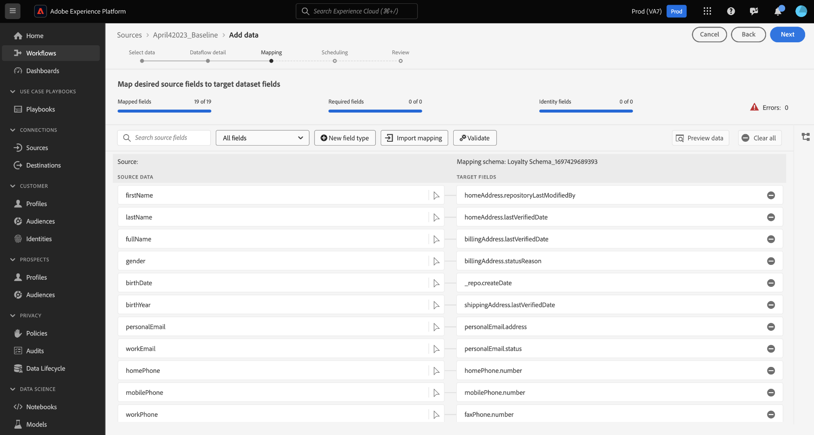

# 更新UI中的資料流

閱讀本教學課程，瞭解如何使用Adobe Experience Platform使用者介面中的來源工作區更新現有資料流，包括其排程和對應設定。

## 快速入門

本教學課程需要您實際瞭解下列Experience Platform元件：

* [來源](../../home.md)：Experience Platform允許從各種來源擷取資料，同時讓您能夠使用Platform服務來建構、加標籤以及增強傳入的資料。
* [沙箱](../../../sandboxes/home.md)：Experience Platform提供的虛擬沙箱可將單一Platform執行個體分割成個別的虛擬環境，以利開發及改進數位體驗應用程式。

## 更新資料流 {#update-dataflows}

>[!CONTEXTUALHELP]
>id="platform_sources_dataflows_daysRemaining"
>title="資料集有效期"
>abstract="此欄表示目標資料集在自動到期之前剩餘的天數。 如果目標資料集過期，資料流將會失敗。為避免資料流失敗，請確保將目標資料集設定為在正確的日期到期。請參閱文件以了解如何更新到期日。"

在Experience PlatformUI中，從左側導覽選取&#x200B;**[!UICONTROL 來源]**，然後從頂端標題選取&#x200B;**[!UICONTROL 資料流程]**。

>[!TIP]
>
>您可以使用篩選功能對資料流進行排序和篩選。 如需詳細資訊，請閱讀[篩選UI](./filter.md)中的來源物件的指南。

[!UICONTROL 資料流]頁面會顯示貴組織中所有現有資料流的清單。 找到您要更新的資料流，然後選取它旁邊的省略符號(`...`)。 下拉式功能表隨即顯示，其中列出您可以選擇使用的選項，以對現有資料流進行額外設定。

若要更新您的資料流，請選取&#x200B;**[!UICONTROL 更新資料流]**。

您會進入來源工作流程，您可在此繼續更新資料流的各個層面，包括在[!UICONTROL 提供資料流詳細資料]步驟中的詳細資料。

### 更新對應 {#update-mapping}

>[!NOTE]
>
>下列來源目前不支援編輯對應功能： Adobe Analytics、Adobe Audience Manager、HTTP API和[!DNL Marketo Engage]。

在此過程中，您也可以更新與資料流關聯的對應集。  對應介面會顯示資料流的現有對應，而不是新的建議對應集。 對應更新僅適用於未來排程的資料流執行。 排程進行一次性內嵌的資料流無法更新其對應集。

使用對應介面來修改套用至資料流的對應集。 如需如何使用對應介面的完整步驟，請參閱[資料準備UI指南](../../../data-prep/ui/mapping.md)以取得詳細資訊。

### 更新排程

更新資料流的對應後，您可以繼續更新擷取排程，以使用新的對應資料擷取資料流。 您只能更新已設定為要依週期性排程擷取的資料流程擷取排程。 您無法重新排程針對一次性內嵌設定的資料流。

您也可以使用資料流頁面中提供的內嵌更新選項，更新資料流的擷取排程。

從資料流頁面，選取資料流名稱旁邊的省略符號(`...`)，然後從出現的下拉式功能表中選取&#x200B;**[!UICONTROL 編輯排程]**。

**[!UICONTROL 編輯排程]**&#x200B;對話方塊提供您更新資料流擷取頻率和間隔速率的選項。 設定更新的頻率和間隔值後，請選取&#x200B;**[!UICONTROL 儲存]**。

### 停用資料流

您可以使用相同的下拉式選單來停用資料流。 若要停用資料流，請選取&#x200B;**[!UICONTROL 停用資料流]**。

接著，從出現的快顯視窗中選取[!UICONTROL 停用]。

如果您稍後重新啟用此資料流，Experience Platform會自動排程回填執行，以涵蓋資料流停用期間。 例如，如果資料流設定為每小時執行且停用48小時，在重新啟用此資料流時，Experience Platform將建立48個回填執行以處理錯過的間隔。

## 後續步驟

依照此教學課程，您已成功使用[!UICONTROL 來源]工作區來更新資料流的擷取排程和對映集。

如需有關如何使用[!DNL Flow Service] API以程式設計方式執行這些操作的步驟，請參閱有關[使用流程服務API更新資料流](../../tutorials/api/update-dataflows.md)的教學課程。
