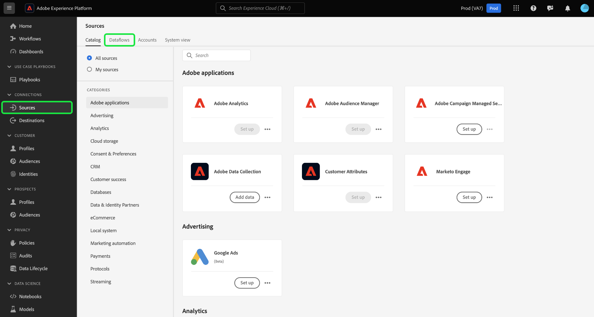

# 更新UI中的資料流

本教學課程提供如何使用來源工作區更新現有資料流的步驟，包括其排程和對應。

## 快速入門

本教學課程需要您實際瞭解下列Adobe Experience Platform元件：

* [來源](../../home.md)：Experience Platform允許從各種來源擷取資料，同時讓您能夠使用Platform服務來建構、加標籤以及增強傳入的資料。
* [沙箱](../../../sandboxes/home.md)：Experience Platform提供的虛擬沙箱可將單一Platform執行個體分割成個別的虛擬環境，以利開發及改進數位體驗應用程式。

## 更新資料流 {#update-dataflows}

>[!CONTEXTUALHELP]
>id="platform_sources_dataflows_daysRemaining"
>title="資料集有效期"
>abstract="此欄表示目標資料集在自動到期之前剩餘的天數。 如果目標資料集過期，資料流將會失敗。為避免資料流失敗，請確保將目標資料集設定為在正確的日期到期。請參閱文件以了解如何更新到期日。"

在Platform UI中，從左側導覽選取&#x200B;**[!UICONTROL 來源]**&#x200B;以存取[!UICONTROL 來源]工作區。 從頂端標題選取&#x200B;**[!UICONTROL 資料流]**&#x200B;以檢視現有資料流的清單。

[!UICONTROL 資料流]頁面包含所有現有資料流的清單，包括關於其對應目標資料集、來源和帳戶名稱的資訊。

若要排序清單，請選取左上方的篩選圖示以使用排序面板。

排序面板提供所有可用來源的清單。 您可以從清單中選取多個來源，以存取屬於不同來源的資料流篩選選取專案。

選取您要使用的來源，以檢視其現有資料流的清單。 識別您要更新的資料流後，請選取資料流名稱旁邊的省略符號(`...`)。

下拉式功能表隨即顯示，為您提供更新所選資料流的選項。 從這裡，您可以選擇更新資料流的對應集和擷取排程。 您也可以選取選項，以在監視控制面板中檢查資料流、訂閱警示，以及停用或刪除資料流。

若要更新資料流的資訊，請選取&#x200B;**[!UICONTROL 更新資料流]**。

### 新增資料

[!UICONTROL 新增資料]步驟隨即顯示。 選取適當的資料格式以檢閱您選取的資料內容，然後選取[下一步] **[!UICONTROL 以繼續。]**

### 資料流詳細資料

在[!UICONTROL 資料流詳細資料]頁面中，您可以提供資料流的更新名稱和說明，並重新設定資料流的錯誤臨界值。 在此步驟中，您也可以設定或修改警示訂閱的設定。

提供更新值後，請選取&#x200B;**[!UICONTROL 下一步]**。

### 對應

>[!NOTE]
>
>下列來源目前不支援編輯對應功能： Adobe Analytics、Adobe Audience Manager、HTTP API和[!DNL Marketo Engage]。

[!UICONTROL 對應]頁面提供您介面，您可以在其中新增和移除與資料流關聯的對應集。

對應介面會顯示資料流的現有對應集，而不是新的建議對應集。 對應更新僅適用於未來排程的資料流執行。 排程進行一次性內嵌的資料流無法更新其對應集。

在這裡，您可以使用對應介面來修改套用至資料流的對應集。 如需如何使用對應介面的完整步驟，請參閱[資料準備UI指南](../../../data-prep/ui/mapping.md)以取得詳細資訊。

### 正在排程

[!UICONTROL 排程]步驟隨即顯示，可讓您更新資料流的擷取排程，並使用更新的對應自動擷取選取的來源資料。

>[!NOTE]
>
>您無法重新排程進行一次性內嵌的資料流。

您也可以使用資料流頁面中提供的內嵌更新選項，更新資料流的擷取排程。

從資料流頁面，選取資料流名稱旁邊的省略符號(`...`)，然後從出現的下拉式功能表中選取&#x200B;**[!UICONTROL 編輯排程]**。

**[!UICONTROL 編輯排程]**&#x200B;對話方塊提供您更新資料流擷取頻率和間隔速率的選項。 設定更新的頻率和間隔值後，請選取&#x200B;**[!UICONTROL 儲存]**。

### 檢閱

**[!UICONTROL 檢閱]**&#x200B;步驟隨即顯示，可讓您在更新資料流之前先檢閱資料流。

檢閱您的資料流後，請選取&#x200B;**[!UICONTROL 完成]**，並等待一些時間，讓資料流建立新的對應集。

## 後續步驟

依照此教學課程，您已成功使用[!UICONTROL 來源]工作區來更新資料流的擷取排程和對映集。

如需有關如何使用[!DNL Flow Service] API以程式設計方式執行這些操作的步驟，請參閱有關[使用流程服務API更新資料流](../../tutorials/api/update-dataflows.md)的教學課程。
