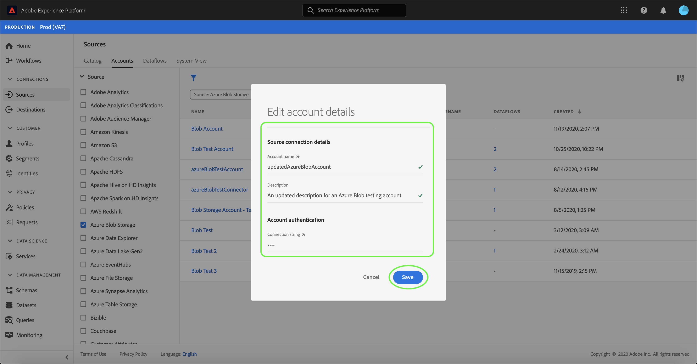

# 在UI中更新帳戶詳細資訊

在某些情況下，可能需要更新現有來源帳戶的詳細資訊。 [!UICONTROL Sources]工作區可讓您新增、編輯和刪除現有批次或串流連線的詳細資訊，包括其名稱、說明和認證。

[!UICONTROL Sources]工作區還允許您編輯批處理資料流的調度，以便更新其接收頻率和間隔速率。

本教程提供從[!UICONTROL  Sources]工作區更新現有帳戶的詳細資訊和憑證以及更新資料流擷取排程的步驟。

## 快速入門

本教學課程需要對Adobe Experience Platform的下列部分有正確的理解：

- [來源](../../home.md):Experience Platform可讓您從各種來源擷取資料，同時讓您能夠使用平台服務來建構、標示並增強傳入資料。
- [沙盒](../../../sandboxes/home.md):Experience Platform提供虛擬沙盒，可將單一平台實例分割為獨立的虛擬環境，以協助開發和發展數位體驗應用程式。

## 更新帳戶

登入[Experience PlatformUI](https://platform.adobe.com)，然後從左側導覽器選擇&#x200B;**[!UICONTROL 源]**&#x200B;以存取[!UICONTROL 源]工作區。 從頂部標題中選擇&#x200B;**[!UICONTROL Accounts]**&#x200B;以查看現有帳戶。

此時將顯示&#x200B;**[!UICONTROL Accounts]**&#x200B;頁。 此頁面是可查看帳戶的清單，包括有關其源、用戶名、資料流數和建立日期的資訊。

選擇左上角的篩選器表徵圖以啟動排序面板。

排序面板提供所有來源的清單。 您可以從清單中選擇多個源，以訪問與不同源關聯的帳戶的篩選選擇。

選擇要使用的源，以查看其現有帳戶的清單。 在確定要更新的帳戶後，請選擇帳戶名稱旁的省略號(`...`)。

此時會顯示下拉式功能表，提供您&#x200B;**[!UICONTROL 新增資料]**、**[!UICONTROL 編輯詳細資料]**&#x200B;和&#x200B;**[!UICONTROL 刪除]**&#x200B;的選項。 從菜單中選擇「編輯詳細資訊」**[!UICONTROL 以更新您的帳戶。]**

使用&#x200B;**[!UICONTROL 編輯帳戶詳細資訊]**&#x200B;對話框可以更新帳戶的名稱、說明和驗證憑據。 更新所需資訊後，選擇&#x200B;**[!UICONTROL 保存]**。

片刻後，畫面底部會出現確認方塊，確認更新是否成功。

## 編輯排程

可以從&#x200B;**[!UICONTROL Accounts]**&#x200B;頁編輯資料流的接收調度。 從帳戶清單中，選擇包含要重新計畫的資料流的帳戶。

此時將顯示資料流頁。 此頁包含與所選帳戶關聯的現有資料流清單。 選擇要重新計畫的資料流旁邊的省略號(`...`)。

此時會顯示下拉式功能表，提供您以下選項：「編輯排程&#x200B;]**、「啟用資料流]**、「監視中的視圖」和「刪除」。 **[!UICONTROL **[!UICONTROL ********&#x200B;從菜單中選擇&#x200B;**[!UICONTROL 編輯計畫]**。

**[!UICONTROL 編輯調度]**&#x200B;對話框提供了更新資料流接收頻率和間隔速率的選項。 設定更新的頻率和間隔值後，選擇&#x200B;**[!UICONTROL 保存]**。

| 排程 | 說明 |
| ---------- | ----------- |
| 頻率 | 資料流收集資料的頻率。 可接受的值包括：`minute`、`hour`、`day`或`week`。 |
| 間隔 | 該間隔用於指定兩個連續流運行之間的期間。 間隔的值應為非零整數，且必須大於或等於`15`。 |

片刻後，畫面底部會出現確認方塊，確認更新是否成功。

## 後續步驟

在本教程中，您成功使用[!UICONTROL  Sources]工作區更新帳戶資訊並編輯資料流計畫。

有關如何使用[!DNL Flow Service] API以程式設計方式執行這些操作的步驟，請參閱有關使用流服務API](../../tutorials/api/update.md)更新連接資訊的教程。[