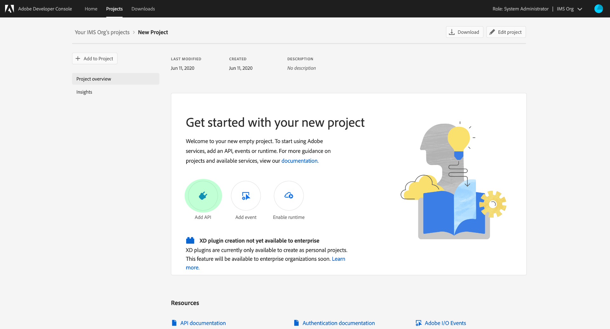

# Reactor API入門

為了使用 [反應堆API](https://www.adobe.io/experience-platform-apis/references/reactor/)，每個請求必須包含以下驗證標頭：

* `Authorization: Bearer {ACCESS_TOKEN}`
* `x-api-key: {API_KEY}`
* `x-gw-ims-org-id: {ORG_ID}`

本指南介紹如何使用Adobe Developer控制台收集這些標頭中每個標頭的值，以便您可以開始調用Reactor API。

## 獲得開發人員訪問Adobe Experience Platform

在為Reactor API生成驗證值之前，必須具有Experience Platform的開發人員訪問權限。 要獲取開發人員訪問權限，請按照 [Experience Platform驗證教程](https://www.adobe.com/go/platform-api-authentication-en)。 完成「獲取用戶訪問」步驟後，返回本教程以生成特定於Repartor API的憑據。

## 生成訪問憑據

使用Adobe Developer控制台，必須生成以下三種訪問憑據：

* `{ORG_ID}`
* `{API_KEY}`
* `{ACCESS_TOKEN}`

您組織的ID(`{ORG_ID}`)和API密鑰(`{API_KEY}`)可在API調用初始生成後重新使用。 但是，您的訪問令牌(`{ACCESS_TOKEN}`)是臨時的，必須每24小時再生一次。

以下詳細介紹了生成這些值的步驟。

### 一次性設定

轉到 [Adobe Developer控制台](https://www.adobe.com/go/devs_console_ui) 和你的Adobe ID登錄。 接下來，按照本教程中介紹的步驟操作 [建立空項目](https://developer.adobe.com/developer-console/docs/guides/projects/projects-empty/) 在Developer Console文檔中。

建立項目後，選擇 **添加API** 的 **項目概述** 的上界。



的 **添加API** 的上界。 選擇 **Experience Platform反應堆API** 從可用API清單中選擇 **下一個**。


在下一螢幕中，系統提示您建立JSON Web令牌(JWT)憑據以生成新密鑰對或上載您自己的公鑰。 對於本教程，請選擇 **生成密鑰對** 選項，然後選擇 **生成鍵對** 在右下角。


下一螢幕確認密鑰對已成功生成，並且包含公共證書和私鑰的壓縮資料夾將自動下載到您的電腦。 在稍後的步驟中需要此私鑰來生成訪問令牌。

選取&#x200B;**「下一步」**&#x200B;以繼續。


下一個螢幕提示您選擇一個或多個要與API整合關聯的產品配置檔案。

>[!NOTE]
>
>產品配置檔案由您的組織通過Adobe Admin Console管理，並包含特定的精細功能權限集。 產品配置檔案及其權限只能由組織內具有管理員權限的用戶管理。 如果您不確定要為API選擇哪些產品配置檔案，請與管理員聯繫。

從清單中選擇所需的產品配置檔案，然後選擇 **保存已配置的API** 完成API註冊。


將API添加到項目後，項目頁將重新顯示在「Experience Platform反應器API」頁上。 從此處向下滾動到 **服務帳戶(JWT)** 部分，該部分提供了所有對Reactor API的調用所需的以下訪問憑據：

* **客戶端ID**:客戶端ID是必需的 `{API_KEY}` 必須在 `x-api-key` 標題。
* **組織ID**:組織ID是 `{ORG_ID}` 必須在 `x-gw-ims-org-id` 標題。


### 每個會話的身份驗證

既然你 `{API_KEY}` 和 `{ORG_ID}` 值，最後一步是生成 `{ACCESS_TOKEN}` 值。

>[!NOTE]
>
>這些令牌在24小時後過期。 如果將此整合用於應用程式，最好從應用程式內部以寫程式方式獲取持有者令牌。

根據您的使用案例，您有兩個選項來生成訪問令牌：

* [手動生成令牌](#manual)
* [以寫程式方式生成令牌](#program)

#### 手動生成訪問令牌 {#manual}

開啟先前在文本編輯器或瀏覽器中下載的私鑰並複製其內容。 然後，導航回「Developer Console（開發人員控制台）」 ，然後在 **生成訪問令牌** 選擇之前，在項目的Repart API頁面中 **生成令牌**。


將生成新的訪問令牌，並提供一個按鈕將令牌複製到剪貼簿。 此值用於所需 `Authorization` 標題，且必須以格式提供 `Bearer {ACCESS_TOKEN}`。


#### 以寫程式方式生成訪問令牌 {#program}

如果您正在將整合用於應用程式，則可以通過API請求以寫程式方式生成訪問令牌。 要完成此操作，必須獲得以下值：

* 客戶端ID(`{API_KEY}`)
* 客戶端密碼(`{SECRET}`)
* JSON Web令牌(`{JWT}`)

可以從項目的首頁獲取客戶端ID和機密，如 [上一步](#one-time-setup)。


要獲取JWT憑據，請導航至 **服務帳戶(JWT)** 在左側導航中，選擇 **生成JWT** 頁籤。 在此頁上，在 **生成自定義JWT**，將私鑰的內容貼上到提供的文本框中，然後選擇 **生成令牌**。


生成的JWT在完成處理後會顯示在下面，並帶有示例cURL命令，如果需要，可以使用該命令test令牌。 使用 **複製** 按鈕將標籤複製到剪貼簿。


收集憑據後，您可以將下面的API調用整合到應用程式中，以便以寫程式方式生成訪問令牌。

**要求**

請求必須發送 `multipart/form-data` 有效負載，提供驗證憑據，如下所示：

```shell
curl -X POST \
  https://ims-na1.adobelogin.com/ims/exchange/jwt/ \
  -H 'Content-Type: multipart/form-data' \
  -F 'client_id={API_KEY}' \
  -F 'client_secret={SECRET}' \
  -F 'jwt_token={JWT}'
```

**回應**

成功的響應將返回新的訪問令牌，以及剩餘的秒數，直到其過期。

```json
{
  "token_type": "bearer",
  "access_token": "{ACCESS_TOKEN}",
  "expires_in": 86399999
}
```

| 屬性 | 說明 |
| :-- | :-- |
| `access_token` | 新生成的訪問令牌值。 此值用於所需 `Authorization` 標題，且必須以格式提供 `Bearer {ACCESS_TOKEN}`。 |
| `expires_in` | 令牌過期的剩餘時間（毫秒）。 一旦令牌過期，必須生成新令牌。 |

{style="table-layout:auto"}

## 後續步驟

按照本教程中的步驟，您應具有 `{ORG_ID}`。 `{API_KEY}`, `{ACCESS_TOKEN}`。 現在，您可以通過將這些值用在Reactor API的簡單cURL請求中來test。

開始嘗試對 [列出所有公司](./endpoints/companies.md#list)。

>[!NOTE]
>
>您的組織中可能沒有任何公司，在這種情況下，響應將為HTTP狀態404（未找到）。 只要您沒有出現403（禁止）錯誤，您的訪問憑據就有效且有效。

確認您的訪問憑據正在工作後，繼續瀏覽其他API參考文檔以瞭解API的許多功能。

## 其他資源

JWT庫和SDK: [https://jwt.io/](https://jwt.io/)

PostmanAPI開發： [https://www.postman.com/](https://www.postman.com/)
