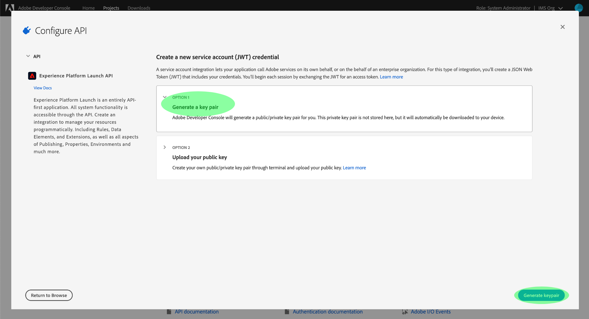

# Reactor API快速入門

若要使用 [Reactor API](https://www.adobe.io/experience-platform-apis/references/reactor/)，每個要求都必須包含下列驗證標題：

* `Authorization: Bearer {ACCESS_TOKEN}`
* `x-api-key: {API_KEY}`
* `x-gw-ims-org-id: {ORG_ID}`

本指南說明如何使用Adobe Developer主控台收集每個標題的值，以便您開始呼叫Reactor API。

## 取得開發人員存取Adobe Experience Platform

您必須擁有開發人員存取Experience Platform的權限，才能產生Reactor API的驗證值。 若要取得開發人員存取權，請遵循 [Experience Platform驗證教學課程](https://www.adobe.com/go/platform-api-authentication-en). 完成「取得使用者存取權」步驟後，請返回本教學課程，產生Reactor API專屬的憑證。

## 生成訪問憑據

使用Adobe Developer Console時，您必須產生下列三個存取憑證：

* `{ORG_ID}`
* `{API_KEY}`
* `{ACCESS_TOKEN}`

貴組織的ID(`{ORG_ID}`)和API金鑰(`{API_KEY}`)可在日後的API呼叫中，於初次產生後重複使用。 不過，您的存取權杖(`{ACCESS_TOKEN}`)是暫時的，必須每24小時重新產生一次。

以下詳細說明產生這些值的步驟。

### 一次性設定

前往 [Adobe Developer Console](https://www.adobe.com/go/devs_console_ui) 並登入您的Adobe ID。 接下來，請依照 [建立空白專案](https://developer.adobe.com/developer-console/docs/guides/projects/projects-empty/) （位於開發人員控制台檔案中）。

建立專案後，請選取 **新增API** 在 **專案概述** 螢幕。


此 **新增API** 畫面。 選擇 **Experience PlatformReactor API** 從可用API清單中選取 **下一個**.


在下一個畫面中，系統會提示您建立JSON Web Token(JWT)憑證，以產生新的索引鍵組或上傳您自己的公開金鑰。 在本教學課程中，請選取 **產生金鑰組** 選項，然後選取 **產生鍵對** 在右下角。



下一個畫面會確認金鑰組已成功產生，而包含公開憑證和私密金鑰的壓縮資料夾會自動下載至您的電腦。 在後續步驟中需要此私密金鑰，才能產生存取權杖。

選取&#x200B;**「下一步」**&#x200B;以繼續。


下一個畫面會提示您選取一或多個產品設定檔，以與API整合建立關聯。

>[!NOTE]
>
>產品設定檔由貴組織透過Adobe Admin Console管理，並包含精細功能的特定權限集。 產品設定檔及其權限只能由組織內具有管理員權限的使用者管理。 如果您不確定要為API選取哪些產品設定檔，請聯絡管理員。

從清單中選取所需的產品設定檔，然後選取 **儲存已設定的API** 完成API註冊。


將API新增至專案後，專案頁面會重新顯示在「Experience Platform反應器API」頁面上。 從這裡，向下捲動至 **服務帳戶(JWT)** 小節，提供對Reactor API進行所有呼叫時所需的下列存取憑證：

* **用戶端ID**:用戶端ID為必要 `{API_KEY}` 必須在 `x-api-key` 頁首。
* **組織ID**:組織ID為 `{ORG_ID}` 值 `x-gw-ims-org-id` 頁首。


### 每個會話的驗證

既然你有了 `{API_KEY}` 和 `{ORG_ID}` 值，最後一步是產生 `{ACCESS_TOKEN}` 值。

>[!NOTE]
>
>這些代號會在24小時後過期。 如果您將此整合用於應用程式，最好以程式設計方式從應用程式內取得您的載體代號。

您有兩個選項可產生存取權杖，視您的使用案例而定：

* [手動產生代號](#manual)
* [以程式設計方式產生代號](#program)

#### 手動產生存取權杖 {#manual}

開啟先前在文字編輯器或瀏覽器中下載的私密金鑰，並複製其內容。 接著，導覽回開發人員控制台，並將私密金鑰貼到 **產生存取權杖** 在選取 **產生代號**.


系統會產生新的存取權杖，並提供將權杖複製到剪貼簿的按鈕。 此值會用於必要 `Authorization` 標題，且必須以格式提供 `Bearer {ACCESS_TOKEN}`.


#### 以程式設計方式產生存取權杖 {#program}

如果您將整合用於應用程式，則可透過API請求以程式設計方式產生存取權杖。 若要完成此操作，您必須取得下列值：

* 用戶端ID(`{API_KEY}`)
* 用戶端密碼(`{SECRET}`)
* JSON網頁代號(`{JWT}`)

您可從專案的主要頁面取得用戶端ID和密碼，如 [上一步](#one-time-setup).


若要取得JWT憑證，請導覽至 **服務帳戶(JWT)** 在左側導覽器中，選取 **產生JWT** 標籤。 在本頁的 **產生自訂JWT**，將私密金鑰的內容貼入提供的文字方塊，然後選取 **產生代號**.


產生的JWT在處理完成後會顯示在下方，並附上範例cURL命令，您可以視需要用來測試代號。 使用 **複製** 按鈕，將Token複製到剪貼簿。


收集憑證後，您就可以將下方的API呼叫整合至您的應用程式，以程式設計方式產生存取權杖。

**要求**

請求必須傳送 `multipart/form-data` 裝載，提供您的驗證憑證，如下所示：

```shell
curl -X POST \
  https://ims-na1.adobelogin.com/ims/exchange/jwt/ \
  -H 'Content-Type: multipart/form-data' \
  -F 'client_id={API_KEY}' \
  -F 'client_secret={SECRET}' \
  -F 'jwt_token={JWT}'
```

**回應**

成功的回應會傳回新的存取權杖，以及在其過期前剩餘的秒數。

```json
{
  "token_type": "bearer",
  "access_token": "{ACCESS_TOKEN}",
  "expires_in": 86399999
}
```

| 屬性 | 說明 |
| :-- | :-- |
| `access_token` | 新產生的存取權杖值。 此值會用於必要 `Authorization` 標題，且必須以格式提供 `Bearer {ACCESS_TOKEN}`. |
| `expires_in` | 代號過期的剩餘時間（以毫秒為單位）。 代號過期後，必須產生新的代號。 |

{style="table-layout:auto"}

## 後續步驟

依照本教學課程中的步驟，您應該會有 `{ORG_ID}`, `{API_KEY}`，和 `{ACCESS_TOKEN}`. 您現在可以在對Reactor API發出的簡單cURL要求中使用這些值，以測試這些值。

首先，嘗試對 [列出所有公司](./endpoints/companies.md#list).

>[!NOTE]
>
>貴組織中可能沒有任何公司，在此情況下，回應將是HTTP狀態404（找不到）。 只要您未收到403（禁止）錯誤，您的存取憑證即有效且有效。

確認您的存取憑證正常運作後，請繼續探索其他API參考檔案，以了解API的許多功能。

## 其他資源

JWT程式庫和SDK: [https://jwt.io/](https://jwt.io/)

Postman API開發： [https://www.postman.com/](https://www.postman.com/)
