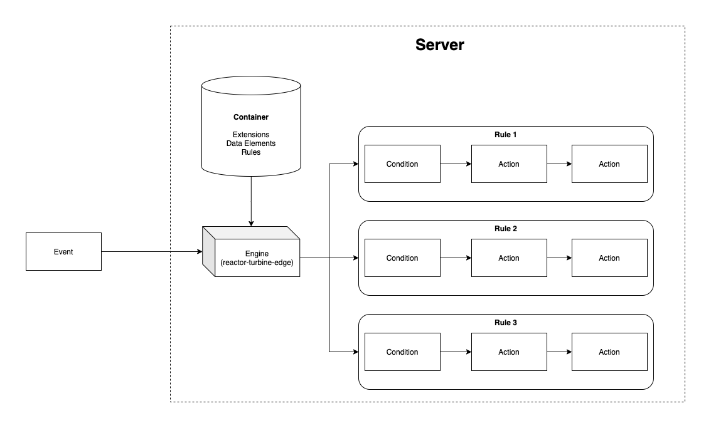

# 邊緣擴充功能流程

>[!NOTE]
>
>Adobe Experience Platform Launch已經過品牌重塑，現在是Adobe Experience Platform中的一套資料收集技術。 因此，所有產品檔案中出現了幾項術語變更。 請參閱下列[檔案](../../term-updates.md)，以取得術語變更的彙總參考資料。

在邊緣擴充功能中，每個條件、動作和資料元素類型都會具備可供使用者修改設定的檢視，以及可依這些使用者定義設定運作的程式庫模組。

如下列高階圖表所示，擴充功能的動作型別檢視會顯示於與Adobe Experience Platform整合的應用程式內，呈現於iframe之中。 檢視可用來修改設定，然後這些設定會儲存在Platform中。 建置標籤執行階段程式庫時，擴充功能的動作型別程式庫模組以及使用者定義的設定，都會包含在要部署至邊緣節點的執行階段程式庫中。 來自Platform的使用者定義設定會在執行階段插入程式庫模組中。

下圖中，您可以看見規則處理流程中各個事件、條件和動作之間的連結。

規則處理流程包含以下幾個階段：

1. 啟動時，將 `settings` 和 `trigger` 方法提供給事件程式庫模組。
1. 一旦事件程式庫模組判定事件已發生，事件程式庫模組就會呼叫 `trigger`。
1. Platform會將`settings`傳入規則的條件型別程式庫模組，在模組中評估條件。
1. 每個條件類型會分別傳回條件是否評估為 true 的結果。
1. 如果所有條件都通過，系統就會執行規則的動作。
