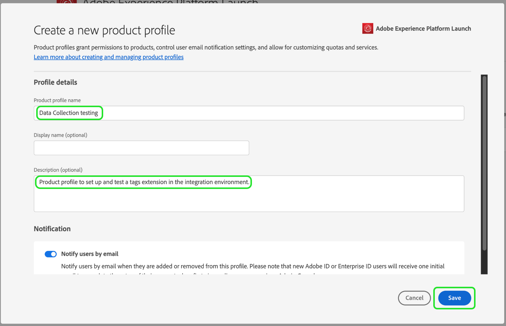
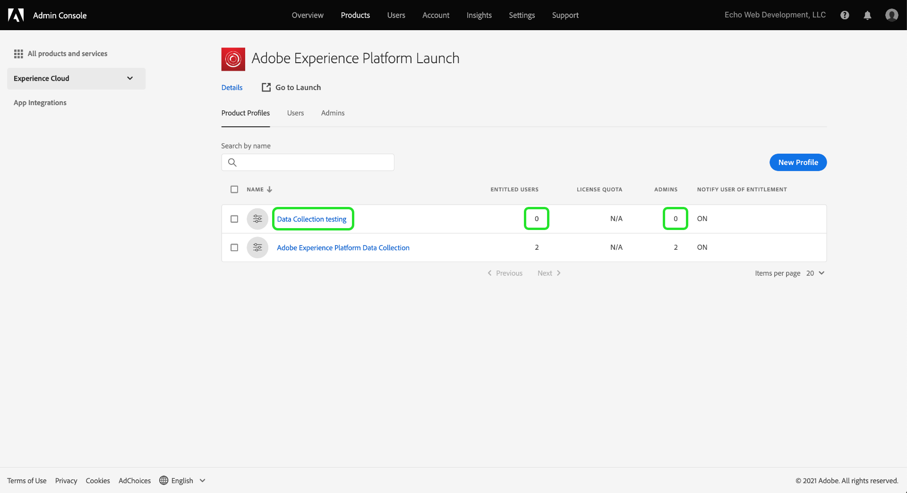
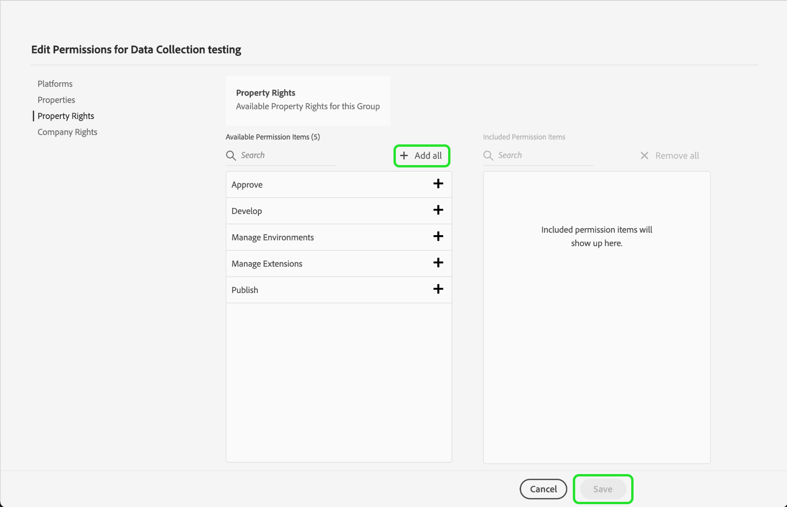

# 授與使用者存取權

>[!NOTE]
>
>Adobe Experience Platform Launch已重新命名為Experience Platform中的資料收集技術套件。 因此，產品檔案中已推出數個術語變更。 有關術語更改的綜合參考，請參閱以下[document](../../term-updates.md)。

開始使用 extension_package 之前，您必須先以使用者帳戶和權限來設定團隊成員。此作業可在 [Adobe Admin Console](https://adminconsole.adobe.com/tw/) 中完成。

本檔案提供透過Admin Console授與Adobe Experience Platform中標籤存取權的步驟。

## 先決條件

本指南假設您是 Admin Console 指定的組織管理員。如果您需要其他關於 Admin Console 和指派角色的資訊，請參閱下列資源：

* [管理使用指南](https://helpx.adobe.com/tw/enterprise/administering/user-guide.html?topic=/enterprise/administering/morehelp/introduction.ug.js)：Admin Console 中所有項目的相關資訊
* [企業管理角色](https://helpx.adobe.com/tw/enterprise/using/admin-roles.html)：關於不同管理角色類型的詳細資訊。在以下指南中，我們會假設您是組織管理員。

## 選擇您的組織

您的 Adobe Experience Cloud 組織管理員應登入 [Admin Console](https://adminconsole.adobe.com/)。第一個畫面是概述。

您中的某些人可能擁有多個組織（組織）的存取權。 若要將標籤功能新增至正確的組織，請選取您在畫面右上角看到的組織名稱。 接下來，從下拉式清單中選擇要使用標籤的組織。

## 建立產品設定檔

產品設定檔是群組。 個人權限會指派給產品設定檔，而設定檔中的任何使用者都會繼承這些權限。

選擇頂部的&#x200B;**[!UICONTROL Products]**&#x200B;連結，左側的&#x200B;**[!UICONTROL Experience Cloud]**。 若您未列出Adobe Experience Platform Launch，客戶應聯絡其客戶團隊，而合作夥伴應傳送電子郵件至<ExchangeTechEC@adobe.com>。

上方的螢幕擷圖顯示範例設定檔，但您可能還沒有。 要建立配置檔案，請選擇&#x200B;**[!UICONTROL 新建配置檔案]**。 在&#x200B;**建立新設定檔**&#x200B;畫面上，只需新增&#x200B;**設定檔名稱**（例如資料收集測試）和選用的&#x200B;**說明**，然後選取&#x200B;**[!UICONTROL 儲存]**:

產品設定檔現已新增至組織。 接下來，將使用者新增至產品設定檔。

## 將使用者指派至產品設定檔

請注意，產品設定檔會為&#x200B;**已授權的使用者**&#x200B;和&#x200B;**管理員**&#x200B;顯示零。 選取您建立的產品設定檔名稱（在此範例中為資料收集測試）。

選擇&#x200B;**[!UICONTROL 用戶]**&#x200B;頁簽。 您可以在此透過電子郵件搜尋現有的Adobe ID使用者，或將新使用者新增至此產品設定檔。 選擇&#x200B;**[!UICONTROL 添加用戶連結]**。

在適當的文字欄位中輸入名稱、使用者群組或電子郵件地址。 建議盡可能包含名字和姓氏。 選擇&#x200B;**[!UICONTROL 保存]**&#x200B;以添加用戶。

在此產品設定檔中擁有您需要的所有使用者後，我們會為他們新增權限。 選擇&#x200B;**[!UICONTROL 權限]**&#x200B;頁簽。 在權限畫面上，您會看到&#x200B;**[!UICONTROL 屬性]**、**[!UICONTROL 公司權限]**&#x200B;和&#x200B;**[!UICONTROL 屬性權限]**。 選擇&#x200B;**[!UICONTROL Edit]**。

若要製作擴充功能，您的團隊至少必須具備下列權限：

* 公司群組中的「管理屬性」。
* 屬性群組中的「管理擴充功能」、「管理環境」和「開發」。

您稍後可以視需要建立其他具有更多有限權限的產品設定檔，但現在只要為&#x200B;**公司權利**&#x200B;和&#x200B;**屬性權利**&#x200B;同時選取&#x200B;**[!UICONTROL +全部新增]**&#x200B;即可。 請務必在每個欄位上選取&#x200B;**[!UICONTROL 儲存]**。

到目前為止，我們已選取適當的組織、建立產品設定檔、將使用者新增至產品設定檔，以及指派權限。

如此即可完成Admin Console中的必要設定。 您和您已設定為使用者的團隊成員現在可以登入[資料收集UI](https://launch.adobe.com/tw/)。

## 確認布建

為您的公司布建標籤的存取權，並依上述說明設定您的使用者後，您應該就能從[資料收集UI](https://launch.adobe.com/)存取生產環境。 如果您已布建標籤，且已完成上述Admin Console步驟，但仍無法登入資料收集UI，請聯絡您的Adobe支援代表。
