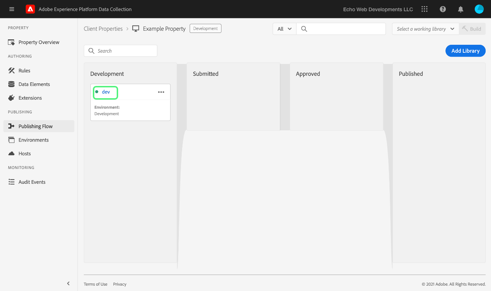

# 上傳並實作端對端測試

>[!NOTE]
>
>Adobe Experience Platform Launch已被改名為Adobe Experience Platform的一套資料收集技術。 因此，所有產品文件中出現了幾項術語變更。 如需術語變更的彙整參考資料，請參閱以下[文件](../../term-updates.md)。

要testAdobe Experience Platform的標籤擴展，請使用標籤API和/或命令行工具上載擴展包。 接下來，使用平台UI或資料收集UI將擴展包安裝到屬性，並在標籤庫中執行其功能並生成。

本文檔介紹如何為擴展實施端到端測試。

>[!NOTE]
>
>本指南假定您正在將Node.js和npm安裝並可用時使用MacOS。

## 驗證您的擴充功能 {#validate}

一旦您的團隊對您的擴展的效能以及在中看到的結果感到滿意 [沙盒](https://www.npmjs.com/package/@adobe/reactor-sandbox#running-the-sandbox) 工具，您應準備好將擴展包上載到標籤。

上傳之前，請先驗證是否有任何必要欄位或設定需完成。例如，查看 [擴展清單](../manifest.md)您 [擴展配置](../configuration.md)您 [視圖](../web/views.md), [庫模組](../web/format.md) （至少）是好做法。

您的標誌檔案就是明確的範例：請在 `"iconPath": "example.svg",` 檔案中加上 `extension.json` 這一行，並將標誌影像檔案納入您的專案中。這是將為擴展顯示的表徵圖的相對路徑。 此路徑不應以斜線開頭。它必須參考副檔名為 `.svg` 的 SVG 檔案。SVG在呈現正方形時應正常顯示，並可以按用戶介面縮放。 查看 [如何縮放SVG文章](https://css-tricks.com/scale-svg/) 的子菜單。

>[!NOTE]
>
>針對公開擴充功能，請在您的 `extension.json` 中納入並附有 Exchange 清單連結的項目。您的[擴充功能資訊清單](../manifest.md)應包含 `"exchangeUrl":"https://www.adobeexchange.com/experiencecloud.details.12345.html"` 之類的項目，指向您 Exchange 清單的 URL。

## 建立 Adobe I/O 整合 {#integration}

為了使用API或命令行工具，您需要具有Adobe I/O的技術帳戶。您必須在I/O控制台中建立技術帳戶，然後使用上載工具上載擴展包。

有關建立技術帳戶以在Adobe Experience Platform與標籤一起使用的資訊，請參閱 [Reactor API入門](../../api/getting-started.md) 的子菜單。

>[!IMPORTANT]
>
>若要在 Adobe I/O 中建立整合，您必須是 Experience Cloud 組織管理員或 Experience Cloud 組織開發人員。

如果無法建立整合，則可能沒有正確的權限。 這將要求組織管理員完成您的步驟或將您指派為開發人員。

## 上傳您的擴充功能套件 {#upload}

現在，您已準備好端到端test擴展包。

第一次上傳擴充功能套件時，套件會進入 `development` 狀態。這意味著它只對您自己的組織可見，並且只對已標籤為可擴展開發的屬性可見。

使用命令行在包含.zip包的目錄中運行以下命令。

```bash
npx @adobe/reactor-uploader
```

`npx` 可讓您下載並直接執行 npm 套件，而無需在機器上實際安裝。這是上傳程式最簡單的執行方式。

上載程式要求您輸入多條資訊。 可以從Adobe I/O控制台檢索技術帳戶ID、API密鑰和其他資訊位。 導覽至 I/O 主控台中的[整合頁面](https://console.adobe.io/tw/integrations)。從下拉清單中選擇正確的組織，找到正確的整合，然後選擇 **[!UICONTROL 視圖]**。

- 您的私密金鑰路徑為何？/path/to/private.key。這是您先前在步驟 2 中儲存私密金鑰的位置。
- 您的組織 ID 為何？從先前開啟的I/O控制台概述頁中複製並貼上此內容。
- 您的技術帳戶 ID 為何？從I/O控制台複製並貼上此內容。
- 您的 API 金鑰為何？從I/O控制台複製並貼上此內容。
- 客戶機的秘密是什麼？ 從I/O控制台複製並貼上此內容。
- 您要上傳的 extension_package 的路徑為何？/path/to/extension_package.zip。如果從包含 .zip 套件的目錄中叫用上傳程式，您可以直接從清單中選取，而無需輸入路徑。

您的擴充功能套件將隨即上傳，且上傳程式會為您提供 extension_package 的 ID。

>[!NOTE]
>
>上傳或修補時，系統以非同步的方式擷取及部署擴充功能套件期間，該套件會進入擱置狀態。當此進程正在進行時，您可以輪詢 `extension_package` 使用API和UI中的ID狀態。 您將在標籤為「待處理」的目錄中看到分機卡。

>[!NOTE]
>
>如果您計畫經常運行上載程式，則每次都會放入所有這些資訊，這可能是負擔。 也可以將這些作為命令行中的參數傳入。 如需詳細資訊，請查看 NPM 文件的[命令列引數](https://www.npmjs.com/package/@adobe/reactor-uploader#command-line-arguments)一節。

## 建立開發屬性 {#property}

登錄UI並選擇 **[!UICONTROL 標籤]** 在左側導航中， [!UICONTROL 屬性] 的下界。 屬性是一個容器，內含您要部署的標記，可用於一或多個網站。


首次登錄時，螢幕上將看不到任何屬性。 選取&#x200B;**「新增屬性」**&#x200B;以建立屬性。輸入名稱和 URL。使用test網站的URL或要測試副檔名的頁面。 此域欄位可以由某些擴展或使用核心擴展的條件使用。

>[!NOTE]
>
>`localhost` 不能作為URL值工作。 相反，如果使用的是 `localhost` URL。 例如，example.com。

若要將此屬性用於擴展開發測試，必須展開 **高級OPTIONS** 確保選中 **配置擴展開發**。


選取底部的&#x200B;**「儲存」**&#x200B;以儲存新屬性。

出現「Properties（屬性）」螢幕。 選取您剛建立的屬性名稱。出現「Property Overview（屬性概述）」螢幕。 它提供指向系統每個區域的連結，其中左側的列中包含全局導航連結。

## 安裝您的擴充功能 {#install-extension}

要在此屬性中安裝擴展，請選擇 **擴展** 連結。 的 **核心** 擴展在 **已安裝** 的上界。 核心擴展包含資料收集中的所有標籤管理功能。


要添加副檔名，請選擇 **目錄** 頁籤。


目錄會顯示每個可用擴充功能的卡片圖示。如果目錄中未顯示副檔名，請確保您已完成「Adobe管理控制台設定」和「建立擴展包」部分中的上述步驟。 如果平台尚未完成初始處理，則擴展包也可能顯示為「掛起」。

如果您遵循了前面的步驟，但仍未在目錄中看到「掛起」或「失敗」擴展包，則應直接使用API檢查擴展包的狀態。 有關如何調用相應API的資訊，請閱讀 [獲取ExtensionPackage](../../api/endpoints/extension-packages.md#lookup) 的子菜單。

在擴展包處理完成後，選擇 **安裝** 卡底部。


配置螢幕開啟（如果擴展機有一個）。 新增設定擴充功能所需的任何資訊，然後選取底部的&#x200B;**「儲存」**。此處顯示的配置螢幕示例使用需要像素ID的Facebook擴展。


您現在應該會看到&#x200B;**已安裝**&#x200B;擴充功能畫面，其中顯示核心擴充功能和您的擴充功能。


## 建立用來測試擴充功能的資源 {#resources}

擴展為Adobe Experience Platform用戶提供了新功能。 這些通常顯示在資料元素或規則生成器中。

### 資料元素

標籤資料元素的目的是幫助用戶保留值。 每個資料元素都是來源資料的對應或指標。單一資料元素是可對應至查詢字串、URL、Cookie 值、JavaScript 變數的變數。選擇 **資料元素** 的 **建立新資料元素**。


擴充功能可視需要定義資料元素類型，供擴充功能運作之用，或方便使用者操作\。當擴展提供資料元素類型時，這些類型將出現在 **建立資料元素** 螢幕：


當用戶從 **擴展** 下拉清單， **資料元素類型** 下拉清單中填充了擴展提供的任何資料元素類型。 使用者可將每個資料元素對應至其來源值。然後，在「資料元素變更事件」或「自訂程式碼事件」中建立規則時，可使用資料元素來觸發要執行的規則。資料元素也可用於「資料元素條件」或規則中的其他條件、例外或操作。

建立資料元素 (設定對應) 後，使用者只需參考資料元素即可參考來源資料。如果值的來源有所變更 (網站重新設計等)，用戶只需在UI中更新一次映射，所有資料元素將自動接收新的源值。

### 規則

選擇 **規則** 連結，然後 **建立新規則**。


首先，輸入規則的描述性名稱。 的 **建立規則** 螢幕設定為 `if-then` 的雙曲餘切值。


如果發生事件，且符合條件，而且沒有例外，則會觸發動作。擴充功能中也存在相同的流程，您可在其中建立或運用事件、條件、例外、資料元素或動作。

使用Facebook擴展示例，為頁面載入到test站點上的每個場合添加事件。


的 `Window Loaded` **事件類型** 確保在test站點上載入頁面時觸發此規則。 選取&#x200B;**「保留變更」**。對於此示例，忽略 **條件** 因為應該為test站點上的任何頁面觸發規則。

下 **操作** 選擇 **添加**。 的 **操作配置** 螢幕。接下來，您必須選擇要應用規則的擴展，以及觸發規則時要執行的操作。 選擇 **Facebook像素** 從 **擴展** 下拉清單和 **發送頁面視圖** 從 **操作類型** 下拉清單。 選擇 **保留更改**，然後 **保存** 下 **編輯規則** 的上界。


測試擴展時，選擇任何相關事件、條件等。 任何數量的規則中提供的任何事件、條件等。

## 發佈您的變更 {#publish}

在主要導覽區中選取&#x200B;**「發佈」**，然後選取&#x200B;**「新增程式庫」**&#x200B;連結：


程式庫是擴充功能、資料元素和規則部署後，彼此間以及與網站間將如何互動的一組指示。程式庫會編譯到組建中。一個程式庫可以包含使用者想一次進行或測試的所有變更，數量不限。

在 **建立庫** 螢幕，在 **名稱** 的子菜單。 標籤提供名為 **開發**。 選擇 **開發** 從 **環境** 下拉清單。 為簡單起見，請添加所有可用資源。 選擇 **添加所有更改的資源**，然後選擇 **保存**。

>[!NOTE]
>
>將資源新增至程式庫時，系統會建立該資源當下的快照，並新增至程式庫。若您之後變更資源 (例如因執行必要的修正作業而變更)，將必須同時更新程式庫，以納入資源的最新變更。為此，您也可以使用&#x200B;**「新增所有已變更的資源」**&#x200B;按鈕。


現在，所有更改都已包括在新建立的庫中(名為 **開發** )，選擇 **保存並生成到開發**。


生成過程完成後，綠色 **成功** 指示符顯示在庫名稱旁邊。



標籤庫現在已發佈並可供使用。 test頁必須使用新建立的庫，才能test瀏覽器中最終用戶的頁面行為。

## 在test站點上安裝標籤 {#install-data-collection-tags}

「環境」(Environments)頁籤提供了安裝說明。 此頁顯示所有可用環境，還允許您建立更多環境。 將庫發佈到開發環境時，請在 **安裝** 列 **開發** 欄。


的 **Web安裝說明** 對話框。 選擇複製表徵圖以複製整個 `<script>` 標籤。


通過放置此單個 `<script>` 標籤在 `<head>` 的子菜單。 接下來，訪問test站點以檢查已發佈標籤庫的行為。

## 測試 {#test}

以下是用於在test頁或站點上驗證擴展的有用控制台命令的清單。

- `_satellite.setDebug(true);` 將啟用調試模式，並將有用的日誌記錄語句輸出到控制台。
- 的 `_satellite._container` 對象包含有關已部署庫的有用資訊，包括有關生成、資料元素、規則和包含的擴展的詳細資訊。

此測試的目的是檢查已部署庫的功能，並確保擴展包在被編入庫後按預期方式運行。

當您發現需要對擴充功能套件進行的變更時，其反覆運算程序與開發程序相類似。

1. 對您專案中的程式碼進行變更。
1. 使用沙箱工具驗證變更.
1. 使用封裝程式工具建立新的 .zip 套件
1. 使用Uploader工具上載新的.zip包。 該過程遵循與以前有關初始上載的相同說明。 但是，您會注意到，由於在開發模式中已存在該名稱的擴展包，因此此新包將覆蓋舊版本，而不是建立新版本。

   >[!NOTE]
   >
   >通過避免重複輸入憑據，可以在命令行上傳遞參數以節省時間。 有關此內容的詳細資訊，請閱讀 [反應堆裝載程式檔案](https://www.npmjs.com/package/@adobe/reactor-uploader)。
1. 更新現有包時，可跳過安裝步驟。
1. 修改資源 — 如果任何擴展元件的配置已更改，則需要更新UI中的這些資源。
1. 將您的最新變更新增至程式庫，然後重新建置.
1. 完成另一輪test。
