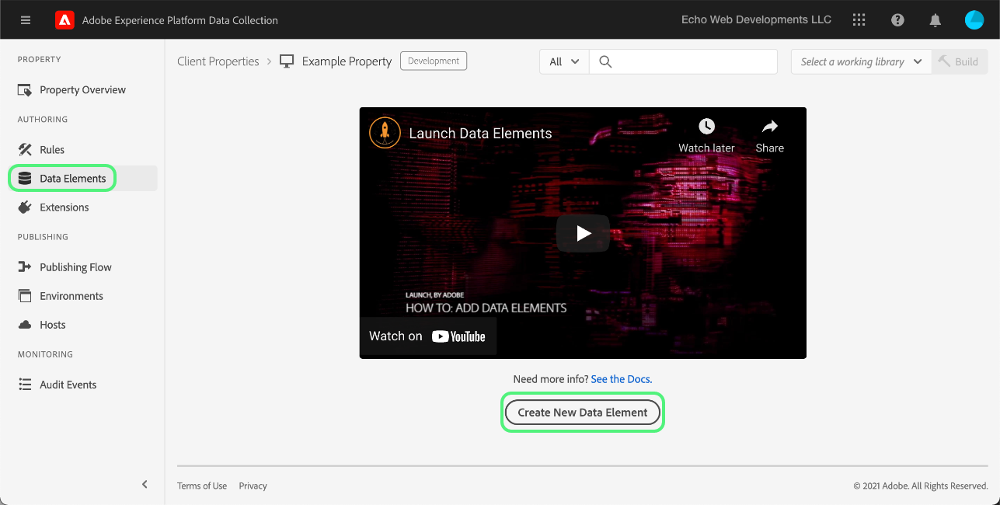
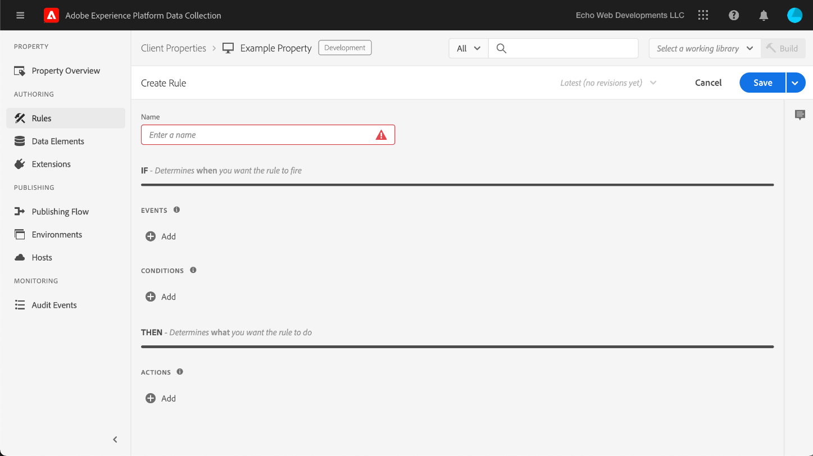

# 上傳並實作端對端測試

>[!NOTE]
>
>Adobe Experience Platform Launch已經過品牌重塑，現在是Adobe Experience Platform中的一套資料收集技術。 因此，所有產品文件中出現了幾項術語變更。 如需術語變更的彙整參考資料，請參閱以下[文件](../../term-updates.md)。

若要在Adobe Experience Platform中測試標籤擴充功能，請使用標籤API和/或命令列工具來上傳您的擴充功能套件。 接下來，使用Platform UI或資料收集UI將您的擴充功能套件安裝至屬性，並在標籤程式庫和組建中執行其功能。

本文介紹如何為擴充功能實作端對端測試。

>[!NOTE]
>
>本指南假設您使用的是MacOS，且已安裝並提供Node.js和npm。

## 驗證您的擴充功能 {#validate}

如果您的團隊對於擴充功能的效能和結果感到滿意，便可在以下連結中檢視： [Sandbox](https://www.npmjs.com/package/@adobe/reactor-sandbox#running-the-sandbox) 工具，您應該已準備好將擴充功能套件上傳至標籤。

上傳之前，請先驗證是否有任何必要欄位或設定需完成。例如，檢閱您的 [擴充功能資訊清單](../manifest.md)，您的 [擴充功能組態](../configuration.md)，您的 [檢視](../web/views.md)，以及您的 [程式庫模組](../web/format.md) （至少）是良好作法。

您的標誌檔案就是明確的範例：請在 `"iconPath": "example.svg",` 檔案中加上 `extension.json` 這一行，並將標誌影像檔案納入您的專案中。這是將顯示給擴充功能的圖示相對路徑。 此路徑不應以斜線開頭。它必須參考副檔名為 `.svg` 的 SVG 檔案。SVG在呈現為正方形時應該會正常顯示，並可由使用者介面縮放。 請參閱 [如何縮放SVG文章](https://css-tricks.com/scale-svg/) 以取得更多詳細資料。

>[!NOTE]
>
>針對公開擴充功能，請在您的 `extension.json` 中納入並附有 Exchange 清單連結的項目。您的[擴充功能資訊清單](../manifest.md)應包含 `"exchangeUrl":"https://www.adobeexchange.com/experiencecloud.details.12345.html"` 之類的項目，指向您 Exchange 清單的 URL。

## 建立 Adobe I/O 整合 {#integration}

若要使用API或命令列工具，您需要具有Adobe I/O的技術帳戶。您必須在I/O主控台中建立技術帳戶，然後使用Uploader工具上傳擴充功能套件。

如需建立技術帳戶以用於Adobe Experience Platform標籤的詳細資訊，請參閱 [Reactor API快速入門](../../api/getting-started.md) 指南。

>[!IMPORTANT]
>
>若要在 Adobe I/O 中建立整合，您必須是 Experience Cloud 組織管理員或 Experience Cloud 組織開發人員。

如果您無法建立整合，表示您可能沒有正確的許可權。 這需要組織管理員為您完成這些步驟，或將您指派為開發人員。

## 上傳您的擴充功能套件 {#upload}

現在您有了認證，就可以端到端地測試擴充功能套件了。

第一次上傳擴充功能套件時，套件會進入 `development` 狀態。這表示它僅對您自己的組織可見，且僅對已標籤為擴充功能開發的屬性可見。

使用命令列在包含.zip套件的目錄中執行下列命令。

```bash
npx @adobe/reactor-uploader
```

`npx` 可讓您下載並直接執行 npm 套件，而無需在機器上實際安裝。這是上傳程式最簡單的執行方式。

Uploader需要您輸入幾項資訊。 技術帳戶ID、API金鑰和其他一些資訊可以從Adobe I/O主控台擷取。 導覽至 I/O 主控台中的[整合頁面](https://console.adobe.io/tw/integrations)。從下拉式清單中選取正確的組織，尋找正確的整合，然後選取 **[!UICONTROL 檢視]**.

- 您的私密金鑰路徑為何？/path/to/private.key。這是您先前在步驟 2 中儲存私密金鑰的位置。
- 您的組織 ID 為何？請從您先前開啟的I/O主控台概觀頁面複製並貼上此內容。
- 您的技術帳戶 ID 為何？請從I/O主控台複製並貼上此專案。
- 您的 API 金鑰為何？請從I/O主控台複製並貼上此專案。
- 使用者端密碼為何？ 請從I/O主控台複製並貼上此專案。
- 您要上傳的 extension_package 的路徑為何？/path/to/extension_package.zip。如果從包含 .zip 套件的目錄中叫用上傳程式，您可以直接從清單中選取，而無需輸入路徑。

您的擴充功能套件將隨即上傳，且上傳程式會為您提供 extension_package 的 ID。

>[!NOTE]
>
>上傳或修補時，系統以非同步的方式擷取及部署擴充功能套件期間，該套件會進入擱置狀態。在此程式進行時，您可以輪詢 `extension_package` 使用API並在UI中用於其狀態的ID。 您會在目錄中看到標示為「擱置中」的擴充功能卡片。

>[!NOTE]
>
>如果您打算經常執行上傳程式，則每次都輸入這些資訊可能會造成負擔。 您也可以從命令列將這些資訊作為引數傳入。 如需詳細資訊，請查看 NPM 文件的[命令列引數](https://www.npmjs.com/package/@adobe/reactor-uploader#command-line-arguments)一節。

## 建立開發屬性 {#property}

登入UI並選取 **[!UICONTROL 標籤]** 在左側導覽列中， [!UICONTROL 屬性] 畫面隨即顯示。 屬性是一個容器，內含您要部署的標記，可用於一或多個網站。


第一次登入時，您的畫面上不會顯示任何屬性。 選取&#x200B;**「新增屬性」**&#x200B;以建立屬性。輸入名稱和 URL。使用測試網站的URL或您要測試擴充功能的頁面。 此網域欄位可供某些擴充功能使用，或供使用核心擴充功能的條件使用。

>[!NOTE]
>
>`localhost` 無法當作URL值使用。 如果您使用，請改為使用任何模擬值進行測試 `localhost` URL。 例如，example.com。

若要將此屬性用於擴充功能開發測試，您必須展開 **進階OPTIONS** 並確保勾選方塊 **針對擴充功能開發進行設定**.


選取底部的&#x200B;**「儲存」**&#x200B;以儲存新屬性。

「屬性」畫面隨即顯示。 選取您剛建立的屬性名稱。「屬性概述」畫面隨即顯示。 它提供系統每個區域的連結，左側欄中有全域導覽連結。

## 安裝您的擴充功能 {#install-extension}

若要在此屬性中安裝您的擴充功能，請選取 **擴充功能** 左側欄中主要導覽連結的連結。 此 **核心** 擴充功能會顯示在 **已安裝** 畫面。 核心擴充功能包含資料收集中的所有標籤管理功能。


若要新增擴充功能，請選取 **目錄** 標籤。


目錄會顯示每個可用擴充功能的卡片圖示。如果您的擴充功能未顯示在目錄中，請確定您已完成Adobe管理主控台設定和建立您的擴充功能套件區段中的上述步驟。 如果平台尚未完成初始處理，您的擴充功能套件也可能會顯示為「擱置中」。

如果您已執行先前步驟，但目錄中仍未顯示「擱置中」或「失敗」擴充功能套件，則應直接使用API檢視擴充功能套件的狀態。 如需如何進行適當API呼叫的詳細資訊，請閱讀 [擷取擴充功能套件](../../api/endpoints/extension-packages.md#lookup) API檔案中。

擴充功能套件處理完畢後，請選取 **安裝** 位於卡片底部。


設定畫面隨即開啟（前提是擴充功能具有擴充功能）。 新增設定擴充功能所需的任何資訊，然後選取底部的&#x200B;**「儲存」**。這裡所示的設定畫面範例使用Facebook擴充功能，此擴充功能需要畫素ID。


您現在應該會看到&#x200B;**已安裝**&#x200B;擴充功能畫面，其中顯示核心擴充功能和您的擴充功能。


## 建立用來測試擴充功能的資源 {#resources}

擴充功能可為Adobe Experience Platform的使用者提供新功能。 這些通常顯示在資料元素或規則產生器中。

### 資料元素

標籤資料元素的用途是協助使用者保留值。 每個資料元素都是來源資料的對應或指標。單一資料元素是可對應至查詢字串、URL、Cookie 值、JavaScript 變數的變數。選取 **資料元素** 從左側導覽列，以及 **建立新資料元素**.



擴充功能可視需要定義資料元素類型，供擴充功能運作之用，或方便使用者操作\。當擴充功能提供資料元素型別時，這些型別會出現在使用者專用的下拉式清單中： **建立資料元素** 畫面：


當使用者選擇您的擴充功能時 **副檔名** 下拉式清單 **資料元素型別** 下拉式清單會填入擴充功能提供的任何資料元素型別。 使用者可將每個資料元素對應至其來源值。然後，在「資料元素變更事件」或「自訂程式碼事件」中建立規則時，可使用資料元素來觸發要執行的規則。資料元素也可用於資料元素條件或規則中的其他條件、例外或動作。

建立資料元素 (設定對應) 後，使用者只需參考資料元素即可參考來源資料。如果值的來源有所變更 (網站重新設計等)，使用者只需在UI中更新一次對應，所有資料元素都會自動接收新的來源值。

### 規則

選取 **規則** 左側導覽中的連結，然後 **建立新規則**.


首先，輸入規則的描述性名稱。 此 **建立規則** 熒幕的設定方式如同 `if-then` 陳述式。



如果發生事件，且符合條件，而且沒有例外，則會觸發動作。擴充功能中也存在相同的流程，您可在其中建立或運用事件、條件、例外、資料元素或動作。

以Facebook擴充功能為例，針對頁面在測試網站上載入的每次機會新增事件。


此 `Window Loaded` **事件型別** 確保每當頁面載入測試網站時，都會觸發此規則。 選取&#x200B;**「保留變更」**。在此範例中，忽略 **條件** 因為測試網站上的任何頁面都應該觸發規則。

下 **動作** 選取 **新增**. 此 **動作設定** 熒幕隨即顯示。接下來，您必須選擇要套用規則的擴充功能，以及觸發規則時要發生的動作。 選取 **facebook Pixel** 從 **副檔名** 下拉式清單，以及 **傳送頁面檢視** 從 **動作型別** 下拉式清單。 選取 **保留變更**，然後 **儲存** 於下列專案 **編輯規則** 畫面。


測試擴充功能時，請選取任何相關的事件、條件等。 任何數量的規則中提供的任何事件、條件等。

## 發佈您的變更 {#publish}

在主要導覽區中選取&#x200B;**「發佈」**，然後選取&#x200B;**「新增程式庫」**&#x200B;連結：


程式庫是擴充功能、資料元素和規則部署後，彼此間以及與網站間將如何互動的一組指示。程式庫會編譯到組建中。一個程式庫可以包含使用者想一次進行或測試的所有變更，數量不限。

於 **建立資料庫** 畫面，在中新增名稱 **名稱** 文字欄位。 標籤提供預設開發環境，命名為 **開發**. 選取 **開發** 從 **環境** 下拉式清單。 為簡化起見，請新增所有可用資源。 選取 **新增所有變更的資源**，然後選取 **儲存**.

>[!NOTE]
>
>將資源新增至程式庫時，系統會建立該資源當下的快照，並新增至程式庫。若您之後變更資源 (例如因執行必要的修正作業而變更)，將必須同時更新程式庫，以納入資源的最新變更。為此，您也可以使用&#x200B;**「新增所有已變更的資源」**&#x200B;按鈕。


現在所有變更都已納入新建立的程式庫中(已命名 **開發** 在提供的範例中)，選取 **儲存並建置到開發環境**.


建置流程完成後，綠色的 **成功** 指標會顯示在程式庫名稱旁邊。


標籤庫現已發佈並可供使用。 測試頁面必須使用新建立的程式庫，才能在瀏覽器中測試一般使用者的頁面行為。

## 在測試網站上安裝標籤 {#install-data-collection-tags}

安裝指示可在環境索引標籤中取得。 此頁面會顯示所有可用的環境，並可讓您建立更多環境。 程式庫發佈至開發環境時，請選取 **安裝** 上的欄 **開發** 列。


此 **網頁安裝指示** 隨即顯示開發環境的對話方塊。 選取復製圖示以複製整個 `<script>` 標籤之間。


透過放置此單一完成安裝 `<script>` 標籤內 `<head>` 檔案或網站範本的區段。 接下來，請造訪測試網站，檢查已發佈標籤程式庫的行為。

## 測試 {#test}

以下是在測試頁面或網站上驗證擴充功能的實用主控台命令清單。

- `_satellite.setDebug(true);` 會啟用偵錯模式，並將有用的記錄陳述式輸出至主控台。
- 此 `_satellite._container` 物件包含有關已部署程式庫的實用資訊，包括有關所包含組建、資料元素、規則和擴充功能的詳細資訊。

此測試的目的是檢查已部署程式庫的功能，並確保擴充功能套件在編入程式庫後，會如預期般運作。

當您發現需要對擴充功能套件進行的變更時，其反覆運算程序與開發程序相類似。

1. 對您專案中的程式碼進行變更。
1. 使用沙箱工具驗證變更.
1. 使用封裝程式工具建立新的 .zip 套件
1. 使用Uploader工具上傳新的.zip套件。 該程式遵循與先前相同的關於初始上傳的指示。 不過，您會注意到，由於在開發模式中已有該名稱的擴充功能套件，因此這個新套件將會覆寫較舊的版本，而非建立新套件。

   >[!NOTE]
   >
   >可在命令列上傳遞引數，以避免重複輸入認證以節省時間。 如需詳細資訊，請閱讀 [reactor-uploader檔案](https://www.npmjs.com/package/@adobe/reactor-uploader).
1. 更新現有套件時，可跳過安裝步驟。
1. 修改資源 — 如果任何擴充功能元件的設定已變更，您將需要在UI中更新這些資源。
1. 將您的最新變更新增至程式庫，然後重新建置.
1. 完成另一輪測試。
