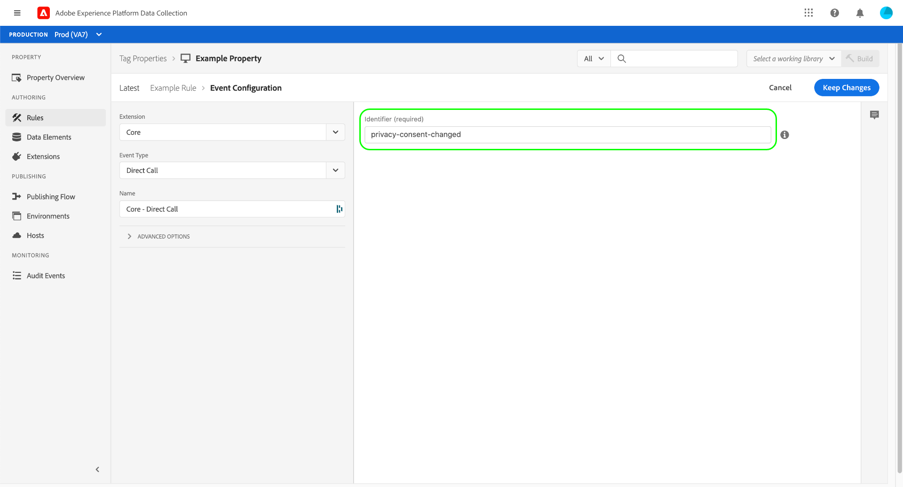

# 核心擴展概述

>[!NOTE]
>
>Adobe Experience Platform Launch已被改名為Adobe Experience Platform的一套資料收集技術。 因此，所有產品文件中出現了幾項術語變更。 如需術語變更的彙整參考資料，請參閱以下[文件](../../../term-updates.md)。

核心標籤擴展是隨Adobe Experience Platform發佈的預設擴展。

本文檔提供有關使用核心擴展構建規則時可用選項的資訊。

## 核心擴充功能事件類型 {#core-extension-event-types}

本主題說明核心擴充功能中可用的事件類型。有關可為多種不同事件類型設定的選項的資訊，請參見 [選項](#options) 的子菜單。

### 基於瀏覽器的事件

#### 標籤模糊

當制表符失去焦點時，制表符模糊事件將觸發操作。 此事件類型沒有設定。

#### 標籤聚焦

標籤焦點事件在標籤獲得焦點時觸發操作。 此事件類型沒有設定。

### 表單

#### 失焦

當表單失去焦點時，模糊事件將觸發操作。 查看 [選項](#options) 的子菜單。

#### 聚焦

當表單獲得焦點時，焦點事件觸發操作。 查看 [選項](#options) 的子菜單。

#### 提交

提交表單時，提交事件將觸發操作。 查看 [選項](#options) 的子菜單。

### 鍵盤控制事件

#### 按鍵點按

按鍵時，事件將觸發。 查看 [選項](#options) 的子菜單。

### 基於媒體的事件

#### 媒體已結束

當介質結束時，事件將觸發。 查看 [選項](#options) 的子菜單。

#### 媒體載入的資料

當媒體載入資料時，事件將觸發。 查看 [選項](#options) 的子菜單。

#### 媒體暫停

媒體暫停時，事件將觸發。 查看 [選項](#options) 的子菜單。

#### 媒體播放

播放媒體時，事件觸發。 查看 [選項](#options) 的子菜單。

#### 媒體已中止

如果介質停止，則觸發事件。 查看 [選項](#options) 的子菜單。

#### 媒體播放時間

如果媒體在指定時間長度內播放，則觸發事件。 必須指定媒體必須播放的持續時間才能觸發事件。 查看 [選項](#options) 的子菜單。


#### 媒體卷已更改

如果卷升高或降低，則觸發事件。 查看 [選項](#options) 的子菜單。

### 面向移動設備的事件

#### 方向變更

如果設備的方向發生更改，事件將觸發。 必須指定方向必須更改的持續時間才能觸發事件。 此事件類型沒有設定。

#### 縮放變更

如果用戶放大或縮小，則觸發事件。 此事件類型沒有設定。

### 滑鼠控制事件

#### 按一下

如果選擇了指定的元素（按一下），則觸發事件。 或者，您可以為元素指定在事件引發之前必須為 true 的屬性值。

如果元素是錨標籤(`<a>`)，您還可以指定是否將導航延遲一段時間。 如果您的規則需要額外的執行時間，並且通常在進行頁面導航之前無法完成，則此操作將非常有用。

>[!WARNING]
>
>如果使用不當，此選項可能會給用戶體驗帶來負面影響，因此應格外小心。

使用連結延遲時，平台實際上會阻止瀏覽器從頁面導航。 然後在指定超時後執行JavaScript重定向到原始目標。 當頁面標籤具有 `<a>` 標籤，其中預期功能實際上不會使用戶離開頁面。 如果您無法以任何其他方式解決問題，則您應該使用選擇器定義非常精確，這樣，此事件就會在您需要它的地方觸發，而不會觸發其它任何地方。

預設鏈路延遲值為100毫秒。 請注意，標籤將始終等待指定的時間量，並且未以任何方式連接到規則操作的執行。 延遲可能會迫使用戶等待的時間超過所需時間，也可能延遲不足以使規則的所有操作成功完成。 延遲更長，可以為規則執行提供更多時間，但也會惡化用戶體驗。

要獲得延遲，必須同時提供觸發事件的選定元素和觸發事件之前的特定時間。

有關高級選項，請參閱 [選項](#options) 的子菜單。

#### 游標停留

如果用戶在指定的元素上停留，則事件將觸發。 您還必須配置規則是立即觸發還是在指定毫秒數後觸發。 查看 [選項](#options) 的子菜單。

### 其他事件

#### 自訂事件

如果發生自定義事件類型，則觸發事件。 在代碼庫中其他位置定義的命名JavaScript函式可用作自定義事件類型。 必須指定自定義事件類型的名稱，並配置任何其他設定（如所述） [選項](#options) 的下界。

#### 資料元素變更

如果指定的資料元素發生更改，則觸發事件。 必須為資料元素提供名稱。 可以通過在文本欄位中鍵入資料元素的名稱，或選擇文本欄位右側的資料元素表徵圖並從顯示的對話框中提供的清單中進行選擇來選擇資料元素。

#### 直接呼叫 {#direct-call-event}

直接呼叫事件繞過事件檢測和查找系統。 直接呼叫規則是您希望確切告訴系統發生什麼情況的理想選擇。 此外，當系統無法檢測DOM中的事件時，它們是理想的。

定義直接呼叫事件時，必須指定將用作此事件標識符的字串。 如果 [觸發直接呼叫操作](#direct-call-action) 將觸發包含相同標識符的所有直接呼叫事件規則，以便偵聽該標識符。



#### 元素存在

如果指定的元素存在，則觸發事件。 查看 [選項](#options) 的子菜單。

#### 進入檢視區

如果用戶進入指定的視區，則事件將觸發。 必須提供CSS選擇器作為目標匹配元素的條件。 您還必須配置規則是立即觸發還是在指定毫秒數後觸發，以及事件應在每次事件發生時還是僅在第一次觸發。

查看 [選項](#options) 的子菜單。

#### 歷史記錄變更

如果發生pushState或哈希更改事件，則觸發事件。 此事件類型沒有設定。

#### 花在頁面上的時間

如果用戶在頁上保留指定的秒數，則觸發事件。 必須指定觸發事件之前必須經過的秒數。

### 頁面載入事件

#### DOM 已就緒

當DOM就緒且用戶可以與頁面交互時，事件將觸發。 此事件類型沒有設定。

#### 程式庫已載入 (頁面頂端) {#library-loaded-page-top}

一旦載入了標籤庫，事件就會觸發。 此事件類型沒有設定。

#### 頁面底部 {#page-bottom}

事件觸發器一次 `_satellite.pageBottom();` 被打過電話。 非同步載入標籤庫時，不應使用此事件類型。 此事件類型沒有設定。

#### 視窗已載入

當瀏覽器調用onLoad且頁面已完成載入時，事件觸發器。 此事件類型沒有設定。

### 選項 {#options}

每個表單事件類型均使用下列設定：

#### 特定元素 \| 任何元素

* 如果您選擇 **[!UICONTROL 特定元素]**，將顯示選擇元素和屬性值的選項。
* 如果您選擇 **[!UICONTROL 任意元素]**，沒有進一步的選項來縮小元素的範圍。

#### 符合 CSS 選擇器的元素

輸入可識別會觸發事件的元素之 CSS 選擇器。

#### 且具有特定屬性值

一旦選取此選項，即可使用下列參數：

* `property=value`

   指定屬性的值

* Regex

   如果 `property=value` 為規則運算式，則啟用。

* 新增

   新增另 `property=value` 組。

#### 進階選項 (事件反昇)

* 即使事件源自子系元素，仍執行此規則
* 即使事件已觸發以子系元素為目標的規則，仍可執行此規則
* 規則執行後，防止事件觸發以上階元素為目標的規則

## 核心擴充功能條件類型

本節說明核心擴充功能中可用的條件類型。這些條件類型可與正常或例外邏輯類型一起使用。

### 資料

#### Cookie

指定 Cookie 名稱和哪個值必須存在，事件才會觸發動作。

1. 指定 Cookie 名稱。
1. 輸入 Cookie 中必須存在哪個值事件才會觸發動作。
1. (選用) 若這是規則運算式，請啟用 Regex。

#### 自訂程式碼

指定必須存在作為事件條件的任何自訂程式碼。

>[!NOTE]
>
>自定義代碼現在支援ES6+ JavaScript。 請注意，某些較舊的瀏覽器不支援ES6+。 要瞭解使用ES6+函式的影響，請對應支援的所有Web瀏覽器進行test。

使用內置代碼編輯器輸入自定義代碼：

1. 選擇 **[!UICONTROL 開啟編輯器]**。
1. 輸入自訂程式碼。
1. 選取「**[!UICONTROL 儲存]**」。

名為 `event` 的變數會自動開放使用，以便您在自訂程式碼中參照。`event` 物件將包含觸發規則之事件的實用資訊。要判斷哪些資料事件可供使用，最簡單的方式是將自訂程式碼中的 `event` 登錄到控制台:

```javascript
console.log(event);
return true;
```

在瀏覽器中執行規則，並在瀏覽器控制台中檢查您所登錄的事件物件。了解哪些資訊可供使用後，就能在自訂程式碼時適度參考，做出程式設計決策。

*條件排序*

當啟用屬性設定中的「按順序運行規則元件」選項時，您可以在條件執行非同步任務時等待後續規則元件。

條件傳回 [Promise](https://developer.mozilla.org/zh-TW/docs/Web/JavaScript/Reference/Global_Objects/Promise) 後，唯有當傳回的 Promise 順利解決後，才執行規則中的下一個條件。如果承諾被拒絕，則標籤將該條件視為失敗，並且不會執行該規則中的進一步條件或操作。

傳回 Promise 的條件範例：

```javascript
return new Promise(function(resolve, reject) {
  setTimeout(function() {
    if (new Date().getDay() === 5) {
      resolve();
    } else {
      reject();
    }
  }, 1000);
});
```

#### 值比較 {#value-comparison}

比較兩個值以判斷此條件是否傳回 true。

如果規則具有多個條件，則可能因為其他條件評估為 false，或有一個例外評估為 true，造成此條件會傳回 true，但規則仍不會引發。

1. 提供一個值。
1. 選取運算子。請參閱下方的值比較運算子清單，以了解詳細資訊。
1. (必要時) 選取比較是否應區分大小寫。
1. 提供另一個值作為比較對象。

可使用下列的值比較運算子：

**等於：**&#x200B;如果使用非嚴格比較，且兩值相等 (在 JavaScript 中為「==」運算子)，則條件會傳回 true。值可為任何類型。在值欄位中輸入 _true_、_false_、_null_ 或 _undefined_ 時，系統會將該字詞當成字串進行比較，且不會轉換為其 JavaScript 相等值。

**不等於：**&#x200B;如果使用非嚴格 (non-strict) 比較，且兩值不相等 (在 JavaScript 中為「! =」運算子)，則條件會傳回 true。值可為任何類型。在值欄位中輸入 _true_、_false_、_null_ 或 _undefined_ 時，系統會將該字詞當成字串進行比較，且不會轉換為其 JavaScript 相等值。

**包含：**&#x200B;如果第一個值包含第二個值，則條件會傳回 true。數字會轉換為字串。數字或字串以外的任何值會都導致條件傳回 false。

**不包含：**&#x200B;如果第一個值不包含第二個值，則條件會傳回 true。數字會轉換為字串。數字或字串以外的任何值都會導致條件傳回 true。

**開頭為：**&#x200B;如果第一個值開頭為第二個值，則條件會傳回 true。數字會轉換為字串。數字或字串以外的任何值會都導致條件傳回 false。

**開頭非為：**&#x200B;如果第一個值的開頭不是第二個值，則條件會傳回 true。數字會轉換為字串。數字或字串以外的任何值會都導致條件傳回 true。

**結尾為：**&#x200B;如果第一個值的結尾是第二個值，則條件會傳回 true。數字會轉換為字串。數字或字串以外的任何值會都導致條件傳回 false。

**結尾非為：**&#x200B;如果第一個值的結尾不是第二個值，則條件會傳回 true。數字會轉換為字串。數字或字串以外的任何值會都導致條件傳回 true。

**符合 Regex：**&#x200B;如果第一個值符合規則運算式，則條件會傳回 true。數字會轉換為字串。數字或字串以外的任何值會都導致條件傳回 false。

**不符合 Regex：**&#x200B;如果第一個值不符合規則運算式，則條件會傳回 true。數字會轉換為字串。數字或字串以外的任何值會都導致條件傳回 true。

**小於：**&#x200B;如果第一個值小於第二個值，則條件會傳回 true。代表數字的字串會轉換為數字。數字或可轉換字串以外的任何值都會導致條件傳回 false。

**小於或等於：**&#x200B;如果第一個值小於或等於第二個值，則條件會傳回 true。代表數字的字串會轉換為數字。數字或可轉換字串以外的任何值都會導致條件傳回 false。

**大於：**&#x200B;如果第一個值大於第二個值，則條件會傳回 true。代表數字的字串會轉換為數字。數字或可轉換字串以外的任何值都會導致條件傳回 false。

**大於或等於：**&#x200B;如果第一個值大於或等於第二個值，則條件會傳回 true。代表數字的字串會轉換為數字。數字或可轉換字串以外的任何值都會導致條件傳回 false。

**為 True：**&#x200B;如果值是布林值且為 true，則條件會傳回 true。若提供的值是任何其他類型，則不會轉換為布林值。帶有 true 值的布林值以外的任何值都會導致條件傳回 false。

**為 Truthy：**&#x200B;如果值在轉換為布林值後為 true，條件會傳回 true。如需 Truthy 值的範例 ，請參閱 [MDN 的 Truthy 文件](https://developer.mozilla.org/zh-TW/docs/Glossary/Truthy)。

**為 False：**&#x200B;如果值是布林值且為 false，則條件會傳回 true。若提供的值是任何其他類型，則不會轉換為布林值。帶有 false 值的布林值以外的任何值都會導致條件傳回 false。

**為 Falsy：**&#x200B;如果值轉換為布林值後為 false，條件會傳回 true。如需 Falsy 值的範例 ，請參閱 [MDN 的 Falsy 文件](https://developer.mozilla.org/zh-TW/docs/Glossary/Falsy)。

#### 變數

指定 JavaScript 變數名稱和哪個值必須存在，事件才會觸發動作。

1. 指定 JavaScript 變數名稱。
1. 指定必須存在作為事件條件的變數值。
1. (選用) 若這是規則運算式，請啟用 Regex。

### 參與

#### 登陸頁面

指定使用者必須在哪個頁面登陸才會觸發事件。

1. 指定登陸頁面。
1. (選用) 若這是規則運算式，請啟用 Regex。

#### 新訪客/回訪訪客

指定訪客須為新訪客或舊訪客，事件才會觸發動作。

選取下列其中一項：

* 新訪客
* 回訪訪客

#### 頁面檢視

設定觸發動作之前訪客必須檢視頁面幾次。

1. 選擇頁面檢視次數必須大於、等於或小於指定值。
1. 指定決定是否符合條件的頁面檢視次數。
1. 選擇下列其中一項，設定計入頁面檢視次數的時間：
   * 期限
   * 目前的工作階段

#### 工作階段

若使用者的工作階段數符合指定準則，則觸發動作。

1. 選擇工作階段數必須大於、等於或小於指定值。
1. 指定決定是否符合條件的工作階段數。

#### 網站逗留時間

若使用者的工作階段數符合指定準則，則觸發動作。

設定訪客必須在網站上逗留多久才會觸發動作。

1. 選取訪客在網站上逗留的分鐘數必須大於、等於或小於指定值。
1. 指定決定是否符合條件的分鐘數。

#### 流量來源

若使用者的工作階段數符合指定準則，則觸發動作。

指定訪客流量的來源必須為何才會觸發動作。

1. 指定流量來源。
1. (選用) 若這是規則運算式，請啟用 Regex。

### 技術

#### 瀏覽器

選取訪客必須使用哪個瀏覽器才會觸發動作。

選取下列一或多個瀏覽器：

* Chrome
* Firefox
* Internet Explorer/Edge
* Internet Explorer Mobile
* Mobile Safari
* OmniWeb
* Opera
* Opera Mini
* Opera Mobile
* Safari

#### 裝置類型

選取訪客必須使用哪種裝置類型才會觸發動作。

選取下列一或多種裝置類型：

* Android
* Blackberry
* 桌面
* iPad
* iPhone
* iPod
* Nokia
* Windows Phone

#### 作業系統 

選取訪客必須使用哪個作業系統才會觸發動作。

選取下列一或多個作業系統：

* Android
* Blackberry
* iOS
* Linux
* MacOS
* Maemo
* Symbian OS
* Unix
* Windows

#### 螢幕解析度

選取訪客必須在其裝置上使用哪種螢幕解析度才會觸發動作。

1. 選取訪客裝置的螢幕解析度寬度必須大於、等於或小於指定值。
1. 指定要求的螢幕解析度寬度像素。
1. 選取訪客裝置的螢幕解析度高度必須大於、等於或小於指定值。
1. 指定要求的螢幕解析度高度像素。

#### 視窗大小

選取訪客必須在其裝置上使用多大的視窗才會觸發動作。

1. 選取訪客裝置的視窗大小寬度是否必須大於、等於或小於指定值。
1. 指定要求的視窗大小寬度像素。
1. 選取訪客裝置的視窗大小高度必須大於、等於或小於指定值。
1. 指定要求的視窗大小高度像素。

### URL

#### 網域

指定訪客的網域。

#### 雜湊

指定 URL 中必須存在的一或多個雜湊模式。

>[!NOTE]
>
>您可使用 OR 聯結多個雜湊模式。

1. 指定雜湊模式。
1. (選用) 若這是規則運算式，請啟用 Regex。
1. 新增任何其他雜湊模式。

#### 路徑和查詢字串

指定 URL 中必須存在的一或多個路徑。這包括路徑和查詢字串。

>[!NOTE]
>
>您可使用 OR 聯結多個路徑。

1. 指定路徑。
1. (選用) 若這是規則運算式，請啟用 Regex。
1. 新增任何其他路徑。

#### 不含查詢字串的路徑

指定 URL 中必須存在的一或多個路徑。這包括路徑，但不包括查詢字串。

>[!NOTE]
>
>您可使用 OR 聯結多個路徑。

1. 指定路徑。
1. (選用) 若這是規則運算式，請啟用 Regex。
1. 新增任何其他路徑。

#### 通訊協定

指定 URL 中使用的通訊協定。

選取下列其中一項：

* HTTP
* HTTPS

#### 查詢字串參數

指定 URL 中使用的 URL 參數。

1. 指定 URL 參數名稱。
1. 指定用於 URL 參數的值。
1. (選用) 若這是規則運算式，請啟用 Regex。

#### 子網域

指定 URL 中必須存在的一或多個子網域。

>[!NOTE]
>
>您可使用 OR 聯結多個子網域。

1. 指定子網域。
1. (選用) 若這是規則運算式，請啟用 Regex。
1. 新增任何其他子網域。

### 其他

#### 日期範圍

指定日期範圍。選擇事件發生之後的日期和時間、事件發生之前的日期，以及時區。

#### 最大頻率

指定條件傳回 true 的次數上限。您可選取下列選項：

* 頁面檢視
* 工作階段
* 訪客
* 秒
* 分鐘
* 日
* 週
* 月

若每一工作階段的條件最大頻率為 1，系統會比較這兩個 `localStorage` 項目。如果 `visitorTracking.sessionCount` 大於 `maxFrequency.session` 計數，則取樣條件為 true。如果相等，則條件為 false。

`sessionCount` 是 `visitorTracking` 項目，因此您必須啟用訪客 API，取樣條件才能正常運作。

#### 取樣

指定條件傳回 true 的時間百分比。

## 核心擴充功能動作類型

本節說明核心擴充功能中可用的動作類型。

### 自訂程式碼

>[!NOTE]
>
>自定義代碼現在支援ES6+ JavaScript。 請注意，某些較舊的瀏覽器不支援ES6+。 要瞭解使用ES6+函式的影響，請對應支援的所有Web瀏覽器進行test。

提供觸發事件和評估條件後執行的程式碼。

1. 為動作程式碼命名。
1. 選取用來定義動作的語言：
   * JavaScript
   * HTML
1. 選取是否要全域執行動作程式碼。
1. 選擇 **[!UICONTROL 開啟編輯器]**。
1. 編輯代碼，然後選擇 **[!UICONTROL 保存]**。

當您選取 JavaScript 作為程式語言時，名為 `event` 的變數會自動開放使用，以便您在自訂程式碼中參照。`event` 物件將包含觸發規則之事件的實用資訊。要判斷哪些資料事件可供使用，最簡單的方式是將自訂程式碼中的 `event` 登錄到控制台:

```javascript
console.log(event);
```

在瀏覽器中執行規則，並在瀏覽器控制台中檢查您所登錄的事件物件。了解哪些資訊可供使用後，就能在自訂程式碼時適度參考，以便做出程式設計決策、傳送 `event` 物件的片段到伺服器等等。

### 自訂程式碼動作處理

所有Adobe Experience Platform用戶都可使用的核心擴展包含用於執行用戶提供的JavaScript或HTML的自定義代碼操作。 通常可幫助使用者了解系統如何處理具有自訂程式碼動作的規則。

#### 使用 page top 或 page bottom 事件的規則

來自自定義操作的代碼嵌入到主標籤庫中。 需用 document.write 將程式碼寫入文件中。若規則中有多個自訂程式碼動作，則會按照規則中設定的順序寫入程式碼。

#### 使用 page top 或 page bottom 以外任何事件的規則

自訂動作的程式碼會從伺服器載入，並使用 [Postscribe](https://github.com/krux/postscribe) 寫入文件中。若規則中有多個自訂程式碼動作，則會同時從伺服器載入程式碼，但按照規則設定的順序寫入。

雖然在頁面載入後使用 document.write 通常會出現問題，但這不是透過「自訂程式碼」動作提供的程式碼所造成的問題。無論程式碼執行的時機為何，您都可以在「自訂程式碼」動作中使用 document.write。

#### 自訂程式碼驗證

標籤代碼編輯器中使用的驗證器被設計為識別與開發者編寫的代碼有關的問題。 經過極簡化程序的程式碼 (例如從 Code Manager 下載的 AppMeasurement.js 程式碼) 可能會遭驗證器誤判而標示為有問題，這通常能予以忽略。

#### 動作排序

啟用屬性設定中的「按順序運行規則元件」選項後，您可以在操作執行非同步任務時等待後續規則元件。  這對 JavaScript 和 HTML 自訂程式碼的運作方式不同。

*JavaScript*

建立 JavaScript 自訂程式碼動作後，您可能會從動作傳回 [Promise](https://developer.mozilla.org/zh-TW/docs/Web/JavaScript/Reference/Global_Objects/Promise)。唯有傳回的 Promise 順利解決後，系統才會執行規則中的下一個動作。如果 Promise 遭拒，系統就不會執行規則的下一個動作。

>[!NOTE]
>
>僅當JavaScript未設定為全局執行時，才可使用此功能。 如果您正在全局範圍內執行自定義代碼操作，則標籤會將承諾視為立即解析，並轉到處理隊列中的下一項。

傳回 Promise 的 JavaScript 自訂程式碼動作範例：

```javascript
return new Promise(function(resolve, reject) {
  setTimeout(function() {
    if (new Date().getDay() === 5) {
      resolve();
    } else {
      reject();
    }
  }, 1000);
});
```

*HTML*

建立 HTML 自訂程式碼動作時，將可在自訂程式碼中使用 `onCustomCodeSuccess()` 函數。您可以調用此函式來指示自定義代碼已完成，並且標籤可能會繼續執行後續操作。 另一方面，如果您的自訂程式碼在某個環節執行失敗，您可以呼叫 `onCustomCodeFailure()`。這將通知標籤不執行該規則中的後續操作。

使用新回呼的 HTML 自訂程式碼動作範例：

```html
<script>
setTimeout(function() {
  if (new Date().getDay() === 5) {
    onCustomCodeSuccess();
  } else {
    onCustomCodeFailure();
  }
}, 1000);
</script>
```

### 觸發直接呼叫 {#direct-call-action}

此操作將觸發使用特定規則的所有規則 [直接呼叫事件](#direct-call-event)。 配置操作時，必須為要觸發的直接調用事件提供標識符字串。 （可選）您還可以通過 `detail` 對象，它可以包含一組自定義鍵值對。


操作直接映射到 [`track` 方法](../../../ui/client-side/satellite-object.md?lang=en#track) 的 `satellite` 對象，可以通過客戶端代碼訪問。

## 核心擴充功能資料元素類型

資料元素類型由擴充功能決定。可建立的類型沒有限制。

以下各節會說明核心擴充功能中可用的資料元素類型。其他擴充功能則使用其他類型的資料元素。

### Cookie

任何可在下列欄位中參考的可用網域 Cookie：Cookie 名稱欄位。

#### 範例：

`cookieName`

### 常數

之後可在動作或條件中參考的任何常數字串值。

#### 範例：

`string`

### 自訂程式碼

>[!NOTE]
>
>自定義代碼現在支援ES6+ JavaScript。 請注意，某些較舊的瀏覽器不支援ES6+。 要瞭解使用ES6+函式的影響，請對應支援的所有Web瀏覽器進行test。

您可以選取「開啟編輯器」，並在編輯器視窗中插入程式碼，藉此在 UI 中輸入自訂 JavaScript。

您必須在編輯器視窗中輸入傳回陳述式，以指明應作為資料元素值使用的值。如果未包含傳回陳述式或傳回 `null` 或 `undefined` 值，則資料元素的預設值會作為資料元素值使用。

**範例：**

```javascript
var pageType = $('div.page-wrapper').attr('class').split('')[1];
if (window.location.pathname == '/') {
  return 'homepage';
} else {
  return pageType;
}
```

如果自訂程式碼資料元素是在執行規則期間所擷取，則名為 `event` 的變數會自動開放使用，以便您在自訂程式碼中參照。`event` 物件將包含觸發規則之事件的實用資訊。要判斷哪些資料事件可供使用，最簡單的方式是將自訂程式碼中的 `event` 登錄到控制台:

```javascript
console.log(event);
return true;
```

在瀏覽器中執行規則，並在瀏覽器控制台中檢查您所登錄的事件物件。了解可能會使用您資料元素的各種規則中，有哪些資訊可供使用之後，就能在自訂程式碼時參考，以便做出程式設計決策，或將 `event` 物件的片段作為資料元素的值傳回。

### DOM 屬性

任何可擷取的元素值，例如 div 或 H1 標籤。

#### 範例：

CSS 選擇器鏈結：

`id#dc logo img`

取得下列項目的值：

`src`

### JavaScript 變數

任何可用的 JavaScript 物件或變數可使用下列路徑欄位參照。

標籤資料元素可用於捕獲標籤JavaScript變數或對象屬性。 然後，通過引用標籤資料元素，可以在擴展或自定義規則中使用這些值。 如果資料源更改，則只需更新對源的引用。

在以下示例中，標籤包含名為 `Page_Name`。

```markup
<script>
  //data layer
  var Page_Name = "Homepage"
</script>
```

建立資料元素時，只需提供該變數的路徑即可。

如果將資料收集器對象用作資料層的一部分，請在路徑中使用點標籤來引用要捕獲到資料元素中的對象和屬性，如 `_myData.pageName`或 `digitalData.pageName`等等。

#### 範例：

`window.document.title`

### 本機儲存

在「本機儲存項目名稱」欄位中提供本機儲存項目的名稱。

本機儲存讓瀏覽器能在頁面之間儲存資訊 ([https://www.w3schools.com/html/html5_webstorage.asp](https://www.w3schools.com/html/html5_webstorage.asp))。本機儲存的運作方式與 Cookie 類似，但更大也更有彈性。

使用提供的欄位來指定您為本機儲存項目建立的值，例如 `lastProductViewed.`

### 合併對象

選擇多個資料元素，每個資料元素都提供一個對象。 這些對象將深度（遞歸）合併在一起以生成新對象。 不會修改源對象。 如果在多個源對象上的同一位置找到屬性，則將使用後一個對象的值。 如果源屬性值為 `undefined`，它不會覆蓋先前源對象中的值。 如果在多個源對象上的同一位置找到陣列，則會連接這些陣列。

例如，假定您選擇了一個資料元素，該元素提供以下對象：

```
{
  "sport": {
    "name": "tennis"
  },
  "dessert": "ice cream",
  "fruits": [
    "apple",
    "banana"
  ]
}
```

假定您還選擇了另一個資料元素，該元素提供以下對象：

```
{
  "sport": {
    "name": "volleyball"
  },
  "dessert": undefined,
  "pet": "dog",
  "instrument": undefined,
  "fruits": [
    "cherry",
    "duku"
  ]
}
```

「合併對象」資料元素的結果將是以下對象：

```
{
  "sport": {
    "name": "volleyball"
  },
  "dessert": "ice cream",
  "pet": "dog",
  "instrument": undefined,
  "fruits": [
    "apple",
    "banana",
    "cherry",
    "duku"
  ]
}
```

### 頁面資訊

使用這些資料點來擷取頁面資訊，以便用於規則邏輯或者傳送資訊至 Analytics 或外部追蹤系統。

您可以選取下列其中一個頁面屬性以用於資料元素：

* URL
* 主機名稱
* 路徑名稱
* 通訊協定
* 反向連結
* 標題

### 查詢字串參數

在「URL 參數」欄位中指定單一 URL 參數。

只需指定名稱部分，任何特殊指示項 (如 &quot;?&quot;或「=」)

#### 範例：

`contentType`

### 隨機數字

使用此資料元素產生隨機數字。它通常用於採樣資料或建立ID，如命中ID。 隨機數字也可用來模糊化敏感性資料，或對其進行 Salt 處理。某些範例可能包括：

* 產生點擊 ID
* 將數字串聯至使用者代號或時間戳記以確保獨特性
* 對 PII 資料執行單向雜湊
* 隨機決定在網站上顯示調查要求的時機

指定隨機數字的最小值和最大值。

**預設值：**

最小：0

最大：1000000000

### 工作階段儲存

在「工作階段儲存項目名稱」欄位中提供工作階段儲存項目的名稱。

工作階段儲存與本機儲存類似，除了在工作階段結束後會捨棄資料，但本機儲存或 Cookie 可能會保留資料。

### 訪客行為

與頁面資訊類似，此資料元素使用常見行為類型來豐富規則和其他平台解決方案中的邏輯。

選取下列其中一個訪客行為屬性：

* 登陸頁面
* 流量來源
* 網站逗留分鐘數
* 工作階段計數
* 工作階段頁面檢視計數
* 期限頁面檢視計數
* 新訪客身分

常見的使用案例包括：

* 訪客在網站逗留 5 分鐘後顯示調查
* 如果這是造訪的登陸頁面，請填入 Analytics 量度
* 在 X 次工作階段計數後向訪客顯示新活動內容
* 若為首次訪客，顯示電子報註冊

### 條件值

的包裝 [值比較](#value-comparison-value-comparison) 的子菜單。 根據比較結果，將返回窗體中兩個可用值之一。 因此可以處理&quot;如果……然後……否則……&quot; 不需要額外規則的情況。

### 運行時環境

允許您選擇以下變數之一：

* 環境階段 — 返回 `_satellite.environment.stage` 區分開發/準備/生產環境。
* 庫生成日期 — 返回 `turbine.buildInfo.buildDate` 包含相同值，如 `_satellite.buildInfo.buildDate`。
* 屬性名稱 — 返回 `_satellite.property.name` 獲取啟動屬性的名稱。
* 屬性ID — 返回 `_satellite.property.id` 獲取Launch屬性的ID
* 規則名稱 — 返回 `event.$rule.name` 包含已執行規則的名稱。
* 規則ID — 返回 `event.$rule.id` 包含已執行規則的ID。
* 事件類型 — 返回 `event.$type` 包含觸發規則的事件類型。
* 事件詳細資訊負載 — 返回 `event.detail` 包含自定義事件或直接呼叫規則的負載。
* 直接呼叫標識符 — 返回 `event.identifier` 包含直接呼叫規則的標識符。

### 設備屬性

返回以下訪問者設備屬性之一：

* 瀏覽器窗口大小
* 螢幕大小

### JavaScript工具

它是常用JavaScript操作的包裝。 它接收一個資料元素作為輸入。 它返回以下資料元素值轉換之一的結果：

* 基本字串操作（replace、substring、regex匹配、第一個和最後一個索引、拆分、切片）
* 基本陣列操作（切片、連接、彈出、移位）
* 基本通用運算（切片、長度）