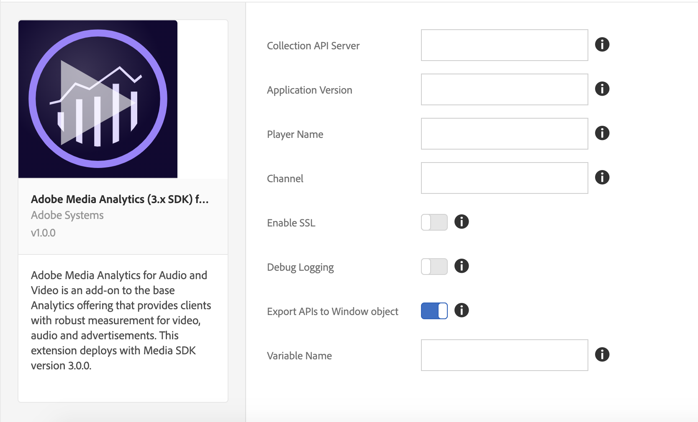

# Adobe Medium分析(3.x SDK)，用於音頻和視頻擴展概述

>[!NOTE]
>
>Adobe Experience Platform Launch已被改名為Adobe Experience Platform的一套資料收集技術。 因此，所有產品文件中出現了幾項術語變更。 如需術語變更的彙整參考資料，請參閱以下[文件](../../../term-updates.md)。

本文件主要說明安裝、設定和實作 Adobe Media Analytics (3.x SDK) for Audio and Video 擴充功能 (Media Analytics 擴充功能) 的相關資訊，其中包含使用此擴充功能來建立規則時可用的選項，以及範例和範例連結。

Media Analytics (MA) 擴充功能新增核心 JavaScript Media SDK (Media 3.x SDK)。此擴展提供了添加 `Media` 跟蹤器實例到啟用標籤的站點或項目。 MA 擴充功能需要額外的擴充功能：

* [Analytics 擴充功能](../analytics/overview.md)
* [Experience Cloud ID 擴充功能](../id-service/overview.md)

>[!IMPORTANT]
>
>此擴充功能會與 Media 3.x SDK 一併部署，且無法向下相容於 Media 2.x SDK。自2.x已棄用以來，請更新為3.x。

在啟用標籤的項目中包括了上述所有三個擴展後，可以通過以下兩種方式之一繼續：

* 從您的網頁應用程式使用 `Media` API
* 納入或建立播放器特定的擴充功能，此模組會將特定的媒體播放器事件對應到 `Media` 追蹤器例項上的 API。此例項會透過 MA 擴充功能公開。

## 安裝並設定 MA 擴充功能

* **安裝：** 要安裝MA擴展，請開啟擴展屬性，選擇 **[!UICONTROL 擴展>目錄]**，懸停在 **[!UICONTROL Adobe Medium分析(3.x SDK)，用於音頻和視頻]** 擴展，然後選擇 **[!UICONTROL 安裝]**。

* **配置：** 要配置MA擴展，請開啟 [!UICONTROL 擴展] 頁籤，懸停在擴展上，然後選擇 **[!UICONTROL 配置]**:



### 設定選項：

| 選項 | 說明 |
| :--- | :--- |
| Collection API Server | 定義 Media Collection API 伺服器 (請連絡您的 Adobe 代表以取得此伺服器) |
| Application Version | 媒體播放器應用程式/SDK 的版本 |
| Player Name | 使用的媒體播放器名稱 (例如：「AVPlayer」、「HTML5 播放器」、「我的自訂視訊播放器」) |
| Channel | 管道名稱屬性 |
| Debug Logging | 啟用或停用記錄 |
| Enable SSL | 啟用或停用透過 HTTPS 傳送 Ping |
| Export APIs to Window Object | 啟用或停用將 Media Analytics API 匯出至全域範圍 |
| Variable Name | 用來匯出 `window` 物件下 Media Analytics API 的變數 |

**提醒：** MA 擴充功能需有 [ Analytics](../analytics/overview.md) 和 [Experience Cloud ID](../id-service/overview.md) 擴充功能，才能正常運作。您也必須將這些擴充功能新增至擴充功能屬性並加以設定。

## 使用 MA 擴充功能

### 從網頁/JS 應用程式使用

MA擴展通過啟用「將API導出到窗口對象」設定來導出全局窗口對象中的媒體API [!UICONTROL 配置] 的子菜單。 這會以設定的變數名稱匯出 API。例如，如果變數名稱設為 `ADB`，則可使用 `window.ADB.Media` 來存取 Media API。

>[!IMPORTANT]
>
> MA 擴充功能僅會在 `window["CONFIGURED_VARIABLE_NAME"]` 未定義時匯出 API，不會覆寫現有變數。

1. **Media API：** `window["CONFIGURED_VARIABLE_NAME"].Media`

   Media SDK 的所有 API 和常數都會公開：[https://adobe-marketing-cloud.github.io/media-sdks/reference/javascript_3x/APIReference.html](https://adobe-marketing-cloud.github.io/media-sdks/reference/javascript_3x/APIReference.html)

1. **建立 Media 追蹤器例項：** `window["CONFIGURED_VARIABLE_NAME"].Media.getInstance`

   **傳回值：追蹤媒體工作階段的**&#x200B;一種`Media`追蹤器例項。

   ```javascript
   var Media = window["CONFIGURED_VARIABLE_NAME"].Media;
   
   var tracker = Media.getInstance();
   ```

1. 使用媒體追蹤器例項，並按照 [JS API 文件](https://adobe-marketing-cloud.github.io/media-sdks/reference/javascript_3x/index.html)所述來實作媒體追蹤功能。

範例播放器可從這裡取得：[MA 範例播放器](https://github.com/Adobe-Marketing-Cloud/media-sdks/tree/master/samples/launch/js/3.x)。範例播放器可作為參考，以示範如何使用 MA 擴充功能直接從網路應用程式支援 Media Analytics。


### 從其他擴充功能使用

MA擴展顯示 `media` 作為共用模組到其他擴展。 (如需共用模組的其他資訊，請參閱[共用模組文件](../../../extension-dev/web/shared.md))。

>[!IMPORTANT]
>
> 共用模組只能從其他擴充功能存取。也就是說，網頁/JavaScript 應用程式無法存取共用模組，或在擴充功能之外使用 `turbine` (請參閱以下程式碼範例)。

1. **Media API：**`media`共用模組

   Media SDK 的所有 API 和常數都會公開：[https://adobe-marketing-cloud.github.io/media-sdks/reference/javascript_3x/APIReference.html](https://adobe-marketing-cloud.github.io/media-sdks/reference/javascript_3x/APIReference.html)

1. 建立 Media 追蹤器例項，如下所示：

   **傳回值：追蹤媒體工作階段的**&#x200B;一種`Media`追蹤器例項。

   ```javascript
   var Media =
     turbine.getSharedModule('adobe-media-analytics', 'media');
   
   var tracker = Media.getInstance();
   ```

1. 使用媒體追蹤器例項，並按照 [JS API 文件](https://adobe-marketing-cloud.github.io/media-sdks/reference/javascript_3x/index.html)所述來實作媒體追蹤功能。

>[!NOTE]
>
>**測試：**&#x200B;若要在這個版本中測試擴充功能，您必須將其上傳至 [ Platform ](../../../extension-dev/submit/upload-and-test.md)以便在其中存取所有相依的擴充功能。
