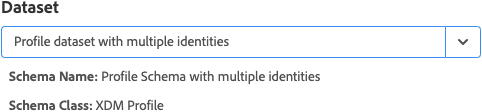
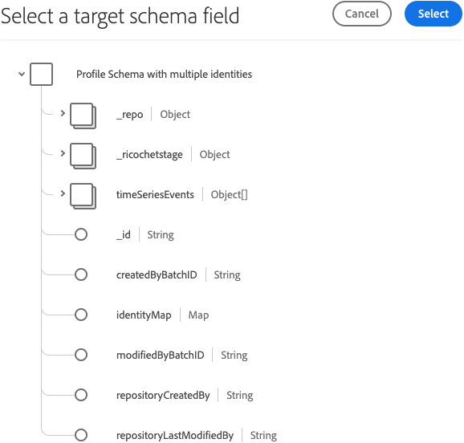

# Adobe Experience Platform 示範擴充功能

>[!NOTE]
>
>Adobe Experience Platform Launch已經過品牌重塑，現在是Adobe Experience Platform中的一套資料收集技術。 因此，所有產品文件中出現了幾項術語變更。 如需術語變更的彙整參考資料，請參閱以下[文件](../../../term-updates.md)。

>[!NOTE]
>
>此擴充功能已遭取代，取代 [Adobe Experience Platform Web SDK](../web-sdk/overview.md).

此擴充功能的功能已移至新的擴充功能。以下快速比較目前功能。

| Platform示範擴充功能 | Platform Web SDK |
| ------------------ | ----------- |
| 支援自訂客戶 ID | 支援自訂客戶 ID |
| XDM的使用者端對應UI | 內建 ECID (不需 visitor.js) |
| 能夠建立串流連線 | 選擇加入支援 |
| | XDM 支援為資料元素 |
| | 第一方網域支援 |
| | 內建偵錯工具 |
| | 自動收集瀏覽器內容 |
| | 完全開放原始碼 |

## 設定 Adobe Experience Platform 擴充功能

本節提供設定 Adobe Experience Platform 擴充功能時可用選項的參考資料。

如果尚未安裝Adobe Experience Platform擴充功能，請開啟您的屬性，然後選取「 」 **[!UICONTROL 擴充功能>目錄]**，將游標暫留在Adobe Experience Platform擴充功能上，然後選取「 」 **[!UICONTROL 安裝]**.

若要設定擴充功能，請開啟 [!UICONTROL 擴充功能] 索引標籤，將游標停留在擴充功能上，然後選取「 」 **[!UICONTROL 設定]**.

### 串流連線

選擇串流連線是您開始將資料串流至 Adobe Experience Platform 的第一步。您可以從串流連線下拉式方塊中選取連線。串流連線是必填欄位。如果您尚未建立任何串流連線，可以選取 **[!UICONTROL 建立串流連線]** 按鈕。

如果您選取 **[!UICONTROL 建立串流連線]** 將會顯示強制回應視窗。

強制回應視窗中，某些欄位會預先填入值，您可以依個人需求適時變更。如果您打算建立多個串流連線，請注意 **[!UICONTROL 資料來源]** 欄位必須是唯一的。 嘗試使用建立另一個串流連線 **[!UICONTROL 資料來源]** 已用於其他連線將會失敗。

在您選取串流端點後，就會產生串流端點 URL 和來源。

## Adobe Experience Platform 擴充功能動作類型

本節說明 Adobe Experience Platform 擴充功能中可用的動作類型。

### 傳送信標 {#send-beacon}

這是您要用來將資料傳送至 Adobe Experience Platform 的動作類型。

您首先需要選取要儲存資料的資料集。一般而言，資料集代表要儲存資料的表格，其中資料會透過串流連線來傳送。使用此動作類型之前，您必須先在 Adobe Experience Platform 內建立資料集。

在您選取要儲存資料的資料集後，就能查看連結至所選資料集的結構描述詳細資料。

### 結構描述對應

選取資料集後，您可以定義結構描述對應關係。

來源值欄位接受值或資料元素。您可以按一下來源值欄位旁的資料元素按鈕，以新增資料元素。

目標結構描述欄位包含資料集結構描述中定義之XDM欄位的路徑。 對於在更深層架構階層定義的欄位，您可以在路徑各部之間使用點(例如： timeSeriesEvents.eventType) 作為分隔符號。

### 結構描述欄位選擇器

透過此擴充功能，您也可能使用視覺效果選擇器來選取目標結構描述欄位。如果您按一下目標結構描述欄位輸入內容旁的目標按鈕，強制回應視窗會隨即顯示，供您查看資料集的結構描述樹狀結構。您可以選擇欄位，然後按一下&#x200B;**「選取」**&#x200B;按鈕，目標結構描述欄位輸入內容便會更新，以包含正確的 XDM 路徑。

### Adobe Experience Platform 中的身分欄位

記錄資料結構描述和時間序列資料結構描述可能包含一或多個身分欄位。 身分欄位會拼接在一起，形成主體的單一身分表示法，並包含諸如 CRM 識別碼、Experience Cloud ID (ECID)、瀏覽器 Cookie、Advertising ID，或其他網域中的其他 ID 等資訊。

結構描述中，身分欄位可以兩種方式定義：

1. 記錄和時間序列結構描述都含有一個特殊欄位，稱為「`xdm:identityMap`」，其中可包含身分地圖。
1. 結構描述內，索引鍵欄位可能會標示為「身分」欄位。

### Adobe Experience Platform 擴充功能中的身分欄位

針對各個定義為身分欄位的結構描述欄位，系統都會在結構描述對應區段中新增一列。每個新增的列都會包含已填入其對應 XDM 結構描述路徑的目標結構描述欄位。如果您在欄位附近看到設定檔圖示，即可識別結構描述欄位是否也是身分欄位。

主要身分欄位一概為必填欄位，因此您無法從結構描述對應區段中刪除包含這些欄位的列。

定義為非主要身分欄位的結構描述欄位會自動新增至結構描述對應區段，但來源值輸入內容可能會維持空白。該欄位可刪除。如果對應的來源值輸入為空白，則欄位會遭捨棄。

在不包含值的每個非主要身分欄位附近，會出現警告圖示。

如果您的結構描述包含「`xdm:identityMap`」欄位，便會顯示身分區域。如果您偏好使用 `xdm:identityMap` 來傳送與身分相關的資料，可使用此區段。

身分對應區段可包含多個列。每一列都可以定義特定的身分類型。您可以為身分定義下列屬性：型別、驗證狀態、主要身分和值。

如果身分對應區段內有多個身分，您只能將一個身分標示為主要身分。

如果您的結構描述具有 `xdm:identityMap` 欄位，而同時有另一個欄位標示為主要身分欄位，則身分對應區段內的主要身分欄不會顯示。

### 必填欄位

有些結構描述會有頂層必要欄位。 最常見的欄位是「`timestamp`」和「`_id`」。若您未定義這些欄位，信標就會執行失敗。您可以在架構對應區段中加以定義。

如果您的結構描述對應區段不包含「`timestamp`」或「`_id`」，但資料集結構描述需使用這些欄位，Adobe Experience Platform 擴充功能就會傳送信標，且信標內會有系統自動產生的值，這樣信標就不會執行失敗。唯有您未定義結構描述對應區段內的欄位時，信標資料中才會新增自動產生的值。
