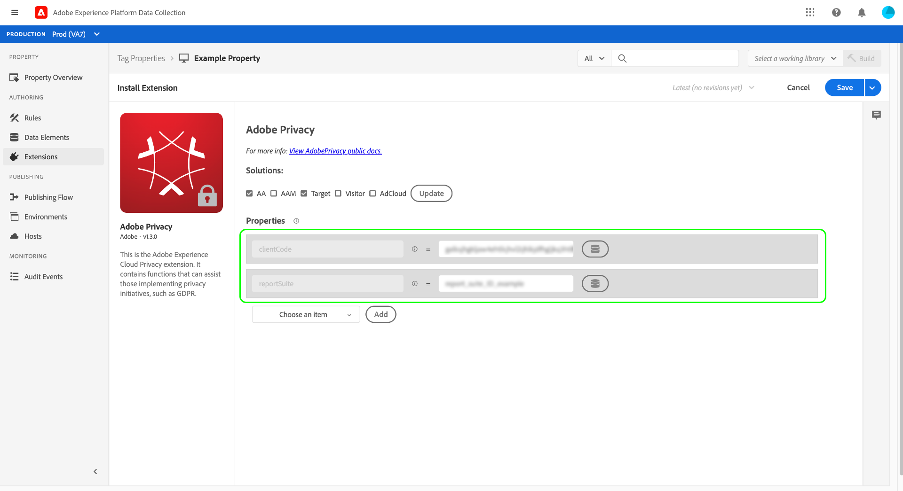

# Adobe隱私擴展概述

>[!NOTE]
>
>Adobe Experience Platform Launch已被改名為Adobe Experience Platform的一套資料收集技術。 因此，所有產品文件中出現了幾項術語變更。 如需術語變更的彙整參考資料，請參閱以下[文件](../../../term-updates.md)。

Adobe隱私標籤擴展允許您通過Adobe客戶端設備上的解決方案來收集和刪除分配給最終用戶的用戶ID。 收集的ID隨後可以發送到 [Adobe Experience Platform Privacy Service](../../../../privacy-service/home.md) 訪問或刪除受支援的Adobe Experience Cloud應用程式中相關個人的個人資料。

本指南介紹如何在AdobeUI或資料收集UI中安裝和配置Experience Platform隱私擴展。

>[!NOTE]
>
>如果您希望安裝這些功能而不使用標籤，請參閱 [隱私JavaScript庫概述](../../../../privacy-service/js-library.md) 有關如何使用原始代碼實現的步驟。

## 安裝並設定 擴充功能

選擇 **[!UICONTROL 擴展]** 在左側的導航欄中，然後是 **[!UICONTROL 目錄]** 頁籤。 使用搜索欄縮小可用副檔名清單，直到找到「Adobe隱私」。 選擇 **[!UICONTROL 安裝]** 繼續。

下一個螢幕允許您配置希望擴展從中收集ID的源和解決方案。 擴展支援以下解決方案：

* Adobe Analytics(AA)
* Adobe Audience ManagerAAM(
* Adobe Target
* Adobe Experience Cloud身份服務（訪問者，或ECID）
* Adobe Advertising Cloud(AdCloud)

選擇一個或多個解決方案，然後選擇 **[!UICONTROL 更新]**。

螢幕會根據您選擇的解決方案更新以顯示所需配置參數的輸入。

使用下面的下拉菜單，還可以向配置中添加其他特定於解決方案的參數。

>[!NOTE]
>
>請參閱 [配置參數](../../../../privacy-service/js-library.md#config-params) 在隱私JavaScript庫概述中，瞭解有關每個受支援解決方案的接受配置值的詳細資訊。

添加選定解決方案的參數後，選擇 **[!UICONTROL 保存]** 的子菜單。

## 使用擴展 {#using}

Adobe隱私擴展提供了三種可以在 [規則](../../../ui/managing-resources/rules.md) 當發生特定事件及符合條件時：

* **[!UICONTROL 檢索標識]**:檢索用戶儲存的身份資訊。
* **[!UICONTROL 刪除標識]**:刪除用戶儲存的身份資訊。
* **[!UICONTROL 檢索，然後刪除標識]**:檢索用戶儲存的身份資訊，然後刪除。

對於上述每個操作，必須提供回調JavaScript函式，該函式將檢索到的標識資料作為對象參數接受和處理。 在此處，您可以儲存這些身份，顯示它們，或將它們發送到 [Privacy ServiceAPI](../../../../privacy-service/api/overview.md) 按你的要求。

使用Adobe隱私標籤擴展時，必須以資料元素的形式提供所需的回調函式。 有關如何配置此資料元素的步驟，請參閱下一節。

### 定義處理標識的資料元素

通過選擇 **[!UICONTROL 資料元素]** 在左側導航中，然後 **[!UICONTROL 添加資料元素]**。 在配置螢幕上後，選擇 **[!UICONTROL 核心]** 為延期和 **[!UICONTROL 自定義代碼]** 的子菜單。 從此處，選擇 **[!UICONTROL 開啟編輯器]** 的下界。

在出現的對話框中，定義將處理檢索到的標識的JavaScript函式。 回調必須接受單個對象類型參數(`ids` )。 然後，該函式可以處理您希望的ID，還可以調用所有全局可用的變數和函式，以便進一步處理。

>[!NOTE]
>
>有關的結構的詳細資訊 `ids` 回調函式應處理的對象，請參閱 [代碼樣本](../../../../privacy-service/js-library.md#samples) 在Privacy JavaScript庫的概述中提供。

完成後，選擇 **[!UICONTROL 保存]**。

如果需要對不同事件進行不同的回調，則可以繼續建立其他自定義代碼資料元素。

### 使用隱私操作建立規則

在配置回調資料元素以處理檢索到的ID之後，您可以建立一個規則，該規則在站點上發生特定事件以及您需要的任何其他條件時調用Adobe隱私擴展。

為規則配置操作時，選擇 **[!UICONTROL Adobe隱私]** 的。 對於操作類型，選擇 [三](#using) 由分機提供。

右面板提示您選擇將用作操作回調的資料元素。 選擇資料庫表徵圖()，然後從清單中選擇先前建立的資料元素。 選擇 **[!UICONTROL 保留更改]** 繼續。

在此處，您可以繼續配置規則，以便在您需要的事件和條件下觸發Adobe隱私操作。 滿足後，選擇 **[!UICONTROL 保存]**。

現在，您可以將規則添加到庫中，以作為在網站上進行部署以進行測試。 請參閱 [標籤發佈流](../../../ui/publishing/overview.md) 的子菜單。

## 禁用或卸載擴展

安裝擴充功能後，您可以將其停用或加以刪除。選擇 **[!UICONTROL 配置]** 在Adobe隱私卡上，選擇 **[!UICONTROL 禁用]** 或 **[!UICONTROL 卸載]**。

## 後續步驟

本指南介紹了UI中Adobe隱私標籤擴展的使用。 有關擴展提供的功能（包括如何使用原始代碼使用它的示例）的詳細資訊，請參見 [隱私JavaScript庫概述](../../../../privacy-service/js-library.md) Privacy Service文檔。
