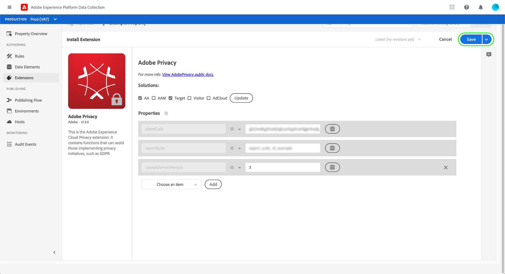

# Adobe隱私權擴充功能概觀

>[!NOTE]
>
>Adobe Experience Platform Launch在Adobe Experience Platform中已重新命名為一套資料收集技術。 因此，所有產品文件中出現了幾項術語變更。 如需術語變更的彙整參考資料，請參閱以下[文件](../../../term-updates.md)。

「Adobe隱私權」標籤擴充功能可讓您透過用戶端裝置上的Adobe解決方案，收集和移除指派給使用者的使用者ID。 接著，收集的ID便可傳送至 [Adobe Experience Platform Privacy Service](../../../../privacy-service/home.md) 存取或刪除受支援Adobe Experience Cloud應用程式中相關個人的個人資料。

本指南涵蓋如何在Experience PlatformUI或資料收集UI中安裝和設定Adobe隱私權擴充功能。

>[!NOTE]
>
>如果您偏好不使用標籤來安裝這些功能，請參閱 [隱私權JavaScript程式庫概觀](../../../../privacy-service/js-library.md) 以取得如何使用原始程式碼實作的步驟。

## 安裝並設定 擴充功能

選擇 **[!UICONTROL 擴充功能]** 在左側導覽器中，後面是 **[!UICONTROL 目錄]** 標籤。 使用搜尋列來縮小可用擴充功能的清單，直到您找到Adobe隱私權為止。 選擇 **[!UICONTROL 安裝]** 繼續。

下一個畫面可讓您設定要擴充功能從中收集ID的來源和解決方案。 擴充功能支援下列解決方案：

* Adobe Analytics(AA)
* Adobe Audience Manager(AAM)
* Adobe Target
* Adobe Experience Cloud Identity Service（訪客或ECID）
* Adobe Advertising Cloud(AdCloud)

選取一或多個解決方案，然後選取 **[!UICONTROL 更新]**.

畫面會更新，根據您選取的解決方案顯示所需設定參數的輸入。

您也可以使用下方的下拉式功能表，將其他解決方案專屬參數新增至設定。

>[!NOTE]
>
>請參閱 [配置參數](../../../../privacy-service/js-library.md#config-params) 在「隱私權JavaScript程式庫」概觀中，取得每個受支援解決方案之已接受設定值的詳細資訊。

完成為所選解決方案新增參數後，請選取 **[!UICONTROL 儲存]** 以儲存設定。

## 使用擴充功能 {#using}

Adobe隱私權擴充功能提供三種動作類型，可用於 [規則](../../../ui/managing-resources/rules.md) 當發生特定事件且符合條件時：

* **[!UICONTROL 擷取身分]**:檢索用戶儲存的身份資訊。
* **[!UICONTROL 移除身分]**:移除使用者儲存的身分資訊。
* **[!UICONTROL 擷取然後移除身分]**:檢索用戶儲存的身份資訊，然後刪除。

對於上述每個動作，您必須提供回呼JavaScript函式，以接受並處理擷取的身分資料作為物件參數。 從這裡，您可以儲存、顯示身分，或將身分傳送至 [Privacy ServiceAPI](../../../../privacy-service/api/overview.md) 如您所需。

使用Adobe隱私權標籤擴充功能時，您必須以資料元素的形式提供必要的回呼函式。 如需如何設定此資料元素的步驟，請參閱下一節。

### 定義資料元素以處理身分

透過選取 **[!UICONTROL 資料元素]** 在左側導覽器中，隨後 **[!UICONTROL 新增資料元素]**. 進入設定畫面後，請選取 **[!UICONTROL 核心]** 擴充功能和 **[!UICONTROL 自訂程式碼]** （適用於資料元素類型）。 從此處，選擇 **[!UICONTROL 開啟編輯器]** 中。

在顯示的對話方塊中，定義將處理擷取身分的JavaScript函式。 回呼必須接受單一物件類型引數(`ids` 在以下範例中)。 然後，函式可以視需要處理ID，也可以叫用網站上全域可用的任何變數和函式，以供進一步處理。

>[!NOTE]
>
>如需的結構詳細資訊，請參閱 `ids` 回呼函式應處理的物件，請參閱 [程式碼範例](../../../../privacy-service/js-library.md#samples) 於隱私權JavaScript程式庫的概觀中提供。

完成後，請選取 **[!UICONTROL 儲存]**.

如果您需要不同事件的不同回呼，可以繼續建立其他自訂程式碼資料元素。

### 建立具有隱私權動作的規則

在設定回呼資料元素以處理擷取的ID後，您可以建立規則，每當網站上發生特定事件以及您需要的任何其他條件時，即叫用Adobe隱私權擴充功能。

為規則設定動作時，請選取 **[!UICONTROL Adobe隱私]** ，以取得擴充功能。 針對動作類型，選取 [三函式](#using) 由擴充功能提供。

右側面板會提示您選取要作為動作回撥的資料元素。 選擇資料庫表徵圖()，然後從清單中選取您先前建立的資料元素。 選擇 **[!UICONTROL 保留變更]** 繼續。

從這裡，您可以繼續設定規則，讓Adobe隱私權動作在您需要的事件和條件下引發。 滿足後，選擇 **[!UICONTROL 儲存]**.

您現在可以將規則新增至程式庫，以部署為網站上的組建以供測試。 請參閱 [標籤發佈流程](../../../ui/publishing/overview.md) 以取得更多資訊。

## 停用或解除安裝擴充功能

安裝擴充功能後，您可以將其停用或加以刪除。選擇 **[!UICONTROL 設定]** 在已安裝擴充功能的「Adobe隱私權」卡上，選取 **[!UICONTROL 停用]** 或 **[!UICONTROL 解除安裝]**.

## 後續步驟

本指南說明如何在UI中使用Adobe隱私權標籤擴充功能。 如需擴充功能的詳細資訊，包括如何使用原始程式碼運用擴充功能的範例，請參閱 [隱私權JavaScript程式庫概觀](../../../../privacy-service/js-library.md) 在Privacy Service檔案中。
