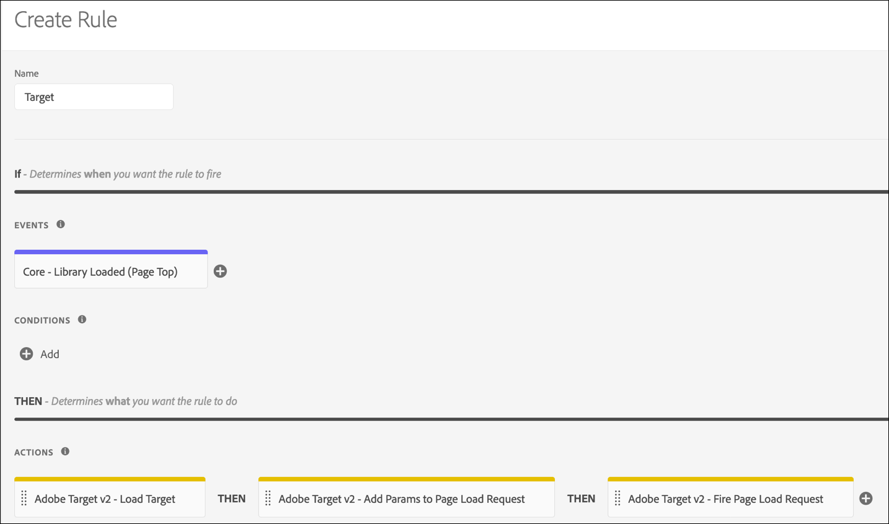

# Adobe Targetv2擴展概述

>[!NOTE]
>
>Adobe Experience Platform Launch已被改名為Adobe Experience Platform的一套資料收集技術。 因此，所有產品文件中出現了幾項術語變更。 如需術語變更的彙整參考資料，請參閱以下[文件](../../../term-updates.md)。

您可參閱此參考文件，了解使用此擴充功能建立規則時可使用哪些選項。

## 設定 Adobe Target v2 擴充功能

>[!IMPORTANT]
>
>Adobe Target 擴充功能需使用 at.js 2.x。

如果尚未安裝Adobe Target擴展，請開啟您的屬性，然後選擇 **[!UICONTROL 擴展>目錄]**，懸停在目標擴展上，然後選擇 **[!UICONTROL 安裝]**。

要配置擴展，請開啟「擴展」頁籤，將滑鼠懸停在擴展上，然後選擇 **[!UICONTROL 配置]**。


### at.js 設定

所有at.js設定（超時除外）都會從目標UI中的at.js配置中自動檢索。 擴展僅在首次添加目標UI時從該UI檢索設定，因此，如果需要其他更新，應在UI中管理所有設定。

下列組態選項可供使用：

#### 用戶端代碼

客戶端代碼是目標的帳戶標識符。 在大部分情況中，此值應一律保持為預設值。可以使用資料元素更改。

#### 組織 ID

此 ID 會將您的實作連結至 Adobe Experience Cloud 帳戶。在大部分情況中，此值應一律保持為預設值。可以使用資料元素更改。

#### 伺服器網域

伺服器域指發送目標請求的域。 在大部分情況中，此值應一律保持為預設值。

#### GDPR 選擇加入

啟用後，Adobe Target 提供選擇加入功能，以協助支援您的同意管理策略。選擇加入功能可讓客戶控制觸發 Target 標籤的方法和時機。如需有關 Adobe 選擇加入的詳細資訊，請參閱[隱私權與一般資料保護規則 (GDPR)](https://experienceleague.adobe.com/docs/target/using/implement-target/before-implement/privacy/cmp-privacy-and-general-data-protection-regulation.html)。

#### 逾時 (毫秒)

如果未在定義的期間內收到 Target 的回應，則要求逾時，系統會顯示預設內容。在訪客工作階段期間會繼續嘗試其他要求。預設值為 3000 毫秒，可能與 Target 使用者介面中設定的「逾時」不同。

如需「逾時」設定如何運作的詳細資訊，請參閱 [Adobe Target 說明](https://experienceleague.adobe.com/docs/target/using/implement-target/client-side/deploy-at-js/implementing-target-without-a-tag-manager.html)。

## Target 擴充功能動作類型

本節說明 Target 擴充功能中可用的動作類型。

Target 擴充功能提供規則的「Then」部分中的下列動作：

### 載入 Target

將此操作添加到標籤規則中，在此操作中，在規則上下文中載入目標是有意義的。 如此會將 at.js 程式庫載入頁面中。在大部分實作中，您網站的每個頁面上都應載入 Target。Adobe 建議，除非先前已有 Target 呼叫，否則應避免執行「載入 Target」動作，否則可能會發生 Analytics 呼叫延遲等問題。

無需設定。

### 具有設備上決策的載入目標

將此操作添加到標籤規則中，在此操作中載入目標具有合理性 [設備上決策](https://experienceleague.adobe.com/docs/target/using/implement-target/client-side/at-js-implementation/on-device-decisioning/on-device-decisioning.html) 在規則的上下文中啟用。 這將在啟用設備上決策的情況下將at.js庫載入到頁面中。 在大部分實作中，您網站的每個頁面上都應載入 Target。Adobe建議僅當在目標調用之前執行「載入目標」和「設備上決定」操作時，才使用該操作。 否則可能會發生 Analytics 呼叫延遲等問題。

無需設定。

### 新增參數至所有要求

此操作類型允許將參數添加到所有目標請求。 「載入 Target」動作必須較先使用。

1. 指定您要新增之參數的名稱和值。
1. 選取新增圖示以新增更多參數。

### 新增參數至頁面載入要求

此操作類型允許將參數專門添加到頁面載入請求中。 「載入 Target」動作必須較先使用。

1. 指定您要新增之參數的名稱和值。
1. 選取新增圖示以新增更多參數。

### 引發頁面載入要求

此操作類型允許目標在載入頁面時觸發請求。 「載入 Target」動作必須較先使用。

必須指定是否啟用正文隱藏以防止閃爍，以及隱藏正文元素時使用的樣式。 提供下列選項：

* **主體隱藏：**&#x200B;您可以啟用或停用此設定。預設值為 Enabled，表示 HTML BODY 隱藏。
* **主體隱藏樣式：**&#x200B;預設值為 body{opacity:0}。此值可以變更為其他不同值，例如 body{display:none}。

如需詳細資訊，請參閱 [Target 線上說明文件](https://experienceleague.adobe.com/docs/target/using/implement-target/client-side/mbox-implement/advanced-mboxjs-settings.html)。

### 觸發檢視

只要載入了新頁面或重新呈現頁面上的元件，就可以調用「觸發器視圖」(Trigger View)操作。 應為單頁應用程式實現觸發器視圖。

1. 指定必須觸發的檢視名稱。
1. 透過勾選「頁面」核取方塊，指定檢視的觸發是否應歸因於報表的曝光。如果檢視與重新演算的元件相關聯，且不會歸因於報表的曝光，則取消勾選「頁面」核取方塊。

有關觸發檢視的詳細資訊，請參閱[`triggerView()`說明文件](https://experienceleague.adobe.com/docs/target/using/implement-target/client-side/functions-overview/adobe-target-triggerview-atjs-2.html)。

## Adobe Target 基本部署

安裝 Target 擴充功能後，請建立至少一個規則才能正確部署。您首先需要載入 Target 程式庫 (at.js)，指定要用於頁面載入要求的參數，然後引發頁面載入要求。

具有此基本實作的 Target 規則看起來如下所示：



保存此規則後，您需要將其添加到庫中並構建/部署它，以便您能夠test行為。

## 非同步部署的 Adobe Target 擴充功能

可以非同步部署標籤。 如果以非同步方式載入標籤庫，並且其中包含目標，則還將非同步載入目標。 這是完全支援的情況，但有一個額外考量必須處理。

在非同步部署中，頁面可以在 Target 程式庫完全載入並執行內容交換之前，先完成預設內容的演算。這可能會導致所謂的「閃爍」問題，即預設內容會短暫顯示，然後才會被 Target 指定的個人化內容取代。如果希望避免此閃爍，建議您使用預隱藏的代碼段並非同步載入標籤包以避免任何內容閃爍。

使用預先隱藏程式碼片段時應留意的事項如下：

* 在載入標籤頭嵌入代碼之前必須添加代碼段。
* 此代碼無法由標籤管理，因此必須直接將其添加到頁面。
* 一發生下列事件時，便會顯示頁面：
   * 收到頁面載入回應時
   * 頁面載入要求逾時
   * 程式碼片段本身逾時
* 應使用預隱藏代碼段在所有頁面上使用「Fire Page Load Request」操作，以最小化預隱藏的持續時間。
* 還必須在您用於目標的頁面載入規則的「頁面載入請求」操作中啟用正文隱藏；否則，在超時期間，所有頁面載入都將保持隱藏狀態。

預先隱藏的程式碼片段如下所示，且可縮小：可設定的選項位於末端：

```js
;(function(win, doc, style, timeout) {
  var STYLE_ID = 'at-body-style';

  function getParent() {
    return doc.getElementsByTagName('head')[0];
  }

  function addStyle(parent, id, def) {
    if (!parent) {
      return;
    }

    var style = doc.createElement('style');
    style.id = id;
    style.innerHTML = def;
    parent.appendChild(style);
  }

  function removeStyle(parent, id) {
    if (!parent) {
      return;
    }

    var style = doc.getElementById(id);

    if (!style) {
      return;
    }

    parent.removeChild(style);
  }

  addStyle(getParent(), STYLE_ID, style);
  setTimeout(function() {
    removeStyle(getParent(), STYLE_ID);
  }, timeout);
}(window, document, "body {opacity: 0 !important}", 3000));
```

依預設，此程式碼片段會預先隱藏整個 HTML BODY。在某些情況下，您可能希望預先隱藏特定的 HTML 元素，而非整個頁面。您可以自訂 style 參數來達到此目的。以某些項目替換此參數，而只預先隱藏頁面的特定區域。

例如，若您有兩個區域，分別以 ID container-1 和 container-2 來識別，則樣式可以換成如下內容：

```css
#container-1, #container-2 {opacity: 0 !important}
```

代替預設值：

```css
body {opacity: 0 !important}
```

依預設，程式碼片段在 3000 毫秒或 3 秒後逾時。此值可自訂。
