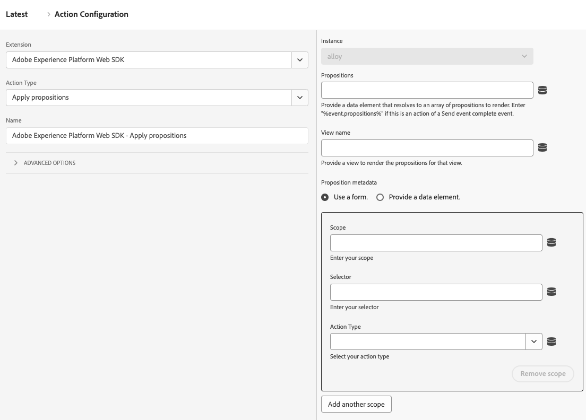
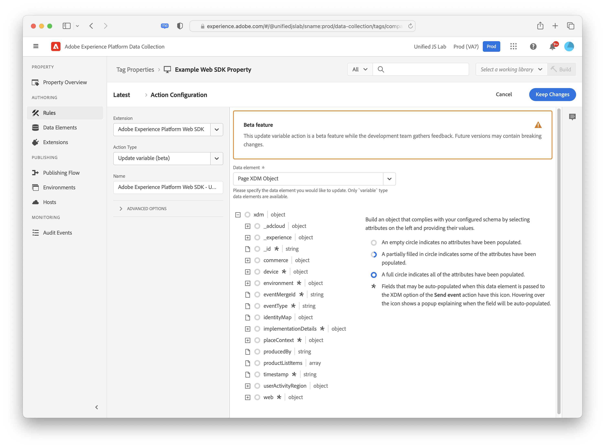

# 動作類型

設定[Adobe Experience Platform Web SDK標籤擴充功能](web-sdk-extension-configuration.md)後，您必須設定動作型別。

此頁面說明[Adobe Experience Platform Web SDK標籤擴充功能](web-sdk-extension-configuration.md)支援的動作型別。

## 套用主張 {#apply-propositions}

**[!UICONTROL 套用主張]**&#x200B;動作型別可讓您在單頁應用程式中轉譯主張，而不增加量度。

在使用單頁應用程式時，如果頁面的部分重新呈現，可能會覆寫已套用至頁面的任何個人化，此動作型別會很有用。

您可以針對各種使用案例使用此動作型別，例如：

1. **呈現mbox HTML選件**。 透過&#x200B;**[!UICONTROL 傳送事件]**&#x200B;動作之範圍或介面明確要求的主張不會自動轉譯。 您可以使用&#x200B;**[!UICONTROL 套用主張]**&#x200B;動作型別，透過指定主張中繼資料，來告知Web SDK在何處演算這些主張。
2. **在單頁應用程式上呈現檢視的選件**。 呈現檢視變更事件時，如果分析資料尚未準備就緒，您可以使用&#x200B;**[!UICONTROL 套用主張]**&#x200B;動作來呈現頁面頂端的檢視主張。 如需詳細資訊，請參閱[頁面事件的頂端和底部（第二個頁面檢視 — 選項2）](../../../../web-sdk/use-cases/top-bottom-page-events.md)。 若要使用此專案，請在表單中輸入&#x200B;**[!UICONTROL 檢視名稱]**。
3. **重新呈現建議**。 當您的網站使用React等架構重新呈現內容時，您可能需要重新套用個人化。 在這種情況下，您可以使用&#x200B;**[!UICONTROL 套用主張]**&#x200B;動作型別來執行此操作。

此動作型別不會針對演算後的主張傳送顯示事件。 它會追蹤已轉譯的主張，以便將其包含在後續&#x200B;**[!UICONTROL 傳送事件]**&#x200B;呼叫中。

此動作型別支援下列欄位：

* **[!UICONTROL 主張]**：您要重新呈現的主張物件陣列。
* **[!UICONTROL 檢視名稱]**：要呈現的檢視名稱。
* **[!UICONTROL 主張中繼資料]**：決定如何套用HTML優惠方案的物件。 您可以透過表單或資料元素提供此資訊。 它包含下列屬性：
   * **[!UICONTROL 領域]**
   * **[!UICONTROL 選取器]**
   * **[!UICONTROL 動作型別]**

## 套用回應 {#apply-response}

當您要根據Edge Network的回應執行各種動作時，請使用&#x200B;**[!UICONTROL 套用回應]**&#x200B;動作型別。 此動作型別通常用於混合部署，其中伺服器會對Edge Network發出初始呼叫，然後此動作型別會從該呼叫取得回應，並在瀏覽器中初始化Web SDK。

使用此動作型別可減少混合個人化使用案例的使用者端載入時間。

![顯示[套用回應]動作型別的Experience Platform使用者介面影像。](assets/apply-response.png)

此動作型別支援下列組態選項：

* **[!UICONTROL 執行個體]**：選取您正在使用的Web SDK執行個體。
* **[!UICONTROL 回應標頭]**：選取資料元素，此資料元素會傳回包含Edge Network伺服器呼叫傳回之標頭索引鍵和值的物件。
* **[!UICONTROL 回應內文]**：選取資料元素，此資料元素會傳回包含Edge Network回應所提供JSON裝載的物件。
* **[!UICONTROL 呈現視覺化個人化決定]**：啟用此選項以自動呈現Edge Network所提供的個人化內容，並預先隱藏內容以防止閃爍。

## 評估規則集 {#evaluate-rulesets}

此動作型別會手動觸發規則集評估。 Adobe Journey Optimizer會傳回規則集以支援瀏覽器內訊息等功能。

![顯示[評估規則集]回應動作型別的Experience Platform使用者介面影像。](assets/evaluate-rulesets.png)

此動作型別支援下列選項：

* **[!UICONTROL 呈現視覺個人化決定]**：啟用此選項以呈現相符規則集專案的視覺個人化決定。
* **[!UICONTROL 決定內容]**：這是鍵值對應，用於評估裝置上決策的Adobe Journey Optimizer規則集。 您可以手動或透過資料元素提供決定內容。

## 取得Media Analytics追蹤器 {#get-media-analytics-tracker}

此動作用於取得舊版Media Analytics API。 設定動作並提供物件名稱時，系統會匯出舊版Media Analytics API至該視窗物件。 如果未提供，則會像目前的Media JS程式庫一樣將其匯出至`window.Media`。

## 使用身分重新導向 {#redirect-with-identity}

使用此動作型別可將目前頁面的身分共用給其他網域。 此動作設計用於&#x200B;**[!UICONTROL 點選]**&#x200B;事件型別和值比較條件。 如需有關如何使用此動作型別的詳細資訊，請參閱[使用Web SDK擴充功能將身分附加至URL](../../../../web-sdk/commands/appendidentitytourl.md#extension)。

## 傳送事件 {#send-event}

傳送事件至Experience Platform，讓Experience Platform可以收集您傳送的資料，並對該資訊採取行動。 您想要傳送的任何資料可在&#x200B;**[!UICONTROL XDM資料]**&#x200B;欄位中傳送。 使用符合[!DNL XDM]結構描述結構的[!DNL JSON]物件。 可以在您的頁面上或透過&#x200B;**[!UICONTROL 自訂程式碼]** **[!UICONTROL 資料元素]**&#x200B;建立此物件。

**[!UICONTROL 傳送事件]**&#x200B;動作型別支援下列欄位和設定。 這些欄位都是選用欄位。

### 執行個體設定 {#instance}

使用&#x200B;**[!UICONTROL Instance]**&#x200B;選取器來選擇要設定的Web SDK執行個體。 如果您只有一個例項，則會預先選取它。

![Experience Platform Tags UI影像顯示[傳送事件]動作型別的執行個體設定。](assets/instance-settings.png)

* **[!UICONTROL 執行個體]**：選取您要設定的Web SDK執行個體。 如果您只有一個例項，則會預先選取它。
* **[!UICONTROL 使用引導式事件]**：啟用此選項可自動填寫或隱藏特定欄位，以啟用特定使用案例。 啟用此選項會觸發下列設定的顯示。
   * **[!UICONTROL 要求個人化]**：此事件將在頁面頂端呼叫。 選取後，此事件會設定下列欄位：
      * **[!UICONTROL 型別]**： **[!UICONTROL 決策主張擷取]**
      * **[!UICONTROL 自動傳送顯示事件]**： **[!UICONTROL false]**
      * 若要在此情況下自動呈現個人化，請啟用&#x200B;**[!UICONTROL 呈現視覺個人化決定]**&#x200B;選項。
   * **[!UICONTROL 收集分析]**：此事件將在頁面底部呼叫。 選取後，此事件會設定下列欄位：
      * **[!UICONTROL 包含演算後的主張]**： **[!UICONTROL true]**
      * **[!UICONTROL Personalization]**&#x200B;設定已隱藏

  >[!NOTE]
  >
  >引導式事件與[頁面事件的頂端和底部](../../../../web-sdk/use-cases/top-bottom-page-events.md)有關。

### 資料 {#data}

* **[!UICONTROL 型別]**：此欄位可讓您指定將記錄在XDM結構描述中的事件型別。 如需詳細資訊，請參閱`sendEvent`命令中的[`type`](/help/web-sdk/commands/sendevent/type.md)。
* **[!UICONTROL XDM]**：
* **[!UICONTROL 資料]**：使用此欄位來傳送不符合XDM結構描述的資料。 如果您嘗試更新Adobe Target設定檔或傳送Target Recommendations屬性，此欄位會很有用。 如需詳細資訊，請參閱`sendEvent`命令中的[`data`](/help/web-sdk/commands/sendevent/data.md)。
* **[!UICONTROL 包含已演算的主張]**：啟用此選項可包含所有已演算，但尚未傳送顯示事件的主張。 將此與&#x200B;**[!UICONTROL 搭配使用。自動傳送已停用的顯示事件]**。 此設定會使用演算後主張的相關資訊更新`_experience.decisioning` XDM欄位。
* **[!UICONTROL 檔案將解除安裝]**：啟用此選項，確保即使使用者離開頁面進行導覽，事件仍可到達伺服器。 這可讓事件連線至伺服器，但會忽略回應。
* **[!UICONTROL 合併ID]**： **此欄位已棄用**。 這會填入`eventMergeId` XDM欄位。

### 個人化 {#personalization}

* **[!UICONTROL 範圍]**：選取您想要明確要求個人化要求的範圍(Adobe Target [!DNL mboxes])。 您可以手動輸入範圍，或提供資料元素來輸入範圍。
* **[!UICONTROL 介面]**：設定網頁上可用於個人化的網頁介面。 如需詳細資訊，請參閱[Adobe Journey Optimizer檔案](https://experienceleague.adobe.com/docs/journey-optimizer/using/web/create-web.html)。
* **呈現視覺個人化決定：**&#x200B;如果您想要在頁面上呈現個人化內容，請勾選&#x200B;**[!UICONTROL 呈現視覺個人化決定]**&#x200B;核取方塊。 如有需要，您也可以指定決定範圍及/或曲面。 如需呈現個人化內容的詳細資訊，請參閱[個人化檔案](/help/web-sdk/personalization/rendering-personalization-content.md#automatically-rendering-content)。
* **[!UICONTROL 要求預設個人化]**：使用此區段來控制是否要求全頁範圍（全域mbox）和預設表面（根據目前URL的網頁表面）。 依預設，這會在頁面載入的前`sendEvent`個呼叫期間自動要求。 您可以從下列選項中選擇：
   * **[!UICONTROL 自動]**：這是預設行為。 只有在尚未要求預設個人化時，才會要求此專案。 這對應至Web SDK命令中未設定的`requestDefaultPersonalization`。
   * **[!UICONTROL 已啟用]**：明確要求頁面範圍和預設表面。 這會更新SPA檢視快取。 這對應至`requestDefaultPersonalization`設定為`true`。
   * **[!UICONTROL 已停用]**：明確隱藏頁面範圍與預設表面的要求。 這對應至`requestDefaultPersonalization`設定為`false`。
* **[!UICONTROL 決定內容]**：這是鍵值對應，用於評估裝置上決策的Adobe Journey Optimizer規則集。 您可以手動或透過資料元素提供決定內容。

### 資料流設定覆寫 {#datastream-overrides}

資料流覆寫可讓您定義資料流的額外設定，這些設定會透過 Web SDK 傳遞到 Edge Network。

這有助於您觸發與預設資料流不同的資料流行為，而不會建立新的資料流或修改現有的設定。 如需詳細資訊，請參閱有關[設定資料流覆寫](web-sdk-extension-configuration.md#datastream-overrides)的檔案。

## 傳送媒體事件 {#send-media-event}

傳送媒體事件至Adobe Experience Platform和/或Adobe Analytics。 當您追蹤網站上的媒體事件時，此動作很有用。 選取執行個體（如果有多個執行個體）。 此動作需要代表追蹤媒體工作階段唯一識別碼的`playerId`。 啟動媒體工作階段時，也需要&#x200B;**[!UICONTROL 體驗品質]**&#x200B;和`playhead`資料元素。

**[!UICONTROL 傳送媒體事件]**&#x200B;動作型別支援下列屬性：

* **[!UICONTROL 執行個體]**：正在使用的Web SDK執行個體。
* **[!UICONTROL 媒體事件型別]**：要追蹤的媒體事件型別。
* **[!UICONTROL 播放器識別碼]**：媒體工作階段唯一識別碼。
* **[!UICONTROL 播放點]**：媒體播放的目前位置（以秒為單位）。
* **[!UICONTROL 媒體工作階段詳細資料]**：傳送媒體開始事件時，應指定必要的媒體工作階段詳細資料。
* **[!UICONTROL 章節詳細資料]**：您可以在此段落中指定傳送章節開始媒體事件時的章節詳細資料。
* **[!UICONTROL Advertising詳細資料]**：傳送`AdBreakStart`事件時，您必須指定必要的廣告詳細資料。
* **[!UICONTROL Advertising pod詳細資料]**：傳送`AdStart`事件時廣告pod的詳細資料。
* **[!UICONTROL 錯誤詳細資料]**：正在追蹤之播放錯誤的詳細資料。
* **[!UICONTROL 狀態更新詳細資料]**：正在更新的播放器狀態。
* **[!UICONTROL 自訂中繼資料]**：正在追蹤之媒體事件的自訂中繼資料。
* **[!UICONTROL 體驗品質]**：正在追蹤的體驗資料媒體品質。

## 設定同意 {#set-consent}

在您收到使用者的同意後，必須使用「設定同意」動作型別，將此同意傳達Adobe Experience Platform Web SDK。 目前支援「Adobe」和「IAB TCF」等兩種標準。請參閱[支援客戶同意偏好設定](../../../../web-sdk/commands/setconsent.md)。 使用Adobe 2.0版時，僅支援資料元素值。 您將需要建立可解析為同意物件的資料元素。

在此動作中，系統也會提供選填欄位，供您加入身分對應，以便在收到同意後同步身分資料。 同意設為「擱置中」或「退出」時，同步會很有用，因為同意呼叫可能是第一個要觸發的呼叫。

## 更新變數 {#update-variable}

使用此動作來修改作為事件結果的XDM物件。 此動作的目的是建立物件，以便稍後從&#x200B;**[!UICONTROL 傳送事件]**&#x200B;動作參照，以記錄事件XDM物件。

若要使用此動作型別，您必須定義[變數](data-element-types.md#variable)資料元素。 選擇要修改的變數資料元素後，會出現類似於[XDM物件](data-element-types.md#xdm-object)資料元素的編輯器的編輯器。

用於編輯器的XDM結構描述是在[!UICONTROL 變數]資料元素上選取的結構描述。 您可以按一下左方樹狀結構中的其中一個屬性，然後修改右方的值，來設定物件的一或多個屬性。例如，在下方的熒幕擷圖中， productedBy屬性已設定為資料元素「Producted by data element」。

更新變數動作中的編輯器與XDM物件資料元素中的編輯器有一些差異。 首先，更新變數動作具有標示為「xdm」的根層級專案。 如果按一下此專案，您可以指定要用來設定整個物件的資料元素。 其次，更新變數動作有核取方塊可清除xdm物件的資料。 按一下左側的其中一個屬性，然後核取右側的核取方塊以清除值。 這會在設定變數的任何值之前，清除目前的值。

## 後續步驟 {#next-steps}

閱讀本文後，您應該更瞭解如何設定動作。 接下來，閱讀如何[設定您的資料元素型別](data-element-types.md)。
