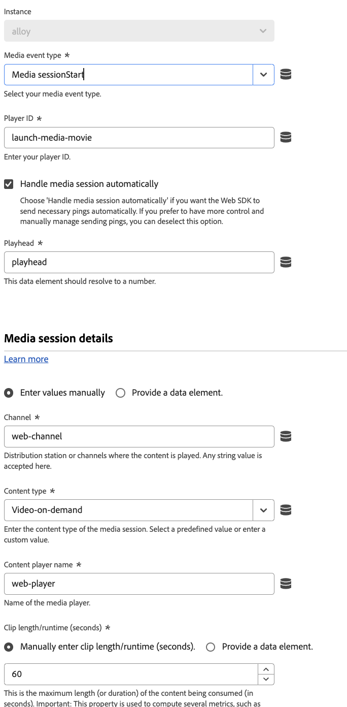

# 動作類型

設定[Adobe Experience Platform Web SDK標籤擴充功能](web-sdk-extension-configuration.md)後，您必須設定動作型別。

此頁面說明[Adobe Experience Platform Web SDK標籤擴充功能](web-sdk-extension-configuration.md)支援的動作型別。

## 套用回應 {#apply-response}

當您要根據Edge Network的回應執行各種動作時，請使用&#x200B;**[!UICONTROL 套用回應]**&#x200B;動作型別。 此動作型別通常用於混合式部署，其中伺服器會對Edge Network發出初始呼叫，然後此動作型別會從該呼叫取得回應，並在瀏覽器中初始化Web SDK。

使用此動作型別可減少混合個人化使用案例的使用者端載入時間。

![顯示[套用回應]動作型別的Experience Platform使用者介面影像。](assets/apply-response.png)

此動作型別支援下列組態選項：

* **[!UICONTROL 執行個體]**：選取您正在使用的Web SDK執行個體。
* **[!UICONTROL 回應標頭]**：選取資料元素，此資料元素會傳回包含標頭索引鍵和從Edge Network伺服器呼叫傳回之值的物件。
* **[!UICONTROL 回應內文]**：選取資料元素，此資料元素會傳回包含Edge Network回應所提供JSON裝載的物件。
* **[!UICONTROL 呈現視覺化個人化決定]**：啟用此選項以自動呈現Edge Network所提供的個人化內容，並預先隱藏內容以防止閃爍。

## 傳送事件 {#send-event}

傳送事件給Adobe[!DNL Experience Platform]，讓Adobe Experience Platform可以收集您傳送的資料，並對該資訊採取行動。 選取執行個體（如果有多個執行個體）。 您想要傳送的任何資料可在&#x200B;**[!UICONTROL XDM資料]**&#x200B;欄位中傳送。 使用符合XDM結構描述的JSON物件。 可以在您的頁面上或透過&#x200B;**[!UICONTROL 自訂程式碼]** **[!UICONTROL 資料元素]**&#x200B;建立此物件。

「傳送事件」動作型別中還有其他欄位，根據您的實作而定，這些欄位也可能會相當實用。 請注意，這些欄位都是選用欄位。

* **型別：**&#x200B;此欄位可讓您指定將記錄在XDM結構描述中的事件型別。 如需詳細資訊，請參閱`sendEvent`命令中的[`type`](/help/web-sdk/commands/sendevent/type.md)。
* **資料：**&#x200B;使用此欄位可傳送不符合XDM結構描述的資料。 如果您嘗試更新Adobe Target設定檔或傳送Target Recommendations屬性，此欄位會很有用。 如需詳細資訊，請參閱`sendEvent`命令中的[`data`](/help/web-sdk/commands/sendevent/data.md)。<!--- **Merge ID:** If you would like to specify a merge ID for your event, you can do so in this field. Please note that the solutions downstream are not able to merge your event data at this time. -->
* **資料集識別碼：**&#x200B;如果您需要傳送資料至資料流中所指定資料集以外的資料集，您可以在此處指定該資料集識別碼。
* **檔案將解除安裝：**&#x200B;如果您想要確保事件可以到達伺服器，即使使用者離開頁面進行導覽，請核取&#x200B;**[!UICONTROL 檔案將解除安裝]**&#x200B;核取方塊。 這可讓事件連線至伺服器，但會忽略回應。
* **呈現視覺個人化決定：**&#x200B;如果您想要在頁面上呈現個人化內容，請勾選&#x200B;**[!UICONTROL 呈現視覺個人化決定]**&#x200B;核取方塊。 如有需要，您也可以指定決定範圍及/或曲面。 如需呈現個人化內容的詳細資訊，請參閱[個人化檔案](/help/web-sdk/personalization/rendering-personalization-content.md#automatically-rendering-content)。

## 設定同意 {#set-consent}

在您收到使用者的同意後，必須使用「設定同意」動作型別，將此同意傳達Adobe Experience Platform Web SDK。 目前支援「Adobe」和「IAB TCF」等兩種標準。請參閱[支援客戶同意偏好設定](../../../../web-sdk/commands/setconsent.md)。 使用Adobe版本2.0時，僅支援資料元素值。 您將需要建立可解析為同意物件的資料元素。

在此動作中，系統也會提供選填欄位，供您加入身分對應，以便在收到同意後同步身分資料。 同意設為「擱置中」或「退出」時，同步會很有用，因為同意呼叫可能是第一個要觸發的呼叫。

## 更新變數 {#update-variable}

使用此動作來修改作為事件結果的XDM物件。 此動作的目的是建立物件，以便稍後從&#x200B;**[!UICONTROL 傳送事件]**&#x200B;動作參照，以記錄事件XDM物件。

若要使用此動作型別，您必須定義[變數](data-element-types.md#variable)資料元素。 選擇要修改的變數資料元素後，會出現類似於[XDM物件](data-element-types.md#xdm-object)資料元素的編輯器的編輯器。

用於編輯器的XDM結構描述是在[!UICONTROL 變數]資料元素上選取的結構描述。 您可以按一下左方樹狀結構中的其中一個屬性，然後修改右方的值，來設定物件的一或多個屬性。例如，在下方的熒幕擷圖中， productedBy屬性已設定為資料元素「Producted by data element」。

更新變數動作中的編輯器與XDM物件資料元素中的編輯器有一些差異。 首先，更新變數動作具有標示為「xdm」的根層級專案。 如果按一下此專案，您可以指定要用來設定整個物件的資料元素。 其次，更新變數動作有核取方塊可清除xdm物件的資料。 按一下左側的其中一個屬性，然後核取右側的核取方塊以清除值。 這會在設定變數的任何值之前，清除目前的值。

## 傳送媒體事件 {#send-media-event}

傳送媒體事件至Adobe Experience Platform和/或Adobe Analytics。 當您追蹤網站上的媒體事件時，此動作很有用。 選取執行個體（如果有多個執行個體）。 此動作需要代表追蹤媒體工作階段唯一識別碼的`playerId`。 啟動媒體工作階段時，也需要&#x200B;**[!UICONTROL 體驗品質]**&#x200B;和`playhead`資料元素。

**[!UICONTROL 傳送媒體事件]**&#x200B;動作型別支援下列屬性：

* **[!UICONTROL Instance]**：正在使用的Web SDK執行個體。
* **[!UICONTROL 媒體事件型別]**：要追蹤的媒體事件型別。
* **[!UICONTROL 播放器識別碼]**：媒體工作階段唯一識別碼。
* **[!UICONTROL 播放點]**：媒體播放的目前位置（以秒為單位）。
* **[!UICONTROL 媒體工作階段詳細資料]**：傳送媒體開始事件時，應指定必要的媒體工作階段詳細資料。
* **[!UICONTROL 章節詳細資料]**：您可以在此段落中指定傳送章節開始媒體事件時的章節詳細資料。
* **[!UICONTROL Advertising詳細資料]**：傳送`AdBreakStart`事件時，您必須指定必要的廣告詳細資料。
* **[!UICONTROL Advertising pod詳細資料]**：傳送`AdStart`事件時廣告pod的詳細資料。
* **[!UICONTROL 錯誤詳細資料]**：正在追蹤之播放錯誤的詳細資料。
* **[!UICONTROL 狀態更新詳細資料]**：正在更新的播放器狀態。
* **[!UICONTROL 自訂中繼資料]**：正在追蹤之媒體事件的自訂中繼資料。
* **[!UICONTROL 體驗品質]**：正在追蹤的體驗資料媒體品質。

## 取得Media Analytics追蹤器 {#get-media-analytics-tracker}

此動作用於取得舊版Media Analytics API。 設定動作並提供物件名稱時，系統會匯出舊版Media Analytics API至該視窗物件。 如果未提供，則會像目前的Media JS程式庫一樣將其匯出至`window.Media`。

![顯示[取得Media Analytics追蹤器]動作型別的Platform UI影像。](assets/get-media-analytics-tracker.png)

## 使用身分重新導向 {#redirect-with-identity}

使用此動作型別可將目前頁面的身分共用給其他網域。 此動作設計用於&#x200B;**[!UICONTROL 點選]**&#x200B;事件型別和值比較條件。 如需有關如何使用此動作型別的詳細資訊，請參閱[使用Web SDK擴充功能將身分附加至URL](../../../../web-sdk/commands/appendidentitytourl.md#extension)。

## 後續步驟 {#next-steps}

閱讀本文後，您應該更瞭解如何設定動作。 接下來，閱讀如何[設定您的資料元素型別](data-element-types.md)。
