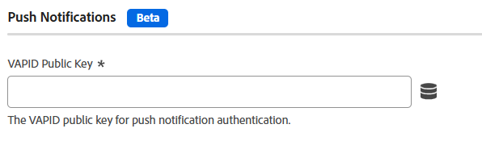

# 推播通知設定 {#push-notifications}

>[!CONTEXTUALHELP]
>id="platform_tags_websdk_pushnotifications"
>title="推播通知"
>abstract="設定用於推播通知驗證的 VAPID 公開金鑰。"

>[!AVAILABILITY]
>
>Web SDK的推播通知目前在&#x200B;**測試版**&#x200B;中。 功能和檔案可能會有所變更。

此設定區段可讓您設定用於推播通知驗證的VAPID公開金鑰。

>[!NOTE]
>
>此功能必須先使用[自訂組建元件](custom-build-components.md)啟用；預設為停用。

1. 使用您的Adobe ID憑證登入[experience.adobe.com](https://experience.adobe.com)。
1. 導覽至&#x200B;**[!UICONTROL Data Collection]** > **[!UICONTROL Tags]**。
1. 選取所需的標籤屬性。
1. 導覽至&#x200B;**[!UICONTROL Extensions]**，然後按一下&#x200B;**[!UICONTROL Configure]**&#x200B;卡片上的[!UICONTROL Adobe Experience Platform Web SDK]。
1. 展開&#x200B;**[!UICONTROL Custom build components]**，然後啟用&#x200B;**[!UICONTROL Push notifications]**。
1. 在[!UICONTROL SDK instances]底下，向下捲動以找出[!UICONTROL Push Notifications]區段。
1. 在&#x200B;**[!UICONTROL VAPID Public Key]**&#x200B;欄位中輸入您的VAPID公開金鑰。

下列欄位可供使用：

## [!UICONTROL VAPID public key]

用於推送訂閱的VAPID公開金鑰。 這是Base64編碼的字串。

## [!UICONTROL Application ID]

與VAPID公開金鑰相關聯的應用程式ID。

## [!UICONTROL Tracking dataset ID]

用於推播通知追蹤與分析的資料集ID。

## 使用JavaScript資料庫推送通知

此區段在設定JavaScript資料庫時相當於[`pushNotifications`](/help/collection/js/commands/configure/pushnotifications.md)的標籤。 連結的頁面也提供必要條件和產生VAPID公開金鑰的相關資訊。
