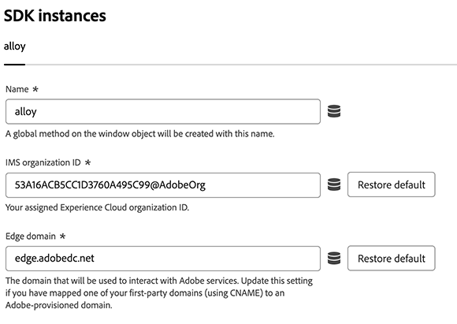
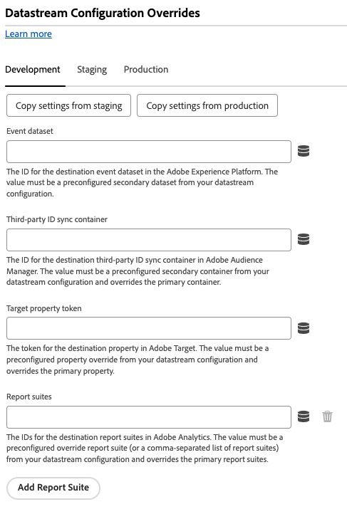
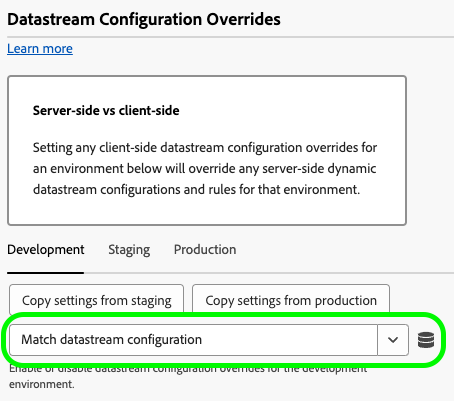

# 設定網頁SDK標籤擴充功能

[!DNL Web SDK]標籤擴充功能會透過Adobe Experience Cloud Edge Network，將資料從Experience Platform屬性傳送至。

擴充功能可讓您將資料串流至Experience Platform、同步身分、處理客戶同意訊號，以及自動收集內容資料。

本檔案說明如何在標籤UI中設定標籤擴充功能。

## 安裝網頁SDK標籤擴充功能 {#install}

Web SDK標籤擴充功能需要安裝屬性。 如果您尚未這樣做，請參閱有關[建立標籤屬性](https://experienceleague.adobe.com/docs/platform-learn/implement-in-websites/configure-tags/create-a-property.html)的檔案。

建立屬性之後，請開啟屬性並選取左側列的&#x200B;**[!UICONTROL 擴充功能]**&#x200B;標籤。

選取&#x200B;**[!UICONTROL 目錄]**&#x200B;索引標籤。 從可用的擴充功能清單中，尋找[!DNL Web SDK]擴充功能，然後選取&#x200B;**[!UICONTROL 安裝]**。

選取&#x200B;**[!UICONTROL 安裝]**&#x200B;之後，您必須設定Web SDK標籤延伸並儲存設定。

>[!NOTE]
>
>標籤擴充功能只會在儲存設定後安裝。 請參閱下一節以瞭解如何設定標籤擴充功能。

## 建立自訂網頁SDK組建 {#custom-build}

Web SDK資料庫包含多個模組，用於各種功能，例如個人化、身分、連結追蹤等。 根據您的使用案例，您可能只需要特定功能，而不需要整個程式庫。 建立自訂的Web SDK組建可讓您僅選取所需的模組，藉此縮小程式庫大小並提升效能。

當您建立自訂Web SDK組建時，您的所有Web SDK執行個體都會使用該組建。

>[!IMPORTANT]
>
>停用Web SDK元件可能會破壞您現有的實作。 每次停用元件時，請務必徹底測試實作，以確保所需的所有功能皆如預期般運作。
>停用元件時，無法再編輯該元件的設定。

若要使用Web SDK標籤擴充功能建立自訂Web SDK組建，請遵循下列步驟。

1. 在標籤延伸設定頁面中，展開&#x200B;**[!UICONTROL 自訂組建元件]**&#x200B;區段。
1. 根據您的需求啟用或停用元件。 您可以從下列元件中選取：
   * **[!UICONTROL 活動收集器]**：此元件可啟用自動連結收集和Activity Map追蹤。
   * **[!UICONTROL 對象]**：此元件可啟用Audience Manager整合，包括URL和Cookie型目的地，以及ID同步。
   * **[!UICONTROL 同意]**：此元件會啟用同意整合。 停用此元件會停用下列元素：
      * [設定同意](action-types.md#set-consent)動作型別
   * **[!UICONTROL Context]**：此元件可啟用自動收集內容資料。
   * **[!UICONTROL 事件合併]**： _已棄用_。 停用此元件會停用下列元素：
      * [事件合併ID](action-types.md#data)資料元素
      * **[!UICONTROL 重設事件合併ID]**&#x200B;動作型別
   * **[!UICONTROL Media Analytics橋接器]**：此元件會使用Media Analytics介面啟用Edge Network串流媒體。 停用此元件會停用下列元素：
      * [取得Media Analytics追蹤器](action-types.md#get-media-analytics-tracker)動作型別
   * **[!UICONTROL Personalization]**：此元件可啟用Adobe Target與Adobe Journey Optimizer的整合。 停用此元件會停用下列元素：
      * [套用主張動作](action-types.md)型別
   * **[!UICONTROL 規則引擎]**：此元件會啟用Adobe Journey Optimizer裝置上決策。 停用此元件會停用下列元素：
      * [評估規則集](action-types.md#evaluate-rulesets)動作型別
      * [訂閱規則集專案](event-types.md#subscribe-ruleset-items)事件型別
   * **[!UICONTROL 串流媒體]**：此元件可啟用Edge Network串流媒體。 停用此元件會停用下列元素：
      * [傳送媒體事件](action-types.md#send-media-event)動作型別

## 設定執行個體設定 {#general}

頁面頂端的設定選項可告知Adobe Experience Platform將資料路由到何處，以及要在伺服器上使用哪些設定。

* **[!UICONTROL 名稱]**： Adobe Experience Platform Web SDK擴充功能支援頁面上的多個執行個體。 此名稱可用來透過標籤設定，將資料傳送至多個組織。 執行個體名稱預設為`alloy`。 不過，您可將執行個體名稱變更為任何有效的JavaScript物件名稱。
* **[!UICONTROL IMS組織ID]**：您要在Adobe傳送資料的組織ID。 大部分時間都會使用自動填入的預設值。 頁面上有多個例項時，請找到您要傳送資料的第二個組織，以該組織的值填入此欄位。
* **[!UICONTROL Edge網域]**：擴充功能傳送及接收資料的網域。 Adobe建議對此擴充功能使用第一方網域(CNAME)。 預設的第三方網域適用於開發環境，但不適用於生產環境。若需設定第一方 CNAME 的相關說明，請參閱[此處](https://experienceleague.adobe.com/docs/core-services/interface/ec-cookies/cookies-first-party.html?lang=zh-Hant)。

## 設定資料流設定 {#datastreams}

此段落可讓您選取三個可用環境（生產、測試和開發）中每一個都應該使用的資料串流。

當請求傳送至Edge Network時，會使用資料串流ID來參考伺服器端設定。 您可以更新設定，而無須在網站上變更程式碼。

請參閱[資料串流](../../../../datastreams/overview.md)指南，瞭解如何設定資料串流。

您可以從可用的下拉式功能表中選擇資料流，或選取&#x200B;**[!UICONTROL 輸入值]**&#x200B;並為每個環境輸入自訂資料流ID。

## 設定隱私權設定 {#privacy}

本節可讓您設定Web SDK如何處理來自您網站的使用者同意訊號。 具體來說，如果沒有提供其他明確的同意偏好設定，這可讓您選取使用者假設的預設同意等級。

預設同意層級不會儲存到使用者設定檔。

| [!UICONTROL 預設同意層級] | 說明 |
| --- | --- |
| [!UICONTROL 在] | 收集在使用者提供同意偏好設定之前發生的事件。 |
| [!UICONTROL 出] | 捨棄在使用者提供同意偏好設定之前發生的事件。 |
| [!UICONTROL 擱置中] | 在使用者提供同意偏好設定之前發生的佇列事件。 提供同意偏好設定時，系統會根據提供的偏好設定收集或捨棄事件。 |
| [!UICONTROL 由資料元素提供] | 預設同意層級是由您定義的個別資料元素所決定。 使用此選項時，您必須使用提供的下拉式選單指定資料元素。 |

>[!TIP]
>
>如果您需要明確的使用者同意才能進行業務操作，請使用&#x200B;**[!UICONTROL Out]**&#x200B;或&#x200B;**[!UICONTROL Pending]**。

## 設定身分設定 {#identity}

本節可讓您定義處理使用者身分識別時的網頁SDK行為。

* **[!UICONTROL 從VisitorAPI移轉ECID]**：此選項預設為啟用。 啟用此功能後，SDK可以讀取`AMCV`和`s_ecid` Cookie，並設定[!DNL Visitor.js]使用的`AMCV` Cookie。 移轉至Web SDK時，此功能很重要，因為有些頁面可能仍在使用[!DNL Visitor.js]。 此選項可讓SDK繼續使用相同的[!DNL ECID]，這樣就不會將使用者識別為兩個不同的使用者。
* **[!UICONTROL 使用第三方Cookie]**：啟用此選項時，Web SDK會嘗試將使用者識別碼儲存在第三方Cookie中。 如果成功，則會在使用者瀏覽多個網域時將其識別為單一使用者，而不是在每個網域上將其識別為個別使用者。 如果已啟用此選項，如果瀏覽器不支援第三方Cookie或使用者已設定不允許第三方Cookie，則SDK可能仍無法將使用者識別碼儲存在第三方Cookie中。 在此情況下，SDK只會將識別碼儲存在第一方網域中。

  >[!IMPORTANT]
  >>第三方Cookie與Web SDK中的[第一方裝置識別碼](../../../../web-sdk/identity/first-party-device-ids.md)功能不相容。
您可以使用第一方裝置識別碼，或使用第三方Cookie，但無法同時使用這兩項功能。
  >
## 設定個人化設定 {#personalization}

此區段可讓您設定在載入個人化內容時如何隱藏頁面的某些部分。 這可確保您的訪客只會看到個人化頁面。

* **[!UICONTROL 將Target從at.js移轉至Web SDK]**：使用此選項可讓[!DNL Web SDK]讀取及寫入at.js `1.x`或`2.x`資料庫所使用的舊版`mbox`和`mboxEdgeCluster` Cookie。 這可協助您在從使用Web SDK的頁面移動到使用at.js `1.x`或`2.x`資料庫的頁面時保留訪客設定檔，反之亦然。

### 預先隱藏樣式 {#prehiding-style}

預先隱藏樣式編輯器可讓您定義自訂CSS規則，以隱藏頁面的特定區段。 載入頁面時，Web SDK會使用此樣式來隱藏需要個人化的區段，擷取個人化，然後取消隱藏個人化的頁面區段。 如此一來，您的訪客便能看見已個人化的頁面，而不需看見個人化擷取程式。

### 預先隱藏程式碼片段 {#prehiding-snippet}

非同步載入Web SDK程式庫時，預先隱藏程式碼片段相當實用。 在此情況下，為避免閃爍，我們建議在載入Web SDK程式庫之前隱藏內容。

若要使用預先隱藏的程式碼片段，請複製該程式碼片段，並貼到頁面的`<head>`元素中。

>[!IMPORTANT]
>
使用預先隱藏程式碼片段時，Adobe建議使用與[預先隱藏樣式](#prehiding-style)所用的規則相同的[!DNL CSS]規則。

## 設定資料收集設定 {#data-collection}

管理資料收集組態設定。 使用[`configure`](/help/web-sdk/commands/configure/overview.md)命令可在JavaScript資料庫中使用類似的設定。

* **[!UICONTROL 在事件傳送回呼之前]**：回呼函式，用於評估及修改傳送至Adobe的裝載。 在回呼函式中使用`content`變數來修改裝載。 此回呼的標籤相當於JavaScript資料庫中的[`onBeforeEventSend`](/help/web-sdk/commands/configure/onbeforeeventsend.md)。
* **[!UICONTROL 收集內部連結點按次數]**：啟用收集網站或屬性內部連結追蹤資料的核取方塊。 啟用此核取方塊時，會顯示事件分組選項：
   * **[!UICONTROL 無事件分組]**：連結追蹤資料會以個別事件傳送至Adobe。 在個別事件中傳送的連結點選可能會增加傳送至Adobe Experience Platform的資料的合約使用量。
   * **[!UICONTROL 使用工作階段存放區進行事件分組]**：將連結追蹤資料儲存在工作階段存放區中，直到發生下一頁事件為止。 在以下頁面中，儲存的連結追蹤資料和頁面檢視資料會同時傳送到Adobe。 Adobe建議在追蹤內部連結時啟用此設定。
   * **[!UICONTROL 使用本機物件進行事件分組]**：將連結追蹤資料儲存在本機物件中，直到下一頁事件為止。 如果訪客導覽至新頁面，連結追蹤資料會遺失。 此設定在單頁應用程式環境中最為有利。
* **[!UICONTROL 收集外部連結點按次數]**：啟用外部連結收集的核取方塊。
* **[!UICONTROL 收集下載連結點按次數]**：啟用收集下載連結的核取方塊。
* **[!UICONTROL 下載連結限定詞]**：將連結URL限定為下載連結的規則運算式。
* **[!UICONTROL 篩選點選屬性]**：回呼函式，可在集合前評估及修改點選相關屬性。 此函式在事件傳送callback]前的[!UICONTROL On之前執行。
* **內容設定**：自動收集訪客資訊，這些資訊會為您填入特定XDM欄位。 您可以選擇&#x200B;**[!UICONTROL 所有預設內容資訊]**&#x200B;或&#x200B;**[!UICONTROL 特定內容資訊]**。 它等同於JavaScript資料庫中的[`context`](/help/web-sdk/commands/configure/context.md)標籤。
   * **[!UICONTROL 網頁]**：收集目前頁面的相關資訊。
   * **[!UICONTROL 裝置]**：收集使用者裝置的相關資訊。
   * **[!UICONTROL 環境]**：收集使用者瀏覽器的相關資訊。
   * **[!UICONTROL 放置內容]**：收集有關使用者位置的資訊。
   * **[!UICONTROL 高平均資訊量使用者代理程式提示]**：收集有關使用者裝置的詳細資訊。

>[!TIP]
>
**[!UICONTROL 在連結點選前開啟]**&#x200B;欄位是已棄用的回呼，只對已設定它的屬性可見。 它等同於JavaScript資料庫中的[`onBeforeLinkClickSend`](/help/web-sdk/commands/configure/onbeforelinkclicksend.md)標籤。 使用&#x200B;**[!UICONTROL 篩選點選屬性]**&#x200B;回呼來篩選或調整點選資料，或使用&#x200B;**[!UICONTROL 在事件傳送回呼前開啟]**&#x200B;來篩選或調整傳送至Adobe的整體裝載。 如果&#x200B;**[!UICONTROL 篩選點選屬性]**&#x200B;回呼和&#x200B;**[!UICONTROL 在連結點選前開啟]**&#x200B;回呼都已設定，則只有&#x200B;**[!UICONTROL 篩選點選屬性]**&#x200B;回呼執行。

## 設定媒體收集設定 {#media-collection}

媒體收集功能可協助您收集與網站上媒體工作階段相關的資料。

收集的資料可包括關於媒體播放、暫停、完成和其他相關事件的資訊。 收集後，您可以將此資料傳送至Adobe Experience Platform和/或Adobe Analytics以產生報表。 此功能提供全方位的解決方案，可追蹤及瞭解您網站上的媒體使用行為。

* **[!UICONTROL 頻道]**：媒體收集發生所在頻道的名稱。 範例：`Video channel`。
* **[!UICONTROL 播放器名稱]**：媒體播放器的名稱。
* **[!UICONTROL 應用程式版本]**：媒體播放器應用程式的版本。
* **[!UICONTROL 主要Ping間隔]**：主要內容的Ping頻率（秒）。 預設值為 `10`。值範圍從`10`到`50`秒。  如果未指定值，則使用[自動追蹤的工作階段](../../../../web-sdk/commands/createmediasession.md#automatic)時使用預設值。
* **[!UICONTROL 廣告Ping間隔]**：廣告內容的Ping頻率（秒）。 預設值為 `10`。值範圍從`1`到`10`秒。 如果未指定值，則使用[自動追蹤的工作階段](../../../../web-sdk/commands/createmediasession.md#automatic)時使用預設值

## 設定資料流覆寫 {#datastream-overrides}

資料流覆寫可讓您定義資料流的額外設定，這些設定會透過 Web SDK 傳遞到 Edge Network。

這可協助您觸發和預設行為不同的資料流行為，且無須建立新的資料流或修改現有設定。

資料流設定覆寫的流程包含兩個步驟：

1. 首先，您必須在[資料流設定頁面](/help/datastreams/configure.md)中定義您的資料流設定覆寫。
2. 接著，您必須透過Web SDK命令或使用Web SDK標籤擴充功能，將覆寫傳送至Edge Network。

如需如何覆寫資料流設定的詳細說明，請參閱資料流[設定覆寫檔案](/help/datastreams/overrides.md)。

除了透過Web SDK命令傳遞覆寫之外，您也可以在下面顯示的標籤擴充功能畫面中設定覆寫。

>[!IMPORTANT]
>
資料流覆寫必須根據環境進行設定。 開發、測試和生產環境都有不同的覆寫。 您可以使用下方畫面中顯示的專用選項，複製設定值。

預設會停用資料流設定覆寫。 預設會選取&#x200B;**[!UICONTROL 符合資料流組態]**&#x200B;選項。

若要在標籤延伸中啟用資料流覆寫，請從下拉式功能表中選取&#x200B;**[!UICONTROL 已啟用]**。

![顯示資料流組態覆寫[已啟用]設定的Web SDK標籤延伸使用者介面。](assets/datastream-override-enabled.png)

啟用資料流設定覆寫後，您可以為每個服務設定覆寫，如下所述。

以下資料流覆寫設定將覆寫所選環境的任何伺服器端資料流設定和規則。

### Adobe Analytics {#analytics}

使用此區段中的設定覆寫路由傳送至Adobe Analytics服務的資料。

* **[!UICONTROL 已啟用]** / **[!UICONTROL 已停用]**：使用此下拉式功能表來啟用或停用傳送至Adobe Analytics服務的資料。
* **[!UICONTROL 報表套裝]**： Adobe Analytics中目標報表套裝的ID。 該值必須是來自您的資料流設定的預先設定覆寫報告套裝（或以逗號分隔的報告套裝清單）。 此設定會覆寫主要報表套裝。
* **[!UICONTROL 新增報表套裝]**：選取此選項即可新增其他報表套裝。

### Adobe Audience Manager {#audience-manager}

使用此區段中的設定覆寫路由傳送至Adobe Audience Manager服務的資料。

* **[!UICONTROL 已啟用]** / **[!UICONTROL 已停用]**：使用此下拉式功能表來啟用或停用傳送至Adobe Audience Manager服務的資料。
* **[!UICONTROL 協力廠商ID同步容器]**： Audience Manager中目的地協力廠商ID同步容器的識別碼。 值必須是來自資料流設定的預先設定次要容器，並覆寫主要容器。

### Adobe Experience Platform {#experience-platform}

使用此區段中的設定覆寫路由傳送至Adobe Experience Platform服務的資料。

* **[!UICONTROL 已啟用]** / **[!UICONTROL 已停用]**：使用此下拉式功能表來啟用或停用傳送至Adobe Experience Platform服務的資料。
* **[!UICONTROL 事件資料集]**： Adobe Experience Platform中目的地事件資料集的識別碼。 該值必須是來自您的資料流設定的預先設定次要資料集。
* **[!UICONTROL Offer Decisioning]**：使用此下拉式功能表來啟用或停用到[!DNL Offer Decisioning]服務的資料路由。
* **[!UICONTROL Edge Segmentation]**：使用此下拉式功能表來啟用或停用到[!DNL Edge Segmentation]服務的資料路由。
* **[!UICONTROL Personalization目的地]**：使用此下拉式功能表來啟用或停用個人化目的地的資料路由。
* **[!UICONTROL Adobe Journey Optimizer]**：使用此下拉式功能表來啟用或停用到[!DNL Adobe Journey Optimizer]服務的資料路由。

### Adobe伺服器端事件轉送 {#ssf}

使用此區段中的設定覆寫路由傳送至Adobe伺服器端事件轉送服務的資料。

* **[!UICONTROL 已啟用]** / **[!UICONTROL 已停用]**：使用此下拉式功能表來啟用或停用傳送至Adobe伺服器端事件轉送服務的資料。

### Adobe Target {#target}

使用此區段中的設定覆寫路由傳送至Adobe Target服務的資料。

* **[!UICONTROL 已啟用]** / **[!UICONTROL 已停用]**：使用此下拉式功能表來啟用或停用傳送至Adobe Target服務的資料。

## 設定進階設定

如果您需要變更用來與Edge Network互動的基本路徑，請使用&#x200B;**[!UICONTROL Edge基本路徑]**&#x200B;欄位。 這應該不需要更新，但若您參與Beta或Alpha版測試，Adobe可能會要求您變更此欄位。

